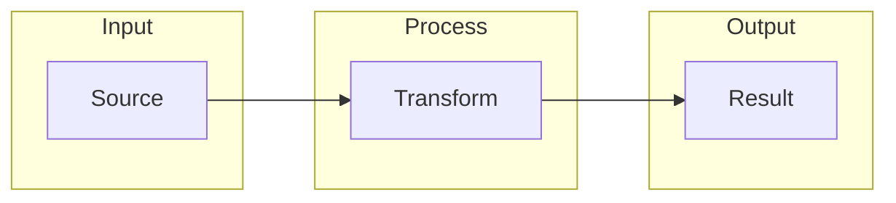
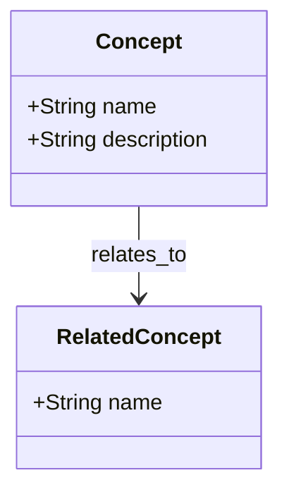
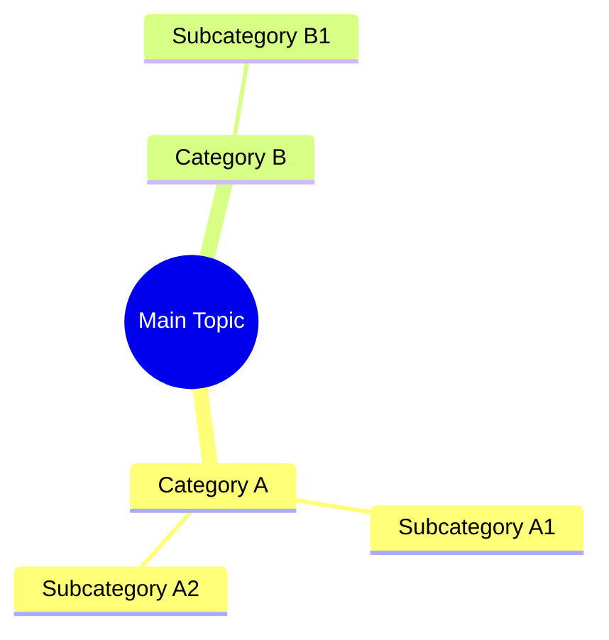
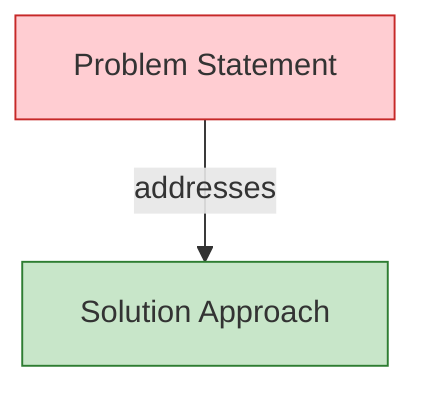
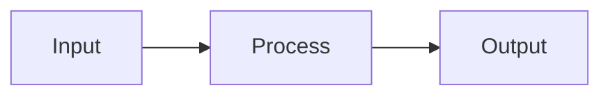
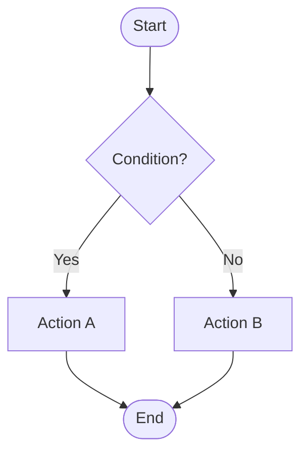
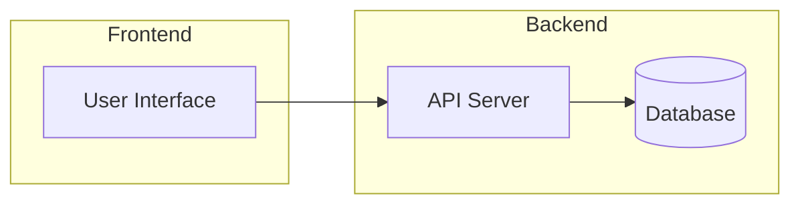
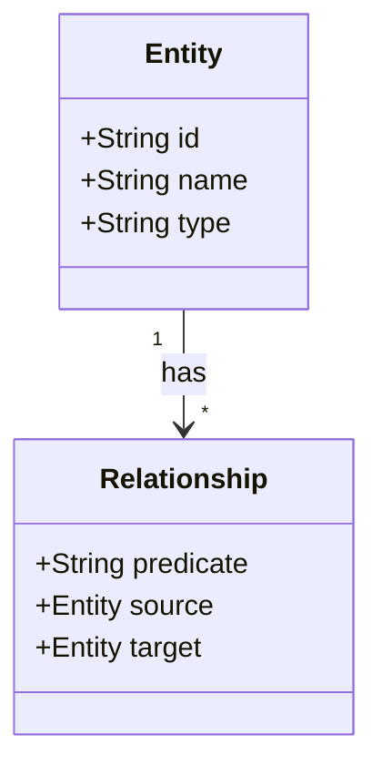
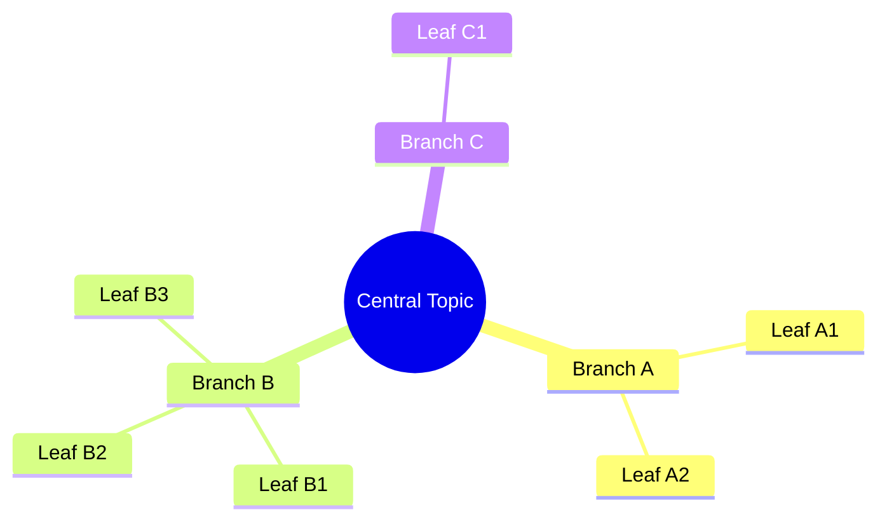
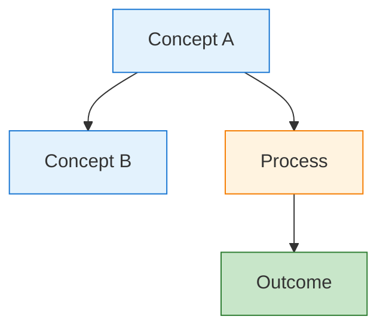

# Infographic Content Library Skill

> A comprehensive workflow system for creating, organizing, and documenting AI-generated visual content libraries (infographics, slide decks, documentation).

## Overview

This skill provides structured workflows for maintaining a visual content library using a two-file documentation pattern per folder:
- **README.md** — Human-readable navigation and discovery
- **SEMANTIC-GRAPH.md** — Machine-readable knowledge graphs and database exports

## Core Capabilities

### 1. README.md Generation

Create navigation-focused documentation with the following structure:

```markdown
[🏠 Home](../README.md) · [📁 Parent](../README.md)

# **Folder Name**

One-line description of the content.

| Source | Infographic | Slides |
|--------|-------------|--------|
| [📄 PDF](./source.pdf) | [🖼️ Image](./infographic.jpg) | [📑 Deck](./slides.pdf) |

Generated with Google NotebookLM — Source document → Infographic → Slide deck.


## Slide Preview

[](./slides.pdf)

## Semantic Knowledge Graph

See [SEMANTIC-GRAPH.md](./SEMANTIC-GRAPH.md) for concepts, relationships, and Neo4j export.
```

**URL Encoding Requirements:**
- Spaces → `%20`
- Parentheses → `%28` / `%29`
- Apostrophes → `%27`
- En-dashes → `%E2%80%91`

### 2. SEMANTIC-GRAPH.md Generation

Create machine-readable knowledge documentation with these sections:

```markdown
[📖 README](./README.md) · [🖼️ Infographic](./image.jpg) · [📑 Slides](./slides.pdf) · [🏠 Home](../../../../README.md)

# Title — Semantic Knowledge Graph

> One-line tagline summarizing the content.

## Summary
2-4 sentences answering "What is this?" and "Why does it matter?"

## Key Concepts
- **Concept One** — Brief explanation
- **Concept Two** — Brief explanation
(4-6 bolded terms mapping to graph nodes)

## Core Arguments
1. First logical point representing an edge in the knowledge graph
2. Second point building on the first
(4-6 numbered points showing logical flow)

## Key Quotes
> "Notable excerpt from the source material." — Attribution

## Mermaid Diagrams

### Flowchart (Process/Architecture)


### Ontology (Entity Types)


### Taxonomy (Hierarchy)


### Knowledge Graph (Relationships)


## Cypher Export (Neo4j)

### Nodes
```cypher
CREATE (concept1:Concept {
    id: 'concept_one',
    name: 'Concept One',
    description: 'Detailed description'
})

CREATE (concept2:Concept {
    id: 'concept_two',
    name: 'Concept Two',
    description: 'Detailed description'
})
```

### Relationships
```cypher
CREATE (concept1)-[:RELATES_TO]->(concept2)
CREATE (concept1)-[:ENABLES]->(concept2)
```

## Tags
`tag-one`, `tag-two`, `tag-three` (10-15 lowercase, hyphenated)

## Search Phrases
- "How to accomplish X"
- "What is Y used for"
(6-10 natural language queries)
```

**Color Conventions:**
| Element | Light | Dark |
|---------|-------|------|
| Problems | #ffcdd2 | #c62828 |
| Solutions | #c8e6c9 | #2e7d32 |
| Concepts | #e3f2fd | #1976d2 |
| Processes | #fff3e0 | #f57c00 |
| Data | #e1bee7 | #7b1fa2 |

**Common Predicates:**
`INCLUDES`, `ADDRESSES`, `CAUSES`, `ENABLES`, `TRANSFORMS`, `RELATES_TO`, `CONTRASTS_WITH`, `PART_OF`

### 3. Slide Mosaic Creation

Generate 4x4 preview grids from PDF presentations:

```bash
# Step 1: Extract slides as images (requires poppler-utils)
pdftoppm -png -r 100 slides.pdf slide

# Step 2: Create 4x4 mosaic (requires ImageMagick)
montage slide-*.png -tile 4x4 -geometry 300x+5+5 -background white slides_mosaic.png

# Step 3: Cleanup temporary files
rm slide-*.png
```

**Parameters:**
- `-r 100` — DPI resolution (72-150 range, balance quality/size)
- `-tile 4x4` — Grid dimensions (use `4x` for auto-wrapping rows)
- `-geometry 300x+5+5` — Thumbnail width and padding
- `-background white` — Inter-tile space color

### 4. Curated Guide Creation

Create themed collections linking related content:

**Directory Structure:**
```
curated-guides/
└── guide-name/
    ├── README.md
    └── CONTENT.md (optional)
```

**README.md Template:**
```markdown
[🏠 Home](../../README.md) · [📚 Curated Guides](../README.md)

# Guide Title

> One-line thematic description.

## Introduction
Brief paragraph explaining the collection's purpose and value.

## Collection Overview

| Topic Area | Document | Focus |
|------------|----------|-------|
| Area 1 | [Title](../../linkedin-published/Category/Folder/) | Key focus |
| Area 2 | [Title](../../linkedin-published/Category/Folder/) | Key focus |

## How to Use This Guide
- Use case 1
- Use case 2

## Statistics
| Metric | Value |
|--------|-------|
| Total Documents | X |
| Topic Areas | Y |
| Creation Period | Date Range |
```

**Trigger Criteria:**
- 3+ related pieces exist
- Cross-cutting themes present
- Logical learning sequence
- Shareable collection needed

## Execution Modes

### Two-Pass Workflow Pattern

**🔨 EXECUTOR MODE** — Focus on creation
1. Follow specific guide instructions
2. Complete all required elements
3. Produce Change Log documenting actions

**🔍 REVIEWER MODE** — Focus on validation
1. Check output against checklists
2. Verify all requirements met
3. Produce Review Report with pass/fail status

**Usage:**
```
"Create README in executor mode, then review"
"Review existing SEMANTIC-GRAPH.md in reviewer mode"
"Execute two-pass workflow for this folder"
```

**STRICT REVIEW** — Request aggressive fault-finding for critical content.

## Review Checklists

### SEMANTIC-GRAPH.md Checklist
- [ ] Navigation header present
- [ ] Tagline under title
- [ ] Summary 2-4 sentences
- [ ] 4-6 key concepts (bolded)
- [ ] 4-6 core arguments (numbered)
- [ ] 2-4 key quotes
- [ ] Flowchart diagram renders
- [ ] Ontology classDiagram renders
- [ ] Taxonomy mindmap renders
- [ ] Knowledge graph renders
- [ ] Consistent color coding
- [ ] Cypher nodes have readable IDs
- [ ] Cypher relationships reference existing nodes
- [ ] 10-15 tags (lowercase, hyphenated)
- [ ] 6-10 search phrases

### README.md Checklist
- [ ] Breadcrumb navigation present
- [ ] Current folder name bolded
- [ ] H1 title with description
- [ ] Quick links table (Source, Infographic, Slides)
- [ ] NotebookLM attribution
- [ ] Embedded infographic with alt text
- [ ] Slide mosaic section with PDF link
- [ ] Semantic knowledge graph link
- [ ] All images exist and load
- [ ] All links use correct relative paths
- [ ] Special characters URL-encoded

### Slide Mosaic Checklist
- [ ] Mosaic PNG exists
- [ ] All slides included in grid
- [ ] Appropriate grid dimensions
- [ ] Thumbnail files deleted
- [ ] Image renders correctly
- [ ] Embedded in README
- [ ] Links to PDF source

### Curated Guide Checklist
- [ ] Folder in curated-guides/
- [ ] Lowercase hyphenated naming
- [ ] Breadcrumb navigation
- [ ] Collection overview table
- [ ] All links working
- [ ] At least 3 related pieces
- [ ] Use cases section
- [ ] Statistics table

## Mermaid Templates Reference

### Flowchart - Left to Right Pipeline


### Flowchart - Top to Bottom with Decisions


### Flowchart - Architecture with Subgraphs


### Class Diagram - Ontology


### Mindmap - Taxonomy


### Graph - Knowledge Network


## Quick Commands

| Task | Command |
|------|---------|
| Create README | "Generate README.md for [folder] using infographic skill" |
| Create Semantic Graph | "Generate SEMANTIC-GRAPH.md for [content]" |
| Create Slide Mosaic | "Create slide mosaic for [file.pdf]" |
| Create Curated Guide | "Create curated guide for [theme]" |
| Review Content | "Review [file] in reviewer mode" |
| Full Workflow | "Execute two-pass workflow for [folder]" |

## Attribution

**Based on:** [Dinis Cruz's NotebookLM Infographics repository](https://github.com/DinisCruz/NotebookLM__Infographics-and-slides)

This skill adapts and extends the workflow patterns, templates, and documentation standards created by Dinis Cruz for organizing AI-generated visual content libraries. His original `.claude` directory provided the foundation for:
- Two-file documentation pattern (README.md + SEMANTIC-GRAPH.md)
- Mermaid diagram templates and color conventions
- Review checklists and execution modes
- Cypher export standards for Neo4j

**Content pipeline:** Source documents → Google NotebookLM → Visual outputs + structured metadata

**License:** CC BY 4.0 — Attribution required for sharing/adaptation
