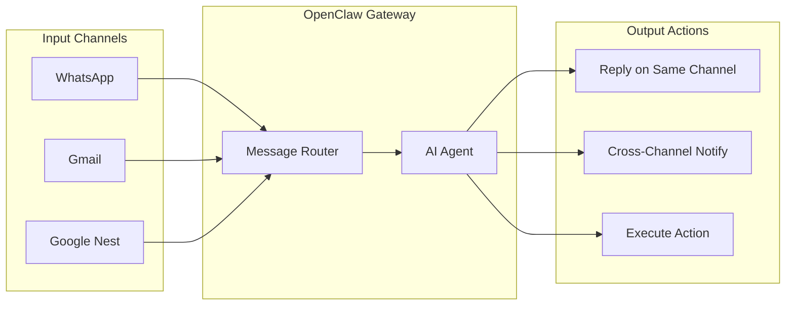

# OpenClaw Channel Integration Skill

## Overview

This skill enables Claude agents to set up and manage OpenClaw personal AI assistant integrations across multiple messaging channels including WhatsApp, Gmail, and Google Nest/Home devices.

## Skill Metadata

| Property | Value |
|----------|-------|
| **Name** | openclaw-channel-integration |
| **Version** | 1.0.0 |
| **Category** | Integration / Automation |
| **Complexity** | Medium |
| **Prerequisites** | Node.js 22+, OpenClaw installed |

---

## Capabilities

### Channel Setup
- WhatsApp integration via Baileys
- Gmail integration via Pub/Sub
- Google Nest/Home via Google Chat API
- Multi-channel orchestration

### Management
- Channel status monitoring
- Authentication handling
- Message routing configuration
- Security policy setup

---

## Prerequisites Checklist

Before using this skill, ensure:

```bash
# 1. Node.js 22+ installed
node --version  # Should be v22.x.x or higher

# 2. OpenClaw installed globally
npm install -g openclaw@latest

# 3. OpenClaw onboarding completed
openclaw onboard --install-daemon

# 4. Gateway running
openclaw status
```

---

## Channel Integration Workflows

### WhatsApp Setup

**Use Case**: Personal AI assistant accessible via WhatsApp messages

#### Step 1: Initialize WhatsApp Channel

```bash
# Add WhatsApp channel
openclaw channel add whatsapp

# This will display a QR code in the terminal
```

#### Step 2: Link Your Phone

1. Open WhatsApp on your phone
2. Go to **Settings** → **Linked Devices**
3. Tap **Link a Device**
4. Scan the QR code displayed in terminal

#### Step 3: Verify Connection

```bash
# Check channel status
openclaw channel status whatsapp

# Expected output:
# WhatsApp: connected
# Phone: +1234567890
# Last message: <timestamp>
```

#### Step 4: Configure Security

```json
// ~/.openclaw/openclaw.json
{
  "channels": {
    "whatsapp": {
      "enabled": true,
      "dmPolicy": "pairing",
      "groupPolicy": "mention",
      "allowedNumbers": ["+1234567890"]
    }
  }
}
```

#### Step 5: Test Integration

Send yourself a WhatsApp message:
```
You: Hello OpenClaw, what can you do?
OpenClaw: I'm your personal AI assistant! I can help with...
```

---

### Gmail Setup

**Use Case**: AI-powered email processing, summaries, and automated responses

#### Step 1: Enable Gmail API

```bash
# Add Gmail channel with Pub/Sub
openclaw channel add gmail
```

#### Step 2: OAuth Authentication

1. Browser window opens automatically
2. Sign in with your Google account
3. Grant required permissions:
   - Read emails
   - Send emails (optional)
   - Manage labels

#### Step 3: Configure Pub/Sub

```bash
# Verify Gmail Pub/Sub subscription
openclaw channel status gmail

# Expected output:
# Gmail: connected
# Subscription: projects/openclaw-xxx/subscriptions/gmail-inbox
# Watch expiry: <date>
```

#### Step 4: Set Up Email Rules

Create a skill to handle emails:

```bash
mkdir -p ~/.openclaw/workspace/skills/email-processor
```

```json
// ~/.openclaw/workspace/skills/email-processor/skill.json
{
  "name": "email-processor",
  "version": "1.0.0",
  "triggers": {
    "gmail": {
      "labels": ["INBOX"],
      "from": ["important@domain.com"],
      "subject": ["urgent", "action required"]
    }
  },
  "actions": {
    "onNewEmail": {
      "summarize": true,
      "categorize": true,
      "notifyVia": ["whatsapp"]
    }
  }
}
```

#### Step 5: Test Email Processing

```bash
# Send a test email to yourself
# OpenClaw will:
# 1. Detect new email via Pub/Sub
# 2. Process with AI
# 3. Optionally notify via WhatsApp
```

---

### Google Nest/Home Setup

**Use Case**: Voice-activated AI assistant on smart speakers

#### Step 1: Enable Google Chat API

```bash
# Add Google Chat channel
openclaw channel add google-chat
```

#### Step 2: Create Google Cloud Project

1. Go to [Google Cloud Console](https://console.cloud.google.com)
2. Create new project or select existing
3. Enable **Google Chat API**
4. Create **Service Account** credentials

#### Step 3: Configure Service Account

```bash
# Download service account JSON
# Save to ~/.openclaw/credentials/google-chat-sa.json

# Configure in OpenClaw
openclaw config set google.chat.serviceAccount ~/.openclaw/credentials/google-chat-sa.json
```

#### Step 4: Link to Google Home

1. Open **Google Home** app
2. Go to **Settings** → **Works with Google**
3. Search for "OpenClaw" (or your custom action name)
4. Link your account

#### Step 5: Configure Voice Commands

```json
// ~/.openclaw/openclaw.json
{
  "voice": {
    "enabled": true,
    "wakeWord": "Hey OpenClaw",
    "synthesis": {
      "provider": "elevenlabs",
      "voice": "rachel"
    },
    "recognition": {
      "provider": "google",
      "language": "en-US"
    }
  }
}
```

#### Step 6: Test Voice Interaction

Say to your Google Nest:
```
You: "Hey Google, talk to OpenClaw"
Google: "Getting OpenClaw"
You: "What's on my calendar today?"
OpenClaw: "You have 3 meetings scheduled..."
```

---

## Multi-Channel Configuration

### Unified Configuration

```json
// ~/.openclaw/openclaw.json
{
  "agent": {
    "model": "anthropic/claude-opus-4-5",
    "thinking": "medium"
  },
  "gateway": {
    "host": "127.0.0.1",
    "port": 18789
  },
  "channels": {
    "whatsapp": {
      "enabled": true,
      "dmPolicy": "pairing",
      "groupPolicy": "mention"
    },
    "gmail": {
      "enabled": true,
      "watchLabels": ["INBOX", "IMPORTANT"],
      "processMode": "summary"
    },
    "google-chat": {
      "enabled": true,
      "voiceEnabled": true
    }
  },
  "routing": {
    "defaultChannel": "whatsapp",
    "notificationChannel": "whatsapp",
    "urgentChannel": "whatsapp"
  }
}
```

### Cross-Channel Workflows



---

## Security Best Practices

### Channel-Specific Security

| Channel | Security Setting | Recommended Value |
|---------|------------------|-------------------|
| WhatsApp | `dmPolicy` | `pairing` |
| WhatsApp | `groupPolicy` | `mention` |
| Gmail | `processMode` | `summary` (not `full`) |
| Gmail | `sendEnabled` | `false` (until needed) |
| Google Chat | `voiceConfirm` | `true` |

### Pairing Code Setup

```bash
# When unknown user messages via WhatsApp
# They receive: "Reply with pairing code: ABC123"

# Approve the pairing
openclaw pairing approve whatsapp ABC123

# Or reject
openclaw pairing reject whatsapp ABC123
```

### Rate Limiting

```json
{
  "rateLimit": {
    "messagesPerMinute": 10,
    "tokensPerHour": 100000,
    "actionsPerDay": 50
  }
}
```

---

## Troubleshooting

### Common Issues

| Issue | Solution |
|-------|----------|
| WhatsApp QR expired | Run `openclaw channel reconnect whatsapp` |
| Gmail watch expired | Run `openclaw channel refresh gmail` |
| Voice not working | Check `voice.enabled` in config |
| Messages not routing | Check `openclaw doctor` output |

### Diagnostic Commands

```bash
# Full system health check
openclaw doctor

# Channel-specific diagnostics
openclaw channel diagnose whatsapp
openclaw channel diagnose gmail

# View recent logs
openclaw logs --tail 100

# Test agent response
openclaw chat "Test message"
```

---

## Example Use Cases

### 1. Email Summary to WhatsApp

```
[Gmail receives important email]
↓
[OpenClaw processes with AI]
↓
[WhatsApp notification]
"📧 New email from boss@company.com
Subject: Q1 Budget Review
Summary: Requesting budget projections by Friday..."
```

### 2. Voice-Triggered Actions

```
[Google Nest]
"Hey OpenClaw, send a message to John on WhatsApp saying I'll be 10 minutes late"
↓
[OpenClaw processes]
↓
[WhatsApp sends to John]
"Hi John, I'll be 10 minutes late"
```

### 3. Cross-Platform Task Management

```
[WhatsApp]
"Add 'Buy groceries' to my todo list"
↓
[OpenClaw adds task]
↓
[Later, via Google Nest]
"What's on my todo list?"
↓
"You have 3 items: Buy groceries, Call dentist, Review report"
```

---

## API Reference

### Channel Commands

```bash
# List all channels
openclaw channel list

# Add a channel
openclaw channel add <channel-name>

# Remove a channel
openclaw channel remove <channel-name>

# Get channel status
openclaw channel status [channel-name]

# Reconnect a channel
openclaw channel reconnect <channel-name>

# Refresh channel auth
openclaw channel refresh <channel-name>
```

### Configuration Commands

```bash
# View current config
openclaw config list

# Set a config value
openclaw config set <key> <value>

# Get a config value
openclaw config get <key>

# Reset to defaults
openclaw config reset
```

---

## Resources

- [OpenClaw Documentation](https://github.com/openclaw/openclaw)
- [WhatsApp Baileys Library](https://github.com/whiskeysockets/baileys)
- [Gmail API Documentation](https://developers.google.com/gmail/api)
- [Google Chat API](https://developers.google.com/chat)
- [ElevenLabs Voice Synthesis](https://elevenlabs.io)

---

*Skill Version: 1.0.0 | Last Updated: 2026-02-01*
