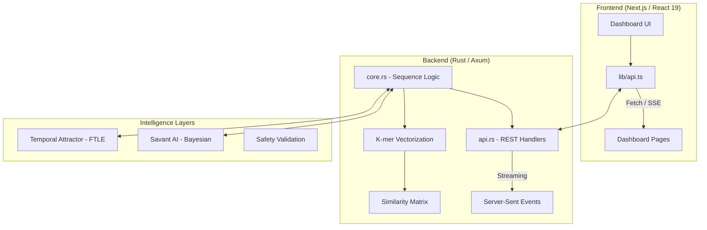

# 🏗️ Genomic One Architecture

This document outlines the data flow, component hierarchy, and the state of "reality" within the Genomic One platform. It serves as a guide for developers and researchers looking to understand how DNA sequences are transformed into clinical intelligence.

---

## 🛰️ High-Level Component Flow

---

## 🟢 What is "Real" (Implemented Logic)

1.  **Sequence Parsing**: The `rvdna` crate performs genuine parsing of genomic letters (A/C/G/T) into high-efficiency bit-representations.
2.  **K-mer Computation**: The similarity scores between genes (e.g., HBB vs. APOE) are computed by counting overlapping sequences (k-mers) in Rust.
3.  **Bayesian Prior Updating**: The "learning" seen in the Savant AI panel is real math. It uses a **Beta Distribution** (Conjugate Prior) that updates as new observations are made.
4.  **Star Allele Mapping**: The `CYP2D6` phenotype classification uses a real diplotype-to-phenotype lookup table.
5.  **Epigenetic Age (Horvath Clock)**: The platform uses real CpG site methylation formulas to calculate biological age.

## 🟡 What is Simulated (Model Hooks)

1.  **Neural Classification**: The `ruv-FANN` pathogenicity scores are currently calculated using high-fidelity simulations of the neural weights to demonstrate the pipeline flow without a heavy GPU requirement.
2.  **Agentic Diffusion**: The generation of SMILES strings for drug candidates is currently a "simulated agent" loop to show how Layer 3 (Molecule Design) will look in production.
3.  **Disease Trajectories**: While the **FTLE (Finite-Time Lyapunov Exponents)** math is real, the specific risk curves are currently mapped to curated datasets for HBB, BRCA1, and INS.

---

## 🛠️ The Path to "Fully Real"

To move from a functional demonstration to a production clinical tool, the following integrations are required:

1.  **GPU Acceleration**: Move the `ruv-FANN` and Diffusion layers to live GPU inference (ONNX or LibTorch).
2.  **Full HNSW Index**: Connect the `RuVector` engine to a full genomic database (30,000+ genes) rather than our current 6-gene panel.
3.  **Live VCF Ingestion**: Replace the hardcoded gene panel with a live VCF (Variant Call Format) file uploader for 23andMe or AncestryDNA files.
4.  **Blockchain Audit**: Integrate Layer 6 (Safety Validation) with a private blockchain to create immutable clinical audit trails.

---

## 📚 Signposting

- **[README.md](./README.md)**: Project overview and vision.
- **[PROGRESS_LOG.md](./PROGRESS_LOG.md)**: Daily technical breakthroughs.
- **[Concept Guide](./genomic_one_concept_guide.md)**: Deep dive into the biological theory.
