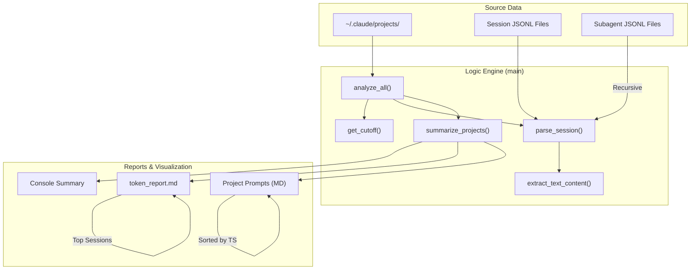

# Token-Analyser Architecture

This diagram illustrates the functional components and data flow of the `token_analysis.py` script.

## Component Overview

## Detailed Execution Flow

1.  **Scanning Phase**:
    *   `analyze_all()` loops through every project folder.
    *   `get_cutoff()` establishes if there's a time-based filter (e.g., `SINCE_DAYS=7`).
2.  **Parsing Phase**:
    *   `parse_session()` opens each `.jsonl` file.
    *   It extracts **Assistant** usage (input, output, and cache tokens).
    *   It extracts **User** prompts (filtering for human-only input via `is_human_prompt`).
    *   It recursively looks for a `subagents/` folder to capture recursive agent usage.
3.  **Aggregation Phase**:
    *   `summarize_projects()` rolls up session data into project-level totals.
    *   Calculates "Grand Totals" for the whole environment.
    *   Identifies the most "costly" (token-heavy) sessions and subagents.
4.  **Reporting Phase**:
    *   `print_summary()` gives immediate feedback in the terminal.
    *   `write_report()` generates the comprehensive Markdown analysis.
    *   `write_prompts_by_project()` creates detailed logs of what you actually asked Claude in each project.
