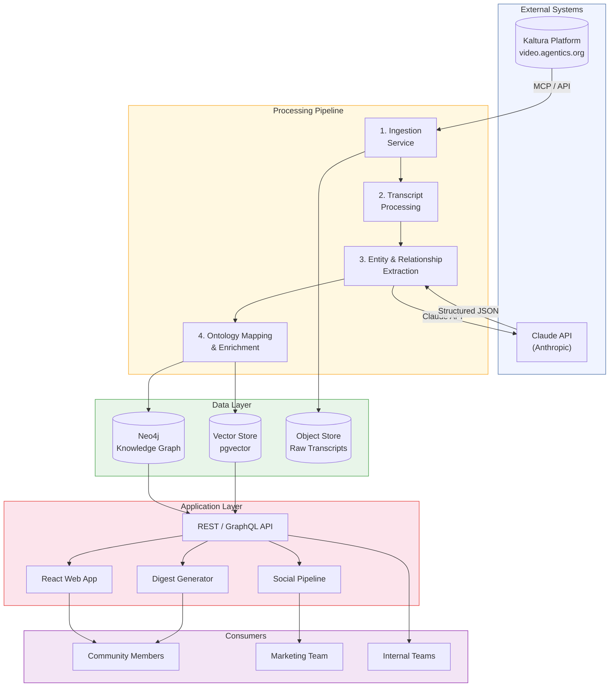
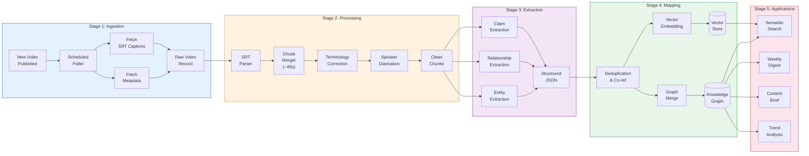
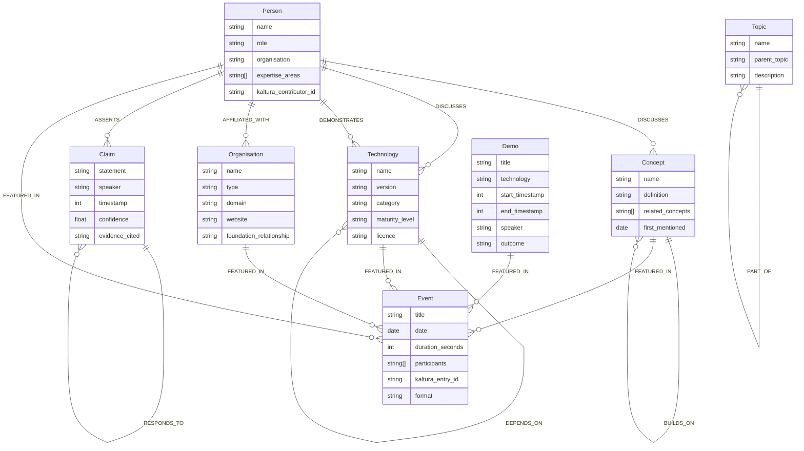
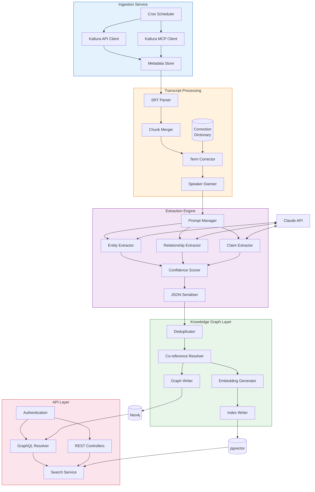
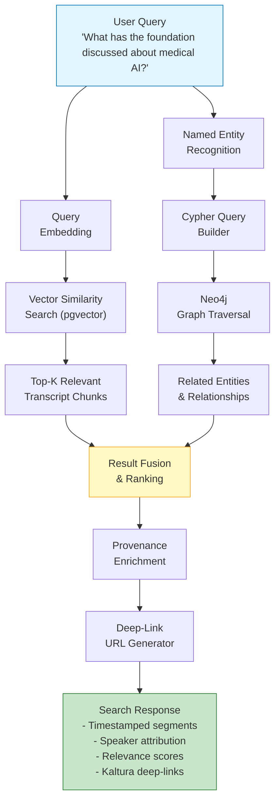
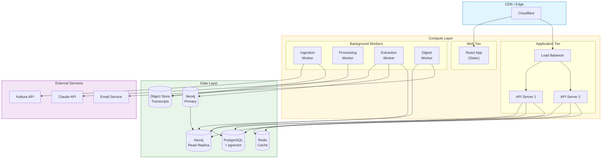
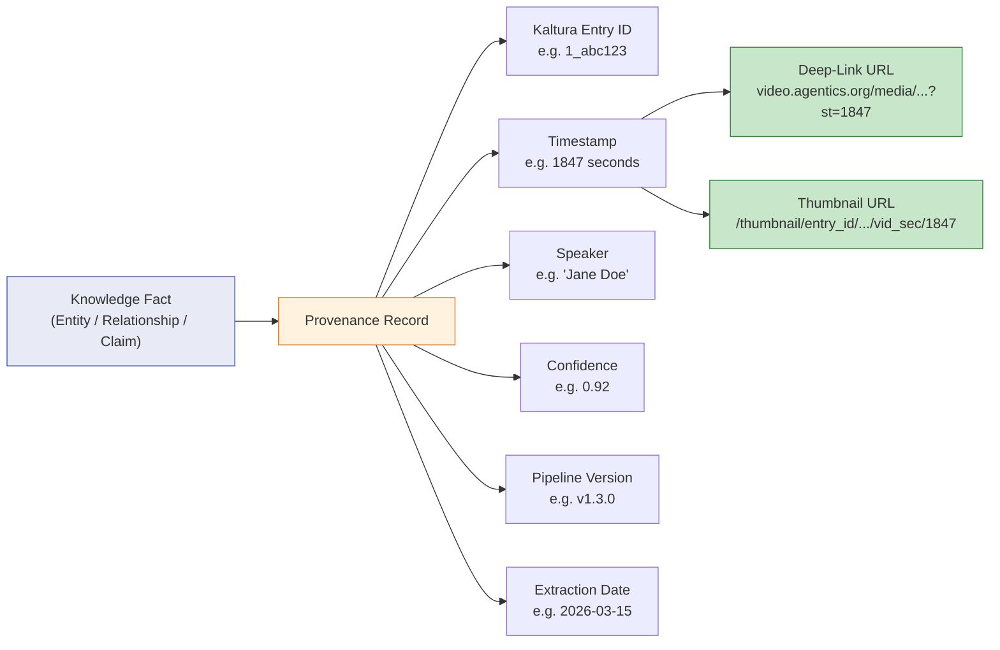
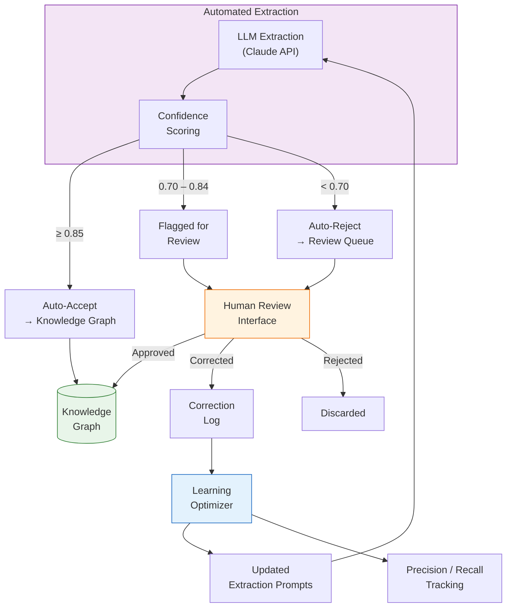

# Video Content Ontology — Architecture

## 1. High-Level System Architecture

The system operates as a five-stage pipeline that transforms raw video content from Kaltura into structured, queryable knowledge served through multiple application channels.

---

## 2. Data Flow Architecture

End-to-end data flow from video publication to user-facing output.

---

## 3. Ontology Schema (Entity-Relationship Diagram)

The core domain model — 8 entity types and 9 relationship types.

---

## 4. Component Architecture (Low-Level)

Detailed breakdown of each service, its responsibilities, and interfaces.

---

## 5. Semantic Search Architecture

How natural language queries are resolved against both the vector store and knowledge graph.

---

## 6. Deployment Architecture

Infrastructure topology for production deployment.

---

## 7. Provenance & Temporal Data Model

Every fact carries a full provenance chain back to its source video moment.

---

## 8. Feedback Loop Architecture

Human corrections improve extraction quality over time.

---

## 9. Technology Decision Summary

| Decision | Choice | Rationale |
|----------|--------|-----------|
| **Knowledge Graph** | Neo4j | Native typed relationships, Cypher maps to ontology queries, mature ecosystem |
| **Vector Store** | pgvector (PostgreSQL) | Co-locate with relational data, avoid extra infrastructure, good enough for scale |
| **LLM** | Claude API (Anthropic) | Strong structured output, entity extraction, summarisation quality |
| **Frontend** | React | Wide talent pool, component ecosystem, SSR options |
| **API** | GraphQL (primary) + REST (simple endpoints) | GraphQL suits graph-shaped data; REST for webhooks and simple integrations |
| **Orchestration** | Custom pipeline with retry/DLQ | Simpler than n8n for this workload; can migrate later if needed |
| **Cache** | Redis | Session cache, query result cache, rate limiting |
| **Deployment** | Containerised (Docker) on cloud VMs | Predictable costs, straightforward ops, no vendor lock-in |

---

## 10. Architectural Decisions & Trade-offs

### Monolith-First, Extract Later

The initial build is a modular monolith — all services in one deployable unit with clear module boundaries. This minimises infrastructure complexity in Phases 1–2. If scaling demands arise in Phase 4, individual modules (e.g., the extraction engine) can be extracted into standalone services.

### Dual Query Path (Graph + Vector)

Search queries hit both Neo4j (structured graph traversal) and pgvector (semantic similarity) in parallel. Results are fused and ranked. This hybrid approach ensures both precise entity lookups and fuzzy natural language queries return high-quality results.

### Confidence-Gated Ingestion

Rather than requiring human review of all extractions, the system uses confidence thresholds to auto-accept high-confidence results and only route low-confidence items to review. This keeps the pipeline flowing while maintaining quality.
