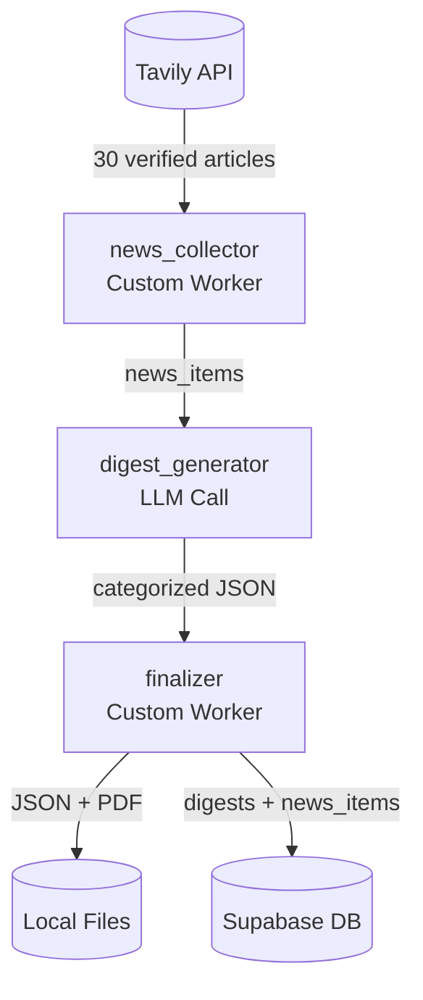

# Agentic AI News Digest

Automated newsletter generation workflow using SimpleAgents framework with real-time web search, LLM-powered classification, and Supabase storage.

## Overview

This workflow searches for Agentic AI news across 6 global regions (North America, UK, Europe, India, China, Japan), classifies them into 4 categories, and generates a publishable newsletter digest — all verified with source URLs and recent publication dates.

## Architecture



## Workflow Pipeline

```
┌─────────────────┐     ┌─────────────────┐     ┌─────────────────┐
│ news_collector  │────►│ digest_generator│────►│   finalizer     │
│ (Custom Worker) │     │   (LLM Call)     │     │ (Custom Worker) │
└─────────────────┘     └─────────────────┘     └─────────────────┘
        │                                               │
        ▼                                               ▼
┌─────────────────┐                           ┌─────────────────────────┐
│  Tavily Search  │                           │  Outputs:               │
│  - 6 queries    │                           │  - newsletter_digest.json
│  - 3-day filter │                           │  - newsletter_digest.pdf│
│  - URL validate │                           │  - Supabase records    │
└─────────────────┘                           └─────────────────────────┘
```

## Categories

| Category | Description | Scoring |
|----------|-------------|---------|
| **Enterprise Adoption** | Companies deploying AI agents at scale | impact_score 1-10 |
| **Challenges** | Problems, risks, failures, regulation | severity: low/medium/high |
| **Opportunities** | Investments, partnerships, new markets | market_potential: low/medium/high |
| **Evolving Trends** | New technologies, innovations | trend_indicator: emerging/growing/maturing |

## Environment Variables

```env
# Required
OPENAI_API_KEY=your_openai_key

# Requesty gateway (optional, for cost optimization)
WORKFLOW_API_BASE=https://router.requesty.ai/v1

# News search
TAVILY_API_KEY=your_tavily_key

# Database storage
SUPABASE_URL=https://your-project.supabase.co
SUPABASE_ANON_KEY=your_anon_key
```

## Supabase Schema

```
agentic_ai_news/
├── digests/
│   ├── id (uuid, pk)
│   ├── title
│   ├── publication_date
│   ├── executive_summary
│   ├── footer
│   └── generated_at
└── news_items/
    ├── id (uuid, pk)
    ├── digest_id (fk)
    ├── headline, summary, source, region, url, date
    ├── category (enterprise_adoption/challenges/opportunities/evolving_trends)
    └── Scoring fields (impact_score/severity/market_potential/trend_indicator)
```

Run `schema.sql` in Supabase SQL Editor to create.

## Usage

```bash
# Install dependencies
cd ..
uv pip install -r requirements.txt

# Run the workflow
cd Agentic-AI-News
python run_news_digest.py
```

## Output

- `newsletter_digest.json` — Full structured digest
- `newsletter_digest_YYYY-MM-DD.pdf` — Formatted PDF with clickable URLs
- Supabase records in `agentic_ai_news.digests` + `agentic_ai_news.news_items`

## Quality Guarantees

- **Zero hallucinations**: Every news item is from verified Tavily search results
- **Date filtering**: Only articles published within last 3 days
- **URL validation**: Fabricated/truncated URLs are excluded
- **LLM summarization**: Summaries generated from raw content, not copied headlines

## Credits

Curated by **Mondweep Chakravorty** | LinkedIn: https://www.linkedin.com/in/mondweepchakravorty/
Workflow powered by **SimpleAgents** by Craftsman Labs | https://yamslam.craftsmanlabs.net/