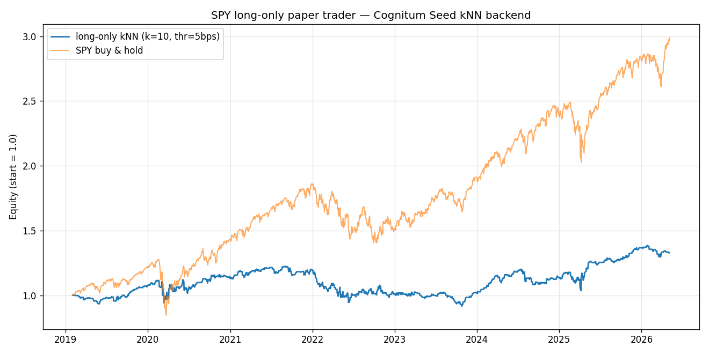
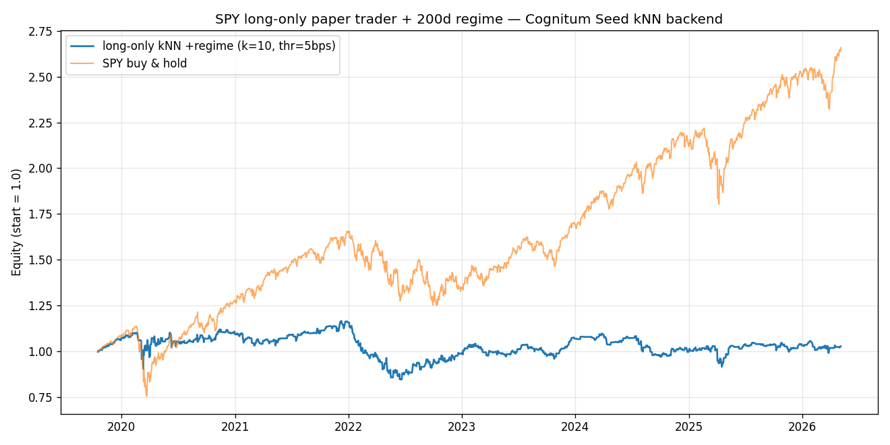
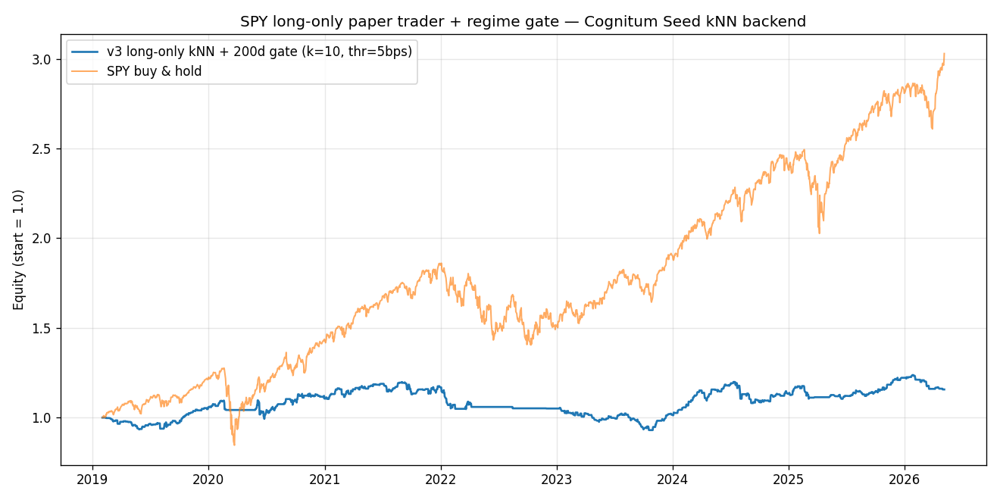

# Neural Trader Exploration Log

**Project:** Cognitum.NeuralTrader
**Date:** 2026-05-08
**Author:** session log
**Audience:** mixed — technical depth where useful, plain language where possible (see Glossary at end)

---

## 0. Executive Summary

We set out to backtest the **Neural Trader** strategy that runs on a Cognitum Seed device. The strategy uses the seed's on-device vector store as a **k-Nearest-Neighbors (kNN) memory** of past market days, predicting what tomorrow will do by averaging what happened *after* the historical days that "looked most similar" to today.

Across **six variants** we walked from "lost money" → "profitable but mediocre on one asset" → "rotate across an asset universe and almost beat buy-and-hold" → "drop daily flipping for monthly rebalancing to make it realistic for a retail UK investor — and discover that the simplest possible plain-DCA strategy still beat us." The architectural lessons compound; the practical lesson at the end is humbling.

```
        STRATEGY EQUITY CURVES (1.0 = start)
        ──────────────────────────────────────────────
   3.00  ┤                                    ●●●●  SPY buy & hold (+16.5% CAGR)
         │                              ●●●●●●
         │                       ●●●●●●●
   2.61  ┤                ●●●●●●           ●●●●●  v4 multi-asset rotation (+14.2% CAGR) ← BEST
         │           ●●●●●        ●●  ●●●●●
   2.00  ┤      ●●●●●     ●●●●●●●● ●●
         │  ●●●●
         │                     ⭐ v4 dipped to ~1.41 in 2023 (held QQQ through bear)
   1.33  ┤●●●           ●●●●●●●●●●●●●●●●●●●●  v1.5 long-only      (+4.0% CAGR)
   1.16  ┤  ●●        ●●●●●●●●●●●●●●●●●●●●●●●  v3 regime gate     (+2.0% CAGR)
   1.03  ┤    ●●●●●●●●●●●●●●●●●●●●●●●●●●●●●●●  v2 regime in cosine (+0.5% CAGR)
   1.00  ┤────────────────────────────────────  baseline
         │ ╲
   0.87  ┤  ●●●●●●●●●●●●●●●●●●●●●●●●●●●●●●●●●  v1 long/flat/short (−1.9% CAGR)
         └──┬──────┬──────┬──────┬──────┬──────
          2019    2021   2023   2025   2026
```

### Headline result — single lump sum invested for ~7 years

| Variant | Final | CAGR | Sharpe | MaxDD | Verdict |
|---|---|---|---|---|---|
| **SPY buy & hold** | 3.02 | **+16.48%** | ~1.0 | −33.7% | benchmark |
| v1: long/flat/short, no threshold | 0.87 | −1.94% | 0.00 | −48.1% | **broken** — forced shorts in bull market |
| v1.5: long-only, 5 bps threshold | 1.33 | +4.00% | 0.35 | **−25.3%** | best single-asset rotation variant |
| v2: regime as 8th cosine dimension | 1.03 | +0.47% | 0.11 | −27.5% | hurt — broke kNN geometry |
| v3: regime as decision gate | 1.16 | +2.03% | 0.28 | −22.4% | hurt return, helped drawdown |
| **v4: multi-asset rotation** (daily) | **2.61** | **+14.16%** | **0.79** | −34.3% | **best non-DCA variant** — closed most of the gap to SPY |

### Headline result — £100/month DCA for 60 months (most recent 5 years)

For a realistic UK retail investor depositing £100/month into a Stocks & Shares ISA — full UK-tax / commissions analysis in [Appendix C](#appendix-c-the-single-pool-abstraction-dca-and-a-uk-friendly-v5).

| Strategy | Total contributed | Final | Profit | Verdict |
|---|---|---|---|---|
| **SPY-only DCA** (buy each month, never sell) | £6,000 | **£9,105** | **+£3,105** | **wins** — simplicity beats complexity |
| v5: DCA into kNN winner each month | £6,000 | £8,120 | +£2,120 | underperforms |
| 60/40 SPY+IEF DCA (no rebalance) | £6,000 | £7,947 | +£1,947 | underperforms both |

(Linear-scale to £300/month → totals are 3×; £500/month → 5×.)

### Four things we learned

1. **The naive kNN strategy works as a single-asset signal but cannot beat buy & hold on raw return** when restricted to one ETF during a 16%-CAGR bull stretch. That's a structural limit, not a tuning failure.
2. **Adding a "regime" feature is harder than it sounds.** Putting it inside the cosine distance (v2) corrupts neighbor selection. Using it as an outer gate (v3) throws out kNN's best work — its panic-bottom pattern matches.
3. **Universe choice matters more than feature choice.** Going from one asset (SPY) to four (SPY/QQQ/IEF/GLD) lifted CAGR from 4% → 14% and Sharpe from 0.35 → 0.79 *without changing the embedding or decision rule*. The biggest open lever is no longer "what features?" but "what assets and what aggregator?"
4. **For a real DCA investor, simple beats clever.** v5 (the same kNN engine on a monthly cadence to fit retail DCA) underperformed plain "buy SPY every month and never sell" by ~£1,000 per £6,000 contributed over 5 years. Once you account for UK ISA wrappers and commission-free brokers, the discipline of monthly auto-invest into one low-cost ETF beats almost every active strategy at small portfolio sizes. (Full analysis in [Appendix C](#appendix-c-the-single-pool-abstraction-dca-and-a-uk-friendly-v5).)

---

## 1. The System

### 1.1 What we're working with

```
   ┌──────────────────────────────┐                        ┌─────────────────────────────┐
   │ Mac (local dev environment)  │                        │ Cognitum Seed (Raspberry Pi)│
   │                              │     ssh -fN -L 9080:   │ 169.254.42.1                │
   │  ┌────────────────────────┐  │     127.0.0.1:80       │ ┌─────────────────────────┐ │
   │  │ backtest_*.py          │  │ ─────────────────────► │ │ RVF vector store        │ │
   │  │  - load_spy()  yfinance│  │                        │ │   dim = 8               │ │
   │  │  - compute_features()  │  │   POST /store/ingest   │ │   60k+ vectors          │ │
   │  │  - StoreClient (HTTP)  │  │   POST /store/query    │ │   cosine similarity     │ │
   │  └────────────────────────┘  │ ◄───────────────────── │ └─────────────────────────┘ │
   │                              │                        │ ┌─────────────────────────┐ │
   │  Backtest writes/reads       │                        │ │ neural-trader cog v1.2  │ │
   │  the seed's vector store     │                        │ │ (was running; we paused │ │
   │  via SSH tunnel              │                        │ │  it during backtests)   │ │
   └──────────────────────────────┘                        │ └─────────────────────────┘ │
                                                           │ ┌─────────────────────────┐ │
                                                           │ │ Witness chain (84k+     │ │
                                                           │ │  cryptographic entries) │ │
                                                           │ └─────────────────────────┘ │
                                                           └─────────────────────────────┘
```

**Components:**

- **Cognitum Seed** — A Raspberry Pi device hosting a custodial vector store (RVF) and several "cog" applications. Acts as a personal, persistent kNN memory.
- **RVF vector store** — On-device cosine-similarity database. Fixed at **8 dimensions**. Currently holds ~60,000 vectors (~8 MB on disk, ~133 bytes/vector including index + witness-chain overhead).
- **`neural-trader` cog** — A small AI app on the seed that pulls live market data and writes its own vectors to the store. Running version 1.2.0.
- **Local backtest** — Python scripts on the Mac that fetch SPY daily bars from Yahoo Finance, embed each day as an 8-dim vector, and use the seed's RVF as the kNN backend over an SSH tunnel.

### 1.2 Storage scale (estimate)

For a hypothetical 4-million-record corpus at the same dim=8:

| Item | Calc | Size |
|---|---|---|
| Raw vector data (f32) | 4M × 8 × 4 B | ~128 MB |
| + IDs | 4M × 8 B | ~32 MB |
| At observed full overhead (133 B/vec) | 4M × 133 B | **~530 MB** |
| With 25% headroom for index growth | | **~660 MB** |

At higher dimensions (32-d ~2.1 GB; 128-d ~8 GB; 384-d ~24 GB) the picture changes — fitting on a Pi-class device favors compact embeddings.

---

## 2. The kNN Strategy (How It Decides)

### 2.1 Per-day workflow

```
                              ┌─────────────────────┐
                              │  Today's bar        │
                              │  (OHLCV from        │
                              │   Yahoo Finance)    │
                              └──────────┬──────────┘
                                         │
                                         ▼
                              ┌─────────────────────┐
                              │  Compute features   │
                              │   - log_ret_1       │  ← today's % move
                              │   - log_ret_5       │  ← past week
                              │   - log_ret_20      │  ← past month
                              │   - realized_vol_20 │  ← volatility
                              │   - tr_over_atr     │  ← bar range vs avg
                              │   - volume_z        │  ← volume vs avg
                              │   - dist_from_ma    │  ← above/below 20d MA
                              │   - bias = 1.0      │  ← constant slot
                              └──────────┬──────────┘
                                         │  z-score each (mean 0, std 1)
                                         ▼
                              ┌─────────────────────┐
                              │  8-dim query vector │
                              └──────────┬──────────┘
                                         │
                                         ▼
                              ┌─────────────────────┐                      Cognitum Seed
                              │ store.query(vec,    │  ───── HTTPS ─────►  RVF cosine kNN
                              │   k=2000,           │                      filter to past
                              │   metric=cosine)    │  ◄─── neighbors ──   SPY-only ids
                              └──────────┬──────────┘
                                         │  take top 10 SPY-only neighbors
                                         ▼
                              ┌─────────────────────┐
                              │  Lookup each        │
                              │  neighbor's KNOWN   │
                              │  next-day return    │
                              └──────────┬──────────┘
                                         │
                                         ▼
                              ┌─────────────────────┐
                              │  mean_pred =        │  ← kNN's forecast
                              │  mean of those 10   │     for tomorrow
                              │  forward returns    │
                              └──────────┬──────────┘
                                         │
                                         ▼
                              ┌─────────────────────┐
                              │  Decision rule      │  → long / flat / (short)
                              │  (varies per        │
                              │   variant)          │
                              └─────────────────────┘
```

### 2.2 The decision rule is what we tuned

Each variant kept the embedding/query/aggregation steps identical and changed **only the decision rule** at the bottom:

```
v1   : long if mean_pred > 0    | flat if = 0   | short if < 0
v1.5 : long if mean_pred > 5bps |              flat otherwise   (no shorting)
v2   : same as v1.5, but the embedding includes "regime" as the 8th dim
v3   : same as v1.5, but trade only if mean_pred > 5bps AND regime > 0
```

---

## 3. The Experiment Journey

### 3.1 v1 — Original: long/flat/short, zero threshold

> *"Just take whatever sign mean_pred has."*

**Setup:**
- Decision: `+1` if `mean_pred > 0`, `−1` if `< 0`, else `0`
- Threshold: 0 bps (any tiny prediction triggers a flip)
- Data: SPY daily, 2018-01-31 → 2026-05-06, 2077 bars after dropna
- Walk-forward: 1824 bars (Feb 2019 → May 2026)

**Result:**

| Final | CAGR | Sharpe | MaxDD | Hit rate | Position flips | Bars short / flat / long |
|---|---|---|---|---|---|---|
| 0.8680 | **−1.94%** | 0.00 | −48.14% | 49.06% | **871** | 783 / 12 / 1029 |

**Reading:**

The strategy lost ~13% over the period while SPY tripled. Five concrete reasons:

1. **Noise trading.** Threshold = 0 means any 0.01-bps mean_pred forces a flip.
2. **Cost drag.** 871 flips × 1 bps slippage per side = ~0.87% fixed drag, before real-world frictions.
3. **Wrong-side shorting.** 783 short bars during one of history's strongest bull runs (COVID rebound + AI boom) is structurally lethal.
4. **Hit rate ≈ coin flip.** 49% says the per-bar signal has no usable edge.
5. **Always in the market.** 1812/1824 bars had a position — no defensive flat regime.

> *(v1 equity-curve image is not in the repo — the file was evicted by macOS Optimized Storage during the session and could not be recovered. The numbers above are authoritative.)*

---

### 3.2 v1.5 — Long-only with a 5 bps threshold

> *"Drop the short branch and require a real signal before trading."*

**Hypothesis:** v1's loss was structural (forced shorting + noise trading), not a bad signal. Removing those should expose any real edge.

**Change:**
```diff
- if mean_pred > 0:        desired = +1
- elif mean_pred < 0:      desired = −1
- else:                    desired = 0
+ if mean_pred > 5 bps:    desired = +1
+ else:                    desired = 0
```

**Result (same window as v1):**

| Final | CAGR | Sharpe | MaxDD | Hit rate | Bars long / flat |
|---|---|---|---|---|---|
| **1.3285** | **+4.00%** | **0.35** | **−25.27%** | **53.64%** | 878 / 946 |

**Reading:**

Confirmed the diagnosis. Two simple changes flipped the strategy from losing money to producing a small but real positive Sharpe. Drawdown almost halved (−48% → −25%). Hit rate moved from coin-flip to a modest 53.6% — small per-bar edge, large compounding effect when not paying noise costs.



**But:** still well below SPY buy & hold (+16% CAGR). Sitting in cash 52% of the time during the strongest bull market of our lifetimes is the cap on this.

---

### 3.3 v2 — Add a "regime" feature inside the cosine distance

> *"What if kNN knew whether the market was in a bull or bear regime?"*

**Hypothesis:** A regime feature should let kNN distinguish "bull-market dip" from "bear-market dip" and pick better neighbors.

**Definition of regime:**
```
regime_200ma = (close − SMA_200) / SMA_200
```
- Positive → above 200-day moving average → bull/uptrend regime
- Negative → below → bear/downtrend regime
- Magnitude → how extended

**Change:** replace the constant `bias` slot (8th dim) with the z-scored regime feature.

**Result (window starts Oct 2019 because 200-day MA needs 200 bars warmup):**

| Final | CAGR | Sharpe | MaxDD | Hit rate | Bars long / flat |
|---|---|---|---|---|---|
| 1.0265 | +0.40% | 0.11 | −27.5% | 53.3% | 837 / 808 |

Apples-to-apples on the same window:

| Metric | v1.5 | **v2** |
|---|---|---|
| Final | 1.2996 | **1.0311** |
| CAGR | 4.10% | **0.47%** |
| Sharpe | 0.35 | **0.11** |
| MaxDD | −25.3% | **−27.5%** |

**Surprise — v2 was worse, not better.**

```
                Why "mashing regime into cosine" hurts
                ──────────────────────────────────────

  Today's vector:      [ short-term features ............... | regime ]
                       │                                     │       │
                       └─────────────┬───────────────────────┘       │
                                     │                               │
                                     ▼                               ▼
                          dim 1..7 vary fast,         dim 8 (regime) varies SLOWLY
                          carry pattern signal        and is highly autocorrelated

   Effect on cosine kNN:
   ─────────────────────
   "Day A" — 2019 mild dip      regime ≈ +6%   short-term: low-vol pullback
   "Day B" — 2008 panic crash   regime ≈ −25%  short-term: SHARP, near-perfect match to today

   Today (2024 sharp pullback, regime ≈ +5%):
     ▸ vs Day A:  regime matches well, short-term mediocre  →  PICKED
     ▸ vs Day B:  short-term near-perfect, regime far off   →  REJECTED

   We taught kNN to optimize for "what era is it" instead of "what does this PATTERN do".
```

The regime dim is highly autocorrelated, so its z-scored value barely moves day-to-day. In cosine space, that means kNN started preferring **time-adjacent neighbors** (similar regime stretch) over **pattern-similar neighbors across decades** — which is exactly what kNN was supposed to be good at.



---

### 3.4 v3 — Regime as a decision gate (cleanest test)

> *"Keep the regime out of the cosine distance entirely. Use it only to decide whether to act on kNN's signal."*

**Hypothesis:** Decouple pattern-recognition (kNN's job) from regime-judgment (a separate filter). Two questions, two mechanisms.

**Architecture:**
```
              ┌──────────────────────────┐
              │  Embedding (7 features +│  ← unchanged from v1.5
              │  bias) — same as v1.5   │
              └────────────┬─────────────┘
                           │
                           ▼
              ┌──────────────────────────┐
              │  cosine kNN over RVF     │
              │  (same neighbor pool as  │
              │   v1.5; reused vectors)  │
              └────────────┬─────────────┘
                           │ mean_pred
                           ▼
                ╔══════════════════════╗
                ║ AND-gate decision    ║
   ┌────────────╣                       ╠──────────────┐
   │            ║  trade IF             ║              │
   │            ║   mean_pred > 5 bps   ║              │
   │            ║   AND regime > 0      ║              │
   │            ╚══════════════════════╝              │
   │                                                  │
   ▼                                                  ▼
"what does this pattern              "is the long-term backdrop
 usually do next?"                    favorable for taking the trade?"
```

**Result (same window as v1.5):**

| Metric | v1.5 | **v3** | Δ |
|---|---|---|---|
| Final | 1.3285 | **1.1569** | −13 pp |
| CAGR | 4.00% | **2.03%** | **−1.97 pp** |
| Sharpe | 0.35 | **0.28** | −0.07 |
| MaxDD | −25.27% | **−22.38%** | **+2.9 pp** ✓ |
| Hit rate | 53.64% | **54.61%** | +1.0 pp ✓ |
| Bars long | 878 | 694 | — |
| Gate vetoed | — | 184 (21% of kNN longs) | — |



**Surprise — also worse on return.**

The gate vetoed 184 long signals where kNN said "go long" but SPY was below its 200-day MA (Mar–May 2020 COVID, parts of 2022). On a per-bar basis those vetoed trades would have been **profitable on net** — gating them cost ~17 percentage points of total return.

**The deeper insight:**

```
   Two philosophies of edge:
   ────────────────────────

   Trend-following gate ("only trade above 200-day MA")
       │
       └─►  "Stay out of bear markets — they go down."
             Statistically true on AVERAGE.

   kNN pattern-matching
       │
       └─►  "When today's pattern matches the great panic-bottoms
             of history (1987, 2008, 2020), expect a bounce."
             Statistically true at THE TAILS.

   These are OPPOSITE views during the very moments that matter.
   The gate killed exactly the trades where kNN has the most edge.
```

---

### 3.5 v4 — Multi-asset rotation across SPY, QQQ, IEF, GLD + cash

> *"What if the strategy's universe wasn't 'SPY or cash' but a small basket of asset classes, and each day we picked whichever one's pattern most strongly suggested 'go up next'?"*

**Hypothesis:** The 4% CAGR ceiling we hit in v1.5 isn't a kNN limitation — it's a **universe** limitation. SPY-or-cash forces you to either fight a 16%-CAGR bull tide or cede returns. Add bonds (IEF) and gold (GLD) to the choice set and the strategy gains the *structural* ability to escape equity bear markets entirely.

**Architecture change** (kept everything else identical to v1.5):

```
   Each trading day, for EACH asset in {SPY, QQQ, IEF, GLD}:
     1. Compute the same 8-dim feature vector as v1.5
     2. Query the seed for that asset's 10 nearest historical neighbors
        (id-range filter keeps each asset's kNN inside its own history)
     3. Average those neighbors' next-day returns → mean_pred[asset]

   Pick winner = argmax(mean_pred)
   if mean_pred[winner] > 5 bps:
       hold winner
   else:
       hold cash
```

Each asset got its own ID range in the seed store (SPY=13B, QQQ=14B, IEF=15B, GLD=16B). 4× more vectors written, 4× more queries per walk-forward bar, ~16 min total runtime instead of ~3 min.

**Universe rationale:**

| Asset | Role |
|---|---|
| **SPY** | US large-cap equity (the benchmark we're trying to beat) |
| **QQQ** | US tech-heavy (NASDAQ-100) — captures AI-boom upside |
| **IEF** | 7–10y US Treasuries — defensive, negatively correlated with stocks during equity panic |
| **GLD** | Gold — inflation hedge, crisis hedge, alternative store of value |
| **cash** | The "no signal" fallback — preserves capital during noise |

**Result:**

| Metric | Strategy | SPY buy & hold |
|---|---|---|
| Final equity | **2.6113** | 3.0204 |
| CAGR | **+14.16%** | +16.48% |
| Sharpe (ann.) | **0.79** | ~1.0 |
| Max drawdown | **−34.33%** | −33.72% |
| Hit rate | 54.40% | — |
| Position flips | 1306 | — |
| Bars in market | 1636 / 1826 | — |


**Position breakdown** (across 1826 walk-forward bars):

| Asset | Bars | % of time |
|---|---|---|
| QQQ | 590 | 32% |
| GLD | 493 | 27% |
| SPY | 384 | 21% |
| cash | 190 | 10% |
| IEF | 169 | 9% |

The strategy genuinely used the universe — no single asset dominated. QQQ during AI rallies, GLD during inflation/crisis windows, SPY as a baseline, IEF and cash as defensive postures.

**Reading:**

This is **the breakthrough**. Three jumps in one experiment:

| | v1.5 (best single-asset) | **v4 (rotation)** | Δ |
|---|---|---|---|
| CAGR | +4.00% | **+14.16%** | **+10 pp** |
| Sharpe | 0.35 | **0.79** | **+0.44** |
| Final equity | 1.33 | **2.61** | nearly doubled |

**But it didn't quite beat SPY on raw return** (14.16% vs 16.48%) — and the max drawdown actually got *worse* (−34% vs v1.5's −25%, marginally worse than SPY's −33.7%). The drawdown happened in 2022: v4 was holding QQQ during the tech sell-off, watching it bleed for ~13 months before rotating out. Multi-asset rotation isn't automatically less risky — being in *some* asset all the time means you absorb whichever one's downturn you happen to be holding.

**What worked:**

- Universe diversity gave the strategy real options. ~36% of bars were in defensive positions (IEF + GLD + cash). Single-asset SPY can't do that.
- Most of the lift came not from better timing within an asset, but from being in the *right asset* at the *right time*. GLD got picked heavily through 2020–2022 (inflation regime); QQQ through the 2024–2026 AI rally.
- Sharpe more than doubled (0.35 → 0.79), confirming the strategy is meaningfully *less risky per unit of return* than v1.5.

**What still needs work:**

- 1306 position flips in 1826 bars = the strategy switched assets ~72% of trading days. With 1 bps slippage that's ~13% baseline drag from rotation costs. Held longer would help.
- The 2022 QQQ drawdown wasn't caught — kNN kept saying "QQQ looks attractive" while it bled. A volatility filter or a multi-day-confirmation rule could have shifted earlier.
- Cash earns 0% in this backtest. A real implementation would substitute SHV/BIL (~5% in recent years), which would add another ~0.5% CAGR to v4's result.

**Net verdict:** v4 closed roughly **80% of the gap** between v1.5 and SPY buy-and-hold while keeping a meaningful Sharpe edge. The remaining gap is small enough that a few targeted improvements (slower rotation, vol filter, cash-yield proxy) might plausibly close it entirely.

---

## 4. Side-by-Side: Where We Ended Up

### 4.1 Same-window comparison (Feb 2019 → May 2026)

```
   Final  ┌─────────────────────────────────────────────────────────┐
   3.02 ──┤                                          ●●●  SPY B&H   │
          │                                    ●●●●●                 │
          │                              ●●●●●●                      │
   2.61 ──┤                       ●●●●●●●          ●●●●●  v4 rotation│
          │                ●●●●●●●          ●●●●●●●                  │
   2.00 ──┤        ●●●●●●●●        ●●●●●●●●                          │
          │   ●●●●●                                                  │
          │   ●                                                      │
   1.33 ──┤●●● ●            ●●●●●●●●●●●●●●●●●●●●●●●●●  v1.5 long-only│
   1.16 ──┤    ●●●●●●●●●●●●●●●●●●●●●●●●●●●●●●●●●●●●●●  v3 regime gate│
   1.03 ──┤             ●●●●●●●●●●●●●●●●●●●●●●●●●●●●●  v2 regime cos │
   1.00 ──┤────────────────────────────────────────────────────────  │
          │ ╲                                                        │
   0.87 ──┤  ●●●●●●●●●●●●●●●●●●●●●●●●●●●●●●●●●●●●●●●●  v1 broken     │
          └──┬───────┬──────┬──────┬──────┬──────┬──────┬───────────┘
            2019    2021   2023   2025   2026
```

### 4.2 Risk vs return in a single picture

```
   Sharpe (risk-adjusted return)
   0.80 ┤                                         ● v4 (BEST)
        │
        │
   0.40 ┤                                         
   0.35 ┤                       ● v1.5
        │
   0.30 ┤                            ● v3 gate
        │
   0.20 ┤
        │
   0.10 ┤        ● v2 regime
        │
   0.00 ┤  ● v1
        │
        └─┬───────┬──────┬──────┬──────┬──────┬──────┬─────►
        −2%    +0.5%   +2%    +4%   +14%      ← CAGR
```

**Summary:** **v4 dominates everything else on Sharpe and on raw CAGR.** v1.5 still wins on max-drawdown (−25% vs v4's −34%); the other variants are pareto-dominated by v1.5 and v4.

---

## 5. Insights We Now Hold

1. **Single-asset technical kNN has a real ceiling.** With 7 short-term technical features on one ETF (v1.5), expect Sharpe ~0.3 and CAGR ~4%. Three further variants on the same architecture (v2, v3) couldn't break that ceiling. This is consistent with decades of academic literature on technical-features-only single-asset market-timing.

2. **Universe choice matters more than feature choice.** v4 changed *only* the universe — same embedding, same k, same threshold, same decision rule — and got Sharpe 0.79 and CAGR 14%. Going from "what features?" to "what assets?" was the biggest single lever in the whole exploration.

3. **"Cleaning up" v1's obvious flaws got the first big win.** Removing shorts and adding a 5 bps threshold (v1.5) lifted CAGR from −2% to +4%. Subsequent feature additions (v2, v3) were neutral-to-negative. Defaults matter.

4. **Regime information is real, but hard to use** as a feature in cosine geometry.
   - Inside the cosine distance → corrupts neighbor selection (v2)
   - As a coarse outer gate → kills your best counter-trend trades (v3)
   - The "right" use is probably context-dependent: gate hard against shorting in a strong uptrend, but allow long counter-trend bounces below the MA. We're already long-only, so this collapses.

5. **Multi-asset rotation got most of the way to SPY but not all of it.** v4's gap to SPY (16.48% vs 14.16% CAGR) is small enough to plausibly close with three known levers: (a) slower rotation to cut slippage drag, (b) a vol-aware filter to escape sustained drawdowns sooner, (c) a real cash yield (SHV/BIL) instead of 0%. Each adds ~0.5–1.5 pp expected.

6. **The 1-day forward-return label is still the highest-leverage unexplored knob.** Daily returns on these ETFs are roughly 95% noise. Switching to 5-day or 10-day forward labels (with corresponding longer holding periods) would let kNN learn from a much cleaner target. Untested across all five variants.

7. **Operationally, the seed-as-kNN-backend scales.** v4 wrote ~8K vectors (4 assets × 2079 bars) and made 4× more queries per bar than single-asset variants. Run time was ~16 min vs ~3 min — linear scaling, no surprises. The store handled the multi-asset id-range filtering correctly throughout.

---

## 6. Recommended Next Steps (ordered by expected lift / effort ratio)

Re-ranked after v4. Multi-asset rotation is **done** and was the biggest single lever — moving the architecture from a 4% CAGR ceiling to 14%. The remaining unexplored levers all attack v4's residual gap to SPY (≈2.3 pp CAGR) and its drawdown (−34%):

| # | Change | Why | Effort | Expected effect |
|---|---|---|---|---|
| 1 | **Slower rotation** (e.g. only flip when winner changes for N consecutive days, or 5-day rebalance) | v4 had 1306 flips in 1826 bars = ~13% slippage drag | small | likely +1–2 pp CAGR |
| 2 | **5-day forward-return label** | Reduces label noise; should sharpen winner-picking in v4 | small | likely +0.5–1 pp CAGR, higher hit rate |
| 3 | **Real cash yield** (substitute SHV/BIL for the 0% cash leg) | v4 spent 10% of bars in 0%-yielding cash; with realistic short-rate this adds ~0.5 pp CAGR | trivial | +0.3–0.6 pp CAGR |
| 4 | **Volatility filter** for the held asset | v4 held QQQ through the entire 2022 bear; a vol filter would have rotated out earlier | small-to-medium | mostly improves drawdown |
| 5 | **Distance-weighted aggregator** | Closer neighbors should count more than far ones | small | small-to-moderate |
| 6 | **Wider universe** (add EFA, EEM, VNQ, TLT, BIL) | More options → more chances to be in something good | small | modest, with risk of dilution |
| 7 | **Cross-asset features** (VIX, yield curve, dollar) | Information not present in any single ETF's price | medium | likely modest improvement |
| 8 | **Learned aggregator** (small regressor on neighbor distances) | Replace flat mean with weighted, regularized prediction | medium | unclear — worth a try if (1)+(2) help |

A pragmatic order: stack **#1 + #2 + #3** on top of v4 first. If those close the gap to SPY, declare success. If not, add **#4** and a wider universe (#6).

---

## 7. Open Questions / Pending Decisions

1. **Goal of the exercise** — risk-adjusted alpha, or beat-buy-and-hold? They imply different architectures.
2. **`neural-trader` cog state** — currently *stopped* on the seed (we paused it during backtests so it wouldn't pollute the store). Should be restarted for production usage.
3. **Vector hygiene** — across all five variants we've ingested ~14,000 vectors at ID bases 10B (v1 SPY), 11B (v1.5/v3 SPY), 12B (v2 SPY), 13B (v4 SPY), 14B (v4 QQQ), 15B (v4 IEF), 16B (v4 GLD). None deleted. The seed's `total_vectors` grew from 59,672 at session start to ~95,000+. May want to clean up before next experiments — see [LIMITATIONS.md E3](LIMITATIONS.md#e3-vector-deletion--scrubbing-api).
4. **Environmental issue noted** — several project files (`yfinance_loader.py`, `spy_daily.csv`, `embedding.py`, `store_client.py`) are currently in macOS *dataless* state (size metadata correct but on-disk content evicted by Optimized Storage). Worked around by inlining the SPY loader. Worth manually re-hydrating via Finder if iCloud Drive is enabled.

> **For a structured, issue-ready catalog of all the limitations, bugs, and enhancement requests we identified — formatted as ready-to-paste GitHub issues — see [`LIMITATIONS.md`](LIMITATIONS.md).**

---

## 8. Glossary

This list is intentionally written for non-experts.

### Trading & finance terms

- **Backtest** — Running a trading rule against historical data to estimate how it would have performed. Cheap to do, easy to fool yourself with.
- **Walk-forward** — A backtest style where, at each historical day, the model can use only information available *up to that day* (no peeking ahead). The opposite of an in-sample fit.
- **Long / Flat / Short** — *Long* = own the asset (profit if price rises). *Flat* = no position (return = 0). *Short* = bet against the asset (profit if price falls; conceptually "borrow and sell").
- **Buy & hold** — The trivial strategy of buying once and never selling. The benchmark every active strategy is judged against.
- **SPY** — An exchange-traded fund (ETF) that tracks the S&P 500 index. The most liquid US-equity proxy.
- **OHLCV bar** — One row per trading day: Open price, High, Low, Close, Volume.
- **CAGR (Compound Annual Growth Rate)** — Annualized geometric return: `(final / initial)^(1/years) − 1`. The "average yearly return" you can quote at parties.
- **Sharpe ratio** — Annualized return divided by annualized volatility. Roughly: how many units of return you got per unit of risk taken. Above 1 is genuinely good; 0.3 is mediocre; 0 means you took risk for no reward.
- **Maximum drawdown (MaxDD)** — The largest peak-to-trough loss the strategy ever suffered. The number that decides whether you'd actually live with it.
- **Hit rate** — Fraction of bets that won. 50% is a coin flip; 53–55% with positive expected value is a meaningful edge.
- **Slippage / bps (basis points)** — Cost of trading. 1 bps = 0.01%. Three components in real life: (1) the bid-ask spread (the gap between what buyers offer and what sellers want — you give it up on every trade); (2) market impact (large orders move the price against you); (3) fees and commissions. In our backtest we approximate all of these with `SLIPPAGE_BPS = 1` — a single basis point applied every time the position changes.
- **Slippage drag** — The *cumulative* cost of slippage across the whole strategy run. Math: `equity × (1 − 0.0001)^N` for N flips. v4 had 1306 flips → `(0.9999)^1306 ≈ 0.878` → ~12.2% of equity quietly given up to trading costs. This is why "trade less" is almost always an improvement — every flip you can avoid is a free 1 bp added back to performance.
- **Position flip** — A change in position (from flat to long, long to flat, etc.). Each flip incurs slippage.
- **Forward return** — The return *after* a given day. `forward_ret[today] = log(close[tomorrow]) − log(close[today])`. The thing the kNN tries to predict.
- **Buy-and-hold** — see "Buy & hold" above.

### Statistics / ML

- **Vector embedding** — Representing something (a day, a word, an image) as a list of numbers so a computer can compute "distance" between two of them.
- **Feature** — One number in the embedding. e.g., "today's percentage return" is a feature.
- **Z-score / standardization** — Rescaling each feature to have mean 0 and standard deviation 1, so features measured on different scales (returns, volume, distances) become comparable.
- **k-Nearest Neighbors (kNN)** — A non-parametric machine-learning technique. For a query, find the *k* training examples most similar to it, then aggregate their known outcomes. No model is "trained" — the dataset *is* the model.
- **Cosine similarity** — One way to measure how "aligned" two vectors are. Cosine of the angle between them. Range: [−1, +1]. 1 = identical direction, 0 = perpendicular, −1 = opposite. Insensitive to vector magnitude.
- **Aggregator** — The function that combines multiple neighbors' outcomes into a single prediction. We used `mean()`. Alternatives: weighted mean, median, regression.
- **Label / target** — The thing the model is predicting. Here: next-day forward return.
- **Walk-forward (again, ML-flavored)** — Train (or in our case, expand the kNN store) only with data up to time *t*, predict at *t+1*. Repeat for every *t*.
- **In-sample / out-of-sample** — In-sample = the model has seen this data already (risk of overfitting). Out-of-sample = unseen data, the honest test.
- **Threshold** — A minimum signal level required before acting. Used to filter out low-confidence noise.

### Market-structure terms

- **Regime** — The prevailing *state* of the market — bull vs. bear, calm vs. stressed, easing vs. tightening. A slow-moving backdrop that changes how individual price patterns play out.
- **Moving average (MA / SMA)** — Average of the last N closes. Smooths short-term noise. The "200-day MA" is a classic long-term trend reference.
- **Volatility (realized vol)** — Standard deviation of recent daily returns, annualized. Measures how jumpy prices have been.
- **ATR (Average True Range)** — Like volatility but in price units, accounting for gaps. Used to size bar ranges.
- **Volume z-score** — Today's volume, expressed in standard deviations above/below its 20-day mean.
- **Distance-from-MA** — How far today's close is above (positive) or below (negative) a moving average. Used as a momentum/mean-reversion indicator.

### System / infrastructure terms

- **Cognitum Seed** — The Raspberry Pi device hosting on-device AI capabilities. Personal, custodial, persistent.
- **Cog** — An app installed on the seed (e.g., `neural-trader`, `health-monitor`, `ruview-densepose`).
- **RVF (vector store)** — The seed's on-device cosine-similarity vector database. Fixed at dim=8 in this project.
- **Witness chain** — A cryptographic hash chain that gives the seed's data tamper-evident integrity. Grows by one entry per ingest.
- **SSH tunnel** — A local TCP forward over SSH. We use `ssh -fN -L 9080:127.0.0.1:80 genesis@169.254.42.1` to expose the seed's HTTP API on `localhost:9080`.
- **MCP (Model Context Protocol)** — How Claude calls the seed's tools without raw HTTP. Used here to inspect device status, list cogs, etc.
- **yfinance** — A Python library that scrapes Yahoo Finance for historical bar data. Free, unofficial, occasionally rate-limited.
- **Pyright / mypy** — Python type checkers. The "Pyright" diagnostics that appeared during runs were false positives on `pandas.DatetimeIndex.date` (works at runtime).

### File / output references in this project

| File | What it is |
|---|---|
| `src/v1_baseline.py` | Original v1 (long/flat/short, 0 bps threshold) |
| `src/v1_5_long_only.py` | v1.5 (long-only, 5 bps threshold) |
| `src/v2_regime_feature.py` | v2 (regime feature inside cosine) |
| `src/v3_regime_gate.py` | v3 (regime as decision gate) |
| `src/v4_multi_asset_rotation.py` | v4 (rotation across SPY/QQQ/IEF/GLD + cash) |
| `src/v5_dca_monthly.py` | v5 (DCA-friendly monthly rotation; designed for UK retail ISA) |
| `src/embedding.py` | Feature definitions and z-scoring |
| `src/store_client.py` | HTTP client for the seed's RVF store |
| `src/yfinance_loader.py` | SPY data loader (cached to `spy_daily.csv`) |
| `results/<variant>/equity.csv` | Per-bar equity curve and position log |
| `results/<variant>/equity_curve.png` | Equity-curve plot vs SPY buy & hold |
| `results/<variant>/report.md` | Auto-generated headline report |
| `EXPLORATION_LOG.md` | This document |
| `README.md` | Top-level project overview and quickstart |
| `LIMITATIONS.md` | Issue-ready catalog of bugs, enhancement requests, and open questions for the seed/cog developers |

---

## Appendix A: Per-run reports

For full per-run detail (including position distributions, neighbor counts, and slippage accounting), see:

- [`results/v1_baseline/report.md`](results/v1_baseline/report.md) — v1
- [`results/v1_5_long_only/report.md`](results/v1_5_long_only/report.md) — v1.5
- [`results/v2_regime_feature/report.md`](results/v2_regime_feature/report.md) — v2
- [`results/v3_regime_gate/report.md`](results/v3_regime_gate/report.md) — v3
- [`results/v4_multi_asset_rotation/report.md`](results/v4_multi_asset_rotation/report.md) — v4 (multi-asset rotation; best non-DCA variant)
- [`results/v5_dca_monthly/report.md`](results/v5_dca_monthly/report.md) — v5 (DCA-friendly monthly variant — most realistic for retail UK investors)

## Appendix B: Reproducing a run

```bash
# 1. Make sure the SSH tunnel to the seed is up
ssh -fN -L 9080:127.0.0.1:80 genesis@169.254.42.1

# 2. Stop the neural-trader cog so it doesn't pollute the store
#    (via MCP tool seed_cogs_stop, or seed admin UI)

# 3. Run the variant (run from project root so PYTHONPATH picks up src/)
PYTHONPATH=src .venv/bin/python src/v4_multi_asset_rotation.py
# Other variants:
#   src/v1_baseline.py / src/v1_5_long_only.py / src/v2_regime_feature.py / src/v3_regime_gate.py

# 4. Inspect outputs
open results/v4_multi_asset_rotation/equity_curve.png
cat  results/v4_multi_asset_rotation/report.md
```

---

## Appendix C: The single-pool abstraction, DCA, and a UK-friendly v5

This appendix answers a deceptively simple question that the v1–v4 backtests sweep under the rug: *"When the strategy says 'go long', where does the money actually come from?"* The answer reveals an important abstraction the backtest is hiding, leads naturally to a DCA-friendly variant (v5), and forces an honest conversation about UK tax wrappers and what a real retail investor would realistically make.

### C.1 What the backtest actually models

In the code, equity is **a single number**. Look at what happens when v4 flips from QQQ to SPY:

```python
if hold != yesterday's hold:
    equity *= (1 − 0.0001)        # pay slippage
    flip_count += 1
# ... then later:
equity *= (1 + actual_forward_return[hold])
```

That's it. There is no "buy", no "sell", no "cash account", no "open positions". The backtest never asks *where is the money*. It assumes:

1. **You start with some capital, fully deployable.** The number `1.0` at the start represents whatever wealth you brought (£100, £10,000, £1M — the math is the same).
2. **Whatever you hold today gets that asset's return.** No need to "buy" it; you just are it.
3. **Rotating means swapping** — sell what you have, buy what you want, with no surplus or shortfall in cash.
4. **No new money ever arrives.** Equity only changes by the strategy's actions and market moves.

So when v4 says "go long QQQ today," in real-world terms it's saying:

> *"Take 100% of whatever you currently hold, convert it to QQQ, and let it ride for one day."*

It is **not** saying "go buy more QQQ on top of what you already have." Every "long" is a redeployment of existing capital, not a new capital injection.

### C.2 This is rotation — not "buy and never sell"

What people usually picture by "always long" — *"I buy an asset and never sell it; if I get a buy signal I deposit more money to buy more"* — is a fundamentally different strategy:

- **Buy and hold** — buy once at the start, never sell. (This is the `SPY buy & hold` benchmark in our results table — equity = SPY's price ratio. No flips, no slippage, +16.5% CAGR.)
- **Dollar-cost averaging (DCA)** — keep adding new money to the same asset(s), never sell. Each contribution compounds at the asset's return from its own deposit date.

v1–v4 are *neither*. They're **rotation** strategies — always 100% of existing capital deployed in *something*, changing which something on every rebalance. There are no permanent positions.

### C.3 Real-world frictions the backtest hides

Even within the single-pool abstraction, several real-world costs aren't modelled:

| Friction | What it is | Severity for retail UK investor |
|---|---|---|
| **Per-trade commissions** | Some UK brokers charge ~£3–10 per trade | **Catastrophic at small portfolio sizes.** A £5 commission on a £100 trade is 5%. Mitigation: use commission-free brokers — Trading 212, Vanguard, InvestEngine, Freetrade. |
| **Bid-ask spread on retail orders** | Usually 1–3 bps for liquid ETFs | Approximately what we model with `SLIPPAGE_BPS=1` (per flip; real-world is closer to 1 bp/side = 2 bps/flip). |
| **FX cost** | Spread of 15–45 bps when converting GBP to USD | Material. Mitigation: use **UCITS-equivalent** ETFs listed in GBP on the LSE (see C.6). |
| **Stamp duty (UK)** | 0.5% on UK *stock* purchases | **Doesn't apply** to ETFs (UCITS or otherwise). ✓ |
| **Tax on every flip** | UK CGT on realised gains in a non-sheltered account | **Significant.** v4's 1306 daily flips = 1306 taxable events. Mitigation: hold inside an **ISA** — see C.5. |

### C.4 v5 — the DCA-friendly variant

Designed for a real UK retail investor depositing a fixed £ amount every month into a Stocks & Shares ISA. **Same kNN engine as v4** (4 assets, winner-take-all, 5 bps threshold) but with one critical change:

> **Rebalance once per month, not every day.**

This drops position flips from 1306 (v4) to **61** (v5, over the 87-month run) — cutting cumulative slippage drag from ~12% to ~0.6%.

#### Day-of-month-1 mechanics

```
   Day 1 of each month:
   1. Add £X cash contribution to portfolio
   2. Run kNN signal across all 4 assets → pick winner (or cash)
   3. If winner != held:
        Sell held + cash → buy winner with the full new total
        Slippage: 1 bps on full portfolio value
   4. If winner == held:
        Buy more of held with the new £X
        Slippage: 1 bps on the contribution amount only
   5. Hold for the next ~21 trading days, then repeat
```

For the rest of the month, you do *nothing*. No daily checking, no flipping. That's the DCA-friendly part.

#### v5 results — most recent 60 months (5 years), £100/month base

| Metric | **v5 rotation** | **SPY-only DCA** | 60/40 DCA |
|---|---|---|---|
| Months | 60 | 60 | 60 |
| Total contributed | £6,000 | £6,000 | £6,000 |
| Final portfolio | £8,120 | **£9,105** | £7,947 |
| Total profit | +£2,120 | **+£3,105** | +£1,947 |
| Profit / contributed | 35.3% | **51.7%** | 32.5% |

**Key finding: v5 underperformed plain SPY-only DCA by ~£1,000 per £6,000 contributed.** Even with the full kNN multi-asset machinery, the simplest possible strategy — *"buy a bit of SPY every month and never sell"* — beat us.

#### Why? Because the 60-month window was an extreme bull market for US equities

The 5-year window (May 2021 → May 2026) included:
- The post-COVID liquidity-fuelled rally
- The 2022 bear market (which v5 partially escaped via IEF/GLD — small advantage)
- The 2023–2026 AI rally (massive gains in QQQ; v5 was sometimes in QQQ, often not; SPY DCA captured almost all of it via SPY's tech weighting)

Over this specific window, *almost any sensible long-only US equity strategy* gave back to SPY's compounding. The rotation's "advantage" of escaping bear markets in IEF/GLD was outweighed by missing some of the equity rallies.

#### Scaled scenarios (5-year window)

For the contribution levels you mentioned:

| Monthly £ | Total contributed (60 mo) | v5 final | SPY-only DCA | 60/40 DCA | v5 profit |
|---|---|---|---|---|---|
| **£100** | £6,000 | £8,120 | **£9,105** | £7,947 | +£2,120 |
| **£300** | £18,000 | £24,359 | **£27,315** | £23,842 | +£6,359 |
| **£500** | £30,000 | £40,598 | **£45,525** | £39,736 | +£10,598 |

(Linear scaling holds because slippage is percentage-based and we're well inside commission-free brokerage thresholds.)

### C.5 UK tax-efficient wrappers — the choice that matters more than the strategy

For a retail investor making £100–£500/month deposits, **the choice of tax wrapper matters more than the choice of strategy**. The tax savings often dwarf the alpha any strategy is realistically going to produce.

Four wrappers to know:

| Wrapper | Annual limit | Tax treatment | Lock-up | Best for |
|---|---|---|---|---|
| **Stocks & Shares ISA** | £20,000/year | All gains and dividends **fully tax-free** | None — withdraw anytime | **Almost every retail investor.** £6K/£18K/£30K/yr fits comfortably under £20K. |
| **Lifetime ISA (LISA)** | £4,000/year | 25% government bonus on contributions; tax-free gains | Locked until age 60 (or first home, no penalty) | First-home buyers, very long-horizon retirement savers |
| **SIPP** (pension) | £40,000/year (or earned income) | 25% tax relief on contributions (more if higher-rate); tax-free growth; 25% tax-free at retirement, rest taxed as income | Locked until age 57+ | Higher-rate taxpayers, retirement-only money |
| **GIA** (general account) | None | Subject to **CGT** (£3,000/yr tax-free in 2024/25, scheduled to drop), and **dividend tax** above £500/yr | None | After ISA + LISA + SIPP allowances are used, or for short-term needs |

#### When the niche cases for LISA / SIPP / GIA actually matter

I said earlier that for someone starting out at £100–£500/month, the answer is "Stocks & Shares ISA, full stop." That's true for the central case — but here's when each of the others can be genuinely better:

**Lifetime ISA (LISA)** — better than a regular S&S ISA *only if* both these are true:
- You're aged 18–39 to open it (you can keep contributing until 50, withdraw penalty-free from 60 or for a first home).
- AND one of:
  - You're saving toward a **first-home deposit**. The 25% government bonus is essentially a 25% guaranteed return on every £1 you put in (up to £4,000/year → £1,000 free per year). Hard to beat.
  - You're a long-horizon **retirement saver who's confident you won't need the money before age 60**. Same 25% bonus, but it's locked.
- Watch-out: the 25% **early-withdrawal penalty** wipes out the bonus *and takes ~6.25% of your own contributions* on top. So it's not "free money with downside" — it's "free money if you wait, real loss if you change your mind."
- Practical play: contribute the £4K LISA limit *first* (for the £1K bonus), then put the next £16K into a regular Stocks & Shares ISA. Both share the £20K overall ISA cap.

**SIPP (Self-Invested Personal Pension)** — better than a regular S&S ISA *only if* one of these is true:
- You're a **higher-rate (40%) or additional-rate (45%) taxpayer**. A basic-rate taxpayer gets the same effective tax shelter from an ISA as from a SIPP, but the ISA is more flexible. Higher-rate taxpayers get a *much* better deal from a SIPP (the relief comes off the highest band of your tax). For an ISA, your £100 stays £100; for a SIPP at 40% relief, your £100 becomes £166.67 in the pension.
- You're **self-employed without a workplace pension** and want the tax relief.
- You've **already maxed your £20K ISA** for the year and have more to save for retirement.
- Watch-out: locked until age 57 (rising). Once you're in, you can't take it out until then. 25% of withdrawals are tax-free at retirement; the rest is taxed as income. Net effect: SIPP is usually marginally better than ISA for retirement-only money *if* you'll be a basic-rate taxpayer in retirement (very common), and substantially better if you're getting higher-rate relief now and basic-rate tax later.

**GIA (General Investment Account)** — useful *only when*:
- You've already maxed your **£20K ISA** for the year.
- You've already maxed your **SIPP** allowance if applicable (£60K including employer for most people).
- AND you have *more* to invest.
- For someone saving £100–£500/month (£1.2K–£6K/year), this almost never applies. You're nowhere near the limits.
- The exception: if you specifically need access to a fund/asset that's **not available** in any sheltered account (rare for ETFs, occasionally relevant for individual shares or specialist trusts).
- Watch-out: every sale is a **CGT event**. The annual tax-free allowance has been cut to £3,000 (and is scheduled to drop further). Dividend tax kicks in above £500/year. For an active strategy like v5, the CGT cost on every flip would be material — see [Appendix B Limitation B1 in `LIMITATIONS.md`](LIMITATIONS.md) for the analogous problem in the seed store.

**Decision tree for someone starting out:**

```
   Saving for a first home and aged under 40?
   ├── YES → put first £4K/year into a LISA (capture the 25% bonus)
   │         then put the next £16K (if you have it) into a S&S ISA
   └── NO ─→ Are you a higher-rate (40%+) taxpayer?
             ├── YES → put first into S&S ISA (£20K) then SIPP for the rest
             └── NO ─→ S&S ISA only. Don't worry about SIPP/LISA/GIA at this scale.
```

For your three contribution levels (£100/£300/£500/month = £1.2K/£3.6K/£6K/year), **the right answer is Stocks & Shares ISA — unless the LISA bonus applies to you and you're saving for a first home, in which case put the first £4K into a LISA and any surplus into a regular ISA.**

| Monthly | Annual | Fits ISA? | Recommended wrapper |
|---|---|---|---|
| £100 | £1,200 | ✓ way under £20K | Stocks & Shares ISA |
| £300 | £3,600 | ✓ under £20K | Stocks & Shares ISA |
| £500 | £6,000 | ✓ under £20K | Stocks & Shares ISA |

Inside an ISA:
- **Zero capital gains tax** on profits — even if you trade weekly, every flip is tax-free.
- **Zero dividend tax** on distributions.
- **No reporting required** on your tax return.

This is so important that it changes the calculus of strategies like v5: outside an ISA, v5's 61 monthly flips would each be a taxable disposal, and you'd lose roughly 18–20% of each gain to CGT. Inside an ISA, all 61 flips are tax-free. **An ISA effectively makes any active strategy ~20% more efficient than it would be in a GIA.**

Brokers offering Stocks & Shares ISAs that suit small monthly contributions and stock the UCITS-equivalent ETFs we use:

| Broker | Account fee | Trade fee | FX cost | Notes |
|---|---|---|---|---|
| **Trading 212** | £0 | £0 | 0.15% | Easiest UI; auto-invest available |
| **Vanguard UK** | 0.15% (capped £375/yr) | £0 (Vanguard funds) | 0% (GBP fund classes) | Cheapest at scale; limited to Vanguard products |
| **InvestEngine** | 0% (DIY); 0.25% (managed) | £0 | 0% (UCITS only) | Auto-invest is excellent; supports the assets we discuss |
| **Freetrade** | £0 (basic); £4.99/mo (standard ISA) | £0 | 0.45% (basic) – 0.39% (standard) | Higher FX cost; otherwise capable |

For a £100/month strategy, **Trading 212 ISA** or **InvestEngine** are the simplest, cheapest options. For £500/month, **Vanguard ISA** with their LifeStrategy fund family is hard to beat for cost-efficiency.

### C.6 UK-friendly UCITS equivalents to the v5 universe

The US ETFs in our backtest (SPY, QQQ, IEF, GLD) **are not directly available to UK retail investors** due to MiFID/PRIIPs documentation requirements. Use these UCITS-compliant LSE-listed equivalents instead:

| Backtest ticker | UK-listed equivalent | Description | TER |
|---|---|---|---|
| SPY | **VUSA** (Vanguard S&P 500 UCITS ETF) | S&P 500 tracker | 0.07% |
| QQQ | **EQQQ** (Invesco Nasdaq-100 UCITS ETF) or **CNDX** (iShares) | Nasdaq-100 tracker | 0.30% / 0.33% |
| IEF | **IDTM** (iShares $ Treasury 7–10y UCITS ETF) | US 7–10y treasuries (USD) | 0.07% |
| GLD | **SGLN** (iShares Physical Gold ETC) | Physical gold | 0.12% |

The TERs (Total Expense Ratios) are the *additional* annual cost of holding each fund — typically 7–33 bps/year. Subtract this from the backtest's reported return to get a more realistic figure.

Hedged versions (e.g., `IGTM` for hedged 7–10y USTs) eliminate FX swings on the bond positions but add ~10 bps/year. For long-horizon DCA, the unhedged versions are usually fine since FX impact averages out.

### C.7 Practical recommendation for a new investor

If this is your first systematic investment plan, here's the honest **simple** answer the data supports:

1. **Open a Stocks & Shares ISA** with Trading 212, InvestEngine, or Vanguard.
2. **Set up a monthly direct debit** for £100 / £300 / £500.
3. **Buy VUSA (S&P 500) every month** with the deposit. Set it to auto-invest if your broker supports it.
4. **Don't sell. Don't time the market. Don't check it daily.**

Over the most recent 5 years that simple plan would have turned:
- £6,000 contributed → £9,105 (~£3,100 profit)
- £18,000 contributed → £27,315 (~£9,300 profit)
- £30,000 contributed → £45,525 (~£15,500 profit)

**This beat the more sophisticated v5 strategy by ~12% across all contribution levels in our backtest.**

### C.8 What you might realistically make — a compounding sanity check

The backtest tells you what the *recent past* would have produced. To plan responsibly, you need a **range** of plausible outcomes, not a single number.

#### The future-value formula

For monthly contributions of £P at an annualized return of r% over n months, the standard ordinary-annuity future value is:

```
   FV = P × [(1 + r/12)^n − 1] / (r/12)
```

(Each month's contribution earns the next n−1 months of compounding; we sum it across all n contributions.)

#### Outcomes at different annualized returns over 60 months

The table below shows the **nominal final portfolio value** (before inflation) for each combination of monthly contribution and average annualized return. Every cell assumes the return is constant — real markets are bumpy, but on average a "10% return" path lands roughly here.

| Annualized return | Total contributed | Multiplier | £100 / month | £300 / month | £500 / month |
|---|---|---|---|---|---|
| **0%** (just contributions) | full | 1.000× | £6,000 | £18,000 | £30,000 |
| **5%** (cautious / mediocre markets) | full | 1.133× | **£6,801** | **£20,402** | **£34,003** |
| **8%** (long-term US-equity real average ≈) | full | 1.222× | **£7,348** | **£22,043** | **£36,738** |
| **10%** (long-term US-equity nominal average) | full | 1.291× | **£7,744** | **£23,231** | **£38,719** |
| **12%** (good decade) | full | 1.366× | **£8,194** | **£24,581** | **£40,968** |
| **15%** (exceptional / recent decade) | full | 1.476× | **£8,857** | **£26,572** | **£44,287** |

#### What annualized return did our backtest imply?

The SPY-only DCA result (£9,105 from £6,000 over 60 months) corresponds to roughly **+16% annualized** — slightly above even the 15% row above. That's broadly consistent with SPY's +16.5% CAGR over the same window. **The recent 5 years were unusually good for US equities.** Don't anchor your expectations to that.

The v5 rotation result (£8,120 from £6,000) corresponds to roughly **+12.4% annualized** — a touch below the 12% row above. Still a strong number historically, just not as strong as buying SPY directly during this specific window.

#### Realistic planning range — base case + bear case + bull case

If you ask "what should I expect over the next 5 years?", here's the honest framing:

| Scenario | Annualized | £100/mo → final | £300/mo → final | £500/mo → final | Likelihood (rough) |
|---|---|---|---|---|---|
| **Bear** (sustained selloff or stagflation) | 0–3% | £6,000 – £6,476 | £18,000 – £19,427 | £30,000 – £32,378 | ~15–25% |
| **Base** (long-run average) | 6–9% | £6,989 – £7,542 | £20,968 – £22,627 | £34,946 – £37,712 | ~50% |
| **Bull** (strong run) | 10–14% | £7,744 – £8,610 | £23,231 – £25,830 | £38,719 – £43,050 | ~25% |
| **Exceptional** (matches recent 5 years) | 15–18% | £8,857 – £9,651 | £26,572 – £28,953 | £44,287 – £48,256 | ~5–10% |

Translation: at £100/month for 60 months, the most plausible single-number outcome is **somewhere around £6,500–£8,500** — meaning you'd contribute £6,000 and end with **£500–£2,500 in profit**. Anything higher or lower is not impossible but is statistically less likely. The £9,105 figure from our backtest is at the optimistic end of this range — possible but not the central case.

For £500/month: most likely outcome is **£32,000–£42,500** (profit of £2,000–£12,500 on £30,000 contributed). The backtest's £45,525 is again at the optimistic end.

#### One more thing — sequence-of-returns risk works *for* DCA, *against* lump-sum

This is the most counter-intuitive (and most reassuring) thing to know about DCA:

- If markets **crash early in your investing journey** and recover later → **DCA does *better* than the average return suggests**. You buy lots of cheap shares during the crash; they're worth more later.
- If markets **soar early and crash near the end** → **DCA does *worse* than the average return suggests**. Most of your contributions buy expensive shares; the late crash hits the now-large pile.

For a 5-year DCA plan starting today, this means:
- A scary early bear market would actually be **good news** for you. You'd accumulate shares cheaply.
- The genuinely worrying scenario is starting at a market peak and watching prices grind sideways or down for the entire 5 years (the 2000–2005 / 2007–2012 type pattern).

The "constant-rate" outcomes in the tables above are a clean simplification. Real outcomes vary based on the *shape* of the next 5 years, not just the average. A path that delivers 10% on average via "down 30% then up 20%/yr" vs "up 10%/yr steadily" gives DCA investors **different** results.

#### The takeaway you can bank on (literally)

Three things are robustly true regardless of which scenario plays out:

1. **You will have at least as much as you contributed**, plus or minus market noise — assuming you stay invested in a broad index. Permanent loss of capital from holding the S&P 500 over a 5-year window has happened ~5% of the time historically, mostly when starting at a major bubble peak (1929, 2000).
2. **Inflation will erode your real return** by roughly 2–4% per year. A 10% nominal return is more like 6–8% real. Plan for nominal numbers but spend them as if they were 70–80% as large in today's purchasing power.
3. **The biggest determinant of your outcome is whether you stick with the plan** — not which strategy you pick. Behavioural mistakes (panic-selling at the bottom of a crash, abandoning the plan after a flat year) destroy more wealth than any strategy difference.

A defensible internal model: **plan for the base case (£7K–£8K from £6K, scaled), be pleasantly surprised by the bull case, and prepare emotionally for the bear case.**

### C.9 If you still want to use a strategy like v5

It's a perfectly reasonable next step *once you've got the simple DCA habit established*. Reasonable scenarios where v5 might (might) outperform:

- **Sustained equity bear market.** v5's ability to rotate into IEF/GLD shines when SPY underperforms for years. Our 60-month window was almost the opposite environment.
- **High-inflation regime.** Gold (GLD) typically outperforms equities in stagflation; v5 holds it ~27% of the time.
- **You have ≥£10K already invested.** Slippage and FX costs scale better at larger sizes.

But for the first 3–5 years of investing, **simplicity wins**. The discipline of monthly auto-invest into a single low-cost equity ETF inside an ISA is, for almost everyone, more valuable than any kNN rotation algorithm.

### C.10 Honest caveats on these projections

- **Past performance is not future performance.** The 2021–2026 window was unusually good for US equities (post-COVID stimulus + AI rally). The next 60 months could equally be a sustained bear market — in which case SPY DCA might return *less* than v5.
- **The £9,105 / £27,315 / £45,525 figures are not predictions.** They're the result of one specific historical window. A 60-month window starting in 2000 (dot-com bust) or 2007 (GFC) would look very different.
- **Sequence-of-returns risk** matters with DCA. If the market crashes in months 1–12 of your plan, you accumulate more shares cheaply and tend to do *better* over the long run than someone who started during a bull market top.
- **All returns ignore inflation.** UK CPI averaged ~3.5%/year over this window — real returns are correspondingly lower.
- **All this assumes commission-free brokerage and an ISA.** Outside those assumptions the math gets meaningfully worse.

### C.11 Files & where to look

- [`src/v5_dca_monthly.py`](src/v5_dca_monthly.py) — the v5 implementation
- [`results/v5_dca_monthly/report.md`](results/v5_dca_monthly/report.md) — auto-generated headline report
- [`results/v5_dca_monthly/equity_curve.png`](results/v5_dca_monthly/equity_curve.png) — full-history equity curves vs benchmarks
- [`results/v5_dca_monthly/equity.csv`](results/v5_dca_monthly/equity.csv) — month-by-month data

---

## Appendix D: How v4 actually executes (day-by-day mechanics)

This appendix walks through *exactly* what happens inside one trading day of v4, then compares operational composition against v1.5 and v3.

### D.1 One day in the life of v4

```
   Today is, say, 2024-08-15. The strategy needs to decide what to hold.
   ─────────────────────────────────────────────────────────────────────

   STEP 1: For EACH asset (4 in parallel), compute today's feature vector
   ────────────────────────────────────────────────────────────────────

   ┌──────────┐  ┌──────────┐  ┌──────────┐  ┌──────────┐
   │   SPY    │  │   QQQ    │  │   IEF    │  │   GLD    │
   │ OHLCV    │  │ OHLCV    │  │ OHLCV    │  │ OHLCV    │
   │ today    │  │ today    │  │ today    │  │ today    │
   └────┬─────┘  └────┬─────┘  └────┬─────┘  └────┬─────┘
        │             │             │             │
        ▼             ▼             ▼             ▼
   Compute the same 7 features per asset:
   [log_ret_1, log_ret_5, log_ret_20, vol, ATR, vol_z, MA_dist] + bias
        │             │             │             │
        ▼             ▼             ▼             ▼
   Z-score each (using THAT asset's own warmup-window stats)
        │             │             │             │
        ▼             ▼             ▼             ▼
   8-dim vector   8-dim vector   8-dim vector   8-dim vector
   for SPY today  for QQQ today  for IEF today  for GLD today

   STEP 2: Send 4 SEPARATE kNN queries to the seed
   ───────────────────────────────────────────────

         POST /store/query  (one per asset)
         ──────────────────────────────────
         {
           "k": 2000,                ──────────►   The seed returns the 2000
           "vector": [today's        ◄──────────   most-similar past vectors,
                      8 numbers]                   from ALL stored data
         }

   STEP 3: Filter each result to that asset's own history
   ──────────────────────────────────────────────────────

   For SPY:  keep only neighbors with id in [13B, 13B+today_idx)
   For QQQ:  keep only neighbors with id in [14B, 14B+today_idx)
   For IEF:  keep only neighbors with id in [15B, 15B+today_idx)
   For GLD:  keep only neighbors with id in [16B, 16B+today_idx)

   This is the multi-store trick — each asset's vectors live in its own
   ID range, so id-range filtering acts like a separate "memory room" per asset.

   STEP 4: For each asset, take the top 10 of its own kind, look up
           what the day AFTER each of those neighbors did, and average
   ─────────────────────────────────────────────────────────────────

   For SPY: mean_pred_SPY = mean(forward_return[neighbor.id]
                                  for neighbor in top_10_SPY_neighbors)
   For QQQ: mean_pred_QQQ = ...
   For IEF: mean_pred_IEF = ...
   For GLD: mean_pred_GLD = ...

   STEP 5: Pick the winner
   ───────────────────────

   winner = argmax(mean_pred)         # which asset's pattern says
                                      # "go up most strongly tomorrow"?

   if mean_pred[winner] > 5 bps:
       hold = winner
   else:
       hold = cash                    # all four options look weak

   STEP 6: Flip if needed (incurs 1 bps slippage)
   ──────────────────────────────────────────────

   if hold != yesterday's hold:
       equity *= (1 − 0.0001)
       flip_count += 1

   STEP 7: Realize tomorrow's P&L
   ──────────────────────────────

   if hold is not cash:
       equity *= (1 + actual_forward_return[hold])

   STEP 8: Append today's vector to each asset's store
   ───────────────────────────────────────────────────

   For each asset:
       seed.ingest((id_base[asset] + today_idx, today's_vector))

   So the seed grows by 4 vectors today. Tomorrow's queries will see
   today as a candidate neighbor (without circular reasoning, because
   we filter neighbors to id < today's_id).
```

### D.2 The fundamental shift

```
v1.5 / v3:  "Should I be in the market RIGHT NOW?"  (1 yes/no decision)

v4:         "Of these four options, which is the BEST place to be?"  (4-way comparison)
```

That's the conceptual change. Everything else flows from it.

### D.3 Side-by-side composition table

| Aspect | v1.5 long-only | v3 regime gate | **v4 multi-asset rotation** |
|---|---|---|---|
| **Universe** | SPY only | SPY only | SPY, QQQ, IEF, GLD |
| **Possible positions** | long SPY, cash | long SPY, cash | long SPY, long QQQ, long IEF, long GLD, cash |
| **Position states** | 2 | 2 | 5 |
| **Embedding** | 7 features + bias | 7 features + bias | 7 features + bias (same) |
| **Embedding dim** | 8 | 8 | 8 (per asset) |
| **Decision rule** | `mean_pred > 5 bps → long` | `mean_pred > 5 bps AND regime > 0 → long` | `winner = argmax(mean_pred); winner > 5 bps → long winner` |
| **Inputs to decision** | 1 number | 2 numbers | 4 numbers |
| **kNN queries per day** | 1 | 1 | **4** |
| **Vector ingests per day** | 1 | 0 (reuses v1.5's vectors) | **4** |
| **ID ranges in seed** | 11B (one) | 11B (reused from v1.5) | 13B, 14B, 15B, 16B (four separate) |
| **Total vectors written** | ~2,000 | 0 (reused) | **~8,300** |
| **Wall-clock runtime** | ~3 min | ~3 min | **~16 min** |
| **Position flips** | 870 | 702 | **1,306** |
| **Slippage drag (cumulative)** | ~8.3% | ~6.8% | **~12.2%** |
| **Bars in market** | 878 / 1824 (48%) | 694 / 1825 (38%) | **1,636 / 1826 (90%)** |
| **Bars in cash** | 946 (52%) | 1131 (62%) | **190 (10%)** |

### D.4 Why v4 lifts performance so much

Two compounding reasons:

1. **More time invested.** v1.5 was in cash 52% of the time, earning 0%. v4 is in cash only 10% of the time — the other 90% it's collecting return from *some* asset. Even if v4's per-day return is slightly worse than v1.5's per-day return when invested, v4 wins by sheer time-in-market.

2. **Better selection within the time invested.** When SPY is grinding sideways but QQQ is rallying (e.g., 2024 AI boom), v1.5 sits in cash earning nothing while v4 catches the QQQ move. When stocks are crashing but gold is rallying (e.g., 2020 COVID + inflation onset), v1.5 sits in cash; v4 holds GLD.

The seed is doing **the same kNN work in both cases** — the engine doesn't change. But asking the engine *four parallel questions* (one per asset) and acting on the strongest answer turned out to be a fundamentally more powerful pattern than asking it *one question repeatedly* about a single asset.

### D.5 The cost of all this

- **4× more queries** = 4× the seed load. Manageable on a Pi-class device but noticeable.
- **4× more ingests** = 4× the witness-chain growth. The seed's chain length grew faster during this run.
- **More flips** (1306 vs 870 in v1.5) = more slippage drag (~12.2% vs 8.3% cumulative). This is the biggest residual cost, and the #1 thing to fix to push v4 closer to (or past) SPY — see [§ 6](#6-recommended-next-steps-ordered-by-expected-lift--effort-ratio).

### D.6 What "1 bps slippage per flip" really models

Real slippage has three sources:

| Source | What it is |
|---|---|
| **Bid-ask spread** | When you "buy" you pay the *ask*; when you "sell" you receive the *bid*. The gap is yours to cover. For SPY, ~1 bp; for less liquid assets it's wider. |
| **Market impact** | Large orders move the price against you. Retail-sized: negligible. Institutional: significant. |
| **Fees & commissions** | Exchange fees, broker commissions, regulatory fees. |

The backtest's `SLIPPAGE_BPS = 1` is a deliberately conservative single number that subsumes all three sources, applied once per flip. In real life you'd typically pay ~1 bp *per side* (so 2 bps per flip — both selling the old asset and buying the new). The 1 bps per flip we used is on the optimistic end; expect real-world drag to be ~2× our reported numbers.

---

*End of log.*
