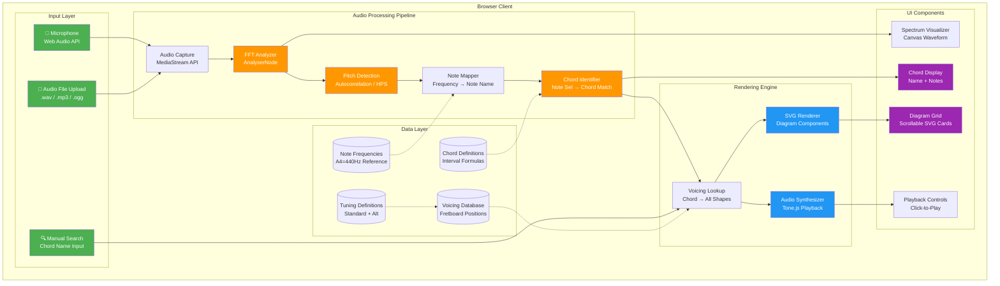
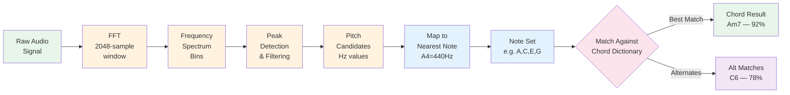
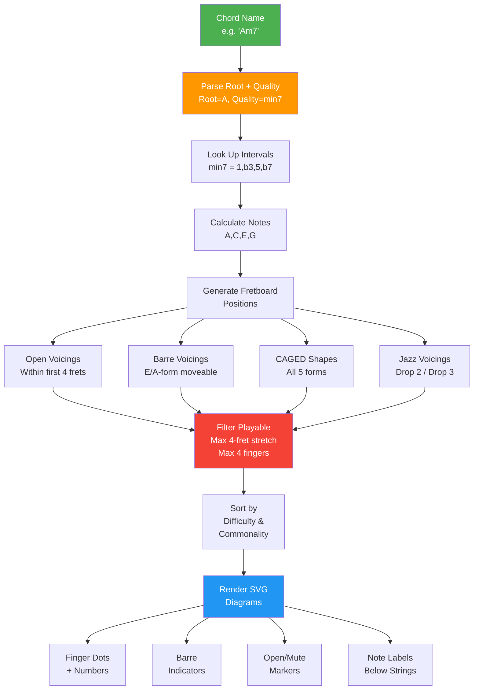
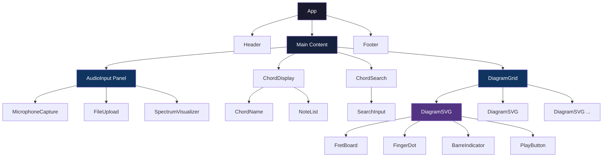
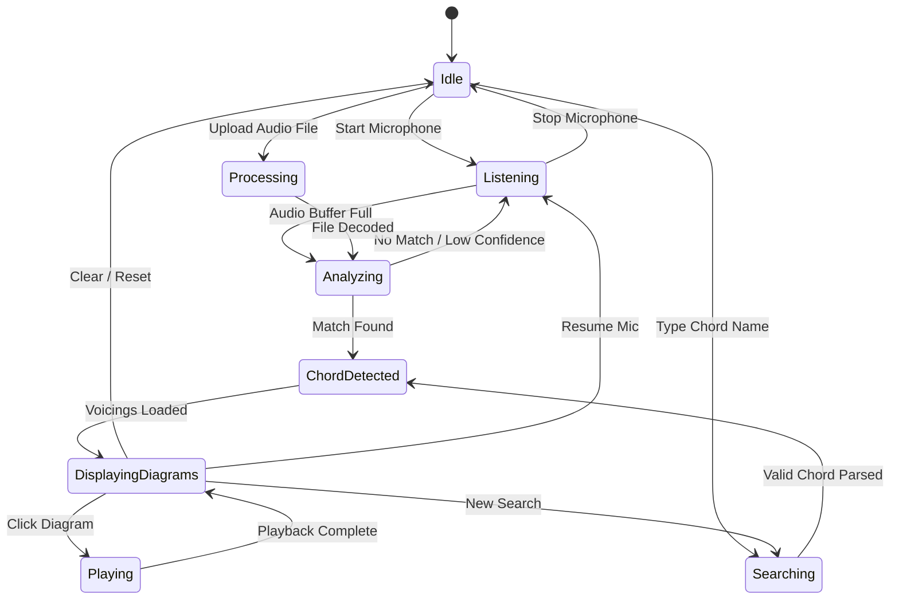
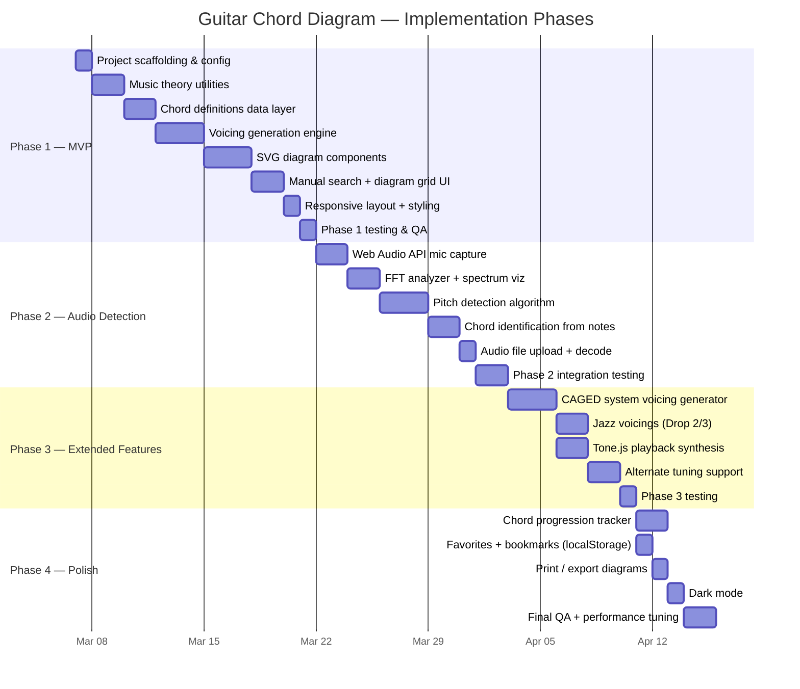
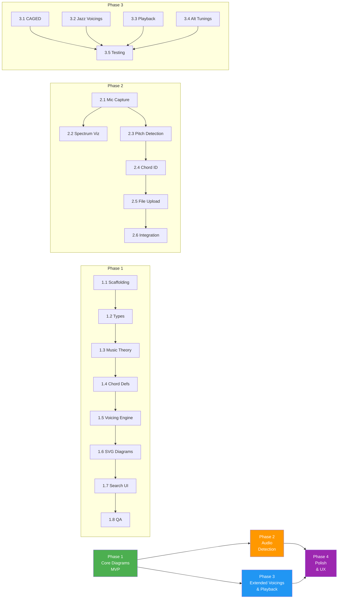

# PRD: Guitar Chord Sound Interpreter & Diagram Generator

## Overview

A browser-based application that listens to guitar audio input (via microphone or audio file), identifies the chord being played, and displays all possible fingering shapes/voicings for that chord as interactive SVG diagrams.

---

## Problem Statement

Guitarists often know a chord by name or sound but don't know all the possible ways to play it across the fretboard. Conversely, beginners may hear a chord but not know what it is. This tool bridges both gaps: it identifies chords from sound and shows every practical voicing.

---

## Target Users

- **Beginner guitarists** learning chord shapes
- **Intermediate players** looking to expand voicing vocabulary
- **Songwriters/transcribers** identifying chords by ear
- **Guitar teachers** needing a visual reference tool

---

## Core Features

### 1. Audio Chord Detection

**Description:** Capture audio from the user's microphone or an uploaded audio file and analyze it to determine the chord being played.

**Technical Approach:**
- Use the Web Audio API to capture microphone input in real time
- Apply FFT (Fast Fourier Transform) to extract frequency spectrum
- Use pitch detection (autocorrelation or harmonic product spectrum) to identify individual note frequencies
- Map detected pitches to musical notes (A, B, C#, etc.)
- Match the note set against a chord dictionary to identify the chord name and quality (major, minor, 7th, sus, dim, aug, etc.)

**Supported Input Modes:**
- Live microphone input with real-time analysis
- Audio file upload (.wav, .mp3, .ogg)

**Detection Capabilities:**
- Major, minor chords
- 7th chords (dominant 7, major 7, minor 7)
- Suspended chords (sus2, sus4)
- Augmented and diminished chords
- Add9, add11 variations
- Power chords (5th)
- Slash chords (inversions with identified bass note)

### 2. Chord Diagram Renderer

**Description:** Given a chord name, render all known/practical fingering positions as standard guitar chord box diagrams (SVG).

**Diagram Features:**
- Standard 6-string guitar neck representation
- Fret numbers labeled on the side
- Finger dots with finger number annotations (1 = index, 2 = middle, 3 = ring, 4 = pinky, T = thumb)
- Open string indicators (O)
- Muted/unplayed string indicators (X)
- Barre indicators (curved bar across strings)
- Fret position marker when chord is played above the 3rd fret
- Note names displayed below each string

**Voicing Coverage:**
- Open position shapes (cowboy chords)
- Barre chord shapes (E-form, A-form, C-form, D-form, G-form — CAGED system)
- Moveable shapes across the fretboard
- Partial/jazz voicings (3-4 string fragments)
- Drop 2, Drop 3 voicings
- All inversions (root, 1st, 2nd, 3rd as applicable)

### 3. Chord Library / Dictionary

**Description:** A comprehensive data model of guitar chords covering all practical voicings.

**Chord Types Supported:**
| Category | Types |
|----------|-------|
| Triads | Major, Minor, Augmented, Diminished |
| 7th Chords | Dom7, Maj7, Min7, Min7b5 (half-dim), Dim7 |
| Extended | 9, Maj9, Min9, 11, 13 |
| Suspended | Sus2, Sus4, 7sus4 |
| Added Tone | Add9, Add11, 6, Min6 |
| Altered | 7#5, 7b5, 7#9, 7b9 |
| Power | 5 (power chord) |

**Root Notes:** All 12 chromatic notes (C, C#/Db, D, D#/Eb, E, F, F#/Gb, G, G#/Ab, A, A#/Bb, B)

### 4. Interactive UI

**Sections:**
- **Audio Input Panel** — mic toggle, file upload, waveform/spectrum visualizer
- **Detected Chord Display** — large, prominent chord name with notes listed
- **Diagram Grid** — scrollable grid of all voicing diagrams for the detected chord
- **Manual Search** — text input to search for any chord by name (e.g., "Am7", "F#dim")
- **Playback** — click a diagram to hear the chord voicing played back via Web Audio API synthesis

---

## Technical Architecture

### System Architecture Diagram



### Audio Detection Data Flow



### Chord Diagram Rendering Flow



### Component Hierarchy



### State Management Flow



### Tech Stack

| Layer | Technology |
|-------|-----------|
| Framework | React 18 + Vite |
| Language | TypeScript |
| Styling | TailwindCSS |
| Audio Processing | Web Audio API (native browser) |
| Diagram Rendering | SVG (inline React components) |
| Audio Synthesis | Tone.js (for chord playback) |
| State Management | React hooks (useState, useReducer, useContext) |
| Testing | Vitest + React Testing Library |

### Project Structure

```
guitar-chord-diagrams/
├── index.html
├── package.json
├── tsconfig.json
├── vite.config.ts
├── tailwind.config.js
├── postcss.config.js
├── src/
│   ├── main.tsx
│   ├── App.tsx
│   ├── components/
│   │   ├── AudioInput/
│   │   │   ├── MicrophoneCapture.tsx
│   │   │   ├── FileUpload.tsx
│   │   │   └── SpectrumVisualizer.tsx
│   │   ├── ChordDisplay/
│   │   │   ├── ChordName.tsx
│   │   │   └── NoteList.tsx
│   │   ├── ChordDiagram/
│   │   │   ├── DiagramSVG.tsx
│   │   │   ├── DiagramGrid.tsx
│   │   │   ├── FretBoard.tsx
│   │   │   ├── FingerDot.tsx
│   │   │   └── BarreIndicator.tsx
│   │   ├── ChordSearch/
│   │   │   └── SearchInput.tsx
│   │   └── Layout/
│   │       ├── Header.tsx
│   │       └── Footer.tsx
│   ├── audio/
│   │   ├── analyzer.ts          # FFT + pitch detection
│   │   ├── chordDetector.ts     # Note set → chord name mapping
│   │   ├── pitchDetection.ts    # Autocorrelation algorithm
│   │   └── synthesizer.ts       # Chord playback via Tone.js
│   ├── data/
│   │   ├── chordDefinitions.ts  # All chord formulas (intervals)
│   │   ├── chordVoicings.ts     # Fretboard positions for each chord
│   │   ├── tunings.ts           # Standard + alternate tunings
│   │   └── noteFrequencies.ts   # Note → Hz mapping
│   ├── utils/
│   │   ├── musicTheory.ts       # Interval math, note transposition
│   │   └── fretboardMath.ts     # Fret-to-note calculations
│   └── types/
│       └── index.ts             # TypeScript interfaces
├── tests/
│   ├── chordDetector.test.ts
│   ├── musicTheory.test.ts
│   └── diagramSVG.test.ts
└── README.md
```

### Key Data Types

```typescript
interface ChordVoicing {
  name: string;              // e.g., "Am7"
  root: string;              // e.g., "A"
  quality: string;           // e.g., "min7"
  strings: (number | null)[]; // Fret per string [E,A,D,G,B,e], null = muted
  fingers: (number | null)[]; // Finger per string, null = open/muted
  barres: Barre[];           // Barre definitions
  baseFret: number;          // Starting fret position
  notes: string[];           // Notes in this voicing
  category: string;          // "open" | "barre" | "jazz" | "partial"
}

interface Barre {
  fret: number;
  fromString: number;
  toString: number;
  finger: number;
}

interface DetectedChord {
  name: string;
  root: string;
  quality: string;
  confidence: number;        // 0-1 detection confidence
  detectedNotes: string[];
  allVoicings: ChordVoicing[];
}
```

---

## Implementation Plan

### Phase Timeline Overview



---

### Phase 1 — Core Diagrams (MVP)

> **Goal:** A working app where users can search for any chord by name and see all playable voicing diagrams rendered as SVGs.

#### Step 1.1 — Project Scaffolding
- Initialize Vite + React + TypeScript project
- Install dependencies: `tailwindcss`, `postcss`, `autoprefixer`
- Configure `tsconfig.json`, `vite.config.ts`, `tailwind.config.js`, `postcss.config.js`
- Set up project directory structure (`src/components/`, `src/data/`, `src/utils/`, `src/types/`, `src/audio/`)
- Create `index.html`, `src/main.tsx`, `src/App.tsx` boilerplate
- Install and configure Vitest for testing

**Deliverable:** `npm run dev` serves a blank React app with TailwindCSS working.

#### Step 1.2 — TypeScript Types & Interfaces
- Define all core types in `src/types/index.ts`:
  - `ChordVoicing`, `Barre`, `DetectedChord`, `ChordDefinition`, `Tuning`, `NoteName`
- Define enums for chord qualities (`Major`, `Minor`, `Dom7`, etc.)
- Define string/fret coordinate types

**Deliverable:** Strongly typed foundation used by all subsequent modules.

#### Step 1.3 — Music Theory Utilities
- `src/utils/musicTheory.ts`:
  - Chromatic note array (`C, C#, D, D#, E, F, F#, G, G#, A, A#, B`)
  - `transposeNote(note, semitones)` — shift a note up/down
  - `getInterval(root, target)` — semitone distance between two notes
  - `applyFormula(root, intervals[])` — generate notes from a root + interval formula
  - Enharmonic normalization (`Db → C#`, `Gb → F#`)
- `src/data/noteFrequencies.ts`:
  - Mapping of every note + octave to its frequency in Hz (A4 = 440Hz)
- `src/data/tunings.ts`:
  - Standard tuning: `[E2, A2, D3, G3, B3, E4]`
  - Data structure for alternate tunings (used in Phase 3)

**Deliverable:** Unit-tested music theory functions.

#### Step 1.4 — Chord Definitions Data Layer
- `src/data/chordDefinitions.ts`:
  - Map of `quality → interval formula`:
    ```
    major: [0, 4, 7]
    minor: [0, 3, 7]
    dom7:  [0, 4, 7, 10]
    maj7:  [0, 4, 7, 11]
    min7:  [0, 3, 7, 10]
    dim:   [0, 3, 6]
    aug:   [0, 4, 8]
    sus2:  [0, 2, 7]
    sus4:  [0, 5, 7]
    ...etc for all supported qualities
    ```
  - Chord name parser: `"Am7" → { root: "A", quality: "min7" }`
  - Chord name formatter: `{ root: "F#", quality: "dim7" } → "F#dim7"`

**Deliverable:** Complete chord dictionary with parser/formatter, unit tested.

#### Step 1.5 — Voicing Generation Engine
- `src/utils/fretboardMath.ts`:
  - `getNoteAtFret(string, fret, tuning)` — what note is at a given position
  - `findNotePositions(note, tuning, maxFret)` — all places a note appears on the fretboard
  - `generateVoicings(root, quality, tuning)` — algorithmic voicing generator:
    1. Get required notes from chord formula
    2. Find all fretboard positions for each note
    3. Generate combinations (one note per string, or muted)
    4. Filter by playability constraints:
       - Max 4-fret stretch (or 5 with barre)
       - Max 4 non-barre fingers
       - At least 3 strings played (no 2-note "chords")
       - Root or 5th in bass preferred
    5. Detect barres automatically
    6. Assign finger numbers heuristically
    7. Categorize: open / barre / partial / jazz
- `src/data/chordVoicings.ts`:
  - Curated overrides for common open chords (C, D, E, G, A, Am, Em, Dm, etc.) to ensure canonical shapes are always present
  - Merge curated + generated voicings, deduplicating

**Deliverable:** Given any chord name, returns a sorted list of `ChordVoicing[]` objects.

#### Step 1.6 — SVG Diagram Components
- `src/components/ChordDiagram/FretBoard.tsx`:
  - Renders 6 vertical string lines + 4-5 horizontal fret lines
  - Nut (thick top line for open position) or fret number label for higher positions
  - String tuning labels at bottom
- `src/components/ChordDiagram/FingerDot.tsx`:
  - Filled circle at correct string × fret intersection
  - Finger number (1-4, T) centered inside the dot
- `src/components/ChordDiagram/BarreIndicator.tsx`:
  - Rounded rectangle spanning multiple strings at a given fret
  - Finger number label
- `src/components/ChordDiagram/DiagramSVG.tsx`:
  - Composes `FretBoard` + `FingerDot[]` + `BarreIndicator[]`
  - Shows open (O) and muted (X) string indicators above the nut
  - Shows note names below each string
  - Accepts a `ChordVoicing` prop and renders the complete diagram
- `src/components/ChordDiagram/DiagramGrid.tsx`:
  - Responsive CSS grid of `DiagramSVG` cards
  - Category labels (Open, Barre, Jazz, etc.)
  - Sort/filter controls

**Deliverable:** Pixel-perfect chord diagrams that match standard guitar chord book notation.

#### Step 1.7 — Search UI & Layout
- `src/components/ChordSearch/SearchInput.tsx`:
  - Text input with autocomplete/suggestions
  - Parses input into root + quality, validates against chord dictionary
  - Displays error state for unrecognized chords
- `src/components/ChordDisplay/ChordName.tsx`:
  - Large display of the current chord name
  - Root note highlighted in accent color
- `src/components/ChordDisplay/NoteList.tsx`:
  - Horizontal list of notes in the chord (e.g., A C E G)
- `src/components/Layout/Header.tsx` + `Footer.tsx`:
  - App title, navigation placeholder, attribution
- `src/App.tsx`:
  - Wire together: SearchInput → chord lookup → DiagramGrid
  - Responsive layout (mobile: stacked, desktop: sidebar + grid)

**Deliverable:** Complete Phase 1 app — type a chord name, see all diagrams.

#### Step 1.8 — Phase 1 Testing & QA
- Unit tests: music theory functions, chord parser, voicing generator
- Component tests: DiagramSVG renders correct number of dots, barres
- Visual QA: verify diagrams for C, Am, G, F, Bm, E7, Cmaj7, Dm against known references
- Responsive check: mobile (375px), tablet (768px), desktop (1280px)

---

### Phase 2 — Audio Detection

> **Goal:** Users can play a chord on their guitar into the microphone and the app identifies it in real time.

#### Step 2.1 — Microphone Capture
- `src/audio/analyzer.ts`:
  - Request mic access via `navigator.mediaDevices.getUserMedia({ audio: true })`
  - Create `AudioContext`, connect `MediaStreamSource` → `AnalyserNode`
  - Configure FFT: `fftSize=4096` (for ~10Hz resolution at 44.1kHz)
  - Expose start/stop controls and raw frequency data
- `src/components/AudioInput/MicrophoneCapture.tsx`:
  - Toggle button with recording state indicator
  - Permission handling (prompt, denied, error states)

**Deliverable:** App can capture and access raw audio frequency data from the microphone.

#### Step 2.2 — Spectrum Visualizer
- `src/components/AudioInput/SpectrumVisualizer.tsx`:
  - Canvas-based frequency bar chart (or smooth curve)
  - Color-coded frequency ranges (bass = warm, treble = cool)
  - Animates at 30fps via `requestAnimationFrame`
  - Shows detected peak frequencies as highlighted markers

**Deliverable:** Visual feedback so users know the mic is active and capturing sound.

#### Step 2.3 — Pitch Detection Algorithm
- `src/audio/pitchDetection.ts`:
  - Implement YIN or autocorrelation-based pitch detection
  - Input: time-domain audio buffer (Float32Array)
  - Output: detected fundamental frequency in Hz + confidence score
  - Handle polyphonic detection:
    - Run harmonic product spectrum (HPS) to find multiple simultaneous pitches
    - Or: use spectral peak picking on FFT magnitude data
    - Filter harmonics/overtones to isolate fundamental notes
  - Guitar-specific optimizations:
    - Limit detection range: 82Hz (E2) to 1175Hz (D6)
    - Use windowing (Hann window) to reduce spectral leakage
    - Require minimum amplitude threshold to ignore noise

**Deliverable:** Given an audio buffer, returns an array of detected `{note, frequency, confidence}`.

#### Step 2.4 — Chord Identification from Detected Notes
- `src/audio/chordDetector.ts`:
  - Input: array of detected notes (e.g., `["A", "C", "E", "G"]`)
  - Algorithm:
    1. Normalize notes (remove octave, deduplicate)
    2. Try each detected note as a potential root
    3. Compute intervals from root to all other notes
    4. Match interval set against chord definitions
    5. Score each match by coverage (all chord tones present?) and confidence
    6. Return top 3 matches with confidence scores
  - Handle ambiguity (Am7 vs C6 — same notes, different root context):
    - Prefer the bass note as root
    - Weight by commonality of chord type

**Deliverable:** Real-time chord detection with confidence scores and alternative suggestions.

#### Step 2.5 — Audio File Upload
- `src/components/AudioInput/FileUpload.tsx`:
  - Drag-and-drop zone + file picker for `.wav`, `.mp3`, `.ogg`
  - Decode audio file via `AudioContext.decodeAudioData()`
  - Feed decoded buffer into the same analysis pipeline
  - Simple play/pause transport controls

**Deliverable:** Users can upload a recording and detect chords from it.

#### Step 2.6 — Phase 2 Integration
- Wire audio detection pipeline into the main App state:
  - `Microphone/File → Analyzer → Pitch Detection → Chord Detector → Chord Display + Diagram Grid`
  - Update chord display in real time as detection results stream in
  - Debounce/throttle updates (max 4 updates/sec) to prevent UI thrashing
  - Show confidence meter next to detected chord name
  - Show alternative chord interpretations in a secondary display
- Integration tests with recorded chord samples

---

### Phase 3 — Extended Voicings & Playback

> **Goal:** Comprehensive voicing coverage and audio playback of diagrams.

#### Step 3.1 — CAGED System Voicing Generator
- Extend `fretboardMath.ts`:
  - Define the 5 CAGED template shapes (C-form, A-form, G-form, E-form, D-form)
  - Each template is a moveable pattern with a root position
  - Transpose each template to all 12 root notes
  - Generate voicings for every chord quality × CAGED form × root
  - Label each voicing with its CAGED form name

**Deliverable:** 5 voicings per chord across the entire neck, labeled by CAGED form.

#### Step 3.2 — Jazz Voicings
- Add Drop 2 and Drop 3 voicing algorithms:
  - Take a close-position chord (e.g., C E G B)
  - Drop the 2nd-from-top note down an octave → Drop 2
  - Drop the 3rd-from-top note → Drop 3
  - Map resulting note sets to guitar fretboard positions
  - Filter for string sets commonly used in jazz (top 4, middle 4, bottom 4)
- Add shell voicings (root + 3rd + 7th only)
- Tag these voicings with category `"jazz"` for filtering

**Deliverable:** Jazz players get practical comping voicings.

#### Step 3.3 — Chord Playback Synthesis
- `src/audio/synthesizer.ts`:
  - Initialize Tone.js with a clean guitar-like synth patch
  - `playVoicing(voicing: ChordVoicing)`:
    - Calculate exact frequencies for each fretted/open string
    - Strum simulation: stagger note onsets by 20-40ms
    - Apply envelope: quick attack, medium sustain, natural decay
  - Add volume control
- `PlayButton` component on each diagram card:
  - Click to hear the voicing
  - Visual strum animation on the diagram during playback

**Deliverable:** Users can click any diagram to hear how it sounds.

#### Step 3.4 — Alternate Tuning Support
- Extend `src/data/tunings.ts` with:
  - Drop D: `[D2, A2, D3, G3, B3, E4]`
  - Open G: `[D2, G2, D3, G3, B3, D4]`
  - Open D: `[D2, A2, D3, F#3, A3, D4]`
  - DADGAD: `[D2, A2, D3, G3, A3, D4]`
  - Half-step down: `[Eb2, Ab2, Db3, Gb3, Bb3, Eb4]`
- Add tuning selector dropdown in the UI
- Voicing generator re-runs when tuning changes
- Diagrams update string labels to reflect the tuning

**Deliverable:** All voicings recalculated for any selected tuning.

---

### Phase 4 — Polish & UX

> **Goal:** Production-quality user experience with persistence and export.

#### Step 4.1 — Chord Progression Tracker
- New `ProgressionPanel` component:
  - Timeline view of detected chords in sequence
  - Shows: chord name, timestamp, duration held
  - Users can click any chord in the timeline to jump to its diagrams
  - Clear / reset progression
  - Copy progression as text (e.g., `Am - F - C - G`)

#### Step 4.2 — Favorites & Bookmarks
- `localStorage`-based persistence:
  - Star icon on each diagram card
  - "Favorites" tab that displays saved voicings
  - Export/import favorites as JSON

#### Step 4.3 — Print & Export
- "Export" button on diagram grid:
  - PNG export: render SVG to canvas → download as PNG
  - PDF export: arrange diagrams in a print-friendly layout
  - Print CSS: `@media print` styles for clean paper output
- Share: generate a URL with chord name encoded as query param

#### Step 4.4 — Dark Mode
- TailwindCSS `dark:` variant classes throughout
- System preference detection (`prefers-color-scheme`)
- Manual toggle in header
- Diagram SVGs adapt colors (white lines on dark background)

#### Step 4.5 — Performance & Final QA
- Lazy load diagram grid (only render visible cards via intersection observer)
- Memoize voicing generation results
- Lighthouse audit: target 90+ on performance, accessibility, best practices
- Cross-browser testing: Chrome, Firefox, Safari, Edge
- Accessibility: keyboard navigation, ARIA labels on diagrams, screen reader support
- Final regression test pass across all phases

---

### Phase Dependency Map



---

## Non-Goals (Out of Scope)

- Tab/sheet music generation
- Chord progression suggestions or AI composition
- Mobile native app (browser-only for now)
- Multi-instrument support (guitar only)
- Backend / user accounts / cloud storage

---

## Success Metrics

- Correctly identifies > 85% of cleanly played chords from microphone input
- Renders at least 5 voicings for every standard chord type
- Page loads in < 2 seconds
- All diagrams render correctly at mobile and desktop viewport sizes

---

## Open Questions

1. Should we support alternate tunings (Drop D, Open G, DADGAD) in Phase 1 or defer?
2. Should the chord library be algorithmically generated from intervals + fretboard math, or hand-curated for quality?
3. Do we want left-handed diagram mode?
4. Should audio file upload support scrubbing/seeking to specific timestamps?
