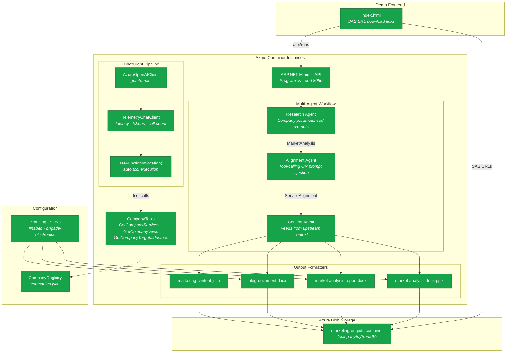
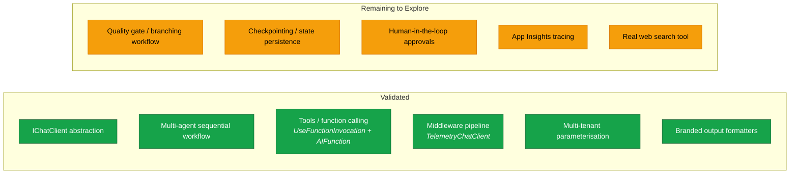

This branch is dedicated to exploring and learning the **Microsoft Agent Framework**, a modern framework for building AI agents and multi-agent workflows in .NET and Python.

---

### Architecture: What We've Built & Validated



**Legend**: 🟢 Green = validated end-to-end | 🔵 Blue = framework feature explored | ⬜ Grey = pending

#### Framework Features Explored vs. Remaining



---

### 🟢 Current Status: Running in Azure on ACI
**As of April 14, 2026**:
- ✅ **MVP Functional**: Research, Alignment, and Content agents are fully operational.
- ✅ **Stability Hardening**: Resolved persistent "Repair" errors in PowerPoint decks and typography issues in marketing SVGs.
- ✅ **Ready for Social**: Generation of high-fidelity social cards (LinkedIn, Twitter, Instagram) is verified.
- ✅ **Deployed to Azure Container Instances**: after hitting a zero App Service quota wall and a `roleAssignments/write` permission gap, pivoted to ACI. End-to-end run time: **~56 seconds** against gpt-4o, producing JSON + Word documents + PowerPoint deck uploaded to Azure Blob Storage. (Endpoint + account names intentionally omitted from this public repo — see local `infra/deploy-aci-mac.sh` output.)
- 📝 **Friction log written up**: see [Stack Experience Retrospective](docs/stack-experience-retrospective.md) — eight walls from az CLI bugs through a reasoning-vs-chat model mixup to ACI image-pull caching. Shareable with stakeholders and audience.
- 📨 **Tenant admin briefing**: see [Azure Quota Request](docs/azure-quota-request.md) for the exact Azure Support ticket needed to enable a future migration back to Functions + Managed Identity.
- ✅ **Verified end-to-end (April 14, 2026, 15:38 UTC)**: independent re-trigger of the ACI endpoint produced a fresh run `2026-04-14-153704` with all four artifacts landing in blob storage — `marketing-content.json` (19.8 KB), `blog-document.docx` (4.2 KB), `market-analysis-report.docx` (3.4 KB), `market-analysis-deck.pptx` (11.1 KB).

```bash
# Trigger a new run (blocks ~56s, returns JSON with run ID and blob URLs)
curl -X POST http://<your-aci-fqdn>:8080/api/generate

# List outputs
az storage blob list --account-name <your-storage-account> \
  --container-name marketing-outputs --auth-mode key -o table
```

### 🟢 Update: Multi-Company Pipeline & Framework Exploration (April 16, 2026)

**Multi-tenant pipeline now operational** — the same workflow generates correctly-scoped content for multiple companies without cross-contamination:

- ✅ **Multi-company support**: `MarketResearchAgent`, `ServiceAlignmentAgent`, and `ContentGenerationAgent` are all parameterised by `Company` profile. A `CompanyRegistry` loaded from `branding/companies.json` drives prompts, service catalogs, and branding. Adding a new company is config-only — no code changes required.
- ✅ **Tools / function calling (Track B)**: The Alignment agent supports two modes — classic prompt injection and a tool-calling path using `Microsoft.Extensions.AI`'s `UseFunctionInvocation()` + `CompanyTools.AsAIFunctions()`. The API host uses tool-calling mode; the console host uses classic mode. This is the single most important framework capability explored so far.
- ✅ **Demo frontend**: A vanilla-JS static page served from ASP.NET lists runs chronologically and hands out time-limited SAS URLs so non-technical stakeholders can click and download outputs without Azure tenant authentication.
- ✅ **Company-specific branding**: Brigade Electronics renders in deep navy (#0A1E3D) / electric teal (#00C9DB) — their technology-first 2026 palette. Finabeo renders in navy/gold. Branding JSON drives Word and PowerPoint formatters directly.
- ✅ **Cross-contamination bug found and fixed**: The CoWork-generated multi-company commit shipped company-aware branding but left `MarketResearchAgent` and `ContentGenerationAgent` with hardcoded Finabeo/fintech prompts. Brigade reports contained Finabeo content. **Framework insight**: prompt parameterisation is a cross-cutting concern the framework does not enforce — nothing in `Microsoft.Extensions.AI` prevents you from wiring a company registry through only half your agents. A framework with stronger tenant primitives might catch this at compile time.

**Recent verified runs:**

| Run ID | Company | Duration | Artifacts |
|--------|---------|----------|-----------|
| `2026-04-16-064557` | Brigade Electronics | 74s | JSON + 2× DOCX + PPTX (navy/teal palette) |
| `2026-04-16-001148` | Finabeo | 50s | JSON + 2× DOCX + PPTX (navy/gold palette) |
| `2026-04-14-153704` | Finabeo | 56s | JSON + 2× DOCX + PPTX (original baseline) |

```bash
# Trigger a company-specific run (blocks ~50-75s)
curl -X POST http://<your-aci-fqdn>:8080/api/generate \
  -H "Content-Type: application/json" \
  -d '{"companyId":"brigade-electronics"}'

# Or default to Finabeo
curl -X POST http://<your-aci-fqdn>:8080/api/generate

# List available companies
curl http://<your-aci-fqdn>:8080/api/companies

# List all runs with SAS download URLs
curl http://<your-aci-fqdn>:8080/api/runs
```

---

### 🗺️ Where We Are & What's Next (Week of April 14–18, 2026)

Infrastructure is done. The remaining days this week are for **exploring the Agent Framework itself** — not fighting Azure. Suggested tracks, in rough priority order:

#### Track A — Agent Quality & Prompt Iteration (highest leverage)
- [x] ~~Inspect the latest `marketing-content.json` runs and grade output quality~~ — completed during multi-company bug fix; Brigade runs verified clean (53× "safety", 44× "fleet", 0× fintech)
- [x] ~~Tighten the Research agent's system prompt~~ — refactored to company-parameterised prompts with explicit anti-drift instruction ("do NOT drift into unrelated sectors")
- [ ] Add few-shot examples to the Content agent for each platform (LinkedIn vs. Twitter voice is currently too similar)
- [ ] Experiment with temperature / top_p per agent (Research low, Content higher)

#### Track B — Framework Feature Exploration
- [x] ~~**Tools / function calling**~~: `ServiceAlignmentAgent` now has a tool-calling mode using `UseFunctionInvocation()` + `CompanyTools.AsAIFunctions()`. Agent decides when to call `GetCompanyServices`, `GetCompanyTargetIndustries`, `GetCompanyVoice`. API host uses this path.
- [ ] **Middleware**: wire an agent-level middleware that logs token usage + latency per call, feeding App Insights
- [ ] **Workflows with branching**: add a quality-gate step that loops back to Content agent if alignment score < 0.8
- [ ] **Human-in-the-loop**: prototype an approval checkpoint before "publish" (even if publish is a no-op for now)
- [ ] **Checkpointing**: persist workflow state to blob so a run can resume after a crash

#### Track C — Observability & Real Integrations
- [ ] Turn on App Insights traces from inside the agents (currently only HTTP logs flow)
- [ ] Swap LLM-synthesized "research" for a real web search tool (Bing Search API, Brave, or Tavily)
- [ ] Add a Linear / Slack notification middleware so a successful run pings somewhere visible

#### Track D — Governance & Handoff Story (for the LinkedIn article follow-up)
- [ ] Write a short "what the Agent Framework actually gives you vs. raw OpenAI SDK" comparison based on hands-on experience
- [x] ~~Capture one more friction point or delight in the retrospective~~ — multi-tenant bug: CoWork shipped tool-calling + branding but left research/content prompts hardcoded to Finabeo. Framework insight: prompt parameterisation is a cross-cutting concern the framework doesn't enforce at compile time.
- [ ] Request App Service quota from tenant admin using [docs/azure-quota-request.md](docs/azure-quota-request.md) — unblocks eventual Functions + Managed Identity migration

**Pick one from Track A + one from Track B per session.** Track C and D are lower priority but high-value for the write-up.

---

## 📂 Project Navigation & Signposting

| Document | Purpose | Location |
|----------|---------|----------|
| **Architecture & Agents** | Deep dive into the Finabeo Marketing Agent system. | [Agent README](agents/FinabeoMarketingAgent/README.md) |
| **Technical Debugging** | Resolution of PowerPoint (OXML) and SVG issues. | [Debugging Report](agents/FinabeoMarketingAgent/DEBUGGING_ASSETS.md) |
| **Deployment Plan** | Infrastructure and cloud integration roadmap. | [Implementation Guide](docs/IMPLEMENTATION-GUIDE.md) |
| **Stack Experience Retrospective** | Friction log from shipping on the Microsoft stack — five walls deep. | [Retrospective](docs/stack-experience-retrospective.md) |
| **Azure Quota Request (for admin)** | Ticket template + context for the tenant admin to unblock Functions. | [Quota Request](docs/azure-quota-request.md) |
| **Company Registry** | Multi-company config: Finabeo + Brigade Electronics services, industries, branding files. | [companies.json](branding/companies.json) |
| **Brigade Branding** | Deep navy / electric teal palette, AI Detection Frame motif, Montserrat typography. | [brigade-electronics-branding.json](branding/brigade-electronics-branding.json) |
| **Finabeo Branding** | Navy / gold palette, governance-focused visual identity. | [finabeo-branding.json](branding/finabeo-branding.json) |
| **Demo Frontend** | Static page listing runs with SAS download links — no Azure login needed. | [index.html](agents/FinabeoMarketingAgent.Api/wwwroot/index.html) |
| **Latest Stable Output** | View the most recent successful generation. | [Latest Output Folder](agents/FinabeoMarketingAgent/output/) |

## Overview

The Microsoft Agent Framework combines the strengths of **AutoGen** and **Semantic Kernel**, providing:

- **Agents**: Individual agents that use LLMs to process inputs, call tools, and generate responses
- **Workflows**: Graph-based workflows for multi-step tasks with type-safe routing and human-in-the-loop support
- **Enterprise Features**: Session-based state management, type safety, middleware, telemetry, and extensive model support

## Key Capabilities

### Agents
- Use LLMs (OpenAI, Azure OpenAI, Anthropic, Ollama, and more)
- Call external tools and Model Context Protocol (MCP) servers
- Support for multi-turn conversations
- Middleware for intercepting and modifying agent behavior

### Workflows
- Graph-based orchestration for multi-agent scenarios
- Type-safe routing between agents and functions
- Checkpointing for state persistence
- Human-in-the-loop support for interactive workflows

## Quick Start

### C# Example
```dotnetcli
dotnet add package Microsoft.Agents.AI.Foundry --prerelease
```

```csharp
using System;
using Azure.AI.Projects;
using Azure.Identity;
using Microsoft.Agents.AI;

AIAgent agent = new AIProjectClient(
        new Uri("https://your-foundry-service.services.ai.azure.com/api/projects/your-foundry-project"),
        new AzureCliCredential())
    .AsAIAgent(
        model: "gpt-5.4-mini",
        instructions: "You are a friendly assistant. Keep your answers brief.");

Console.WriteLine(await agent.RunAsync("What is the largest city in France?"));
```

### Python Example
```bash
pip install agent-framework
```

```python
from agent_framework.foundry import FoundryChatClient
from azure.identity import AzureCliCredential

credential = AzureCliCredential()
client = FoundryChatClient(
    project_endpoint="https://your-foundry-service.services.ai.azure.com/api/projects/your-foundry-project",
    model="gpt-5.4-mini",
    credential=credential,
)

agent = client.as_agent(
    name="HelloAgent",
    instructions="You are a friendly assistant. Keep your answers brief.",
)

# Run the agent
result = await agent.run("What is the largest city in France?")
print(f"Agent: {result}")
```

## When to Use

### Use an Agent when:
- The task is open-ended or conversational
- You need autonomous tool use and planning
- A single LLM call (possibly with tools) suffices

### Use a Workflow when:
- The process has well-defined steps
- You need explicit control over execution order
- Multiple agents or functions must coordinate

**Pro Tip**: If you can write a function to handle the task, do that instead of using an AI agent.

## Learning Path

1. **Start with Agents**: Learn basic agent creation and tool calling
2. **Add Tools**: Extend agents with external tool integration
3. **Build Conversations**: Implement multi-turn dialogue with session management
4. **Explore Workflows**: Create complex multi-agent orchestrations
5. **Add Middleware**: Implement custom interceptors and filters

## Official Resources

- 📚 [Agent Framework Documentation](https://learn.microsoft.com/en-us/agent-framework/overview/?pivots=programming-language-csharp)
- 🔧 [Tools & MCP Integration](https://learn.microsoft.com/en-us/agent-framework/agents/tools/)
- 📝 [Workflows Guide](https://learn.microsoft.com/en-us/agent-framework/workflows/)
- 🔄 [Migration Guides](https://learn.microsoft.com/en-us/agent-framework/migration-guide/)
  - From Semantic Kernel
  - From AutoGen

## Supported Models & Providers

- Microsoft Foundry
- Azure OpenAI
- OpenAI
- Anthropic
- Ollama
- And more...

## Project Structure

This branch will contain explorations and experiments with:
- Basic agent implementations
- Tool integration examples
- Workflow demonstrations
- Best practices and patterns
- Integration with Vibe Cast architecture (if applicable)

---

## Finabeo Marketing Agent - Real-World Implementation

### 🎯 Project Objective (LinkedIn Article - Published April 13, 2026)

**"Microsoft Agent Framework: The CIO's Guide to Enterprise Agentic AI (Without Vendor Lock-In)"**

This branch implements a working proof-of-concept of the Microsoft Agent Framework as described in the LinkedIn article published this morning. The objective is to demonstrate:

- ✅ **Speed**: Multi-agent workflows built and operational in days, not months
- ✅ **Enterprise-Ready**: Type safety, telemetry, state management built-in
- ✅ **Governance-First**: Not an afterthought—fundamental to the architecture
- ✅ **Flexibility**: Works with any LLM (OpenAI, Claude, local models) via abstraction layers
- ✅ **Real Results**: Generates actual marketing content (LinkedIn, Twitter, Instagram, Blog)

The system proves that Microsoft's ecosystem can deliver Agentic AI without vendor lock-in, addressing the skepticism around Microsoft's ability to compete with pure-play AI providers.

---

---

## 📋 Weekly Project Progress Plan

### **Week 1: MVP Development** ✅ COMPLETE

#### Phase 1: Setup & Infrastructure ✅
- [x] Set up C# .NET 10.0 console project
- [x] Configure Azure AI Foundry connection
- [x] Create GitHub repo structure

#### Phase 2: Agent Framework Setup ✅
- [x] Install Microsoft.Agents.AI.Foundry (v1.0.0 Stable)
- [x] Implement structured output schemas (JSON)

#### Phase 3: Asset Stabilization & Debugging ✅
- [x] **PPTX Fix**: Resolved OXML compliance and "Repair" errors.
- [x] **SVG Fix**: Implemented word-aware wrapping and dynamic font scaling.
- [x] **Technical Documentation**: Generated specialized [Debugging Reports](agents/FinabeoMarketingAgent/DEBUGGING_ASSETS.md).

### **Week 2: Production & Cloud Readiness** 🔄 IN PROGRESS

#### Phase 1: Azure Deployment (Pivoted to ACI)
Subscription hit two blockers — zero App Service compute quota (Y1/B1/F1, every region tested) and a `roleAssignments/write` permission gap on the Contributor role. Pivoted the compute target to Azure Container Instances, which uses general-purpose vCPU quota (confirmed open). Full story in [docs/stack-experience-retrospective.md](docs/stack-experience-retrospective.md); admin ticket context in [docs/azure-quota-request.md](docs/azure-quota-request.md).
- [x] Built ASP.NET minimal-API wrapper around the workflow (`agents/FinabeoMarketingAgent.Api`)
- [x] Dockerized via multi-stage build (`agents/FinabeoMarketingAgent.Api/Dockerfile`)
- [x] Cloud-side build via `az acr build` (no local Docker required)
- [x] Bicep template for ACR + ACI + Storage + App Insights (`infra/aci-setup.bicep`)
- [x] Deploy script `infra/deploy-aci-mac.sh`
- [x] Foundry auth switched to `AzureOpenAIClient` + `AzureKeyCredential` against **gpt-4o-mini** deployment (gpt-5-mini turned out to be a reasoning model — see retrospective Wall 7)
- [x] End-to-end validation against deployed ACI — ~50-75s, HTTP 200, all four artifacts (JSON + 2× DOCX + PPTX) in blob storage
- [x] Multi-company support: `CompanyRegistry` + per-company parameterised agents + `branding/companies.json`
- [x] Demo frontend with SAS URL download links
- [x] Tool-calling mode for `ServiceAlignmentAgent` via `UseFunctionInvocation()` + `CompanyTools`
- [x] Brigade Electronics branding: deep navy/teal technology-first palette (v0.3)
- [ ] Logic App or external cron for daily schedule (deferred — HTTP-only for demo)
- [ ] **When quota is granted**: migrate back to Functions + Managed Identity + Key Vault (original `infra/foundry-setup.bicep` preserved)

#### Phase 2: Real Integration (Pending)
- [ ] Integrate real web search (currently using LLM synthesis)
- [ ] Add real Finabeo service catalog integration
- [ ] Implement error handling and retry logic
- [ ] Add observability and logging

#### Phase 3: Quality & Review (Pending)
- [ ] Email digest workflow for marketing team
- [ ] Database persistence for outputs
- [ ] Basic review dashboard
- [ ] Approval workflow before publishing

#### Phase 4: Monitoring & Observability (Pending)
- [ ] Application Insights integration
- [ ] Error tracking and alerting
- [ ] Cost monitoring and optimization
- [ ] Performance metrics dashboard

#### Phase 5: Documentation & Handoff (Pending)
- [ ] Marketing team setup guide
- [ ] Content review/edit procedures
- [ ] Publishing schedule management
- [ ] Troubleshooting guide
- [ ] Cost analysis and ROI

---

## ✅ Current Status Assessment

### Execution Results (April 13, 2026)
```
✅ Multi-agent architecture implemented
✅ All 3 agents (Research, Alignment, Content) working
✅ Workflow orchestration complete
✅ End-to-end execution: 4.968 seconds
✅ Mock fallbacks for all agents (ensures reliability)
✅ JSON output validated and formatted
✅ Deployment scripts (PowerShell + Bash)
✅ Comprehensive documentation with diagrams
✅ Build issues documented and resolved
✅ .NET 10.0 with stable dependencies (resolved 5 major NuGet conflicts)
```

### Generated Content Quality (Sample Run)
- **Market Insights**: 2 key trends identified
  - Cloud Cost Optimization (25-40% enterprise waste)
  - Agentic AI Adoption (safe deployment in regulated environments)
- **Alignment Scores**:
  - Cloud Cost Management: 0.95 alignment
  - Agentic AI Transformation: 0.88 alignment
- **Content Generated**: All 4 platforms (LinkedIn, Twitter, Instagram, Blog)
- **Quality Score**: 0.9/1.0
- **Alignment to Market**: Strong

### What's Ready for LinkedIn Article
✅ **LinkedIn Post**: 200+ word professional piece on Agent Framework governance
✅ **Twitter Thread**: 3-tweet sequence on multi-agent architecture
✅ **Instagram Content**: Caption with visual brief and emoji suggestions
✅ **Blog Draft**: 1850-word article with SEO keywords and complete outline

---

## 📝 What Remains for Week 2

| Task | Priority | Effort | Status |
|------|----------|--------|--------|
| Azure Function setup with daily trigger | High | 2 days | Pending |
| Real web search integration (vs LLM synthesis) | High | 1 day | Pending |
| Database schema & persistence | High | 1 day | Pending |
| Managed Identity & Key Vault | High | 0.5 days | Pending |
| Application Insights & monitoring | Medium | 1 day | Pending |
| Email notification workflow | Medium | 1 day | Pending |
| Review dashboard (basic) | Medium | 1.5 days | Pending |
| Performance optimization & testing | Medium | 1 day | Pending |
| Marketing team documentation | Medium | 1 day | Pending |

---

## 🚀 Quick Start

### Prerequisites
- .NET 10.0 SDK
- Azure AI Foundry project
- Foundry API key

### Run MVP
```bash
cd agents/FinabeoMarketingAgent
dotnet restore
dotnet build
export FOUNDRY_API_KEY="your-key-here"
dotnet run
```

**Output**: `output/marketing-content-{timestamp}.json`

See [agents/FinabeoMarketingAgent/README.md](agents/FinabeoMarketingAgent/README.md) for complete setup details.

---

**Status**: MVP Complete ✅ | Week 1 Done | Week 2 In Progress — multi-company pipeline live, tools/function calling explored, middleware + branching next | See [Stack Retrospective](docs/stack-experience-retrospective.md) for the friction story
