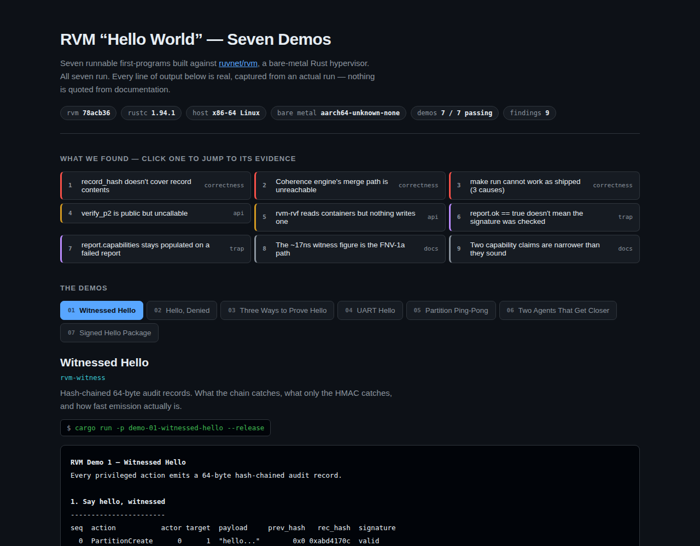
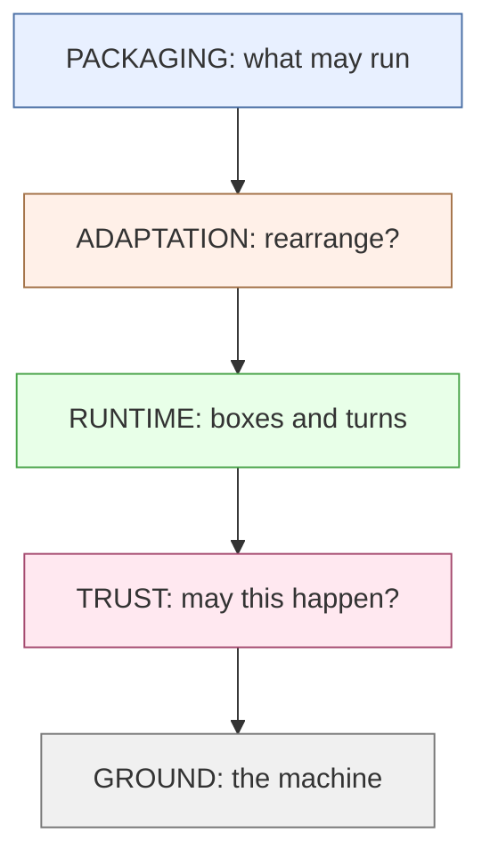
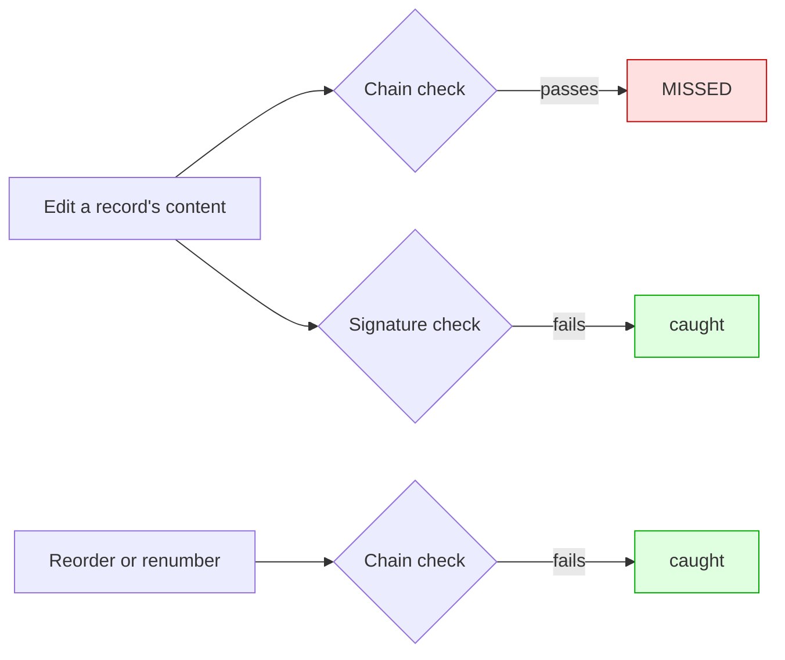
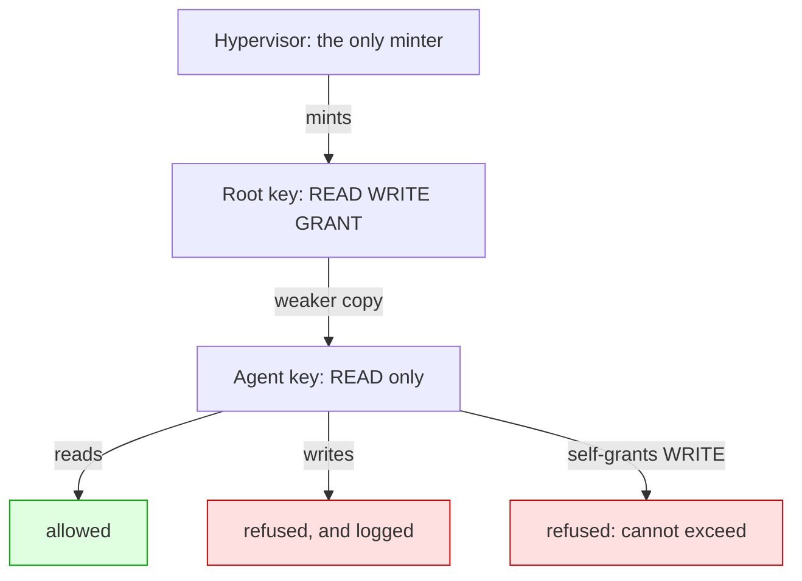
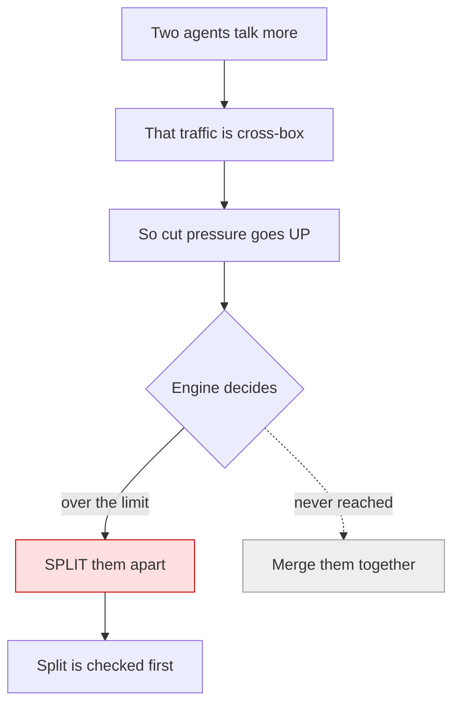
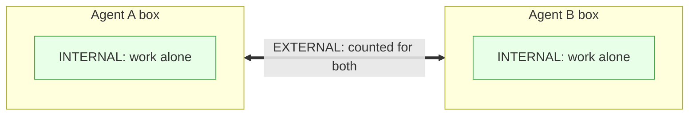
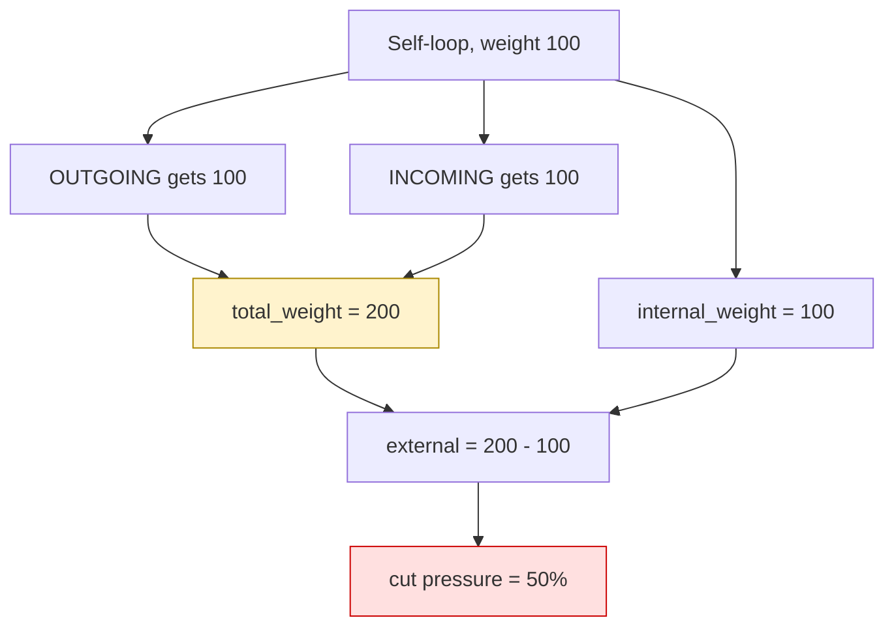
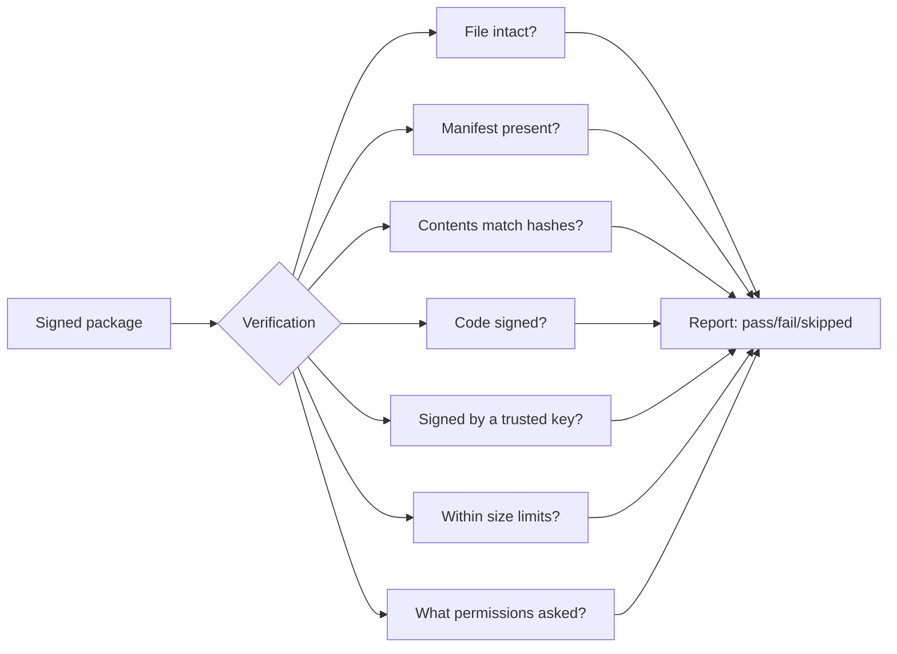
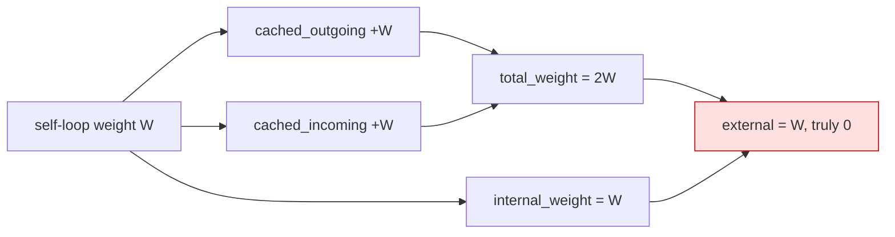

# RVM "Hello World" — Seven Demos, and What They Found

Seven runnable first-programs built against [ruvnet/rvm](https://github.com/ruvnet/rvm),
a bare-metal Rust hypervisor (`no_std`, AArch64) built around *coherence
domains*: partitions whose isolation and scheduling are meant to adapt to how
agents actually communicate.

**All seven run.** Every number and outcome below was measured on this machine
against rvm at rev `78acb36` — nothing is quoted from the documentation. Where
the code and the docs disagree, the demos say so and show the evidence.

This is an **orphan branch**: it shares no history with `main`.

> **New here?** [**PRD.md**](PRD.md) explains how this work came about and why
> each piece is shaped the way it is — the goals, the seven candidates and how
> they were chosen, the decision log, and what we deliberately left out. This
> README is the results; the PRD is the reasoning.

---

## What we did

The original ask was for ideas for a "hello world" app. RVM isn't a framework
you build an app *on* — it's a hypervisor — so "hello world" means picking
which layer to say hello from. We tiered seven candidates by setup cost, then
built all of them.

The method for each demo was the same:

1. **Read the actual source**, not the README — dump each crate's public items,
   read the function bodies that matter.
2. **Write the demo against the real API**, fixing compile errors against
   ground truth rather than guessing signatures.
3. **Run it, and believe the output over the prose.** Several demos changed
   shape once the output contradicted the documented behaviour — demo 3's
   central example was wrong on the first pass and got rewritten; demo 6 was
   rebuilt entirely around the opposite of its expected result.
4. **Verify each surprise before reporting it.** The boot failure was
   confirmed by patching rvm and watching it boot. The coherence finding was
   confirmed by an exhaustive sweep, not a single failing case.

Total: ~1,800 lines of demo code across seven crates, and 10 findings.

### Environment

| | |
|---|---|
| rvm revision | `78acb36d3d906b098b2074b8aecf9ff88c2af4e0` |
| rustc | 1.94.1 |
| Host | x86-64 Linux |
| Bare-metal target | `aarch64-unknown-none` |
| Emulator | `qemu-system-aarch64` (machine `virt`, cpu `cortex-a72`) |

All timings are x86-64 host numbers with each crate's **default** features.
That matters — see finding 8.

---

## Showing this to people

There's a **single-page demo site** in [`web/`](web/) with every demo's real
output, generated by `python3 web/build.py` from actual runs. It deploys two
ways from the same files:

- **Netlify** — free, static, captured output. `netlify deploy --dir=web --prod`
- **Cloud Run** — adds a *Run live* button per demo that executes the binary on
  request. `gcloud run deploy rvm-demos --source .`

The page probes `/healthz` on load, so the same HTML works on both: live buttons
appear when a backend answers and stay hidden when one doesn't. See
[`web/README.md`](web/README.md).



---

## Quick start

```bash
./scripts/bootstrap.sh                 # clones rvm as a sibling checkout
./scripts/run-all.sh                   # runs demos 1-3 and 5-7
cd demos/04-uart-hello && ./run.sh      # boots demo 4 under QEMU
```

Demo 4 additionally needs:

```bash
sudo apt-get install -y qemu-system-arm
rustup target add aarch64-unknown-none
```

---

## The parts of RVM, in plain language

Skip this if you already know the codebase. It exists so the demo results below
make sense without reading kernel source.

<!--
  Mermaid house rules for this file. GitHub's renderer is stricter than the
  mermaid you get locally, and breaks in two ways we have actually hit:
    1. <b>/<i> in a node label render as LITERAL TEXT (htmlLabels is off).
    2. <br/> is DROPPED WITHOUT a line break, so a multi-line label becomes one
       long concatenated string that overflows its box and gets clipped.
  Therefore, in every mermaid block below:
    * one short line per label, roughly 30 characters maximum
    * no <br/>, no <b>/<i>, no emoji, ASCII arrows only
    * emphasis via `style X fill:...`, never via markup
    * detail that will not fit belongs in the prose around the diagram
  Rendering locally with default settings will NOT reproduce either failure --
  check with htmlLabels:false and no <br/> support before trusting it.
-->

**What RVM is trying to be.** Normally, running untrusted programs safely means
giving each one a whole fake computer — a virtual machine, with a fake disk, fake
network card, and its own operating system. That's heavy. RVM's bet is that AI
agents don't need a fake computer; they need *a box with a lock on it and a
logbook by the door.* Its box is called a **partition**, the lock is a
**capability**, and the logbook is the **witness log**. Almost everything else
is machinery around those three ideas.


```mermaid
flowchart TB
    L4["PACKAGING: what may run"]
    L3["ADAPTATION: rearrange?"]
    L2["RUNTIME: boxes and turns"]
    L1["TRUST: may this happen?"]
    L0["GROUND: the machine"]
    L4 --> L3 --> L2 --> L1 --> L0
    style L4 fill:#e8f0ff,stroke:#4a6fa5
    style L3 fill:#fff0e8,stroke:#a5744a
    style L2 fill:#e8ffe8,stroke:#4aa54a
    style L1 fill:#ffe8f0,stroke:#a54a6f
    style L0 fill:#f0f0f0,stroke:#777
```

Which crates live at each layer:

| Layer | Crates |
|---|---|
| **Packaging** — what may run at all | `rvm-rvf`, `rvm-host`, `rvm-launch` |
| **Adaptation** — should the boxes be rearranged? | `rvm-coherence`, `rvm-wasm` |
| **Runtime** — boxes, turns and space | `rvm-partition`, `rvm-sched`, `rvm-memory` |
| **Trust** — may this happen, and who saw it? | `rvm-cap`, `rvm-witness`, `rvm-proof`, `rvm-security` |
| **Ground** — the machine itself | `rvm-hal`, `rvm-boot`, `rvm-types` |

### Every crate, one line each

The **Verified** column is the honest part: seven demos do not cover seventeen
crates. "used" means our code called it and we watched what it did. "read only"
means we read the source but never exercised it, so nothing in this repo tests
those claims.

| Crate | What it does | Demo | Verified |
|---|---|---|---|
| `rvm-types` | The shared vocabulary — IDs, rights, the 64-byte record layout. Every other crate depends on it | all | used |
| `rvm-hal` | Talks to actual hardware: memory mapping, timers, interrupts, the serial port | 4 | used |
| `rvm-cap` | **The keys.** Issues unforgeable tokens, tracks who gave what to whom, enforces that you can never hand on more than you hold | 2, 3 | used |
| `rvm-witness` | **The logbook.** Every privileged action writes a 64-byte record, chained to the one before it. Core rule: *no witness, no mutation* | 1, 4, 5, 7 | used |
| `rvm-proof` | Proof-gated state changes and hardware-backed signing | — | read only |
| `rvm-security` | **The gate.** One door that checks the key, checks the proof, and writes the logbook entry — for allowed *and* refused attempts | 2, 3 | used |
| `rvm-partition` | **The boxes.** Creating them, and the one-way channels they message each other over | 5 | used |
| `rvm-sched` | Whose turn to run. Priority = deadline urgency + how badly a partition wants to be somewhere else | 5 | used |
| `rvm-memory` | Four tiers from hot SRAM down to cold archive, with rebuild-on-demand | — | read only |
| `rvm-coherence` | **The interesting one.** Watches who talks to whom and decides whether boxes should merge or split | 6 | used |
| `rvm-boot` | Startup in seven ordered phases, each one logged before the next begins | 4 | used |
| `rvm-wasm` | Checks WebAssembly modules are well-formed and tracks agent lifecycle states | 6 | used |
| `rvm-rvf` | The bouncer for packaged agents: signature, contents, declared permissions | 7 | used |
| `rvm-gpu` | Optional GPU compute with per-partition budgets | — | read only |
| `rvm-host` | What a verified artifact actually runs inside | — | read only |
| `rvm-launch` | Driving one instance through create → start → suspend → checkpoint → terminate | — | read only |
| `rvm-kernel` | Wires all of the above into one API and one bootable binary | 4 (indirectly) | see finding 3 |

### One trap worth knowing before you read the code

**There are two different things called `ProofTier`, and a third meaning of
"tier" on top.** If you go looking, this will cost you an hour:

| Where | Values | Meaning |
|---|---|---|
| `rvm_types::ProofTier` | `P1`, `P2`, `P3` | How deeply we checked (the one demo 3 is about) |
| `rvm_proof::ProofTier` | `Hash`, `Witness`, `Zk` | What *kind* of cryptographic proof accompanies a change |
| `rvm-security`'s gate | `1`, `2`, `3` | A label the gate stamps on its own log entries |

Same word, three unrelated scales. Also note `rvm-cap`'s own header table lists
P3 as *"Deferred"*, and its error type still carries `P3NotImplemented` — but
`verify_p3` is implemented and passes in demo 3. The doc comment is stale.

---

## What each demo actually showed

Five pictures for the results that are hard to see from a wall of terminal
output. Full transcripts are under [Results](#results).

### Demo 1 — two locks on the logbook, and one is weaker than it looks

The audit log has two independent protections. We tampered with it two ways to
find out what each one actually covers.


```mermaid
flowchart LR
    T1["Edit a record's content"] --> C1{"Chain check"}
    T1 --> S1{"Signature check"}
    C1 -->|passes| X1["MISSED"]
    S1 -->|fails| Y1["caught"]
    T2["Reorder or renumber"] --> C2{"Chain check"}
    C2 -->|fails| Y2["caught"]
    style X1 fill:#ffe0e0,stroke:#c00
    style Y1 fill:#e0ffe0,stroke:#0a0
    style Y2 fill:#e0ffe0,stroke:#0a0
```

**The point:** the hash chain proves records are *in the right order*, not that
their *contents* are unchanged — even though its documentation says otherwise.
Only the signature covers contents. A deployment that skips signing has an audit
log an attacker can silently rewrite. That's finding 1.

### Demo 2 — keys that can only ever get weaker


```mermaid
flowchart TB
    H["Hypervisor: the only minter"]
    R["Root key: READ WRITE GRANT"]
    A["Agent key: READ only"]
    H -->|mints| R
    R -->|"weaker copy"| A
    A -->|reads| OK["allowed"]
    A -->|writes| NO["refused, and logged"]
    A -->|"self-grants WRITE"| NO2["refused: cannot exceed"]
    style OK fill:#e0ffe0,stroke:#0a0
    style NO fill:#ffe0e0,stroke:#c00
    style NO2 fill:#ffe0e0,stroke:#c00
```

**The point:** authority only ever shrinks as it's passed along. An agent cannot
upgrade itself, and every refusal is written to the logbook with the same key
fingerprint as the successful reads — so an auditor sees exactly which key was
presented for a rejected action, not just that something failed.

There's also `GRANT_ONCE`: a key that may be shared exactly once and then loses
the ability, automatically. We watched the right disappear after a single use.

### Demo 3 — three different questions, not three strictness levels


```mermaid
flowchart LR
    Q1["P1: is the badge valid?"]
    Q2["P2: is the request legal?"]
    Q3["P3: was the issuer allowed?"]
    Q1 --- Q2 --- Q3
```

In full, each tier asks:

- **P1** — is this badge real, still current, and does it open *this* door?
- **P2** — is this request legal *right now*? Right person, within bounds, not
  expired, and not a replay of an earlier one?
- **P3** — did whoever issued this badge actually have the authority to,
  following the chain all the way back to the top?

**The point:** the names suggest P3 is a stricter P1. It isn't — they ask
*unrelated* questions. A key missing a permission fails P1 but **passes** P3,
because P3 never looks at permissions at all. You don't escalate between them;
you pick the question you need answered. Both cost nanoseconds, thousands of
times inside their budget.

### Demo 6 — the headline claim, and why it doesn't happen

RVM's pitch is: *when two agents talk more, RVM moves them closer together.*


```mermaid
flowchart TB
    START["Two agents talk more"]
    P["That traffic is cross-box"]
    PRESSURE["So cut pressure goes UP"]
    START --> P --> PRESSURE
    PRESSURE --> DEC{"Engine decides"}
    DEC -->|"over the limit"| SPLIT["SPLIT them apart"]
    DEC -.->|"never reached"| MERGE["Merge them together"]
    SPLIT --> WHY["Split is checked first"]
    style SPLIT fill:#ffe0e0,stroke:#c00
    style MERGE fill:#eeeeee,stroke:#999
```

#### First, what "external weight" means

The engine keeps a map of who talks to whom. Each partition is a dot; each
channel is a line whose thickness is how much traffic has crossed it. Every
partition has two kinds of line:


```mermaid
flowchart LR
    subgraph BoxA["Agent A box"]
        AW["INTERNAL: work alone"]
    end
    subgraph BoxB["Agent B box"]
        BW["INTERNAL: work alone"]
    end
    BoxA <== "EXTERNAL: counted for both" ==> BoxB
    style AW fill:#e8ffe8,stroke:#4aa54a
    style BW fill:#e8ffe8,stroke:#4aa54a
```

- **Internal weight** — work a partition does by itself, needing nobody. In the
  graph this is an edge from the partition back to itself, a *self-loop*.
- **External weight** — traffic to *other* partitions. Note that traffic between
  two agents is external **for both of them** — that fact is what drives
  finding 2 below.

**Cut pressure** is meant to be `external ÷ (external + internal)`, as a
percentage. It answers: *"of everything this box does, how much of it involves
reaching outside?"* The name comes from imagining you cut this box away from
the rest — how much traffic would you be severing? Above 80%, the engine flags
it for splitting, on the logic that a box mostly talking outward is badly
placed.

So on the intended reading:

| Situation | Expected pressure |
|---|---|
| Works entirely alone | 0% — nothing to sever |
| Half its traffic goes outside | 50% |
| Talks only to others, never works alone | 100% — split it |

#### What the code actually computes

It doesn't do that. A partition's own private work **leaks into the external
figure**, because two functions disagree about how to count a self-loop:


```mermaid
flowchart TB
    SELF["Self-loop, weight 100"]
    SELF --> OUT["OUTGOING gets 100"]
    SELF --> INC["INCOMING gets 100"]
    OUT --> TOT["total_weight = 200"]
    INC --> TOT
    SELF --> INT["internal_weight = 100"]
    TOT --> EXT["external = 200 - 100"]
    INT --> EXT
    EXT --> P["cut pressure = 50%"]
    style P fill:#ffe0e0,stroke:#c00
    style TOT fill:#fff3cd,stroke:#a80
```

Reading that top to bottom: the self-loop is *both* outgoing and incoming, so
`total_weight` counts it **twice** (200). `internal_weight` looks for edges where
source and destination are the same partition, and counts it **once** (100).
External is then derived as `total - internal`, which leaves one spare copy of
the partition's own private work filed as traffic to the outside world.

This is **finding 10** below.

#### The measured numbers

Taken from `rvm-coherence` itself — not a model — with each partition doing 100
units of its own work:

| Talk with the other agent | Cut pressure | Expected on the intended reading | Verdict |
|---|---|---|---|
| 0 — completely alone | **50.0%** | 0% | *wrong* |
| 10 — barely | 52.0% | 7.8% | fine |
| 100 | 66.5% | 49.7% | fine |
| 200 | 75.0% | 66.7% | fine |
| 400 | 83.3% | 80.0% | **split!** |
| 900 | 90.9% | 90.0% | **split!** |
| 2000 | 95.5% | 95.2% | **split!** |

Two separate things to take from this table.

**The bottom rows are finding 2.** The closer two agents get, the more the
system wants to separate them. "These two are inseparable" and "this box is
badly placed" are the same number, and the split rule only ever reads it one
way. The merge test has the same problem in mirror image: for two partitions to
look worth merging, nearly all of both their traffic must be with each other —
exactly the condition that pushes cut pressure to its maximum. So whenever the
merge test says yes, the split test has already said yes louder.

**The top row is finding 10.** A partition talking to nobody should read 0%.
It reads 50%, and the error shrinks as real external traffic grows, which is
why it hides so well — at the thresholds that matter it is only a few points
off, and nothing downstream looks obviously broken.

**The point:** talking more makes the system want to pull them *apart*, not push
them together. We didn't want to claim that from one example, so the demo tries
**4,032 different combinations** of how much the agents talk to each other versus
to themselves. The merge recommendation came back **zero times**. In 1,244 of
those combinations the system internally decided "these should merge" — and then
threw that answer away because it had already found a reason to split.

That's finding 2, and it's the most significant thing we found.

### Demo 7 — the bouncer, and six ways to get turned away


```mermaid
flowchart LR
    PKG["Signed package"] --> V{"Verification"}
    V --> C1["File intact?"]
    V --> C2["Manifest present?"]
    V --> C3["Contents match hashes?"]
    V --> C4["Code signed?"]
    V --> C5["Signed by a trusted key?"]
    V --> C6["Within size limits?"]
    V --> C7["What permissions asked?"]
    C1 & C2 & C3 & C4 & C5 & C6 & C7 --> OUT["Report: pass/fail/skipped"]
```

**The point:** we broke the package six different ways — altered the code,
altered the signature, corrupted the header, rewrote the requested permissions,
signed with the wrong key, and truncated the file. All six were refused, each
with a *specific* reason rather than a generic "invalid". This is the
best-built part of RVM.

Two traps for anyone using it, though (findings 6 and 7): a report can say
`ok = true` when the signature was never actually checked — because "skipped"
isn't "failed" — and a *rejected* package still reports the permissions it
asked for, so code that reads that field without checking the verdict first
would happily grant them.

---

## Results

### Demo 1 — Witnessed Hello (`rvm-witness`)

Says hello as a sequence of witnessed privileged actions, then attacks the log.

```
seq  action           actor target  payload     prev_hash   rec_hash  signature
  0  PartitionCreate      0      1  "hello..."        0x0 0xabd4170c  valid
  1  CapabilityGrant      1      2  "world..." 0xabd4170c 0xf0a60690  valid
  2  PartitionDestroy     1      1  "!......." 0xf0a60690 0x7cb17d7b  valid

3. Tamper with a payload: rewrite history's content
Rewriting record 1's payload from "world" to "pwned"...
verify_chain  -> OK, 3 records link cleanly   <-- tamper NOT caught
signatures    -> INVALID at index 1           <-- tamper caught here

4. Tamper with ordering: renumber a record
verify_chain  -> FAILED: corrupted record at seq 7   <-- caught
```

Throughput, 1,000,000 iterations:

| operation | ns/op |
|---|---|
| `append` (chain only, crypto-sha256 **on** — the default) | ~318 |
| `signed_append` (chain + HMAC-SHA256) | ~1624 |
| `append` with crypto-sha256 **off** (FNV-1a path) | ~22 |

→ **Findings 1 and 8.**

### Demo 2 — Hello, Denied (`rvm-cap`, `rvm-security`)

```
1. The hypervisor mints a root capability
  root cap  index=0 gen=1  rights=READ|WRITE|GRANT
  agent tries the same          -> denied (GrantNotPermitted)

2. Delegate READ-only to the agent, then try to write
  agent reads the region             ALLOWED  (tier P1, witness seq 0)
  agent writes the region            DENIED   InsufficientRights: token holds READ

4. GRANT_ONCE: authority that evaporates after one use
  1st delegation to partition 3 -> ok (index=3 gen=1)
  source rights are now READ   <-- GRANT_ONCE consumed
  2nd delegation to partition 3 -> denied (GrantNotPermitted)

5. The audit trail: denials are witnessed too
seq  action            tier    cap_hash
  0  RegionShare        P1   0x1000002
  1  ProofRejected       -   0x1000002
```

Everything behaves as documented. The denied write lands in the log as
`ProofRejected` carrying the *same* `cap_hash` as the successful read, so an
auditor can see which token was presented for a refused operation.

### Demo 3 — Three Ways to Prove Hello (`rvm-cap`, `rvm-security`)

The interesting result is which tier catches what:

| case | P1 | P3 |
|---|---|---|
| token lacks `EXECUTE` | **FAIL** | PASS — P3 never looks at rights |
| ancestor mid-chain revoked | **FAIL** | **FAIL** — revocation cascades by design |
| chain longer than `max_depth` allows | PASS | **FAIL** — the genuine P3-only check |

The middle row corrects the intuitive guess (and our first draft): revoking an
intermediate *does* force-invalidate every descendant's table slot, so the cheap
P1 check already rejects it. `revoke.rs` says so explicitly — *"Without this, a
revoked child capability's table slot remains `is_valid: true` and would pass P1
verification."* Delegation depth is what actually requires walking to the root.

Cost:

| path | ns/op | ADR target |
|---|---|---|
| `verify_p1` | ~1.5 | < 1 µs |
| `verify_p3` | ~4.2 | "deep" |
| security gate (P2 + witness emit) | ~331 | — |

Both proof tiers land ~3 orders of magnitude inside budget. The gate row is
dominated by witness emission, not proof checking.

→ **Finding 4.**

### Demo 4 — UART Hello (`rvm-hal`, `rvm-boot`) — bare metal

A `no_std` AArch64 kernel booting under QEMU:

```
========================================
  RVM Demo 4 - UART Hello
  hello world, from a bare partition
========================================

Exception level : EL1
Witness ring    : 32 records (2048 bytes)

Boot sequence
-------------
  phase 0  HalInit         witnessed at seq 0
  phase 1  MemoryInit      witnessed at seq 1
  phase 2  CapabilityInit  witnessed at seq 2
  phase 3  WitnessInit     witnessed at seq 3
  phase 4  SchedulerInit   witnessed at seq 4
  phase 5  RootPartition   witnessed at seq 5
  phase 6  Handoff         witnessed at seq 6

  chain verification: OK, 7 records link cleanly
```

Getting here required diagnosing why rvm's own `make run` prints nothing.

→ **Finding 3.**

### Demo 5 — Partition Ping-Pong (`rvm-partition`, `rvm-sched`)

```
2. Open comm edges
  edge 1 : ping -> pong
  edge 2 : pong -> ping
  pong sending on ping's edge -> refused (InsufficientCapability)

4. The conversation
  turn  scheduler picks          message            edge weight  witness
     0  PartitionId(1) (speaker) p1 -> p2: "hello"  1            seq 0
     1  PartitionId(2) (speaker) p2 -> p1: "world"  1            seq 1
     2  PartitionId(1) (speaker) p1 -> p2: "how"    2            seq 2
     ...
  chain verification: OK, 6 records
  signatures        : 6/6 valid
```

Channels are directional and the sender must be the channel's source — a forged
send is refused. Edge weight climbs one per send; that counter is exactly what
the coherence engine consumes in demo 6.

→ **Finding 9.**

### Demo 6 — Two Agents That Get Closer (`rvm-coherence`, `rvm-wasm`)

This demo was built to show RVM's headline behaviour. It shows the opposite.

```
5. Loud: the two agents start talking constantly
  epoch 4: SplitRecommended p1 (pressure 8544 bp)
  epoch 5: SplitRecommended p1 (pressure 8878 bp)
  epoch 6: SplitRecommended p1 (pressure 9070 bp)
  epoch 7: SplitRecommended p1 (pressure 9194 bp)

6. The merge signal fires -- and is then discarded
  evaluate_merge(p1, p2) -> mutual 4194 bp, should_merge = true
  engine.recommend()     -> SplitRecommended p1 (pressure 9194 bp)

7. Is a merge reachable at all? Search the space
  searched 4032 weight combinations
    MergeRecommended actually returned : 0
    merge signal set, split returned instead : 1244
    lowest-pressure shadowed case: self(100,0) cross(0,400)
      -> pressure p1=8333 p2=10000, mutual=4000 bp, split threshold 8000
```

→ **Finding 2** — the most significant result here.

### Demo 7 — Signed Hello Package (`rvm-rvf`)

Builds a signed RVForge container, verifies it, then breaks it six ways:

```
1. Pack the agent
  container: 448 bytes
    seg 1 type 0x07 META      payload  30 B  signed=false executable=false
    seg 2 type 0x05 MANIFEST  payload   4 B  signed=false executable=false
    seg 3 type 0x10 WASM      payload   8 B  signed=true  executable=true

5. Corrupt one byte at a time
  flip a byte of agent bytecode   refused  ContentHash/ContentHashMismatch,
                                           Signature/SignatureRejected
  flip a byte of the signature    refused  Signature/SignatureRejected
  flip the container magic        refused  parse: BadMagic
  rewrite the capability string   refused  ContentHash/ContentHashMismatch
  signed by an untrusted key      refused  Signature/SignatureRejected
  truncate the last segment       refused  parse: Truncated
```

Six tampering modes, six distinct detail codes. This is the strongest
subsystem in the tree.

→ **Findings 5, 6, 7.**

---

## Findings

Ten things worth reporting upstream. Each is reproduced by the demo listed and
was verified against source, not inferred.

| # | Finding | Severity | Demo |
|---|---|---|---|
| 1 | `record_hash` doesn't cover record contents | Correctness | 1 |
| 2 | Coherence engine's merge path is unreachable | Correctness | 6 |
| 3 | `make run` cannot work as shipped (3 causes) | Correctness | 4 |
| 4 | `verify_p2` is public but uncallable | API | 3 |
| 5 | rvm-rvf can read containers but nothing writes one | API | 7 |
| 6 | `report.ok == true` doesn't mean the signature was checked | Caller trap | 7 |
| 7 | `report.capabilities` stays populated on a failed report | Caller trap | 7 |
| 8 | The ~17ns witness figure is the FNV-1a path | Docs | 1 |
| 9 | Two capability claims are narrower than they sound | Docs | 5, 6 |
| 10 | Cut pressure double-counts self-loops; an isolated partition reads 50% | Correctness | 6 |

### 1. `record_hash` does not cover record contents

`WitnessLog::append` sets `record_hash = compute_chain_hash(prev_hash, sequence)`
— derived purely from position in the chain. The field's own docs describe it as
*"FNV-1a hash of bytes [0..44] of this record (self-integrity)"*, and `hash.rs`
exports an unused `compute_record_hash(data)` that would do exactly that.

Consequence: `verify_chain` proves **ordering**, not **content**. Editing a
record's payload is invisible to it. Only the HMAC signature written by
`signed_append` covers contents — so a deployment using plain `append` has no
tamper evidence on payloads at all.

### 2. The merge half of the coherence engine is unreachable

This is the behaviour the project leads with: *"When two agents start talking
more, RVM moves them closer."* It does the opposite. Cross-partition traffic is
external weight, cut pressure is `external/total`, so talking more drives
pressure **up** and triggers `SplitRecommended`.

Worse, `recommend()` scans for a split candidate first and returns on the first
hit. Across a 4,032-point sweep of the two-partition weight space it returned
`MergeRecommended` **zero times**, while the underlying `evaluate_merge` signal
was set and then discarded in **1,244** of them.

The arithmetic is why: mutual coherence tracks roughly `pressure − 5000`, so
`should_merge` (≥ 4000 bp) implies pressure ≈ 9000 bp — always over the 8000 bp
split threshold.

`pressure.rs` already carries a comment about lowering the merge threshold from
7000 to 4000 because *"a threshold of 7000 (70%) was unreachable, preventing
merge signals from ever firing"*. That fixed `evaluate_merge`; the shadowing in
`recommend()` is the half still open. A fix means ranking split and merge
candidates against each other instead of returning on the first split found.

### 3. `make run` cannot work as shipped

Three independent faults, all confirmed:

- `KERNEL_ELF` is `target/$(TARGET)/release/rvm-kernel`, but rvm-kernel's
  `[[bin]]` is named `rvm`. QEMU exits with *"could not load kernel"*.
- `rvm_main` builds a `rvm_kernel::Kernel` as a stack local. That value is
  **232,768 bytes**; `rvm.ld` reserves **65,536**. The compiler's stack probe
  walks off the bottom of the stack and faults.
- FP/SIMD is trapped at EL1 (`CPACR_EL1.FPEN` unset) and LLVM emits
  `movi v0.2d, #0` to zero large structs, so the first big initialisation traps.
  `VBAR_EL1` is also unset, so it vectors to address `0x200` — zeroes.

Fixing the last two makes rvm's own kernel print its full boot banner. Verified,
and saved as [`rvm-boot-fixes.patch`](demos/04-uart-hello/rvm-boot-fixes.patch).
Note that cargo does not track `rvm.ld`, so editing it alone won't trigger a
rebuild.

### 4. P2 verification is public but uncallable

`CapabilityManager::verify_p2` and `ProofVerifier::verify_p2` both take
`ctx: &PolicyContext`. `rvm-cap/src/lib.rs` declares `mod verify;` privately and
re-exports only `ProofVerifier` — never `PolicyContext`. No external caller can
name the type, so neither function can be called. Nothing else in the workspace
re-exports it. One-line fix:

```rust
pub use verify::{ProofVerifier, PolicyContext};
```

### 5. rvm-rvf can read containers but nothing can write one

The crate is read-only by design, and its `testkit` — the only container builder
in the tree — is a private `mod`. Demo 7 reimplements the segment layout against
the public `format` API to have anything to verify. Making `testkit` public, or
shipping a writer, would save every downstream user this work.

### 6. `report.ok == true` does not mean the signature was checked

With no trusted key supplied, the signature check is recorded `Skip` and the
report is still `ok = true`. `ok` means "nothing failed", and a skip is correctly
not a pass — but a caller reading only `ok` accepts an artifact whose signature
was never verified. Requiring a verified signature means supplying a trusted key
**and** confirming the `Signature` record is `Pass`.

### 7. `report.capabilities` stays populated on a failed report

The rustdoc says a failed capability check yields the deny-everything mapping,
which is true but narrower than it reads: *only* a `CapabilityMapping` failure
zeroes it. A package failing `ContentHash` and `Signature` still reports
`granted: [Network, Clock]`. Callers must gate on `report.ok` first.

### 8. The ~17ns witness figure is the FNV-1a path

`rvm-witness`'s default features include `crypto-sha256`, which is what you get
unless you opt out. Measured here:

| build | ns/op |
|---|---|
| `append`, crypto-sha256 off (FNV-1a) | ~22 |
| `append`, crypto-sha256 on (**default**) | ~295–318 |
| `signed_append` (chain + HMAC-SHA256) | ~1624 |

rvm's own benchmark agrees on this machine (`witness_log_append_256` ≈ 295 ns).
Both figures are honest for their build; the README just doesn't say which one
it quotes. The ADR targets are still met by orders of magnitude either way.

### 9. Two capability claims are narrower than they sound

- `rvm-wasm` validates modules and manages a 7-state agent lifecycle. It does
  **not** execute WebAssembly — there is no interpreter or JIT. "Running" is a
  state label.
- `IpcMessage` carries no payload bytes, only `payload_len` and `msg_type`. RVM
  moves message *headers*; the payload is expected to live in a shared region
  the receiver already holds a capability for.

Neither is a defect — both are reasonable designs — but "WASM agent runtime" and
"inter-partition messaging" read as more than they are.

### 10. Cut pressure double-counts self-loops

Found while writing the plain-language explanation above — the arithmetic
wouldn't reconcile, which turned out to be the code's fault rather than ours.

`CoherenceGraph::total_weight` returns `cached_outgoing + cached_incoming`. A
self-loop is both outgoing and incoming, so it is counted **twice**.
`internal_weight` scans for `from == to` and counts it **once**. Cut pressure is
`(total − internal) / total`, so one spare copy of the partition's own internal
work is silently classified as external traffic:


```mermaid
flowchart LR
    L["self-loop weight W"] --> A["cached_outgoing +W"]
    L --> B["cached_incoming +W"]
    A --> T["total_weight = 2W"]
    B --> T
    L --> I["internal_weight = W"]
    T --> E["external = W, truly 0"]
    I --> E
    style E fill:#ffe0e0,stroke:#c00
```

The error is largest exactly where it matters least noticed: at zero external
traffic it is the whole answer (50% instead of 0%), and it shrinks toward
nothing as real external traffic grows. At the 80% split threshold the reading
is only ~3 points high — wrong, but not obviously so.

Measured, with `rvm-coherence` directly:

```
ISOLATED partition, self-loop 100, zero neighbours:
  total_weight    = 200
  internal_weight = 100
  external        = 100      <-- should be 0
  cut pressure    = 50.0%    <-- should be 0%
```

`pressure.rs` states the intended behaviour plainly: *"A partition with no edges
has zero pressure."* There is even a test named `isolated_partition_zero_pressure`
— but it adds a node with **no edges at all**, so it passes trivially and never
exercises a self-loop.

Consequences:

- **Cut pressure has a floor of 50%** for any partition doing local work. It
  cannot express "this partition is well-placed", only degrees of badly-placed.
- The usable range of the split signal is halved — everything is squeezed into
  50–100% against an 8000 bp (80%) threshold.
- It **compounds finding 2.** Merge needs low pressure and high mutual
  coherence; inflating everyone's pressure pushes the merge window further out
  of reach.

The fix is a one-line change in `total_weight` — subtract the self-loop once, or
have `compute_cut_pressure` use the adjacency row alone — plus a test that
actually adds a self-loop.

---

## What works well

The list above is all problems, so this is worth stating plainly:

- **The capability system is solid.** Monotonic attenuation, `GRANT_ONCE`
  consumption, cascading revocation through the derivation subtree, and
  hypervisor-only root minting all behave exactly as documented (demo 2).
  Revocation deliberately force-invalidates every descendant's table slot so the
  cheap P1 check catches it — with a source comment explaining why.
- **RVF verification is genuinely good** (demo 7). Six tampering modes each
  produce a distinct, specific detail code; the signature covers header fields
  and not just payload bytes; reports are deterministic — same bytes, same
  options, same report.
- **P1/P3 are far inside their ADR targets** — ~1.5 ns and ~4.2 ns against
  budgets of 1 µs and "deep" (demo 3).
- **The engineering baseline is real.** 17 crates, `no_std` throughout, clean
  compile with no warnings, and the AArch64 cross-build works.

---

## Layout

```
demos/01-witnessed-hello/       cargo run -p demo-01-witnessed-hello
demos/02-hello-denied/          cargo run -p demo-02-hello-denied
demos/03-prove-hello/           cargo run -p demo-03-prove-hello
demos/04-uart-hello/            ./run.sh   (standalone; excluded from workspace)
demos/05-partition-pingpong/    cargo run -p demo-05-partition-pingpong
demos/06-agents-get-closer/     cargo run -p demo-06-agents-get-closer
demos/07-signed-hello/          cargo run -p demo-07-signed-hello
scripts/bootstrap.sh            clones rvm to ../rvm at a pinned rev
scripts/run-all.sh              runs every host demo in order
web/                            the shareable demo site (see web/README.md)
PRD.md                          why the work is shaped this way; decision log
```

rvm is consumed as a **sibling checkout** at `../rvm`, not a git dependency:
cargo initialises submodules for git deps, and rvm declares three
(`rudevolution`, `ruvector`, `cuda-wasm`) that its own workspace `exclude`s and
that take >10 minutes to fetch. `bootstrap.sh` clones without them.

## Caveats

- All timings are single-run wall-clock on a shared x86-64 VM, not criterion
  statistics. They're accurate to roughly an order of magnitude, which is all
  the claims above depend on. rvm's own `cargo bench` corroborates the witness
  number.
- Finding 2's sweep covers the **two-partition** case across 8 weight values per
  edge. It does not prove merge is unreachable for every possible graph — only
  that it is unreachable across the space a two-agent scenario can occupy, which
  is the scenario the project's own pitch describes.
- Demo 6's original design called for dropping a trust signal to force a split.
  There is no trust input anywhere in `rvm-coherence`; the only split driver is
  cut pressure. The demo uses traffic redirection instead.
