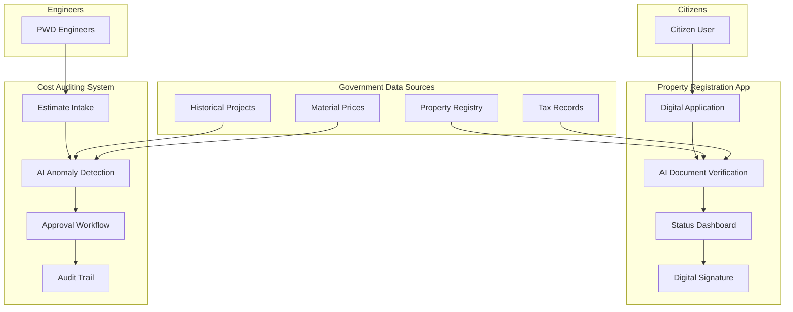
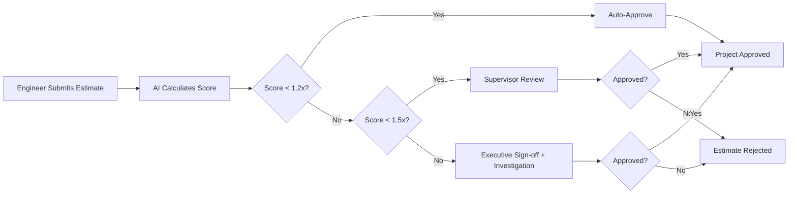
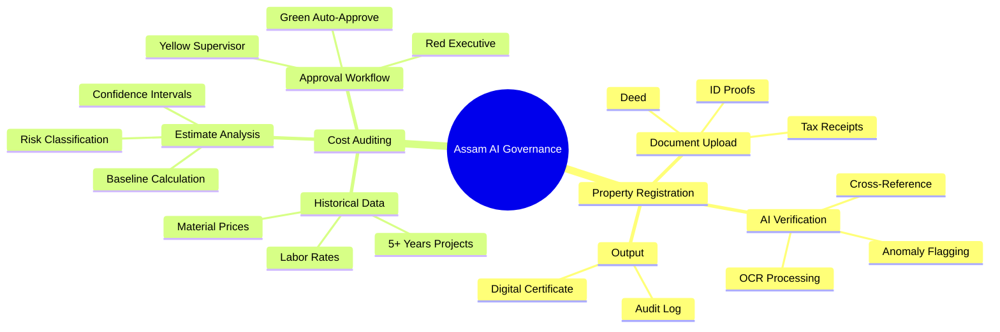
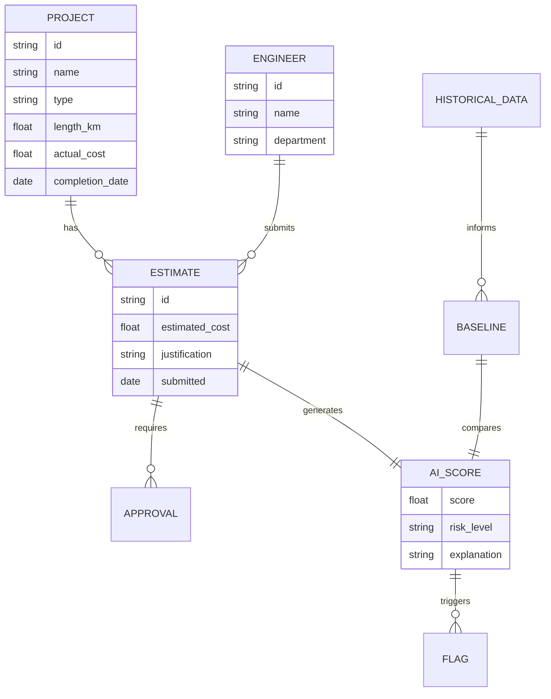
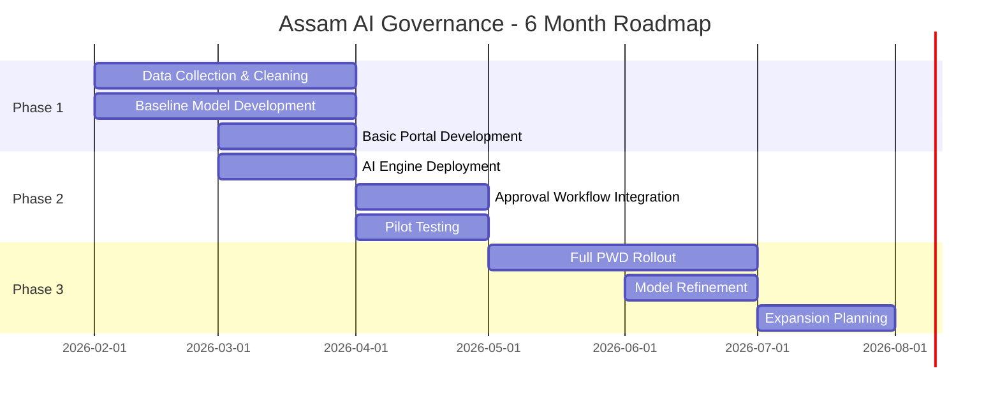

# Semantic Graph: Assam AI Governance Initiatives

> Machine-readable knowledge graph with Mermaid diagrams and Neo4j Cypher exports

---

## Summary

This PRD outlines two AI governance initiatives for Assam State Government: a Property Registration Digitalization App to streamline property transactions through AI-assisted document verification, and an Infrastructure Cost Auditing System to detect and prevent cost inflation in public works projects. Together, these systems aim to reduce corruption, increase transparency, and save ₹50+ crore annually while cutting processing times by 60%+.

---

## Key Concepts

- **AI Document Verification** — OCR-powered document classification and entity extraction for property registration
- **Anomaly Detection** — ML-based flagging of inflated cost estimates against historical baselines
- **Digital Governance** — End-to-end digitalization of government processes with audit trails
- **Cost Baseline Model** — Historical median cost calculations adjusted for location, terrain, and market rates
- **Role-Based Access Control** — Security architecture ensuring data privacy and compliance
- **Explainable AI** — Transparent reasoning for flagged estimates enabling appeals and accountability

---

## Core Arguments

1. **Manual processes enable corruption**: Paper-based workflows with multiple office visits create opportunities for fraud and inefficiency in both property registration and infrastructure contracting.

2. **AI can validate at scale**: Machine learning models trained on historical data can automatically flag anomalies that would escape manual review, catching 80%+ of suspicious estimates.

3. **Transparency drives accountability**: Complete audit trails and explainable AI decisions allow for appeals while ensuring every decision is logged and traceable.

4. **ROI justifies investment**: At ₹3.2 crore total cost versus ₹50+ crore annual savings, the payback period is approximately 2 months.

5. **Phased rollout reduces risk**: Starting with flat registration and road construction (highest fraud vectors) allows validation before expanding to other domains.

6. **Human-in-the-loop preserves fairness**: AI flags anomalies but humans make final approval decisions, with grievance mechanisms for engineers.

---

## Key Quotes

> "Real example: ₹2 crore project → ₹6-7 crore estimate (3x markup)"

> "Citizens must visit government offices to register property transactions... Average processing time: 20-30 days"

> "AI makes final flagging, humans make approval decisions"

> "Payback period: ~2 months"

---

## Mermaid Diagrams

### System Architecture Overview



### Estimate Approval Workflow



### Data Flow Mindmap



### Entity Relationship Diagram



### Implementation Timeline



---

## Neo4j Cypher Export

```cypher
// =====================================================
// NODES: Core Entities
// =====================================================

CREATE (initiative:Initiative {
  name: "Assam AI Governance Initiatives",
  version: "1.0",
  date: "2026-02-02",
  owner: "Assam State Government",
  status: "Concept Phase"
})

CREATE (propApp:System {
  name: "Property Registration Digitalization App",
  type: "Digital Service",
  target_processing_days: 7,
  target_remote_completion: 0.80
})

CREATE (costAudit:System {
  name: "Infrastructure Cost Auditing System",
  type: "AI Governance",
  target_savings_crore: 50,
  target_fraud_detection: 0.80
})

// =====================================================
// NODES: Features - Property Registration
// =====================================================

CREATE (f1:Feature {name: "Digital Application", system: "Property Registration"})
CREATE (f2:Feature {name: "AI Document Verification", system: "Property Registration"})
CREATE (f3:Feature {name: "Real-Time Status Dashboard", system: "Property Registration"})
CREATE (f4:Feature {name: "Digital Signature & Approval", system: "Property Registration"})
CREATE (f5:Feature {name: "Data Integration", system: "Property Registration"})

// =====================================================
// NODES: Features - Cost Auditing
// =====================================================

CREATE (f6:Feature {name: "Historical Cost Database", system: "Cost Auditing"})
CREATE (f7:Feature {name: "Estimate Intake & Analysis", system: "Cost Auditing"})
CREATE (f8:Feature {name: "AI Anomaly Detection", system: "Cost Auditing"})
CREATE (f9:Feature {name: "Approval Workflow", system: "Cost Auditing"})
CREATE (f10:Feature {name: "Audit Trail & Accountability", system: "Cost Auditing"})
CREATE (f11:Feature {name: "Post-Project Analysis", system: "Cost Auditing"})

// =====================================================
// NODES: Technologies
// =====================================================

CREATE (t1:Technology {name: "React/Flutter", category: "Frontend"})
CREATE (t2:Technology {name: "Node.js/Python", category: "Backend"})
CREATE (t3:Technology {name: "PostgreSQL", category: "Database"})
CREATE (t4:Technology {name: "Tesseract OCR", category: "AI/ML"})
CREATE (t5:Technology {name: "scikit-learn", category: "AI/ML"})
CREATE (t6:Technology {name: "Isolation Forest", category: "AI/ML"})
CREATE (t7:Technology {name: "AWS/GCP", category: "Infrastructure"})

// =====================================================
// NODES: Stakeholders
// =====================================================

CREATE (s1:Stakeholder {name: "Citizens", role: "End Users"})
CREATE (s2:Stakeholder {name: "PWD Engineers", role: "Estimate Submitters"})
CREATE (s3:Stakeholder {name: "Supervisors", role: "Approvers"})
CREATE (s4:Stakeholder {name: "CM Office", role: "Executive Sponsor"})
CREATE (s5:Stakeholder {name: "Finance Ministry", role: "Budget Authority"})

// =====================================================
// NODES: Risks
// =====================================================

CREATE (r1:Risk {name: "Data Quality", impact: "AI model unreliable", mitigation: "Data audit + cleansing"})
CREATE (r2:Risk {name: "Engineer Resistance", impact: "Low adoption", mitigation: "Transparent rules, appeal mechanism"})
CREATE (r3:Risk {name: "Model Bias", impact: "Legal challenge", mitigation: "Regular model audits"})
CREATE (r4:Risk {name: "False Positives", impact: "Approval delays", mitigation: "Conservative thresholds"})
CREATE (r5:Risk {name: "System Downtime", impact: "Project delays", mitigation: "99.5% SLA + manual fallback"})

// =====================================================
// NODES: Metrics
// =====================================================

CREATE (m1:Metric {name: "Processing Time", current: "20-30 days", target: "5-7 days"})
CREATE (m2:Metric {name: "Remote Completion", current: "0%", target: "80%"})
CREATE (m3:Metric {name: "Fraud Detection Rate", current: "Manual", target: "80%+"})
CREATE (m4:Metric {name: "Annual Savings", current: "0", target: "50+ crore"})
CREATE (m5:Metric {name: "False Positive Rate", target: "<5%"})

// =====================================================
// RELATIONSHIPS
// =====================================================

// Initiative contains systems
CREATE (initiative)-[:INCLUDES]->(propApp)
CREATE (initiative)-[:INCLUDES]->(costAudit)

// Systems have features
CREATE (propApp)-[:HAS_FEATURE]->(f1)
CREATE (propApp)-[:HAS_FEATURE]->(f2)
CREATE (propApp)-[:HAS_FEATURE]->(f3)
CREATE (propApp)-[:HAS_FEATURE]->(f4)
CREATE (propApp)-[:HAS_FEATURE]->(f5)

CREATE (costAudit)-[:HAS_FEATURE]->(f6)
CREATE (costAudit)-[:HAS_FEATURE]->(f7)
CREATE (costAudit)-[:HAS_FEATURE]->(f8)
CREATE (costAudit)-[:HAS_FEATURE]->(f9)
CREATE (costAudit)-[:HAS_FEATURE]->(f10)
CREATE (costAudit)-[:HAS_FEATURE]->(f11)

// Features use technologies
CREATE (f2)-[:USES]->(t4)
CREATE (f8)-[:USES]->(t5)
CREATE (f8)-[:USES]->(t6)
CREATE (propApp)-[:BUILT_WITH]->(t1)
CREATE (propApp)-[:BUILT_WITH]->(t2)
CREATE (propApp)-[:BUILT_WITH]->(t3)
CREATE (costAudit)-[:BUILT_WITH]->(t2)
CREATE (costAudit)-[:BUILT_WITH]->(t3)
CREATE (costAudit)-[:BUILT_WITH]->(t7)

// Stakeholder relationships
CREATE (s1)-[:USES]->(propApp)
CREATE (s2)-[:USES]->(costAudit)
CREATE (s3)-[:APPROVES_IN]->(costAudit)
CREATE (s4)-[:SPONSORS]->(initiative)
CREATE (s5)-[:FUNDS]->(initiative)

// Systems address risks
CREATE (costAudit)-[:ADDRESSES]->(r1)
CREATE (costAudit)-[:ADDRESSES]->(r2)
CREATE (costAudit)-[:ADDRESSES]->(r3)
CREATE (costAudit)-[:ADDRESSES]->(r4)
CREATE (initiative)-[:ADDRESSES]->(r5)

// Systems measure metrics
CREATE (propApp)-[:MEASURES]->(m1)
CREATE (propApp)-[:MEASURES]->(m2)
CREATE (costAudit)-[:MEASURES]->(m3)
CREATE (costAudit)-[:MEASURES]->(m4)
CREATE (costAudit)-[:MEASURES]->(m5)

// Feature dependencies
CREATE (f8)-[:DEPENDS_ON]->(f6)
CREATE (f9)-[:DEPENDS_ON]->(f8)
CREATE (f10)-[:DEPENDS_ON]->(f9)
CREATE (f11)-[:DEPENDS_ON]->(f10)

// Systems enable outcomes
CREATE (propApp)-[:ENABLES]->(m1)
CREATE (propApp)-[:ENABLES]->(m2)
CREATE (costAudit)-[:ENABLES]->(m3)
CREATE (costAudit)-[:ENABLES]->(m4)

// Transformation relationships
CREATE (costAudit)-[:TRANSFORMS {from: "Manual Review", to: "AI-Assisted Flagging"}]->(f8)
CREATE (propApp)-[:TRANSFORMS {from: "Paper-Based", to: "Digital"}]->(f1)
```

---

*Generated using the [Infographic Content Library Skill](https://github.com/mondweep/vibe-cast/tree/claude/infographic-skill-FyqpJ)*
