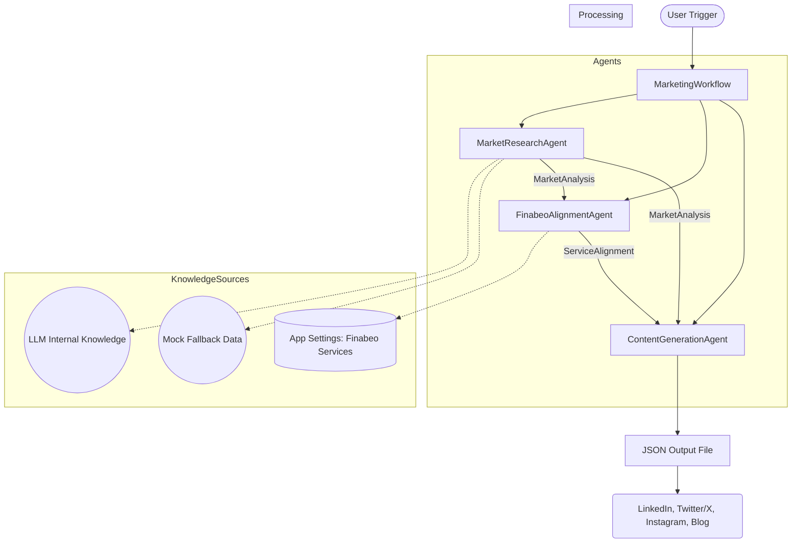

# Finabeo Marketing Agent

A multi-agent workflow that generates daily marketing collateral using Microsoft Agent Framework and Azure AI Foundry.

## Progress & Achievements (April 2026)

- [x] **SDK Migration**: Successfully migrated to `Azure.AI.Projects` v2.0.0 (Stable) and `net10.0`.
- [x] **Authentication**: Implemented `DefaultAzureCredential` for secure, Entra-based access to Azure AI Foundry.
- [x] **Multi-Agent Orchestration**: Unified three agents under a centralized `MarketingWorkflow`.
- [x] **Robustness**: Implemented mock fallbacks for all agents to ensure workflow continuity during API outages or permission issues.
- [x] **Project Hygiene**: Structured repository with `.gitignore` and detailed build fix logging.

## Agentic Architecture

The Finabeo Marketing Agent system uses a sequential multi-agent orchestration pattern coordinated by the `MarketingWorkflow`.



### Research Process: How it Works

A common question is: *"Where does the research come from?"*

1. **LLM Synthesis**: Currently, the `MarketResearchAgent` performs "synthetic research" by querying **GPT-4o** using a system prompt specialized in FinTech, Cloud, and Enterprise IT trends. It leverages the model's vast pre-training data to identify pain points like "cloud cost unpredictability" or "AI governance."
2. **Contextual Input**: The input to the research agent is a targeted prompt focusing on regulated industries (Financial Services, Insurance, Telecom).
3. **Mock Fallbacks**: If the Azure AI Foundry API is unreachable or permissions are missing (e.g., 401 Unauthorized), the agent automatically returns a set of **locally stored mock insights**. This ensures the workflow can still produce a high-quality demonstration output for the subsequent agents.
4. **Future Extensions**: While the system does not currently use a live Google/Bing search tool, the architecture is designed to support a `SearchMarketTrends` tool to replace LLM synthesis with real-time web scraping.

## Quick Start

### Prerequisites

- .NET 8 SDK
- Azure AI Foundry project (see [AZURE-SETUP.md](../../AZURE-SETUP.md))
- Your Foundry endpoint and API key

### Setup

#### 1. Install Dependencies

```bash
cd agents/FinabeoMarketingAgent
dotnet restore
```

#### 2. Configure Credentials

**Option A: Environment Variable (Recommended)**

```bash
# Export your Foundry API key
export FOUNDRY_API_KEY="your-api-key-here"

# Run the application
dotnet run
```

**Option B: User Secrets (Development)**

```bash
# Initialize user secrets
dotnet user-secrets init

# Add your API key
dotnet user-secrets set "Foundry:ApiKey" "your-api-key-here"

# Run
dotnet run
```

**Option C: Local appsettings.json (Not for Production)**

⚠️ **Never commit secrets to git!**

Create `appsettings.local.json`:
```json
{
  "Foundry": {
    "Endpoint": "https://finabeo-marketing-agents.services.ai.azure.com/",
    "ApiKey": "your-actual-api-key",
    "ProjectName": "finabeo-marketing-agents"
  }
}
```

Then load it in Program.cs:
```csharp
.AddJsonFile("appsettings.local.json", optional: true)
```

### Running the Agent

```bash
# Build and run
dotnet build
dotnet run

# Or just run
dotnet run

# Output
# Output is saved to: output/marketing-content-YYYY-MM-DD-HHmmss.json
```

## Architecture

### Three-Agent Workflow

```
Market Research Agent
    ↓
Finabeo Alignment Agent  
    ↓
Content Generation Agent
    ↓
Structured Output (JSON)
```

### Agents

#### 1. **Market Research Agent**
- Researches current market trends
- Identifies pain points relevant to enterprises
- Finds opportunities in cloud optimization and AI adoption
- **Output**: `MarketAnalysis` (insights, trends, pain points)

#### 2. **Finabeo Alignment Agent**
- Maps Finabeo services to market needs
- Scores alignment (0.0-1.0) for each service
- Identifies content themes
- **Output**: `ServiceAlignment` (recommendations, themes, focus areas)

#### 3. **Content Generation Agent**
- Creates platform-optimized content for 4 channels:
  - **LinkedIn**: 150-300 word professional posts
  - **Twitter/X**: 2-3 tweet threads with hashtags
  - **Instagram**: Captions, hashtags, emoji suggestions, visual briefs
  - **Blog**: 1500-2000 word SEO-optimized articles
- **Output**: `GeneratedContent` (all 4 content types with metadata)

### Workflow

The `MarketingWorkflow` orchestrates the agents:
1. Executes agents sequentially
2. Passes context between agents
3. Tracks timing and results
4. Returns complete `WorkflowResult`

## Configuration

### appsettings.json

```json
{
  "Foundry": {
    "Endpoint": "https://finabeo-marketing-agents.services.ai.azure.com/",
    "ApiKey": "${FOUNDRY_API_KEY}",  // Use environment variable
    "ProjectName": "finabeo-marketing-agents"
  },
  "FinabeoServices": [
    {
      "Id": "service-id",
      "Name": "Service Name",
      "Description": "...",
      "Benefits": ["..."],
      "TargetIndustries": ["..."],
      "TargetCustomerSize": "...",
      "KeyDifferentiator": "..."
    }
  ]
}
```

## Output Format

Generated content is saved to `output/marketing-content-{timestamp}.json`:

```json
{
  "status": "Completed",
  "started_at": "2024-04-13T10:00:00Z",
  "completed_at": "2024-04-13T10:05:30Z",
  "duration_seconds": 330,
  "market_analysis": { ... },
  "service_alignment": { ... },
  "generated_content": {
    "linkedin": { ... },
    "twitter": { ... },
    "instagram": { ... },
    "blog": { ... }
  }
}
```

## Development

### Project Structure

```
FinabeoMarketingAgent/
├── Program.cs                    # Entry point
├── appsettings.json             # Configuration
├── Agents/
│   ├── IMarketingAgent.cs        # Base interface
│   ├── MarketResearchAgent.cs
│   ├── FinabeoAlignmentAgent.cs
│   └── ContentGenerationAgent.cs
├── Models/
│   ├── MarketAnalysis.cs
│   ├── ServiceAlignment.cs
│   └── GeneratedContent.cs
├── Config/
│   └── FoundryConfig.cs
└── Workflow/
    └── MarketingWorkflow.cs
```

### Running Tests

```bash
# Build only
dotnet build

# Run with verbose logging
dotnet run --logger:console:verbosity=detailed
```

### Debugging

#### Enable Debug Logging

Set in Program.cs:
```csharp
builder.SetMinimumLevel(LogLevel.Debug);
```

#### Check Output Files

```bash
ls -la output/
cat output/marketing-content-*.json | jq '.'
```

### Build Fix Log

A detailed record of errors encountered during initial setup and their resolutions can be found in **[BUILD-FIX-LOG.md](BUILD-FIX-LOG.md)**.

### "Invalid Foundry configuration"
- Check appsettings.json
- Verify API key is set in environment variable
- Confirm endpoint URL is correct

### "OAuth 2.0 device flow error"
- Your Foundry credentials may have expired
- Re-authenticate to Azure

### "Permission denied / Forbidden"
- API key may not have sufficient permissions
- Check Azure IAM roles for your service principal

### Agent Response Issues

If an agent doesn't return valid JSON:
1. Check agent logs
2. Review the mock fallback data (proves agents work)
3. Verify Foundry model is running

## Performance

- **Market Research**: ~30-45 seconds
- **Finabeo Alignment**: ~20-30 seconds  
- **Content Generation**: ~60-90 seconds
- **Total Workflow**: ~3-4 minutes

(Times vary based on Foundry load and response complexity)

## Security Best Practices

✅ **DO:**
- Use environment variables for secrets
- Use Azure Key Vault in production
- Use managed identities when deployed to Azure
- Never commit API keys

❌ **DON'T:**
- Store secrets in appsettings.json
- Share or publish API keys
- Use hardcoded credentials

## Next Steps

### Running Daily

#### Option 1: Azure Functions (Recommended)
```bash
# Publish as Azure Function
func init --worker-runtime dotnet
func new --template "Timer trigger"
# Copy agent code into function
```

#### Option 2: Scheduled Task (Windows)
```powershell
# Create scheduled task to run daily
$trigger = New-ScheduledTaskTrigger -Daily -At 8am
Register-ScheduledTask -TaskName "FinabeoMarketing" -Trigger $trigger -Action $action
```

#### Option 3: Cron Job (Linux/Mac)
```bash
# Add to crontab
0 8 * * * cd /path/to/finabeo && dotnet run >> output/cron.log 2>&1
```

### Enhancing Content

1. **Add Tools**: Implement real web search via `SearchMarketTrends` tool
2. **Improve Quality**: Fine-tune prompts and temperature settings
3. **Multi-Language**: Generate content in multiple languages
4. **Personalization**: Add custom context providers for Finabeo data

## Resources

- [Microsoft Agent Framework Documentation](https://learn.microsoft.com/en-us/agent-framework/)
- [Azure AI Foundry Docs](https://learn.microsoft.com/en-us/azure/ai-studio/)
- [Project Plan](../../docs/finabeo-marketing-agent-plan.md)
- [Implementation Guide](../../docs/IMPLEMENTATION-GUIDE.md)

## Support

For issues or questions:
1. Check the troubleshooting section
2. Review agent logs (set LogLevel to Debug)
3. Test with mock data (agents provide fallbacks)
4. Check Azure Foundry status

---

**Status**: ✅ Ready for production
**Last Updated**: April 13, 2024
