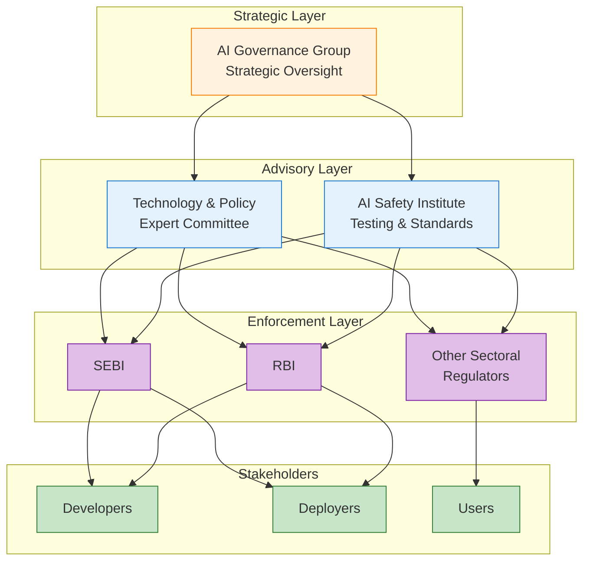
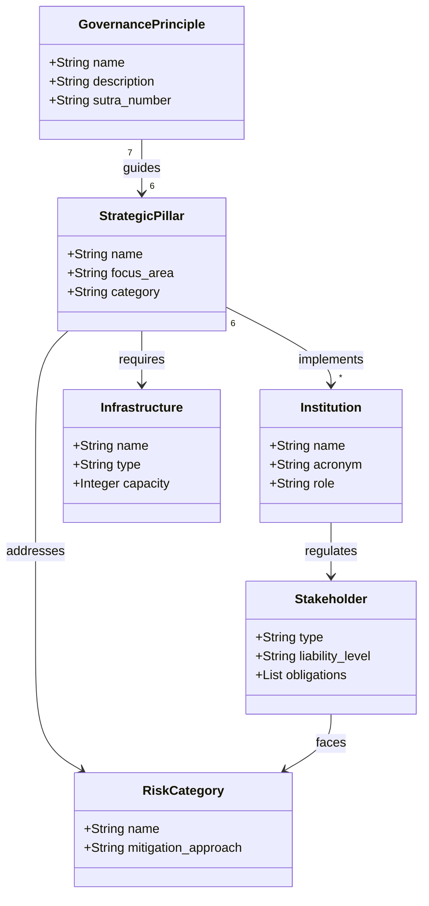
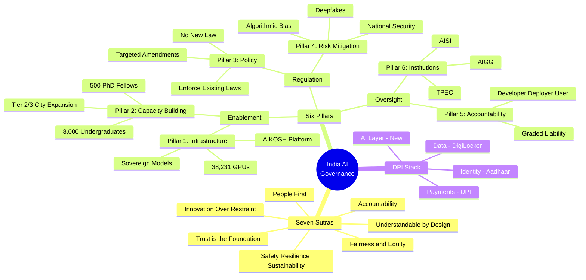
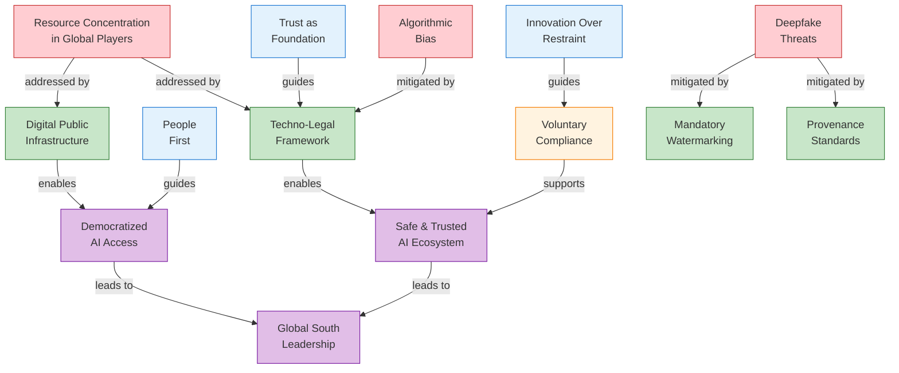

[📖 README](./README.md) · [📑 Slides](./slides.pdf) · [🏠 Home](../../README.md)

# India AI Governance Guidelines — Semantic Knowledge Graph

> A techno-legal framework enabling safe, trusted AI innovation for India's Viksit Bharat 2047 vision.

## Summary

India's AI Governance Guidelines represent a strategic departure from prescriptive regulation, embracing an "innovation over restraint" philosophy. The framework builds on existing laws (IT Act, DPDP Act, Consumer Protection Act) rather than creating new AI-specific legislation. Central to the approach is leveraging India's Digital Public Infrastructure (DPI) stack—Aadhaar, UPI, DigiLocker—as a democratizing force multiplier for AI access. The governance structure establishes the AI Governance Group (AIGG) for strategic oversight and the AI Safety Institute (AISI) for technical standards, with sectoral regulators handling enforcement.

## Key Concepts

- **Techno-Legal Framework** — Using technology solutions (watermarking, provenance standards) to solve technology problems, rather than relying solely on legal mechanisms
- **Seven Sutras** — Core governance principles: Trust, People First, Innovation Over Restraint, Safety/Resilience/Sustainability, Understandability, Accountability, Fairness & Equity
- **Six Pillars** — Strategic framework components: Infrastructure, Capacity Building, Policy, Risk Mitigation, Accountability, Institutions
- **Digital Public Infrastructure (DPI)** — India Stack layers (Aadhaar identity, UPI payments, DigiLocker data) serving as foundation for AI democratization
- **Graded Liability** — Accountability model distinguishing between Developers, Deployers, and Users based on function and risk level
- **Contextual Safety** — Risk assessment based on empirical evidence of harm in Indian context, not hypothetical global fears

## Core Arguments

1. AI governance should enable innovation rather than constrain it—governance serves as a catalyst, not a bottleneck
2. Existing legal frameworks (IT Act, DPDP, Consumer Protection) are sufficient for current AI challenges; new laws should only be drafted if proven necessary
3. India's DPI advantage provides a unique path to democratize AI access for the "last citizen" that other nations cannot easily replicate
4. Risk mitigation must be contextual—based on actual Indian harm evidence rather than imported Western fears about hypothetical threats
5. The developer-deployer-user liability chain requires transparency about how different actors in the AI value chain operate
6. Voluntary industry compliance combined with techno-legal solutions (watermarking, provenance) is preferable to compliance-heavy regulatory regimes

## Key Quotes

> "To harness AI for inclusive development and global competitiveness while mitigating risks through a 'Techno-Legal' framework." — Mission Statement

> "India is not regulating the technology itself, but its applications, empowering sectoral regulators to act." — Key Takeaway

> "Build with Trust. Innovate with Responsibility." — Closing Statement

> "Greater transparency is required about how different actors in the AI value chain operate." — Accountability Principle

---

## Mermaid Diagrams

### Flowchart: Governance Architecture



### Ontology: Entity Types (Class Diagram)



### Taxonomy: Framework Hierarchy (Mind Map)



### Knowledge Graph: Concept Relationships



---

## Cypher Export (Neo4j)

### Nodes

```cypher
// Governance Principles (Seven Sutras)
CREATE (trust:GovernancePrinciple {
    id: 'sutra_trust',
    name: 'Trust is the Foundation',
    sutra_number: 1,
    description: 'Trust must be embedded across the value chain—technology, institutions, and users'
})

CREATE (people_first:GovernancePrinciple {
    id: 'sutra_people_first',
    name: 'People First',
    sutra_number: 2,
    description: 'Human oversight and empowerment are non-negotiable. AI must serve people, not replace them'
})

CREATE (innovation:GovernancePrinciple {
    id: 'sutra_innovation',
    name: 'Innovation Over Restraint',
    sutra_number: 3,
    description: 'Responsible innovation should be prioritized over cautionary restraint'
})

CREATE (safety:GovernancePrinciple {
    id: 'sutra_safety',
    name: 'Safety, Resilience & Sustainability',
    sutra_number: 4,
    description: 'Systems must withstand systemic shocks and be environmentally responsible'
})

CREATE (understandable:GovernancePrinciple {
    id: 'sutra_understandable',
    name: 'Understandable by Design',
    sutra_number: 5,
    description: 'Disclosures and explanations are core design features'
})

CREATE (accountability:GovernancePrinciple {
    id: 'sutra_accountability',
    name: 'Accountability',
    sutra_number: 6,
    description: 'Clear assignment of responsibility across the AI value chain'
})

CREATE (fairness:GovernancePrinciple {
    id: 'sutra_fairness',
    name: 'Fairness & Equity',
    sutra_number: 7,
    description: 'AI systems must not discriminate and must promote equitable outcomes'
})

// Strategic Pillars
CREATE (pillar_infra:StrategicPillar {
    id: 'pillar_infrastructure',
    name: 'Infrastructure',
    pillar_number: 1,
    category: 'Enablement',
    focus: 'Democratizing access through IndiaAI Mission'
})

CREATE (pillar_capacity:StrategicPillar {
    id: 'pillar_capacity',
    name: 'Capacity Building',
    pillar_number: 2,
    category: 'Enablement',
    focus: 'Future-ready talent development'
})

CREATE (pillar_policy:StrategicPillar {
    id: 'pillar_policy',
    name: 'Policy',
    pillar_number: 3,
    category: 'Regulation',
    focus: 'Agile, flexible architecture with no new law'
})

CREATE (pillar_risk:StrategicPillar {
    id: 'pillar_risk',
    name: 'Risk Mitigation',
    pillar_number: 4,
    category: 'Regulation',
    focus: 'Contextual safety based on Indian evidence'
})

CREATE (pillar_account:StrategicPillar {
    id: 'pillar_accountability',
    name: 'Accountability',
    pillar_number: 5,
    category: 'Oversight',
    focus: 'Graded liability for developers, deployers, users'
})

CREATE (pillar_institutions:StrategicPillar {
    id: 'pillar_institutions',
    name: 'Institutions',
    pillar_number: 6,
    category: 'Oversight',
    focus: 'Whole of Government approach'
})

// Institutions
CREATE (aigg:Institution {
    id: 'inst_aigg',
    name: 'AI Governance Group',
    acronym: 'AIGG',
    role: 'Strategic Oversight'
})

CREATE (aisi:Institution {
    id: 'inst_aisi',
    name: 'AI Safety Institute',
    acronym: 'AISI',
    role: 'Technical Wing: Testing & Standards'
})

CREATE (tpec:Institution {
    id: 'inst_tpec',
    name: 'Technology & Policy Expert Committee',
    acronym: 'TPEC',
    role: 'Policy Support'
})

// Infrastructure Components
CREATE (aikosh:Infrastructure {
    id: 'infra_aikosh',
    name: 'AIKOSH Platform',
    type: 'Data Platform',
    datasets: 1500,
    models: 217,
    entities: 34
})

CREATE (compute:Infrastructure {
    id: 'infra_compute',
    name: 'Compute Infrastructure',
    type: 'GPU Cluster',
    gpus: 38231,
    next_gen_gpus: 3000
})

// DPI Stack
CREATE (aadhaar:DPILayer {
    id: 'dpi_aadhaar',
    name: 'Aadhaar',
    function: 'Identity'
})

CREATE (upi:DPILayer {
    id: 'dpi_upi',
    name: 'UPI',
    function: 'Payments'
})

CREATE (digilocker:DPILayer {
    id: 'dpi_digilocker',
    name: 'DigiLocker',
    function: 'Data'
})

CREATE (ai_layer:DPILayer {
    id: 'dpi_ai',
    name: 'AI Layer',
    function: 'Artificial Intelligence'
})

// Risk Categories
CREATE (deepfake:RiskCategory {
    id: 'risk_deepfake',
    name: 'Deepfakes & Misinformation',
    threat_level: 'High',
    mitigation: 'Watermarking, Provenance Standards'
})

CREATE (bias:RiskCategory {
    id: 'risk_bias',
    name: 'Algorithmic Bias',
    threat_level: 'Medium',
    mitigation: 'Techno-Legal Solutions'
})

CREATE (security:RiskCategory {
    id: 'risk_security',
    name: 'National Security Threats',
    threat_level: 'High',
    mitigation: 'Contextual Assessment'
})

// Stakeholder Types
CREATE (developer:StakeholderType {
    id: 'stakeholder_developer',
    name: 'Developer',
    liability: 'High',
    description: 'Creates AI models and systems'
})

CREATE (deployer:StakeholderType {
    id: 'stakeholder_deployer',
    name: 'Deployer',
    liability: 'Medium',
    description: 'Deploys and operates AI systems'
})

CREATE (user:StakeholderType {
    id: 'stakeholder_user',
    name: 'User',
    liability: 'Low',
    description: 'End users of AI systems'
})
```

### Relationships

```cypher
// Principles guide Pillars
CREATE (trust)-[:GUIDES]->(pillar_infra)
CREATE (trust)-[:GUIDES]->(pillar_institutions)
CREATE (people_first)-[:GUIDES]->(pillar_capacity)
CREATE (innovation)-[:GUIDES]->(pillar_policy)
CREATE (safety)-[:GUIDES]->(pillar_risk)
CREATE (understandable)-[:GUIDES]->(pillar_account)
CREATE (accountability)-[:GUIDES]->(pillar_account)
CREATE (fairness)-[:GUIDES]->(pillar_risk)

// Pillars implemented by Institutions
CREATE (pillar_institutions)-[:IMPLEMENTS]->(aigg)
CREATE (pillar_institutions)-[:IMPLEMENTS]->(aisi)
CREATE (pillar_institutions)-[:IMPLEMENTS]->(tpec)

// Institution relationships
CREATE (aigg)-[:OVERSEES]->(tpec)
CREATE (aigg)-[:OVERSEES]->(aisi)
CREATE (tpec)-[:ADVISES]->(aigg)
CREATE (aisi)-[:SUPPORTS]->(tpec)

// Infrastructure relationships
CREATE (pillar_infra)-[:INCLUDES]->(aikosh)
CREATE (pillar_infra)-[:INCLUDES]->(compute)

// DPI Stack relationships
CREATE (aadhaar)-[:ENABLES]->(upi)
CREATE (upi)-[:ENABLES]->(digilocker)
CREATE (digilocker)-[:ENABLES]->(ai_layer)
CREATE (ai_layer)-[:BUILT_ON]->(aadhaar)
CREATE (ai_layer)-[:BUILT_ON]->(upi)
CREATE (ai_layer)-[:BUILT_ON]->(digilocker)

// Risk mitigation relationships
CREATE (pillar_risk)-[:ADDRESSES]->(deepfake)
CREATE (pillar_risk)-[:ADDRESSES]->(bias)
CREATE (pillar_risk)-[:ADDRESSES]->(security)

// Accountability relationships
CREATE (pillar_account)-[:REGULATES]->(developer)
CREATE (pillar_account)-[:REGULATES]->(deployer)
CREATE (pillar_account)-[:REGULATES]->(user)
CREATE (developer)-[:TRANSFERS_TO]->(deployer)
CREATE (deployer)-[:TRANSFERS_TO]->(user)
```

---

## Tags

`ai-governance`, `india-ai`, `viksit-bharat-2047`, `techno-legal`, `digital-public-infrastructure`, `dpi`, `seven-sutras`, `six-pillars`, `aigg`, `aisi`, `graded-liability`, `deepfake-mitigation`, `algorithmic-bias`, `india-stack`, `meity`, `innovation-over-restraint`

## Search Phrases

- "How does India plan to regulate AI?"
- "What is the techno-legal framework for AI governance?"
- "What are the seven sutras of India AI governance?"
- "How does India's DPI stack enable AI democratization?"
- "What is the role of AIGG and AISI in AI governance?"
- "How does graded liability work for AI developers?"
- "What is India's approach to deepfake regulation?"
- "How does India balance AI innovation with safety?"
- "What infrastructure supports India's AI mission?"
- "What is the Viksit Bharat 2047 AI strategy?"
