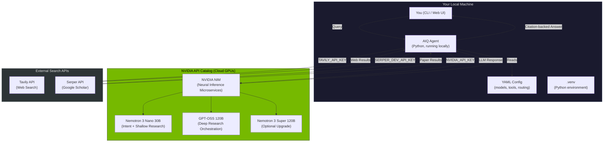
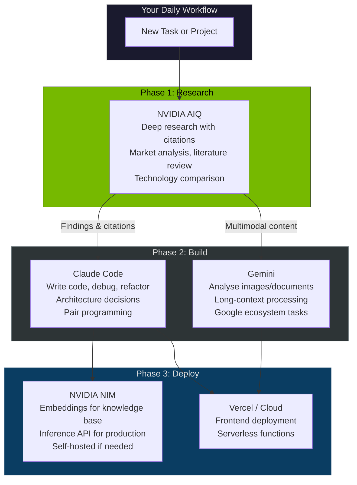
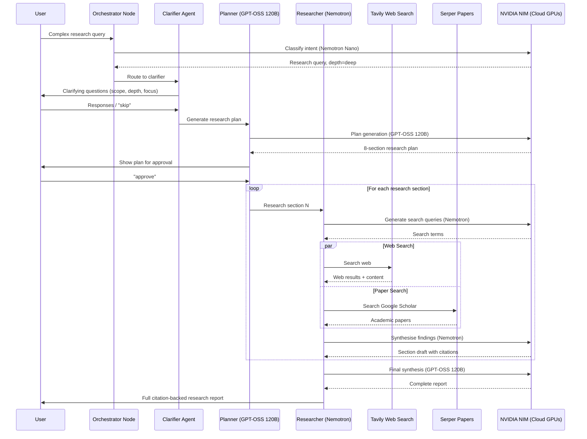
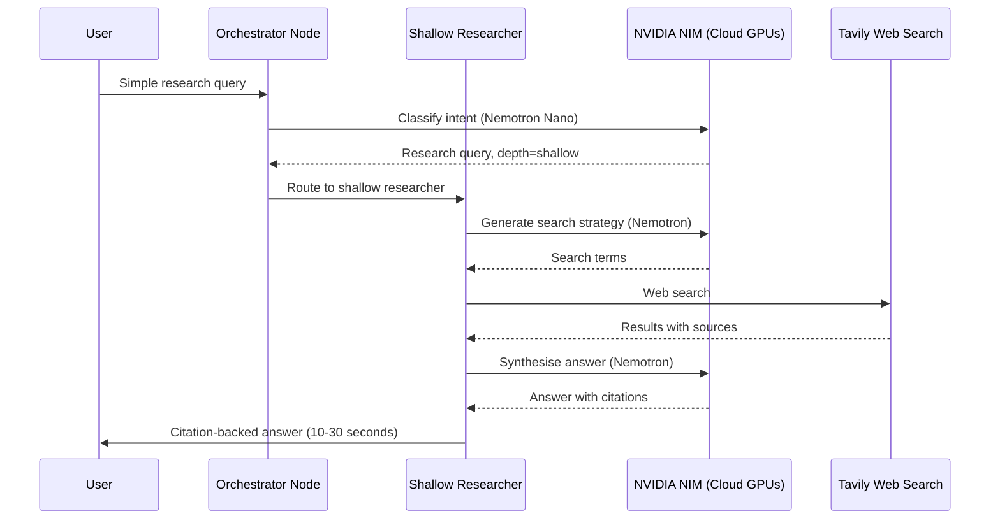
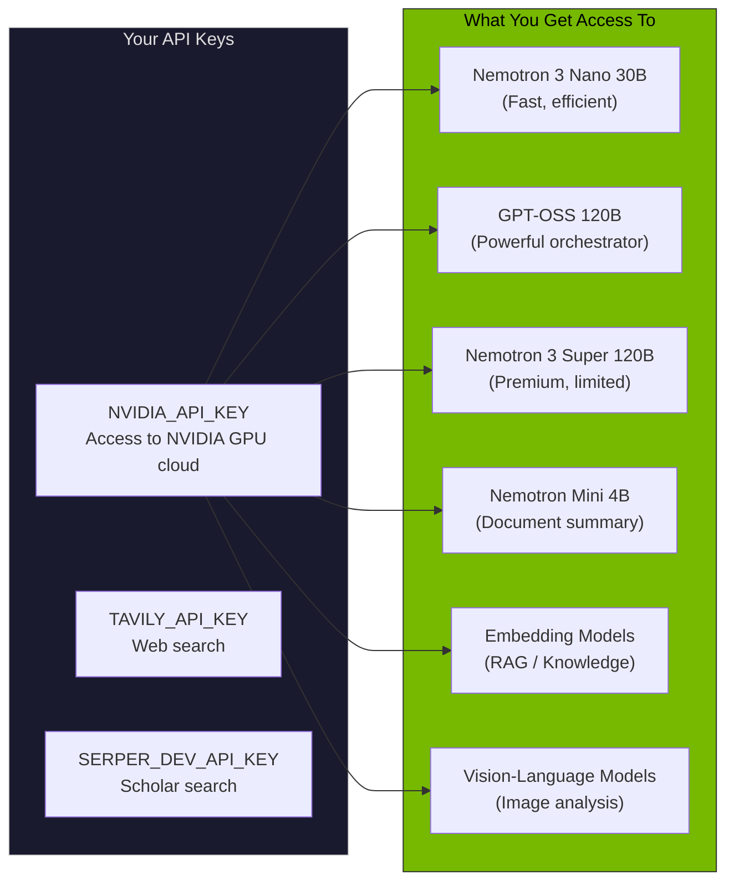
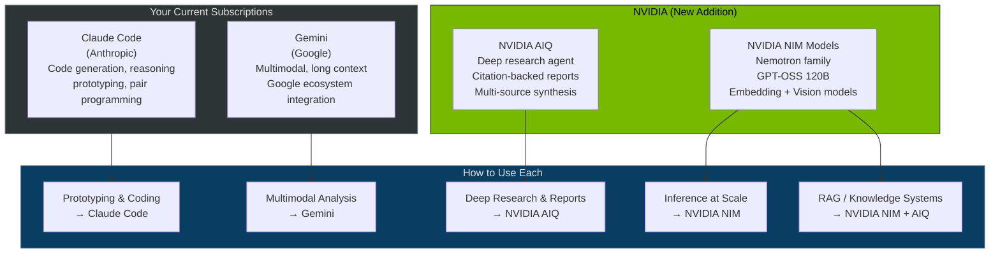
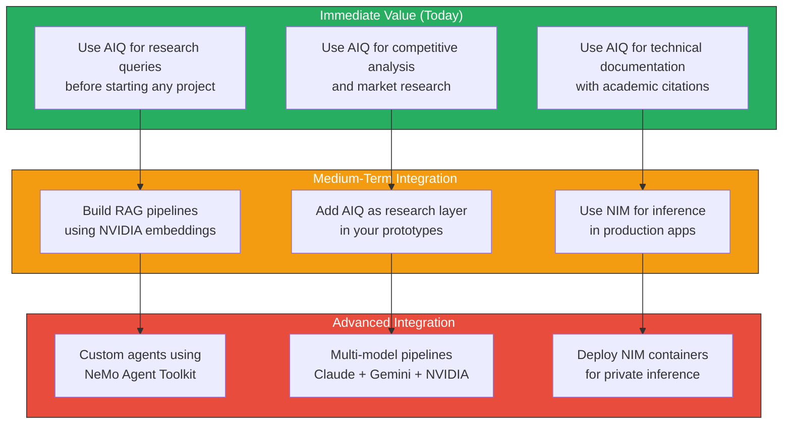
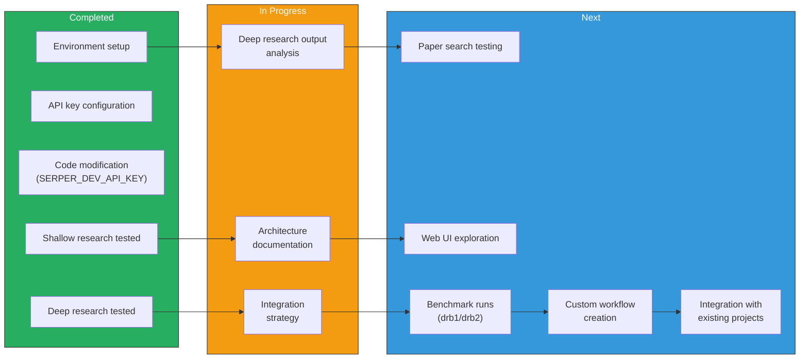

# NVIDIA AIQ: Architecture, Scope & Integration Strategy

## How NVIDIA AIQ Works

When you run a query through AIQ, here's what happens end-to-end:



## Understanding AIQ, NIM, and How They Fit Alongside Claude and Gemini

### What is AIQ?

**AIQ is not an acronym with a formal expansion.** It is NVIDIA's branding for their **AI-Q Blueprint** -- a reference architecture for building research agents. The name is a play on "AI + IQ" (intelligence quotient).

AIQ is not a model. It is a **pre-built, configurable multi-agent research system** -- an orchestrator, tools, search integrations, and models wired together into a pipeline that produces citation-backed research reports.

### What is NIM?

**NIM = Neural Inference Microservices.** It is NVIDIA's equivalent of calling the OpenAI API or Anthropic API, but for NVIDIA's own models. You send a prompt to `integrate.api.nvidia.com/v1`, it runs on NVIDIA's cloud GPUs, and you get a response back. You can also self-host NIM containers on your own GPUs for full control.

### AIQ vs Calling Claude / Gemini / GPT Directly

When you use Claude Code or Gemini, you interact with a single model:

```
You -> Claude/Gemini/GPT -> Answer
```

When you use AIQ, a multi-agent pipeline handles your query:

```
You -> Intent Classifier (Nemotron)  -> Decides depth (shallow vs deep)
     -> Clarifier Agent              -> Asks you scoping questions
     -> Planner (GPT-OSS 120B)      -> Creates a multi-section research plan
     -> Researcher (Nemotron)        -> Searches web (Tavily)
                                     -> Searches papers (Serper)
                                     -> Synthesises findings per section
                                     -> Cites all sources
     -> Final Report with 41 citations
```

**AIQ is not a smarter model. It is an automated research workflow that uses models as components.**

### Why Not Just Use Claude / Gemini / GPT for Everything?

| Capability | Claude Code | Gemini | NVIDIA AIQ | NVIDIA NIM |
|-----------|------------|--------|-----------|-----------|
| **What it is** | General-purpose AI assistant | Multimodal AI assistant | Multi-agent research pipeline | Inference API for NVIDIA models |
| **Best at** | Code generation, reasoning, pair programming | Long documents, images, Google ecosystem | Automated deep research with citations | Embeddings, RAG pipelines, production inference |
| **Searches the web?** | No (unless you add tools) | Limited | Yes (Tavily + Serper built-in) | No (it's just an inference API) |
| **Produces citations?** | Only if you ask carefully | Only if you ask carefully | Automatically, with numbered references | N/A |
| **Multi-step research?** | You drive each step manually | You drive each step manually | Automated: plan -> research -> synthesise | N/A |
| **Self-hostable?** | No | No | Yes (Docker/Helm) | Yes (NIM containers on your GPUs) |
| **Reasoning quality** | Excellent (best-in-class) | Very good | Good (Nemotron is capable but not top-tier) | Depends on model chosen |

### The Honest Assessment

**Claude, GPT, and Gemini are better general-purpose reasoners.** They produce higher quality analysis when you give them a well-crafted prompt. You should keep using them for coding, complex reasoning, creative work, and general assistance.

**NVIDIA's value is in three specific areas:**

1. **AIQ as a ready-made research agent.** You do not build the orchestration, citation tracking, or multi-step research pipeline. It is pre-built. You ask a question and get a cited report. Building equivalent functionality on top of Claude or Gemini would take significant engineering effort.

2. **NIM for embeddings and RAG.** NVIDIA's embedding models (`llama-nemotron-embed-vl-1b-v2`) are excellent for building knowledge bases. If you are building a system that needs to search through documents, NIM embeddings + a vector database is a strong, cost-effective choice.

3. **Self-hosting and scale.** If you ever need to run inference on your own hardware (for privacy, cost, or latency reasons), NIM containers are the way to do it. You cannot self-host Claude or GPT.

### Where Each Tool Fits in Your Workflow



### Summary

| Tool | Role | When to use |
|------|------|-------------|
| **Claude Code** | Primary coding assistant | Every day -- writing, debugging, prototyping |
| **Gemini** | Multimodal assistant | When you need image analysis, long docs, Google integration |
| **NVIDIA AIQ** | Research engine | Before starting a project -- get cited research, competitive analysis, literature reviews |
| **NVIDIA NIM** | Inference backbone | When building production apps -- embeddings, RAG, self-hosted inference |

**NVIDIA complements your existing tools. It does not replace them.**

---

## Deep Research Flow (Detailed)



## Shallow Research Flow



## What You're Actually Using



## Your Current AI Toolkit Landscape



## NVIDIA API Key: What Access Do You Get?

### Rate Limits and Throttling

The NVIDIA API Catalog (build.nvidia.com) provides access to models hosted on NVIDIA's GPU infrastructure. Key points:

| Aspect | Details |
|--------|---------|
| **Free Tier** | Typically 1,000 API calls/month for most models |
| **Rate Limits** | Varies by model; Nemotron Nano is more available than Super |
| **Throttling** | Yes, there are rate limits but they are generous for exploration |
| **Cost** | Free tier available; pay-as-you-go for higher volumes |
| **GPU Backend** | NVIDIA hosts the GPUs -- you don't need your own |
| **Nemotron Super** | Limited availability due to high demand |
| **GPT-OSS 120B** | Available but may have queue times |

### Comparison with Your Other Subscriptions

| Provider | What You Pay | What You Get | Best For |
|----------|-------------|--------------|----------|
| **Claude Code** | Subscription | Claude models, code tools, CLI | Coding, prototyping, pair programming |
| **Gemini** | Subscription | Gemini models, Google integration | Multimodal, long documents, Google ecosystem |
| **NVIDIA** | API Key (free tier) | Multiple models, GPU inference | Research, inference, RAG, production deployment |

### Key Insight: NVIDIA Complements, Not Replaces

NVIDIA's value proposition is different from Claude/Gemini:

1. **Claude Code** = Your primary coding assistant (generates, edits, debugs code)
2. **Gemini** = Your multimodal assistant (images, long docs, Google integration)
3. **NVIDIA AIQ** = Your research engine (deep research, citations, reports)
4. **NVIDIA NIM** = Your inference backbone (deploy models at scale, RAG, embeddings)

## How to Maximise NVIDIA Capabilities



## Practical Integration Examples

### Example 1: Research-Driven Prototyping
```
1. Use NVIDIA AIQ to research a topic deeply (citations, papers)
2. Use Claude Code to build the prototype based on AIQ's findings
3. Use Gemini for any multimodal aspects (image analysis, etc.)
4. Use NVIDIA NIM for the inference layer in production
```

### Example 2: Trading System Enhancement
```
1. AIQ researches latest trading strategies (academic papers + web)
2. Claude Code implements the strategy in your neural trader
3. NVIDIA NIM provides low-latency inference for real-time decisions
```

### Example 3: Knowledge System
```
1. NVIDIA embedding models index your documents
2. AIQ provides research capability on top of your knowledge base
3. Claude Code builds the UI and integration layer
4. Gemini handles any multimodal document analysis
```

## Scope of This Tinkering Activity


