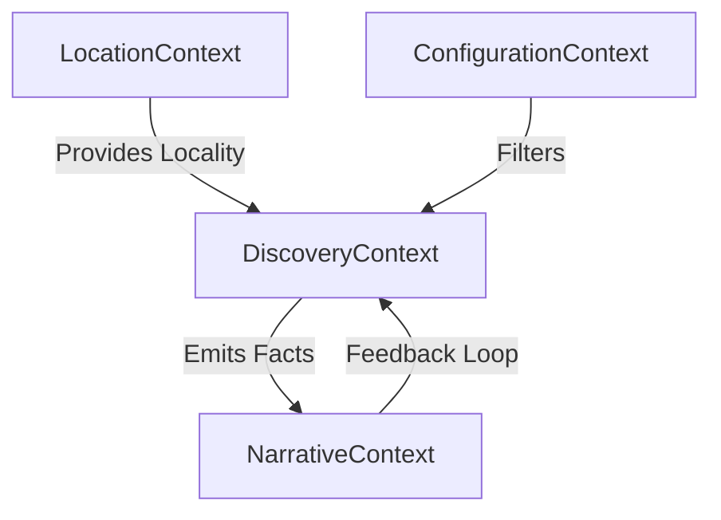

# Domain-Driven Design (DDD) Overview

**Version:** 1.0.0
**Design Lead:** DDD_Specialist (Swarm Agent)

---

## 1. Domain Vision

Driftwise operates in the **Context-Aware Discovery** domain. The core problem is matching *location* with *narrative* in real-time, constrained by *user attention* (driving).

## 2. Bounded Contexts

We have identified 4 primary Bounded Contexts using a context map.

### 2.1 📍 Location Context
*   **Responsibility**: Knowing where the user is and where they are going.
*   **Aggregate Root**: `Journey`.
*   **Entities**: `Coordinate`, `Heading`, `Speed`.
*   **Services**: `LocationProvider` (Wraps Capacitor), `GeocodingAdapter`.
*   **Ubiquitous Language**: "Fix", "Heading", "Locality", "Geofence".

### 2.2 🔭 Discovery Context
*   **Responsibility**: Mining the "world knowledge" for interesting nuggets.
*   **Aggregate Root**: `Fact`.
*   **Entities**: `Topic`, `HistoricalEra`, `SerendipityScore`.
*   **Services**: `FactGenerator` (LLM Interface), `RelevanceFilter`.
*   **Ubiquitous Language**: "Nugget", "Context Window", "Hallucination Check".

### 2.3 🗣️ Narrative Context (Voice)
*   **Responsibility**: Delivering information naturally and managing the conversation.
*   **Aggregate Root**: `Session`.
*   **Entities**: `Utterance`, `Interruption`, `Tone`.
*   **Services**: `LiveConnection` (WebSocket), `AudioDuck` (Native).
*   **Ubiquitous Language**: "Turn-taking", "Barge-in", "Ducking", "Silence Timeout".

### 2.4 ⚙️ Configuration Context
*   **Responsibility**: User preferences and constraints.
*   **Entities**: `InterestProfile` (e.g., "Architecture", "Battles"), `VerbosityLevel`.
*   **Repositories**: `SettingsStore`.

## 3. Context Mapping

*   **Location -> Discovery**: Upstream. Discovery allows Location to dictate the search parameters.
*   **Discovery -> Narrative**: Upstream. Narrative takes facts and "performs" them.
