# Microsoft Agent Framework Architecture

## System Architecture Diagram

```mermaid
graph TB
    subgraph "Application Layer"
        APP["Your Application"]
    end

    subgraph "Agent Layer"
        AIAgent["<b>AIAgent</b><br/>Base Class<br/>(Abstract)"]
        ChatClientAgent["<b>ChatClientAgent</b><br/>Inference Service<br/>Wrapper"]
        CustomAgent["<b>Custom Agents</b><br/>Enterprise/Special<br/>Use Cases"]
        FoundryAgent["<b>FoundryAgent</b><br/>Microsoft Foundry<br/>Native"]
        RemoteAgent["<b>RemoteAgent</b><br/>A2A Protocol<br/>Proxy"]
    end

    subgraph "Inference Service Abstraction"
        IChatClient["<b>IChatClient</b><br/>Standard Interface"]
        
        subgraph "Service Implementations"
            AzureOpenAI["Azure OpenAI<br/>(ChatCompletion<br/>& Responses)"]
            OpenAI["OpenAI<br/>(ChatCompletion<br/>& Responses)"]
            Anthropic["Anthropic<br/>(Claude)"]
            Foundry["Foundry<br/>(Models)"]
            Custom["Custom<br/>IChatClient"]
        end
    end

    subgraph "Agent Execution Runtime"
        AgentLoop["<b>Agentic Loop</b><br/>Deterministic<br/>Execution Model"]
        
        subgraph "Execution Components"
            PromptEngine["Prompt<br/>Engine"]
            FunctionCalling["Function<br/>Calling"]
            ToolExecution["Tool<br/>Execution"]
            StateManagement["State<br/>Management"]
        end
    end

    subgraph "Integration Layer"
        Tools["<b>Tools/MCP</b><br/>Model Context<br/>Protocol"]
        ContextProviders["<b>Context Providers</b><br/>Memory & Knowledge<br/>Injection"]
        Middleware["<b>Middleware</b><br/>Interceptors &<br/>Filters"]
    end

    subgraph "State & History Management"
        ChatHistory["Chat History<br/>Storage"]
        
        subgraph "History Options"
            LocalHistory["In-Memory/<br/>Custom"]
            ServiceHistory["Service-Provided<br/>Storage"]
        end
    end

    subgraph "Advanced Features"
        Workflows["<b>Workflows</b><br/>Graph-Based<br/>Multi-Agent"]
        Sessions["<b>Agent Session</b><br/>Persistent<br/>State"]
        Telemetry["<b>Telemetry</b><br/>OpenTelemetry<br/>Logging"]
    end

    subgraph "Inference Services (External)"
        AzureService["Azure OpenAI<br/>Service"]
        OpenAIService["OpenAI<br/>API"]
        AnthropicService["Anthropic<br/>API"]
        FoundryService["Microsoft Foundry<br/>Service"]
    end

    %% Connections
    APP -->|Uses| AIAgent
    AIAgent -->|"Specialized:"| ChatClientAgent
    AIAgent -->|"Specialized:"| CustomAgent
    AIAgent -->|"Specialized:"| FoundryAgent
    AIAgent -->|"Specialized:"| RemoteAgent
    
    ChatClientAgent -->|Wraps| IChatClient
    IChatClient -->|"Implemented by"| AzureOpenAI
    IChatClient -->|"Implemented by"| OpenAI
    IChatClient -->|"Implemented by"| Anthropic
    IChatClient -->|"Implemented by"| Foundry
    IChatClient -->|"Implemented by"| Custom
    
    AzureOpenAI -->|Connects to| AzureService
    OpenAI -->|Connects to| OpenAIService
    Anthropic -->|Connects to| AnthropicService
    Foundry -->|Connects to| FoundryService
    
    ChatClientAgent -->|Executes via| AgentLoop
    AgentLoop -->|Uses| PromptEngine
    AgentLoop -->|Handles| FunctionCalling
    AgentLoop -->|Invokes| ToolExecution
    AgentLoop -->|Manages| StateManagement
    
    ToolExecution -->|Accesses| Tools
    ContextProviders -->|Feeds| AgentLoop
    Middleware -->|Intercepts| AgentLoop
    
    AgentLoop -->|Stores/Retrieves| ChatHistory
    ChatHistory -->|"Can be"| LocalHistory
    ChatHistory -->|"Can be"| ServiceHistory
    
    ChatClientAgent -->|Uses for complex| Workflows
    ChatClientAgent -->|Manages| Sessions
    ChatClientAgent -->|Emits| Telemetry

    %% Styling
    classDef agent fill:#4A90E2,stroke:#2E5C8A,color:#fff,stroke-width:2px
    classDef service fill:#7ED321,stroke:#5FA819,color:#fff,stroke-width:2px
    classDef runtime fill:#F5A623,stroke:#C97E0A,color:#fff,stroke-width:2px
    classDef integration fill:#BD10E0,stroke:#7D0892,color:#fff,stroke-width:2px
    classDef advanced fill:#50E3C2,stroke:#2FA899,color:#fff,stroke-width:2px
    classDef external fill:#FF6B6B,stroke:#C92A2A,color:#fff,stroke-width:2px
    
    class AIAgent,ChatClientAgent,CustomAgent,FoundryAgent,RemoteAgent agent
    class IChatClient,AzureOpenAI,OpenAI,Anthropic,Foundry,Custom service
    class AgentLoop,PromptEngine,FunctionCalling,ToolExecution,StateManagement runtime
    class Tools,ContextProviders,Middleware integration
    class Workflows,Sessions,Telemetry advanced
    class AzureService,OpenAIService,AnthropicService,FoundryService external
```



## Key Architecture Insights

### The Three-Layer Abstraction

1. **Application Layer**: Your code using agents
2. **Framework Layer**: Agent implementations and abstractions
3. **Service Layer**: External inference services and backends

### The IChatClient Contract

The **`IChatClient`** interface is the critical abstraction:
- Standardizes communication with any inference service
- Enables swapping backends without changing agent code
- Allows multiple implementations for the same service (different APIs/SDKs)

### Agentic Loop: The Engine

All agent execution happens through the **Agentic Loop**:
1. Receive user input
2. Send to inference service with context
3. Service responds with message or tool call
4. Execute tools if needed
5. Loop until task complete

### Multi-Agent Orchestration

**Workflows** enable complex scenarios:
- Graph-based agent coordination
- Type-safe routing
- Checkpointing
- Human-in-the-loop decision points

---

## Glossary of Framework Abstractions

### Core Abstractions

#### **AIAgent** (Base Class)
The foundational abstraction representing an autonomous agent. All agent types inherit from this base class, providing:
- Consistent interface for all agent implementations
- Run methods for executing agent logic
- State management capabilities
- Integration points for middleware and context providers

**Use when**: Building custom agent types with specialized behavior

#### **ChatClientAgent** (Primary Implementation)
A concrete agent implementation that wraps any `IChatClient`. Handles:
- Chat completion API interactions
- Function/tool calling
- Conversation history management
- Structured output extraction

**Use when**: Building agents from standard inference services

#### **IChatClient** (Service Abstraction)
The critical interface that standardizes communication with inference services. Abstracts:
- Chat completion requests
- Streaming responses
- Model configuration
- Service-specific features

**Why it matters**: Enables service-agnostic agent development; change backends by swapping implementations

### Service Layer

#### **Inference Service**
An external API or service that provides language model capabilities:
- Azure OpenAI
- OpenAI
- Anthropic
- Microsoft Foundry
- Custom implementations

**Key property**: Must implement `IChatClient` interface to work with Agent Framework

### Execution Runtime

#### **Agentic Loop** (Deterministic Execution Model)
The structured loop that governs all agent execution:
1. Initialize with instructions and context
2. Send message to inference service
3. Receive decision from service (respond or call tool)
4. Execute tools/functions if needed
5. Return results and loop until completion

**Why it's important**: Ensures predictable, reproducible agent behavior

#### **Context Providers**
Mechanisms for injecting knowledge and state into agent execution:
- Memory/conversation history
- User profile information
- Knowledge bases or documents
- Dynamic contextual information

**Types**:
- **Session-based**: Maintains conversation history
- **RAG providers**: Retrieve relevant documents
- **Custom providers**: Application-specific context

### Integration Points

#### **Tools/MCP** (Model Context Protocol)
Mechanisms for agents to interact with external systems:
- API calls
- Database queries
- File operations
- Custom functions
- MCP (Model Context Protocol) servers

**How it works**: Agent decides to call tool → Framework executes → Returns result to agent

#### **Middleware**
Interceptors that allow modification of:
- Incoming messages (before service)
- Service responses (after inference)
- Tool calls (before execution)
- Final outputs (before return)

**Use for**: Logging, filtering, rate limiting, prompt engineering, safety checks

### State Management

#### **Chat History Storage**
Persistent tracking of conversation context:
- **Local/In-Memory**: Application manages history, passes with each request
- **Service-Provided**: Service maintains history server-side, application references

**Trade-offs**:
- Local: More control, higher latency cost
- Service: Simpler, less bandwidth, depends on service availability

#### **Agent Session**
Long-lived execution context for an agent:
- Maintains conversation state
- Tracks tool execution history
- Supports checkpointing
- Enables pause/resume workflows

### Advanced Features

#### **Workflows** (Graph-Based Orchestration)
Explicit multi-agent coordination system:
- Agents as nodes in a directed graph
- Type-safe routing between agents
- Conditional branching based on outputs
- Human-in-the-loop decision points
- Persistent checkpointing

**When to use**: Complex scenarios requiring multiple agents or multi-step processes

#### **Telemetry & Observability**
Structured logging and metrics:
- OpenTelemetry integration
- Traces for each agent execution
- Metrics for performance monitoring
- Logs for debugging

**Supports**: Distributed tracing, performance analysis, cost tracking

### Implementation Patterns

#### **Custom Agents**
Complete customization by extending `AIAgent` base class:
- Full control over execution logic
- Custom inference patterns
- Specialized state management
- Domain-specific behavior

**Complexity**: High | **Flexibility**: Maximum

#### **RemoteAgent/Proxies**
Agents that act as proxies to remote agent services:
- A2A (Agent-to-Agent) protocol
- Federated agent networks
- Service-hosted agents

**Use case**: Integrating with enterprise agent platforms

---

## Design Principles Explained

### 1. **Abstraction-First Design**
The framework prioritizes abstractions (`IChatClient`) over concrete implementations, enabling:
- Service independence
- Easy swapping of backends
- Testing with mock implementations
- Custom service integration

### 2. **Composition Over Inheritance**
Agents compose inference services + tools + context rather than inherit specialized behavior:
- `ChatClientAgent` = IChatClient + Tools + ContextProviders
- Flexible combinations of components
- Easy to test individual pieces

### 3. **Deterministic Loop Pattern**
All execution follows a structured loop ensuring:
- Reproducible behavior
- Clear execution flow
- Observable action sequences
- Straightforward debugging

### 4. **Enterprise-Ready Defaults**
Out-of-the-box:
- Type safety
- Middleware support
- Telemetry integration
- State management
- Error handling

### 5. **Extensibility at Every Layer**
Custom implementations possible for:
- Agents (extend `AIAgent`)
- Chat clients (implement `IChatClient`)
- Context providers (custom knowledge injection)
- Middleware (execution hooks)
- Workflows (custom orchestration logic)

---

## Putting It Together: Example Flow

```
User Application
    ↓
ChatClientAgent (wraps IChatClient)
    ↓
Middleware (logs request)
    ↓
Context Providers (injects memory)
    ↓
Agentic Loop
    ├─ Send prompt to inference service
    ├─ Service returns tool call decision
    ├─ Middleware monitors decision
    ├─ Tools execute the call
    ├─ Chat History stores message
    └─ Loop repeats or returns result
    ↓
Middleware (logs response)
    ↓
Telemetry (records trace)
    ↓
User Application receives response
```

This architecture enables building sophisticated, observable, and maintainable AI applications with maximum flexibility and minimal code.
