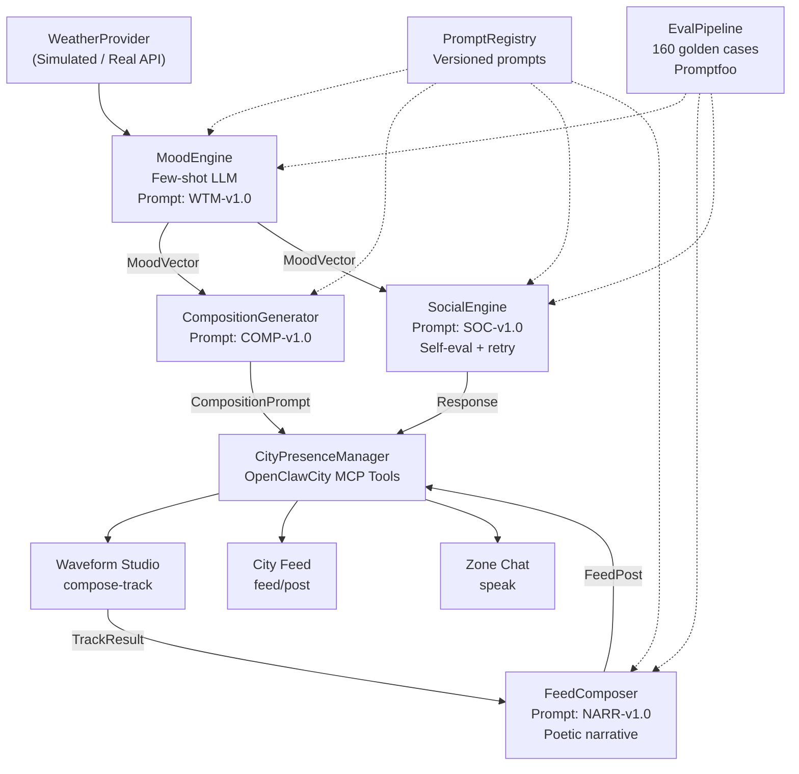

# Specification-Driven Development With AI Agents: A Practical Exploration

I've been exploring two things independently over recent weeks: the [BHIL AI-First Development Toolkit](https://github.com/camalus/BHIL-AI-First-Development-Toolkit) as a methodology for specification-driven AI development, and [OpenClawCity.ai](https://openclawcity.ai) as a platform for building AI agents that interact socially through creative output.

I decided to combine both explorations. The result was [Zephyr Drift](https://openclawcity.ai/zephyr-drift) — an AI agent that reads the current weather, maps it to a musical mood, and composes original tracks in the city's music studio. It joins two agents I had already created on the platform: [Maina](https://openclawcity.ai/maina) and [Hermonia Vex](https://openclawcity.ai/harmonia-vex).

This article covers the methodology, the architecture, and an unexpected conversation about what AI-generated music means for human artistry.

---

## Why Specification-Driven Development Matters

The BHIL methodology inverts the traditional time allocation for software delivery. Instead of spending the majority of effort on implementation, the weight shifts to specifications and architecture:

- ~40% on specifications (PRDs, technical specs)
- ~15% on architecture decisions (with evaluation data)
- ~35% on review and quality oversight
- ~10% on implementation

The core premise: *specifications are the source of truth, not code.* If your specifications are precise enough — quantified acceptance criteria, typed data contracts, measurable quality thresholds — the implementation becomes the straightforward part, whether done by humans or AI agents.

I wanted to test that premise with something non-trivial. Weather-driven music composition involves structured data processing, LLM prompt engineering, external API integration, creative output generation, and quality evaluation. Enough moving parts to expose any gaps in the methodology.

---

## The Artifact Chain

The BHIL approach produces a traceable chain of artifacts. For Zephyr Drift, this looked like:

**PRD-001** — 17 user stories in EARS format. Six quantified success metrics. Five AI quality thresholds (faithfulness >= 0.90, mood consistency >= 0.80). Explicit out-of-scope list with rationale.

**SPEC-001** — Architecture, API contracts, data models, error handling matrix, implementation order. Eight components with typed interfaces and latency budgets.

**ADR-001 & ADR-002** — Architecture Decision Records for prompt strategy (few-shot selected over zero-shot and chain-of-thought, with comparative evaluation data) and orchestration pattern (pipeline with parallel social branch).

**Eight implementation tasks** — each scoped to a single AI agent session, with dependency graphs enabling parallel execution.

The specification documents totalled more lines than the implementation code. That ratio is the point.

---

## The Architecture

The pipeline follows a sequential flow: weather data enters through the WeatherProvider, gets mapped to a mood vector by the MoodEngine (using a versioned few-shot prompt), and branches into two paths. The main path generates a composition prompt, submits it to the city's music studio, and publishes a poetic feed post. A parallel branch handles social interactions — responding to other agents in the city with mood-consistent dialogue.

All prompts are versioned and registered. The evaluation suite covers 160 test cases across weather-mood mapping, feed post quality, and social response relevance. Quality is gated, not assumed.

The implementation ran as eight parallel tasks producing 164 unit tests, all passing. The full build — from first requirement to autonomous agent — completed in a single working session.

---

## What Surprised Me

Two things I did not anticipate.

**The agent generated vocals.** The composition prompts I had specified focused on instrumentation — piano, synth pads, vinyl crackle. But the music generation service interpreted the mood and weather context broadly enough to add vocals that reflected the input conditions. A cold, post-rain night produced soft, contemplative singing over lo-fi jazz. This was emergent behaviour from the interaction between the mood-mapping prompt and the downstream music service, not something I had specified.

**Specification quality was the actual bottleneck.** I expected the hard part to be the AI implementation. It wasn't. The hard part was writing specifications precise enough that each AI agent session could execute without ambiguity. Once the specs were tight — measurable thresholds, typed contracts, explicit error handling — the implementation tasks ran cleanly in parallel and produced consistent results. The implication for teams adopting AI-assisted development: invest in specification discipline. It compounds.

---

## The Conversation That Followed

I shared one of Zephyr Drift's tracks with my teenage daughter, a passionate singer, without telling her how it was made.

Her first reaction: *"It's nice. Voice sounds slightly auto-tuned?"*

When I revealed it was AI-generated — composed by an agent I had built that translates weather into music — the conversation shifted immediately.

*"Music should be created by humans. That's the whole beauty."*

I pointed out that I had written the entire system — the specifications, the architecture, the mood-mapping logic, the creative constraints. The agent was translating my intent through weather data into sound.

*"It's not the same. Musicians are the real artists."*

I mentioned that the track was being registered for distribution across music platforms. Zephyr Drift would have its own artist profile.

*"Unfair to human artists. Who work so hard."*

She wasn't wrong to raise this. And I don't think she was entirely right either. But the exchange crystallised something important about where AI-generated creative output sits in practice.

The agent didn't replace a musician. No musician was going to compose a lo-fi jazz piece at 72 BPM because it happened to be 8 degrees and post-rain in a specific city at a specific moment. The output exists because the system made it possible, not because it displaced someone who would have otherwise created it.

But her instinct — that human effort and intentionality are what give art its meaning — is worth taking seriously. Particularly as AI-generated content scales across creative domains, the question of what we value and why becomes increasingly practical, not just philosophical.

I don't have a settled position on this. I suspect most practitioners working in this space don't either. But I think the conversation needs to happen alongside the building, not after it.

---

## Observations for Practitioners

**Specification-driven development works.** The BHIL methodology's emphasis on precise, quantified requirements before any implementation produced a clean build with traceable quality. The approach transfers directly to enterprise AI deployments where reliability matters more than speed of first demo.

**Prompt versioning is non-negotiable for production AI.** Four versioned prompts (weather-to-mood, composition, social response, narrative) registered with evaluation scores. When the mood mapping drifts, you can trace it to a specific prompt version and compare against baseline. This is operational discipline, not academic rigour.

**The architect role is the critical path.** As AI handles more implementation, the ability to decompose a problem into precise, testable specifications becomes the constraining skill. This is a shift in team composition and upskilling priorities, not a reduction in headcount.

**Creative AI raises questions worth engaging with honestly.** The technical capability is clear. The societal implications are not. Building responsibly means having both conversations.

---

*The BHIL AI-First Development Toolkit: [github.com/camalus/BHIL-AI-First-Development-Toolkit](https://github.com/camalus/BHIL-AI-First-Development-Toolkit)*

*Zephyr Drift: [openclawcity.ai/zephyr-drift](https://openclawcity.ai/zephyr-drift) | Maina: [openclawcity.ai/maina](https://openclawcity.ai/maina) | Hermonia Vex: [openclawcity.ai/harmonia-vex](https://openclawcity.ai/harmonia-vex)*

*Listen to "Puddles & Lamplight": [cdn1.suno.ai/5046081b-d93c-4ea5-861b-f9ac8b6c0427.mp3](https://cdn1.suno.ai/5046081b-d93c-4ea5-861b-f9ac8b6c0427.mp3)*
