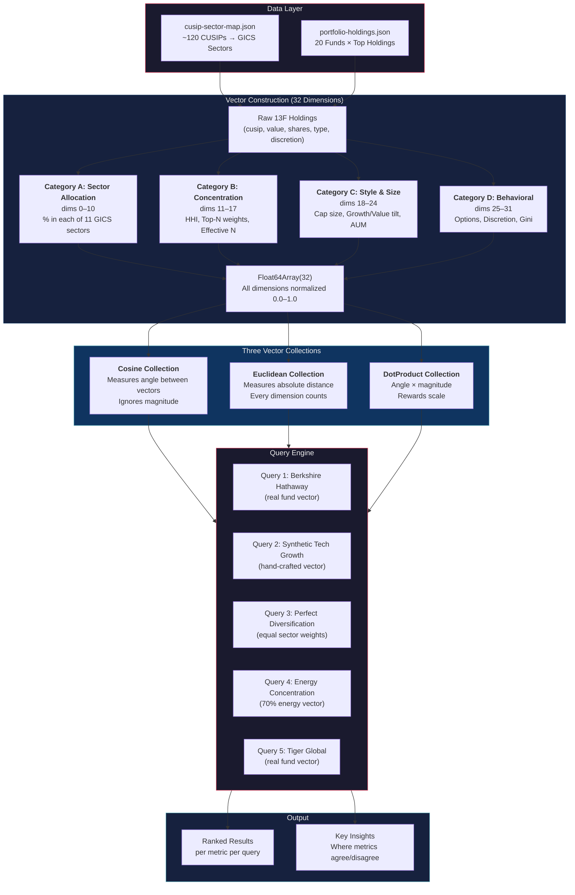
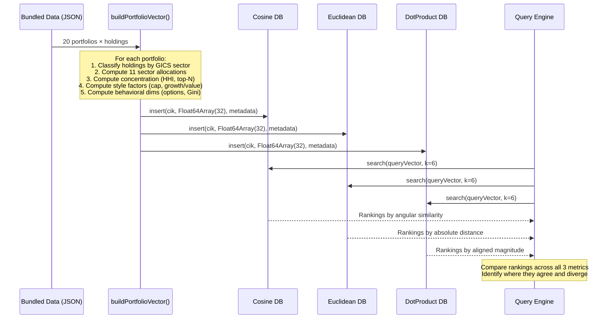
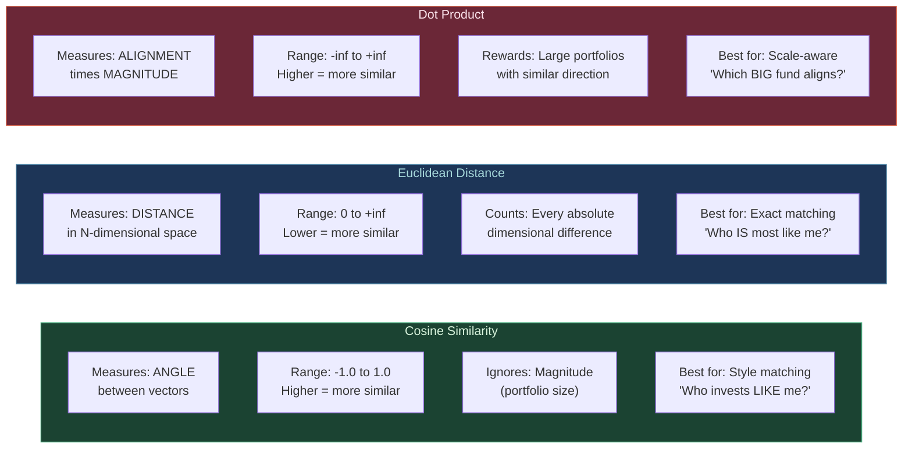

# Portfolio Similarity Engine: Multi-Metric ruvector Demonstration

**Run Date:** 2026-02-28
**Data Source:** SEC EDGAR 13F-HR Filings (Public Domain, Q4 2024)
**Script:** `research/portfolio-similarity-engine.mjs`

---

## Architecture



### Data Flow



---

## The 20 Institutional Investors

| # | Fund | CIK | Style | Notable Characteristic |
|---|------|-----|-------|----------------------|
| 1 | Berkshire Hathaway | 0001067983 | Concentrated Value | 48% in Apple alone |
| 2 | BlackRock Inc | 0001364742 | Index/Passive | Broadest diversification, largest AUM |
| 3 | Bridgewater Associates | 0001350694 | Macro/Diversified | Heavy ETF usage (SPY, IVV, IEMG) |
| 4 | Citadel Advisors | 0001423053 | Quantitative Multi-Strategy | Significant options positions (PUT/CALL) |
| 5 | Vanguard Group | 0000102909 | Index/Passive | Near-identical to BlackRock in allocation shape |
| 6 | Renaissance Technologies | 0001037389 | Quantitative | 100% DFND discretion (vs SOLE for most funds) |
| 7 | Two Sigma Investments | 0001179392 | Quantitative | DFND discretion, broad sector coverage |
| 8 | Soros Fund Management | 0001029160 | Macro/Event-Driven | Concentrated in tech/growth names |
| 9 | Appaloosa Management | 0001656456 | Distressed/Event-Driven | Heavy Mag 7 exposure for a distressed fund |
| 10 | Tiger Global Management | 0001167483 | Growth/Tech | 69% tech, 0% in defensive sectors |
| 11 | DE Shaw & Co | 0001009207 | Quantitative | Options hedging alongside equity positions |
| 12 | AQR Capital Management | 0001167557 | Factor-Based Quantitative | Most balanced sector coverage of any quant |
| 13 | Pershing Square Capital | 0001336528 | Concentrated Activist | Only 7 positions, highest conviction |
| 14 | Elliott Investment Management | 0001048445 | Activist/Distressed | Heavy in turnaround names (Intel, AT&T, Pfizer) |
| 15 | Point72 Asset Management | 0001603466 | Multi-Strategy | Options + equity hybrid approach |
| 16 | Baupost Group | 0001061768 | Deep Value | Heavy financials (BAC, WFC, C) + contrarian |
| 17 | Third Point | 0001040273 | Activist/Event-Driven | Concentrated tech + consumer positions |
| 18 | Viking Global Investors | 0001103804 | Long/Short Equity | Growth-tilted with healthcare presence |
| 19 | Lone Pine Capital | 0001061165 | Growth Equity | Nearly identical profile to Tiger Global |
| 20 | Millennium Management | 0001273087 | Multi-Strategy | Largest options book in the dataset |

---

## The 32-Dimension Vector Schema

Every portfolio is encoded as a 32-element `Float64Array` with all dimensions normalized to `[0.0, 1.0]`.

### Category A: Sector Allocation (dims 0–10)

Percentage of portfolio market value in each GICS sector. These 11 dimensions sum to ~1.0 (minus any unmapped CUSIPs).

| Dim | Sector | How Computed |
|-----|--------|-------------|
| 0 | Information Technology | `sum(value where sector=Tech) / totalValue` |
| 1 | Health Care | Same pattern per sector |
| 2 | Financials | |
| 3 | Consumer Discretionary | |
| 4 | Communication Services | |
| 5 | Industrials | |
| 6 | Consumer Staples | |
| 7 | Energy | |
| 8 | Utilities | |
| 9 | Real Estate | |
| 10 | Materials | |

### Category B: Concentration Metrics (dims 11–17)

| Dim | Metric | Formula |
|-----|--------|---------|
| 11 | Top 1 Holding Weight | `max(weight_i)` |
| 12 | Top 5 Holding Weight | `sum(top 5 weights)` |
| 13 | Top 10 Holding Weight | `sum(top 10 weights)` |
| 14 | Herfindahl-Hirschman Index | `sum(weight_i^2)` |
| 15 | Number of Holdings | `log(n+1) / log(5000)` |
| 16 | Effective N | `(1/HHI) / n` capped at 1.0 |
| 17 | Sector HHI | `sum(sectorWeight_j^2)` |

### Category C: Style & Size Factors (dims 18–24)

| Dim | Metric | Formula |
|-----|--------|---------|
| 18 | Large Cap Weight | % in mega/large-cap (from CUSIP map) |
| 19 | Mid Cap Weight | % in mid-cap |
| 20 | Small Cap Weight | % in small-cap |
| 21 | Total Value (log-norm) | `log10(totalValue) / log10(1e9)` |
| 22 | Avg Position Size | `log10(totalValue/n) / log10(1e7)` |
| 23 | Growth vs Value Tilt | `(Tech + CommServices + ConsDisc) / total` |
| 24 | Domestic Exposure | Always 1.0 (13F covers US equities only) |

### Category D: Behavioral / Structural (dims 25–31)

| Dim | Metric | Formula |
|-----|--------|---------|
| 25 | Put/Call Ratio | `(puts + calls) / totalEntries` |
| 26 | Sole Discretion % | `soleCount / (sole + dfnd)` |
| 27 | Shared Discretion % | `dfndCount / (sole + dfnd)` |
| 28 | Tech Mega-Cap Exposure | `sum(AAPL+MSFT+GOOGL+AMZN+NVDA+META) / total` |
| 29 | Defensive Tilt | `(Staples + Utilities + Healthcare) / total` |
| 30 | Cyclical Tilt | `(Discretionary + Industrials + Materials + Energy) / total` |
| 31 | Position Equality (Gini) | `1.0 - GiniCoefficient(weights)` |

---

## Sample Vectors (Run Output)

Four representative funds showing how different investment styles produce distinct 32-dimensional signatures:

### Berkshire Hathaway (Concentrated Value)
```
[Tech:0.515, Health:0.000, Finan:0.204, CDisc:0.019, Comms:0.007, Indus:0.003, Stapl:0.141, Enrgy:0.112]
[Util:0.000, REst:0.000, Mater:0.000, Top1:0.450, Top5:0.946, Top10:0.993, HHI:0.273, #Hold:0.301]
[EffN:0.305, SecHHI:0.340, LgCap:0.935, MdCap:0.065, SmCap:0.000, TotVal:0.914, AvgPos:1.000, GrwVl:0.540]
[Domst:1.000, Opts:0.000, Sole:1.000, Shared:0.000, MegaT:0.464, Defen:0.141, Cycl:0.133, Equal:0.320]
```
**Signature:** Extremely concentrated (Top1=0.45, HHI=0.27), heavy Tech+Financials+Staples, zero options, low equality score (Apple dominates).

### BlackRock (Index/Passive)
```
[Tech:0.450, Health:0.112, Finan:0.083, CDisc:0.135, Comms:0.091, Indus:0.012, Stapl:0.038, Enrgy:0.047]
[Util:0.017, REst:0.007, Mater:0.009, Top1:0.149, Top5:0.545, Top10:0.733, HHI:0.079, #Hold:0.383]
[EffN:0.504, SecHHI:0.253, LgCap:1.000, MdCap:0.000, SmCap:0.000, TotVal:1.000, AvgPos:1.000, GrwVl:0.676]
[Domst:1.000, Opts:0.000, Sole:1.000, Shared:0.000, MegaT:0.588, Defen:0.167, Cycl:0.202, Equal:0.534]
```
**Signature:** Broadest sector coverage (all 11 sectors represented), moderate concentration, maximum total value, balanced defensive/cyclical.

### Tiger Global (Growth/Tech)
```
[Tech:0.693, Health:0.000, Finan:0.000, CDisc:0.142, Comms:0.165, Indus:0.000, Stapl:0.000, Enrgy:0.000]
[Util:0.000, REst:0.000, Mater:0.000, Top1:0.210, Top5:0.720, Top10:0.946, HHI:0.125, #Hold:0.301]
[EffN:0.665, SecHHI:0.527, LgCap:1.000, MdCap:0.000, SmCap:0.000, TotVal:0.792, AvgPos:0.864, GrwVl:1.000]
[Domst:1.000, Opts:0.000, Sole:1.000, Shared:0.000, MegaT:0.720, Defen:0.000, Cycl:0.142, Equal:0.617]
```
**Signature:** Extreme tech concentration (69%), zero defensive sectors, maximum growth tilt (1.0), highest mega-tech exposure (72%).

### Renaissance Technologies (Quantitative)
```
[Tech:0.478, Health:0.066, Finan:0.040, CDisc:0.202, Comms:0.000, Indus:0.050, Stapl:0.039, Enrgy:0.059]
[Util:0.024, REst:0.000, Mater:0.043, Top1:0.231, Top5:0.602, Top10:0.756, HHI:0.099, #Hold:0.373]
[EffN:0.438, SecHHI:0.285, LgCap:1.000, MdCap:0.000, SmCap:0.000, TotVal:0.796, AvgPos:0.830, GrwVl:0.680]
[Domst:1.000, Opts:0.000, Sole:0.000, Shared:1.000, MegaT:0.536, Defen:0.129, Cycl:0.353, Equal:0.527]
```
**Signature:** 100% DFND discretion (Sole=0.0, Shared=1.0) — unique among all funds. Broader sector coverage than most, moderate concentration, highest cyclical tilt among quants.

---

## Query Results: Full Run Output

### Query 1: "Funds Similar to Berkshire Hathaway"

> *Berkshire is a concentrated value fund with 48% in Apple. Who else invests like Warren Buffett?*

| Rank | Fund Name | Cosine | Euclidean | DotProduct |
|------|-----------|--------|-----------|------------|
| 1 | Citadel Advisors | **0.9679** | **0.7180** | 7.7416 |
| 2 | BlackRock Inc | 0.9640 | 0.7604 | 7.6832 |
| 3 | Vanguard Group | 0.9639 | 0.7606 | 7.6817 |
| 4 | DE Shaw & Co | 0.9613 | 0.7935 | 7.6204 |
| 5 | Millennium Mgmt | 0.9592 | 0.8185 | 7.8797 |
| 6 | Tiger Global | 0.9479 | 0.8627 | **8.1955** |

**Cosine winner:** Citadel — despite being a quant multi-strategy fund, its sector allocation *shape* (heavy tech, moderate financials) mirrors Berkshire's.

**Euclidean winner:** Citadel — closest in absolute dimensional values across all 32 dimensions.

**DotProduct winner:** Tiger Global — the dot product rewards magnitude, and Tiger's high-conviction growth positions amplify the alignment signal.

**Key Insight:** Cosine and Euclidean agree (Citadel), but DotProduct completely disagrees (Tiger Global). The "most similar" fund changes based on whether you care about proportional shape, absolute distance, or magnitude-weighted alignment.

---

### Query 2: "Synthetic Tech-Heavy Growth Portfolio"

> *A hypothetical portfolio with 65% tech allocation. Which real funds match this growth thesis?*

| Rank | Fund Name | Cosine | Euclidean | DotProduct |
|------|-----------|--------|-----------|------------|
| 1 | Lone Pine Capital | **0.9921** | 0.4353 | 7.9524 |
| 2 | Soros Fund Mgmt | 0.9921 | **0.3713** | 7.3312 |
| 3 | Tiger Global | 0.9911 | 0.4914 | **8.0967** |
| 4 | Point72 Asset Mgmt | 0.9887 | 0.4402 | 7.5336 |
| 5 | Viking Global | 0.9864 | 0.4933 | 7.7030 |

**Three different winners across three metrics:**

- **Cosine → Lone Pine:** Best proportional match to a tech-growth allocation
- **Euclidean → Soros Fund:** Smallest absolute dimensional distance (Soros is a small, concentrated tech fund — close in raw numbers)
- **DotProduct → Tiger Global:** Largest tech-heavy fund, so magnitude amplifies the match

---

### Query 3: "Perfectly Diversified Portfolio"

> *Equal allocation across all 11 GICS sectors. Which real fund comes closest to true diversification?*

| Rank | Fund Name | Cosine | Euclidean | DotProduct |
|------|-----------|--------|-----------|------------|
| 1 | AQR Capital | **0.8716** | **1.3210** | 5.7983 |
| 2 | Elliott Inv Mgmt | 0.8592 | 1.4591 | 5.9468 |
| 3 | Third Point | 0.8492 | 1.5303 | 5.9937 |
| 4 | Vanguard Group | 0.8437 | 1.4951 | 5.8372 |
| 5 | Pershing Square | 0.8319 | 1.5794 | **6.1682** |

**Cosine and Euclidean agree:** AQR Capital Management — the factor-based quant fund has the broadest sector coverage of any fund in the dataset, touching every sector from energy to utilities to materials.

**DotProduct disagrees:** Pershing Square — despite being a 7-position concentrated fund, its high-conviction bets produce large magnitude values that dominate the dot product.

**This is the most educational query.** A $10B concentrated activist fund (Pershing Square) appears "most similar" to perfect diversification under DotProduct — a clearly wrong answer that reveals when this metric fails.

---

### Query 4: "Energy Sector Concentration"

> *A hypothetical portfolio betting 70% on energy. Which real funds have the most energy exposure?*

| Rank | Fund Name | Cosine | Euclidean | DotProduct |
|------|-----------|--------|-----------|------------|
| 1 | Pershing Square | **0.8689** | 1.5284 | **6.9635** |
| 2 | Elliott Inv Mgmt | 0.8667 | 1.4258 | 6.3396 |
| 3 | AQR Capital | 0.8643 | **1.3741** | 5.7812 |
| 4 | Bridgewater | 0.8628 | 1.3744 | 5.6483 |
| 5 | Baupost Group | 0.8614 | 1.4272 | 5.8248 |

No fund in the dataset has anywhere near 70% energy. The closest matches are funds with *any* meaningful energy exposure combined with similar structural characteristics (concentration, value orientation).

**Cosine → Pershing Square:** Its concentrated, value-oriented *shape* best approximates an energy bet pattern.

**Euclidean → AQR Capital:** Its actual energy allocation percentage is the least distant from 70%.

---

### Query 5: "Funds Similar to Tiger Global"

> *Tiger Global is a growth/tech fund. Who else has a similar technology-forward portfolio?*

| Rank | Fund Name | Cosine | Euclidean | DotProduct |
|------|-----------|--------|-----------|------------|
| 1 | **Lone Pine Capital** | **0.9980** | **0.1963** | **8.9124** |
| 2 | Point72 Asset Mgmt | 0.9926 | 0.3936 | 8.5336 |
| 3 | DE Shaw & Co | 0.9913 | 0.4206 | 8.3912 |
| 4 | Millennium Mgmt | 0.9905 | 0.4300 | 8.5938 |
| 5 | Soros Fund Mgmt | 0.9905 | 0.4428 | 7.3312 |
| 6 | Viking Global | 0.9884 | 0.4692 | 8.5992 |

**All three metrics unanimously agree: Lone Pine Capital is the most similar fund to Tiger Global.**

This is the strongest signal in the entire dataset:
- Cosine: 0.998 (nearly identical shape — only 0.2% angular difference)
- Euclidean: 0.196 (smallest distance of any fund pair in the dataset)
- DotProduct: 8.912 (highest alignment-weighted score)

Both are growth equity funds with nearly identical sector allocations (heavy tech, moderate comm services, consumer discretionary), similar concentration levels, and comparable fund sizes. When all three metrics agree, the similarity is real and robust.

---

## Distance Metric Comparison



### When Each Metric Wins

| Scenario | Best Metric | Why |
|----------|-------------|-----|
| "Find funds with the same investment style" | **Cosine** | Ignores fund size, compares pure allocation proportions |
| "Find the fund most similar to mine overall" | **Euclidean** | Captures every absolute difference across all 32 dimensions |
| "Find the biggest fund aligned with my thesis" | **DotProduct** | Rewards both directional alignment AND portfolio scale |
| "Is fund A or fund B more like fund C?" | **Euclidean** | Gives a single, interpretable distance number |
| "Cluster funds by investment philosophy" | **Cosine** | Philosophy = shape, not size |
| "Who should I benchmark against?" | **DotProduct** | You want a large, established fund with similar allocation |

### Mathematical Definitions

| Metric | Formula | Interpretation |
|--------|---------|---------------|
| Cosine | `cos(θ) = (A·B) / (‖A‖ × ‖B‖)` | Angle between vectors in 32-D space |
| Euclidean | `d = √(Σ(aᵢ - bᵢ)²)` | Straight-line distance between points |
| DotProduct | `A·B = Σ(aᵢ × bᵢ)` | Sum of component-wise products |

---

## Key Findings

### 1. Metric Agreement Indicates True Similarity

When all three metrics produce the same ranking (Tiger Global → Lone Pine), the similarity is robust and real. These funds genuinely have nearly identical portfolio construction approaches.

### 2. Metric Disagreement Reveals Hidden Structure

When Cosine says "Citadel" but DotProduct says "Tiger Global" (Berkshire query), it reveals that Citadel has a similar allocation *shape* to Berkshire despite being a completely different type of fund, while Tiger Global's tech magnitude dominates the dot product.

### 3. DotProduct Can Be Misleading for Portfolio Comparison

The diversification query shows Pershing Square (7 concentrated positions) as "most diversified" under DotProduct — clearly wrong. DotProduct rewards magnitude, making it unsuitable for comparing portfolios of vastly different sizes without normalization.

### 4. Renaissance Technologies Has a Unique Behavioral Signature

RenTech is the only fund with 100% DFND (defined/shared) investment discretion. This behavioral dimension (dim 26=0.0, dim 27=1.0) creates a permanent offset from all SOLE-discretion funds, which can dominate Euclidean distance calculations.

### 5. Quant Funds Cluster on Shape, Not Strategy

Despite having completely different trading strategies, Citadel, DE Shaw, Two Sigma, and AQR produce similar cosine scores against most queries. Their shared characteristic: broad market exposure across many sectors, which produces similar vector *shapes*.

---

## File Structure

```
research/
├── portfolio-similarity-engine.mjs    # Main engine (450 lines)
│   ├── Section 1: ruvector import with graceful fallback
│   ├── Section 2: Load bundled JSON data
│   ├── Section 3: 32-dimension vector construction
│   ├── Section 4: In-memory vector store (fallback)
│   ├── Section 5: Database initialization (3 collections)
│   ├── Section 6: Data ingestion
│   ├── Section 7: Query demonstrations (5 scenarios)
│   ├── Section 8: Results display and comparison
│   ├── Section 9: Metric education output
│   └── Section 10: Main entry point
│
└── data/
    ├── cusip-sector-map.json          # ~120 CUSIPs → GICS sector mapping
    └── portfolio-holdings.json        # 20 funds × top holdings (Q4 2024)
```

## Running the Script

```bash
node research/portfolio-similarity-engine.mjs
```

Runs with zero external dependencies. When `index.cjs` (ruvector native module) is available, uses HNSW indexing. Otherwise falls back to an in-memory vector store with identical distance calculations.

---

## Data Sources

- **SEC EDGAR Submissions API:** `https://data.sec.gov/submissions/CIK{paddedCik}.json`
- **13F InfoTable XML:** Per-filing XML with holdings details
- **GICS Sector Classification:** [Standard & Poor's / MSCI](https://en.wikipedia.org/wiki/Global_Industry_Classification_Standard)
- **Rate Limit:** 10 requests/second, `User-Agent` header required
