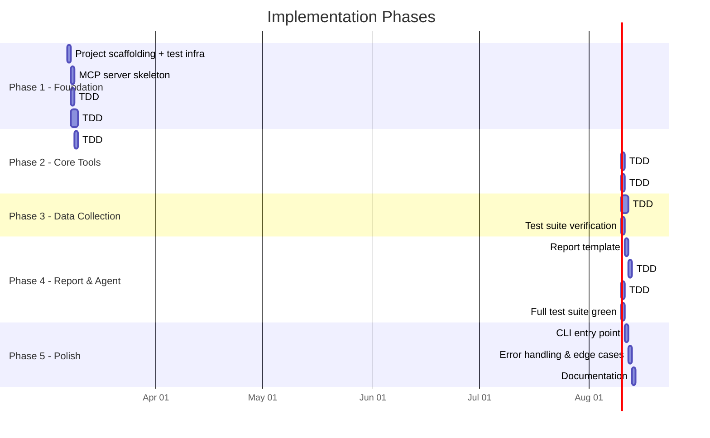
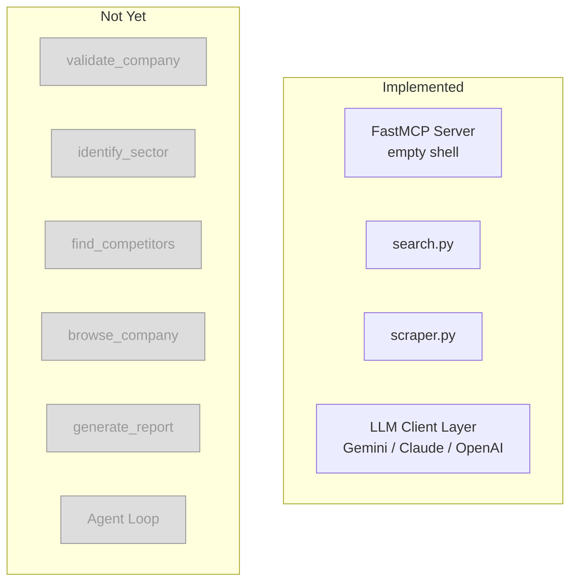
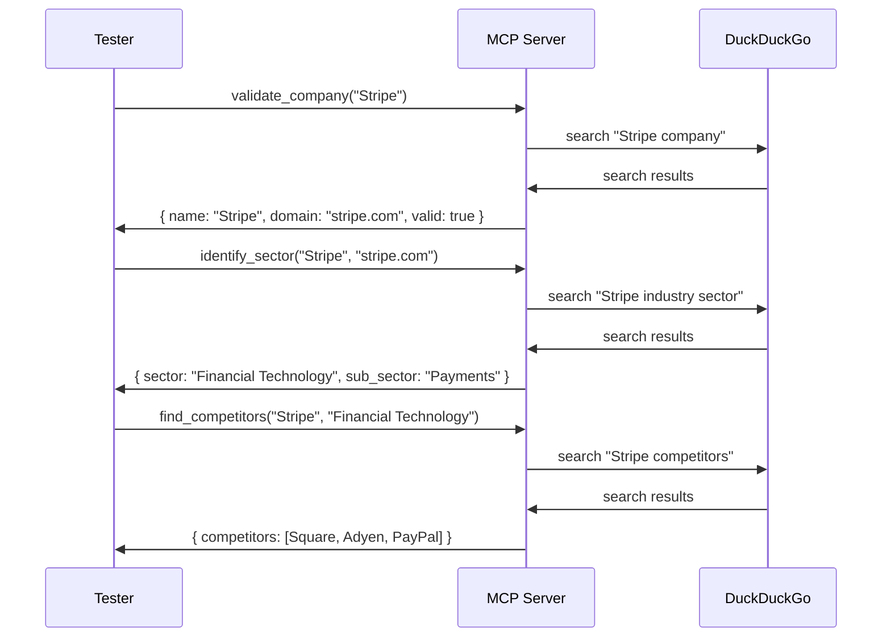
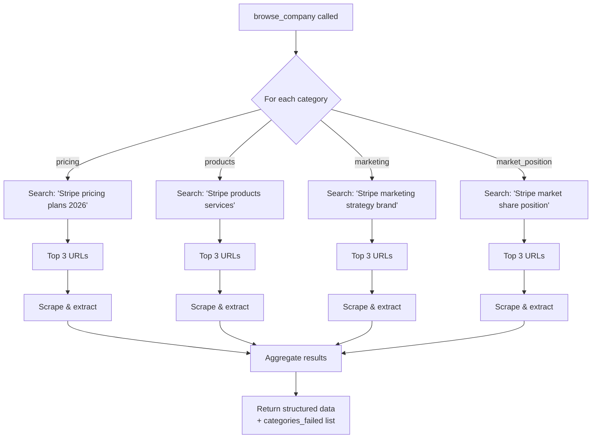
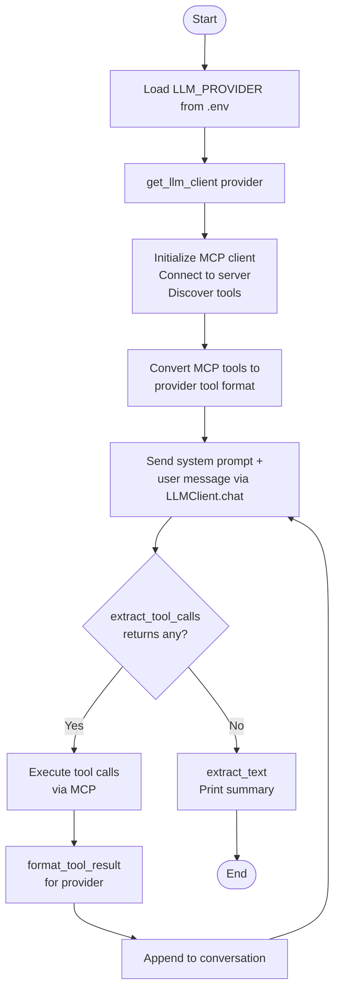
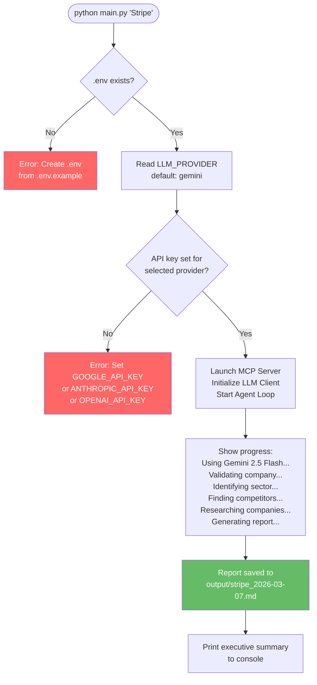
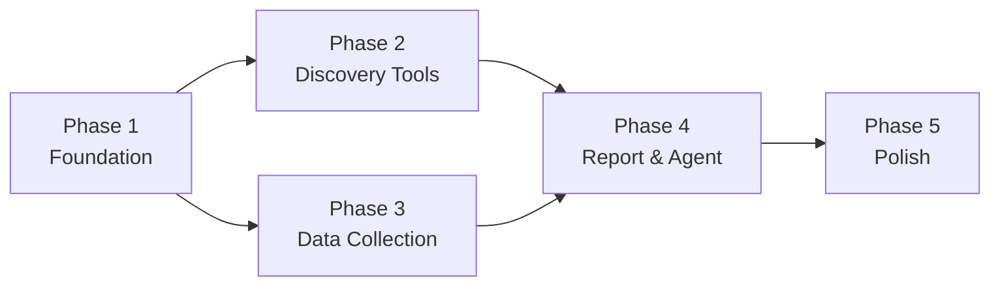

# Implementation Plan

## Competitive Analysis AI Agent

**Version**: 1.0
**Date**: 2026-03-07

---

## Overview

This plan breaks the implementation into 5 phases, each delivering a working increment. Each phase builds on the previous one and can be validated independently.

### Testing Approach: London School TDD

Every phase follows **test-first development**. For each module:
1. **Red**: Write a failing test with mocked collaborators
2. **Green**: Implement the minimum code to pass
3. **Refactor**: Clean up while keeping tests green

All external services (DuckDuckGo, LLM APIs, web scraping, file I/O) are mocked. **No API keys are needed to run `pytest`.** Integration tests requiring real API keys are marked with `@pytest.mark.integration` and skipped by default.



---

## Phase 1: Project Foundation

**Goal**: Set up the project structure, dependencies, and shared utilities.

### Tasks

| # | Task | Output |
|---|------|--------|
| # | Task | Output |
|---|------|--------|
| 1.1 | Create project directory structure (including `agent/llm/`, `tests/`) | All folders and `__init__.py` files |
| 1.2 | Create `requirements.txt` with all dependencies (multi-provider + testing) | `requirements.txt` |
| 1.3 | Create `.env.example` with multi-provider configuration template | `.env.example` |
| 1.4 | Create `pytest.ini` and `tests/conftest.py` with shared fixtures | Test infrastructure ready |
| 1.5 | **TDD**: Write tests for `search.py` (mock `DDGS`) → implement `server/utils/search.py` with rate limiting | `test_search.py` passes, `web_search()` works |
| 1.6 | **TDD**: Write tests for `scraper.py` (mock `httpx`, `trafilatura`) → implement `server/utils/scraper.py` | `test_scraper.py` passes, `scrape_url()` works |
| 1.7 | Create bare FastMCP server in `server/mcp_server.py` | Server starts and responds to tool listing |
| 1.8 | Implement `agent/llm/base.py` — abstract `LLMClient` interface | Base class with `chat()`, `extract_tool_calls()`, `extract_text()`, `format_tool_result()` |
| 1.9 | **TDD**: Write tests for `GeminiClient` (mock `google.genai`) → implement `agent/llm/gemini_client.py` | `test_llm_clients.py::TestGemini*` passes |
| 1.10 | **TDD**: Write tests for `AnthropicClient` (mock `anthropic`) → implement `agent/llm/anthropic_client.py` | `test_llm_clients.py::TestAnthropic*` passes |
| 1.11 | **TDD**: Write tests for `OpenAIClient` (mock `openai`) → implement `agent/llm/openai_client.py` | `test_llm_clients.py::TestOpenAI*` passes |
| 1.12 | **TDD**: Write tests for provider factory → implement `agent/llm/__init__.py` | `test_llm_clients.py::TestFactory*` passes |

### Deliverables
- Project runs `pip install -r requirements.txt` without errors
- `pytest` runs and all Phase 1 tests pass (mocked, no API keys)
- `search.py` rate limiter prevents burst requests
- `scraper.py` handles timeouts and extraction failures
- MCP server starts and lists zero tools
- `get_llm_client("gemini")` returns a working `GeminiClient` instance
- Each LLM client correctly converts MCP tool schemas to provider format

### Architecture at end of Phase 1



---

## Phase 2: Core Discovery Tools

**Goal**: Implement the first three tools that form the discovery pipeline.

### Coding Standards for All MCP Tools

Every MCP tool function **must** include a clear, descriptive Python docstring. FastMCP uses these docstrings as the tool descriptions that Claude sees during tool discovery, so they directly affect how well the agent calls the tools.

Each docstring must include:
- **Summary line**: What the tool does in one sentence
- **Args section**: Each parameter with its type and purpose
- **Returns section**: Structure of the returned data
- **Raises/Notes section** (where applicable): Error conditions or important behavior

Example:

```python
@mcp.tool()
async def validate_company(company_name: str) -> dict:
    """Validate that a company is a real, identifiable entity.

    Searches the web for the given company name and confirms it exists.
    Returns the canonical company name, official domain, and a brief description.

    Args:
        company_name: The name of the company to validate (free-text input).

    Returns:
        A dict with keys:
            - name (str): Canonical company name.
            - domain (str): Official website domain.
            - description (str): Brief company description.
            - valid (bool): Whether the company was found.
            - suggestions (list[str]): Alternative names if validation failed.
    """
```

This standard applies to **all tools across Phase 2, 3, and 4**.

### Tasks

| # | Task | Output |
|---|------|--------|
| 2.1 | **TDD**: Write tests for `validate_company` (mock `web_search`) → implement tool | `test_validate_company.py` passes |
| 2.2 | **TDD**: Write tests for `identify_sector` (mock `web_search`) → implement tool | `test_identify_sector.py` passes |
| 2.3 | **TDD**: Write tests for `find_competitors` (mock `web_search`) → implement tool | `test_find_competitors.py` passes |
| 2.4 | Register all three tools in `mcp_server.py` | MCP server lists 3 tools with correct descriptions |
| 2.5 | Verify `pytest` — all Phase 1 + Phase 2 tests pass | Full green test suite |

### Validation Criteria
- `validate_company("OpenAI")` returns `{ name: "OpenAI", domain: "openai.com", valid: true, ... }`
- `validate_company("xyznotacompany123")` returns `{ valid: false, suggestions: [...] }`
- `identify_sector("OpenAI", "openai.com")` returns a sector containing "artificial intelligence" or similar
- `find_competitors("OpenAI", "Artificial Intelligence")` returns 3 relevant competitors (e.g., Anthropic, Google DeepMind, etc.)

### Tool interaction flow



---

## Phase 3: Data Collection Tool

**Goal**: Implement the `browse_company` tool — the most complex tool in the system.

### Tasks

| # | Task | Output |
|---|------|--------|
| 3.1 | **TDD**: Write tests for category-specific query builders → implement | `test_browse_company.py::TestQueryBuilders` passes |
| 3.2 | **TDD**: Write tests for content extraction pipeline (mock `web_search`, `scrape_url`) → implement | `test_browse_company.py::TestExtraction` passes |
| 3.3 | **TDD**: Write tests for partial failure handling → implement `browse_company` tool | `test_browse_company.py::TestPartialFailure` passes |
| 3.4 | Register tool in `mcp_server.py` | MCP server lists 4 tools |
| 3.5 | Verify `pytest` — all Phase 1-3 tests pass | Full green test suite |

### Validation Criteria
- `browse_company("Stripe", "stripe.com", ["pricing", "products"])` returns structured data for both categories
- If one category fails, the tool still returns data for the other categories with a `categories_failed` field
- Scraping respects the 15-second timeout per request

### Data collection detail



---

## Phase 4: Report Generation & Agent Loop

**Goal**: Complete the tool set with report generation and build the agent client.

### Tasks

| # | Task | Output |
|---|------|--------|
| 4.1 | Create Jinja2 report template in `templates/report.md.j2` | Template with placeholders for all report sections |
| 4.2 | **TDD**: Write tests for `generate_report` (mock file I/O) → implement tool | `test_generate_report.py` passes |
| 4.3 | Register tool in `mcp_server.py` | MCP server lists 5 tools |
| 4.4 | **TDD**: Write tests for agent loop (mock `LLMClient` + MCP) → implement `agent/client.py` | `test_agent_loop.py` passes |
| 4.5 | Write system prompt for the agent | System prompt that guides the LLM through the analysis workflow (works across all providers) |
| 4.6 | Verify `pytest` — all Phase 1-4 tests pass | Full green test suite |
| 4.7 | `@pytest.mark.integration`: End-to-end test with Gemini (requires `GOOGLE_API_KEY`) | Complete report generated (opt-in) |

### Report template structure

```
# Competitive Analysis Report: {company_name}

## Executive Summary
## Company Overview
## Competitor Profiles
### Competitor 1 / 2 / 3
## Comparison Matrix
| Category | Target | Comp 1 | Comp 2 | Comp 3 |
## SWOT Analysis
## Recommendations
## Data Sources & Timestamps
```

### Agent loop design



### Validation Criteria
- Report template renders correctly with sample data
- Agent successfully orchestrates all 5 tools in sequence using Gemini (default)
- Full end-to-end run produces a markdown report in `output/`
- Agent handles tool errors gracefully (continues with partial data)
- Switching `LLM_PROVIDER=anthropic` or `LLM_PROVIDER=openai` produces equivalent results

---

## Phase 5: CLI, Error Handling & Polish

**Goal**: Make the system production-ready with a proper CLI, robust error handling, and documentation.

### Tasks

| # | Task | Output |
|---|------|--------|
| 5.1 | Implement CLI entry point in `main.py` | `python main.py "Company Name"` works |
| 5.2 | Add comprehensive error handling across all tools | Retries, timeouts, graceful degradation |
| 5.3 | Add logging throughout the pipeline | Structured logging with configurable verbosity |
| 5.4 | Create `.gitignore` | Excludes `.env`, `output/`, `__pycache__/`, etc. |
| 5.5 | Create `README.md` with setup and usage instructions | Complete setup guide |
| 5.6 | Full end-to-end validation with 3 different companies | Verified reports for diverse company types |

### CLI flow



### Validation Criteria
- `python main.py "Stripe"` produces a complete report
- `python main.py "xyzfakecompany"` exits gracefully with a helpful message
- Running without `.env` shows a clear setup instruction
- README is sufficient for a new developer to set up and run the project

---

## Phase Summary

| Phase | Focus | Key Output | Estimated Effort |
|-------|-------|-----------|-----------------|
| **1** | Foundation | Project structure, utilities, LLM clients, test infra | Medium |
| **2** | Discovery Tools | `validate_company`, `identify_sector`, `find_competitors` + tests | Medium |
| **3** | Data Collection | `browse_company` with scraping pipeline + tests | Medium-Large |
| **4** | Report & Agent | `generate_report`, agent loop, full test suite | Medium |
| **5** | Polish | CLI, error handling, logging, documentation | Small-Medium |

---

## Dependency Graph



Phase 2 and Phase 3 can be worked on in parallel since they both depend only on Phase 1. Phase 4 requires both Phase 2 and Phase 3 to be complete.
