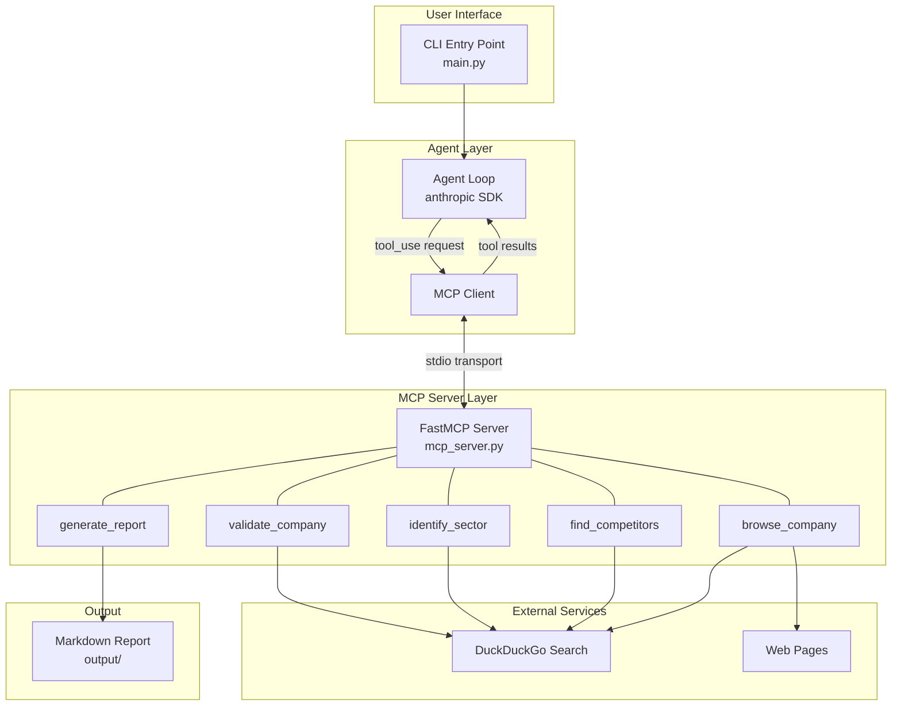
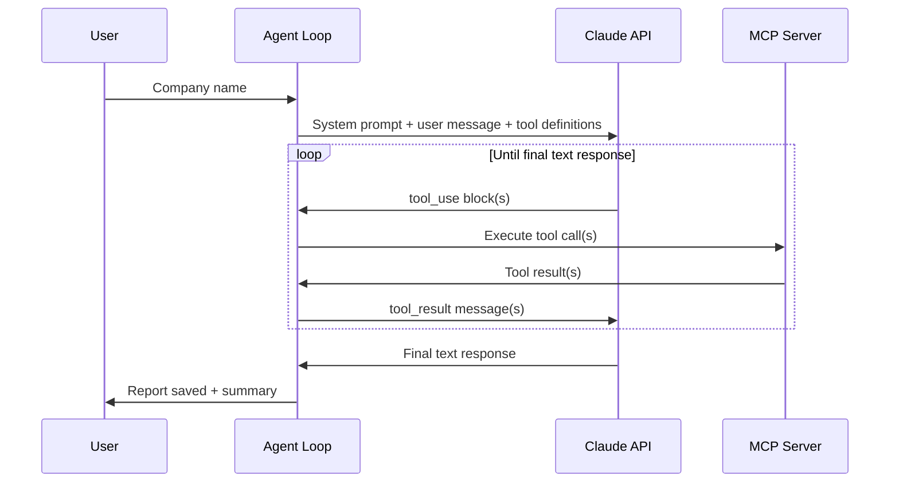
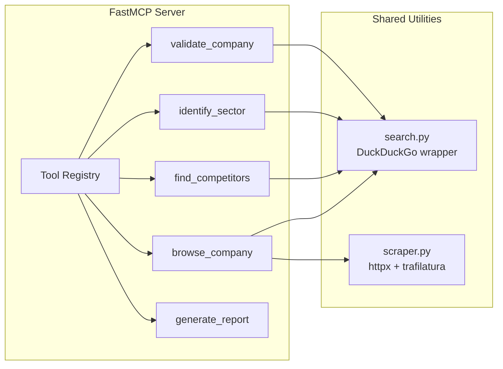
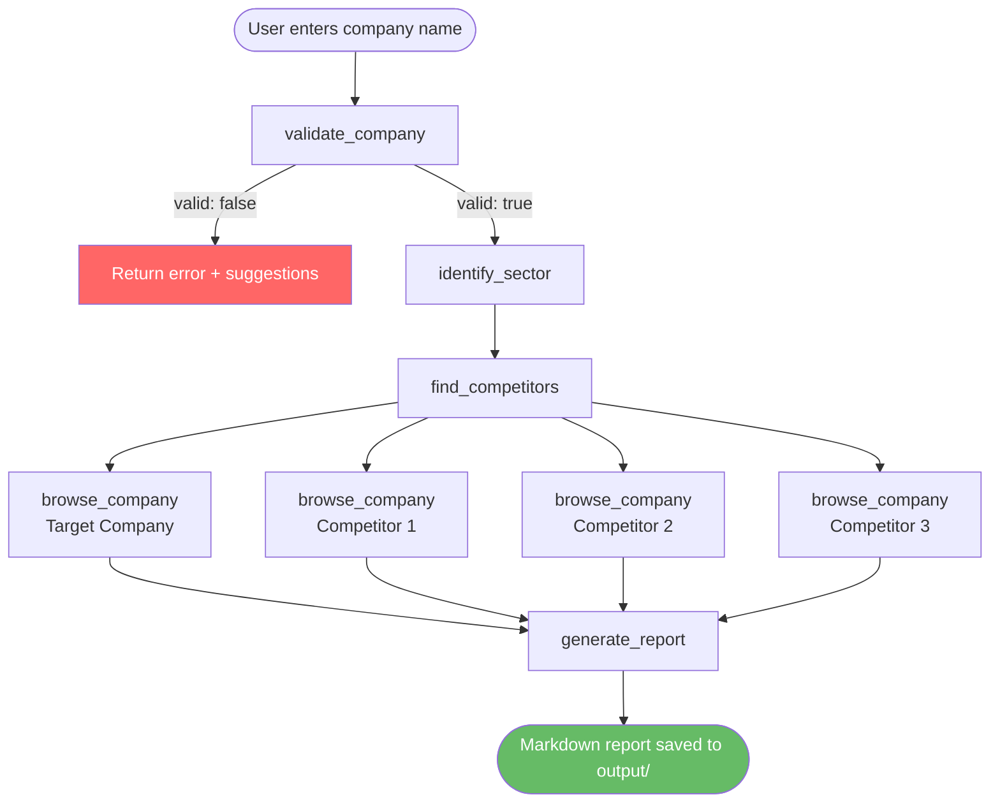
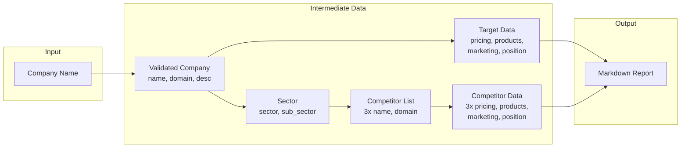
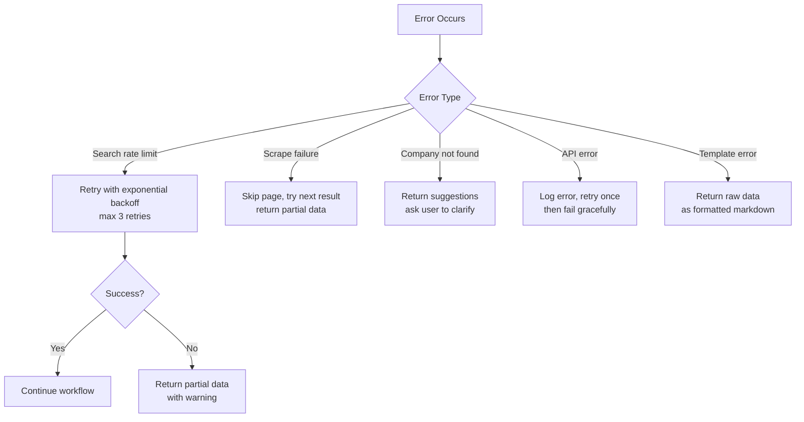

# Technical Architecture & Design Document

## Competitive Analysis AI Agent

**Version**: 1.0
**Date**: 2026-03-07
**Status**: Draft

---

## 1. System Overview

The Competitive Analysis AI Agent is a single-agent system that automates competitor research. Given a company name, it validates the entity, identifies the sector, finds top competitors, collects strategic data, and generates a comparative markdown report.

The system uses a **Model Context Protocol (MCP)** client-server architecture where Claude acts as the orchestrating agent and tools are exposed via a FastMCP server.

---

## 2. High-Level Architecture



---

## 3. Component Design

### 3.1 Agent Loop (Client)

The agent loop is a lightweight orchestrator using the Anthropic SDK's native tool-use capability. No agent framework is needed.



**Key design decisions:**
- Direct `anthropic` SDK usage — no framework overhead
- Tools are discovered from the MCP server at startup
- The agent loop handles retries and error propagation
- Conversation history is maintained in-memory for the duration of one run

### 3.2 MCP Server

The FastMCP server exposes five tools over **stdio transport** (launched as a subprocess by the agent).



### 3.3 Tool Specifications

#### `validate_company`

| Attribute | Detail |
|-----------|--------|
| **Input** | `company_name: str` |
| **Output** | `{ name: str, domain: str, description: str, valid: bool }` |
| **Logic** | Search DuckDuckGo for the company name. Extract canonical name, official domain, and brief description from top results. Return `valid: false` with suggestions if ambiguous or not found. |
| **Error handling** | Returns structured error with suggestions for misspelled or ambiguous names. |

#### `identify_sector`

| Attribute | Detail |
|-----------|--------|
| **Input** | `company_name: str, domain: str` |
| **Output** | `{ sector: str, sub_sector: str, sic_code: str, description: str }` |
| **Logic** | Search for `"{company_name}" industry sector` and extract sector classification from results. |

#### `find_competitors`

| Attribute | Detail |
|-----------|--------|
| **Input** | `company_name: str, sector: str` |
| **Output** | `{ competitors: [{ name: str, domain: str, description: str }] }` (top 3) |
| **Logic** | Search for `"{company_name}" competitors` and `top companies in {sector}`. Cross-reference results. Rank by relevance. |

#### `browse_company`

| Attribute | Detail |
|-----------|--------|
| **Input** | `company_name: str, domain: str, categories: list[str]` |
| **Output** | `{ pricing: str, products: str, marketing: str, market_position: str }` |
| **Logic** | For each category, search DuckDuckGo and scrape the top 2-3 relevant pages using `httpx` + `trafilatura`. Aggregate extracted content. |
| **Error handling** | Returns partial data if some categories fail. Includes a `categories_failed: list` field. |

#### `generate_report`

| Attribute | Detail |
|-----------|--------|
| **Input** | `target_company: dict, competitors: list[dict], analysis_data: dict` |
| **Output** | `{ report_path: str, summary: str }` |
| **Logic** | Renders a Jinja2 markdown template with all collected data. Saves to `output/` with timestamped filename. Returns the file path and a 3-line executive summary. |

---

## 4. Agent Workflow



> **Note:** The four `browse_company` calls are sequential in the single-agent design. The agent decides the order. A future multi-agent version could parallelize these.

---

## 5. Data Flow



---

## 6. Technology Stack

| Layer | Technology | Justification |
|-------|-----------|---------------|
| **Language** | Python 3.11+ | Ecosystem support, async capabilities |
| **Agent LLM** | Claude (via `anthropic` SDK) | Native tool-use, MCP originator |
| **MCP Server** | `fastmcp` | Lightweight, Pythonic MCP server |
| **Web Search** | `duckduckgo-search` | Free, no API key, sufficient for this use case |
| **Web Scraping** | `httpx` + `trafilatura` | Async HTTP + excellent content extraction |
| **Templating** | `jinja2` | Report template rendering |
| **Config** | `python-dotenv` | Environment-based API key management |

### Dependencies

```
anthropic>=0.39.0
fastmcp>=2.0.0
duckduckgo-search>=7.0.0
httpx>=0.27.0
trafilatura>=1.12.0
jinja2>=3.1.0
python-dotenv>=1.0.0
```

---

## 7. Project Structure

```
vibe-cast/
├── input/
│   ├── PRD.md
│   ├── technical-architecture.md
│   └── implementation-plan.md
├── server/
│   ├── __init__.py
│   ├── mcp_server.py              # FastMCP server entry point
│   ├── tools/
│   │   ├── __init__.py
│   │   ├── validate_company.py    # Company validation tool
│   │   ├── identify_sector.py     # Sector identification tool
│   │   ├── find_competitors.py    # Competitor discovery tool
│   │   ├── browse_company.py      # Web research tool
│   │   └── generate_report.py     # Report generation tool
│   └── utils/
│       ├── __init__.py
│       ├── search.py              # DuckDuckGo search wrapper
│       └── scraper.py             # httpx + trafilatura scraper
├── agent/
│   ├── __init__.py
│   └── client.py                  # Agent loop + MCP client
├── templates/
│   └── report.md.j2              # Jinja2 report template
├── output/                        # Generated reports
├── main.py                        # CLI entry point
├── requirements.txt
├── .env.example
└── README.md
```

---

## 8. Error Handling Strategy



**Principles:**
- **Graceful degradation**: A missing data category should not block report generation. The report is generated with available data and notes what is missing.
- **Structured errors**: All tools return errors in a consistent `{ error: str, suggestions: list }` format.
- **Timeouts**: HTTP requests timeout at 15 seconds. Total tool execution timeout at 60 seconds.

---

## 9. Configuration

```env
# .env.example
ANTHROPIC_API_KEY=sk-ant-...         # Required: Claude API key
CLAUDE_MODEL=claude-sonnet-4-20250514       # Optional: model override (default: claude-sonnet-4-20250514)
REQUEST_TIMEOUT=15                   # Optional: HTTP timeout in seconds
MAX_SEARCH_RESULTS=5                 # Optional: DuckDuckGo results per query
OUTPUT_DIR=output                    # Optional: report output directory
```

---

## 10. Security Considerations

| Concern | Mitigation |
|---------|-----------|
| API key exposure | Stored in `.env`, never committed (`.gitignore`) |
| Prompt injection via scraped content | Tool results are structured data; raw HTML is never passed to the LLM |
| Rate limiting | Exponential backoff on all external calls |
| Data privacy | No user data is stored beyond the current session; reports are local files |

---

## 11. Limitations & Trade-offs

- **Single-agent sequential execution**: The four `browse_company` calls run sequentially. This is simpler but slower than a parallel approach.
- **No persistent storage**: Each run is independent. No caching of previous results.
- **Public data only**: The system relies entirely on publicly available information via web search.
- **DuckDuckGo rate limits**: High-frequency usage may hit rate limits. Mitigated by backoff but not eliminated.
- **Content extraction quality**: `trafilatura` is excellent but not perfect — some pages with heavy JavaScript rendering may yield poor results.
