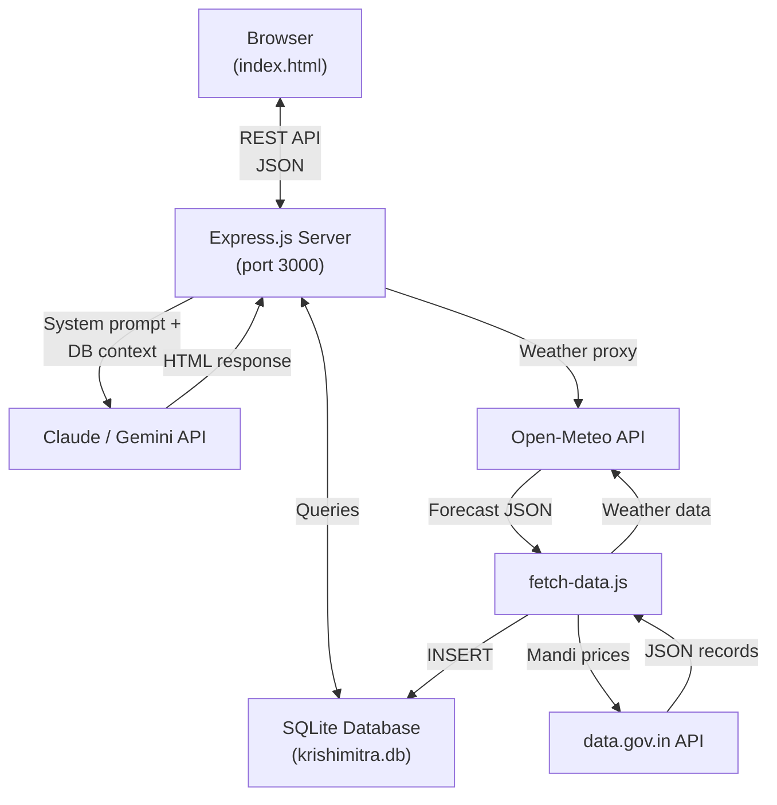
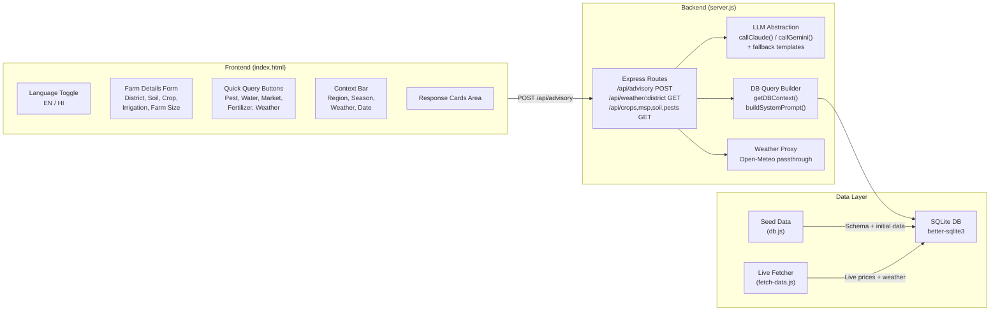
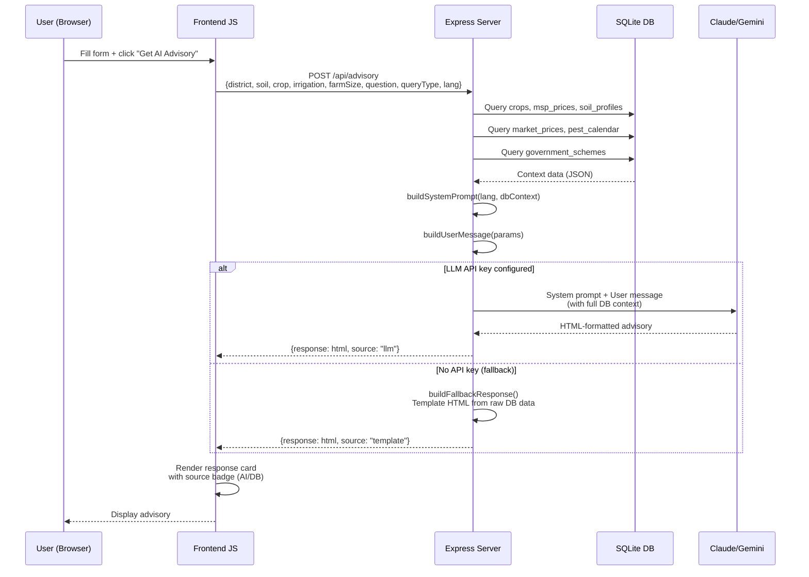
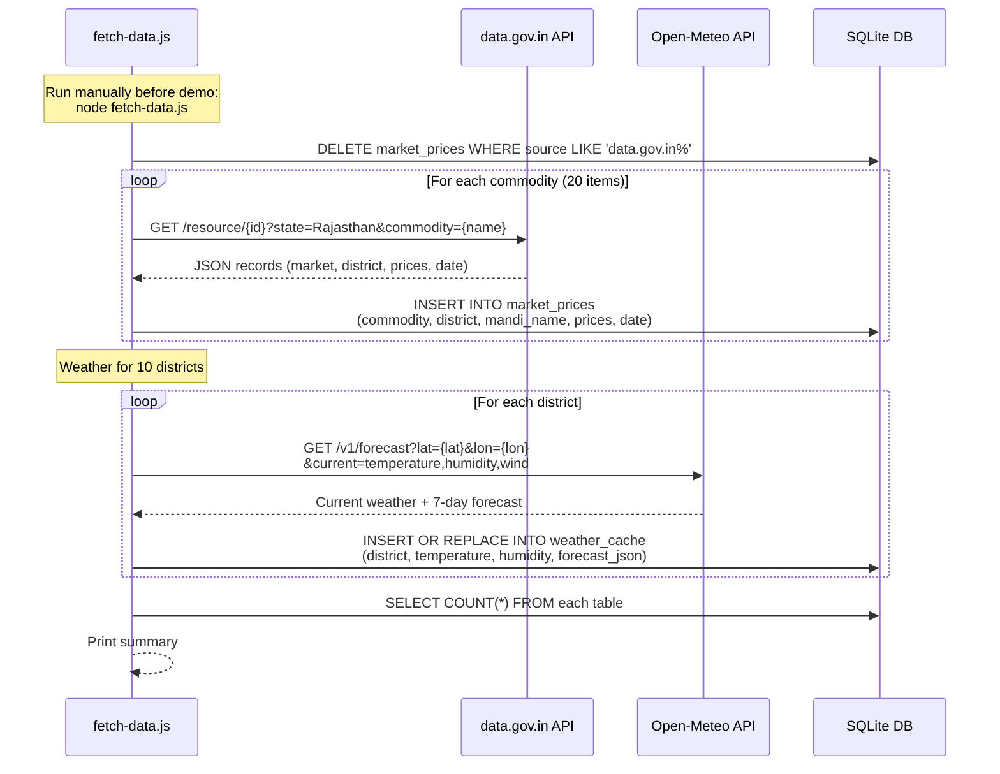
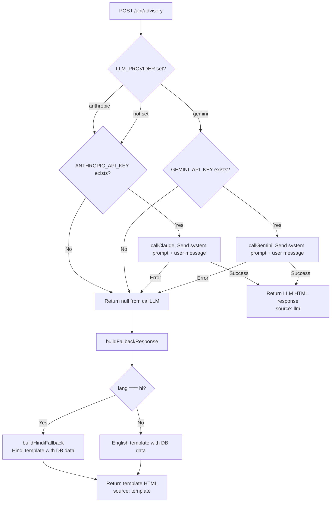
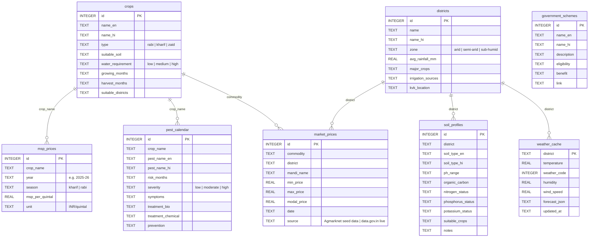

# KrishiMitra Architecture

Detailed architecture documentation for the KrishiMitra agricultural advisory application.

---

## High-Level Architecture



---

## Component Architecture



---

## Data Flow Diagrams

### 1. Advisory Request Flow



### 2. Data Fetch Flow



### 3. Fallback Flow



---

## Database Schema



---

## ASCII Architecture Diagram

```
┌─────────────────────────────────────────┐
│  Browser (HTML/CSS/JS)                  │
│  ├─ Language Toggle (EN/HI)             │
│  ├─ Farm Details Form                   │
│  ├─ Quick Query Buttons                 │
│  └─ Response Cards Area                 │
└──────────────┬──────────────────────────┘
               │ REST API (JSON)
┌──────────────▼──────────────────────────┐
│  Express.js Server (port 3000)          │
│  ├─ /api/advisory (POST)                │
│  │   ├─ Query SQLite for context        │
│  │   ├─ Call Claude/Gemini LLM          │
│  │   └─ Fallback: template from DB      │
│  ├─ /api/weather/:district (GET)        │
│  │   └─ Proxy to Open-Meteo            │
│  └─ /api/crops,msp,soil,pests (GET)    │
└──────────────┬──────────────────────────┘
               │
┌──────────────▼──────────────────────────┐
│  SQLite Database (krishimitra.db)       │
│  ├─ crops (15) + msp_prices (25)        │
│  ├─ soil_profiles (10) + districts (10) │
│  ├─ pest_calendar (12) + schemes (6)    │
│  ├─ market_prices (38 live+seed)        │
│  └─ weather_cache (10 districts)        │
└─────────────────────────────────────────┘

External Data Sources:
  ├─ data.gov.in API ──→ Live mandi prices
  ├─ Open-Meteo API ──→ Real-time weather
  ├─ GoI MSP rates  ──→ Seeded MSP data
  └─ Claude/Gemini  ──→ AI advisory (optional)
```

---

## Technology Decisions

| Decision | Choice | Rationale |
|----------|--------|-----------|
| **Server framework** | Express.js | Minimal boilerplate, widely known, fast to prototype. A single `server.js` file handles all routes. |
| **Database** | SQLite (better-sqlite3) | Zero-config, no external database server needed. The entire DB is a single file (`krishimitra.db`) that can be committed or regenerated. Synchronous API via better-sqlite3 simplifies query code. |
| **Frontend** | Vanilla HTML/CSS/JS | No build step, no framework dependencies. Opens directly in a browser for offline demo. Single file keeps deployment simple for a conference demo. |
| **Dual LLM support** | Claude + Gemini | Flexibility to use whichever API key is available. The `callLLM()` abstraction makes it trivial to switch providers via a single env var. |
| **Template fallback** | DB-driven HTML templates | The app remains fully functional without any API key. Advisory responses are built directly from database records, ensuring the demo never fails due to API issues. |
| **Weather API** | Open-Meteo | Free, no API key required, reliable. Provides current conditions and 7-day forecasts. Eliminates a potential point of failure for demos. |
| **Market data** | data.gov.in (Agmarknet) | Official Government of India commodity price data. Free API with public key. Combined with seed data for reliable offline operation. |
| **Language approach** | `data-en`/`data-hi` attributes | Simple, no i18n library needed. Every visible text element carries both translations. LLM responses are controlled via the system prompt language instruction. |
| **Data fetcher** | Separate script (`fetch-data.js`) | Decoupled from the server process. Run once before a demo to populate fresh data. Uses `curl` via `child_process` to avoid HTTP library dependencies. |
| **Testing** | Playwright | Industry-standard E2E testing. Tests the full stack (frontend + server) in a real browser environment. |
