# LecturePulse - Architecture & Design Document

## 1. Overview

LecturePulse is a real-time lecture engagement platform that uses computer vision to monitor student posture, providing presenters with live analytics and students with posture feedback. Camera frames never leave the student's device -- only computed scores are transmitted.

---

## 2. High-Level System Architecture

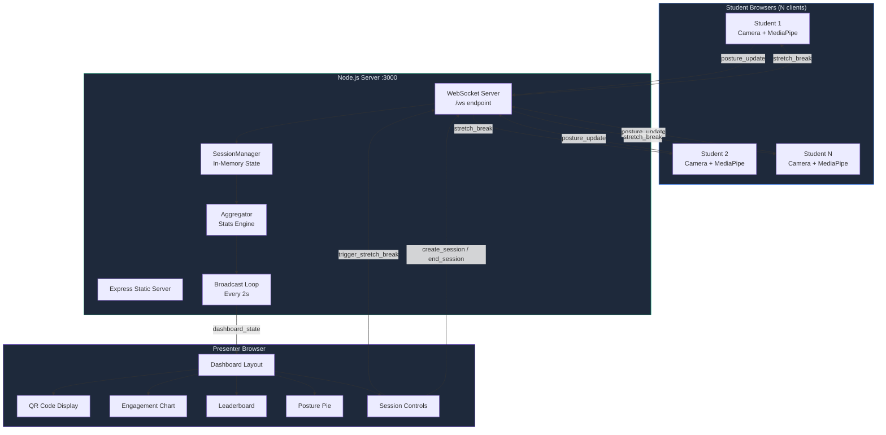

---

## 3. Technology Stack

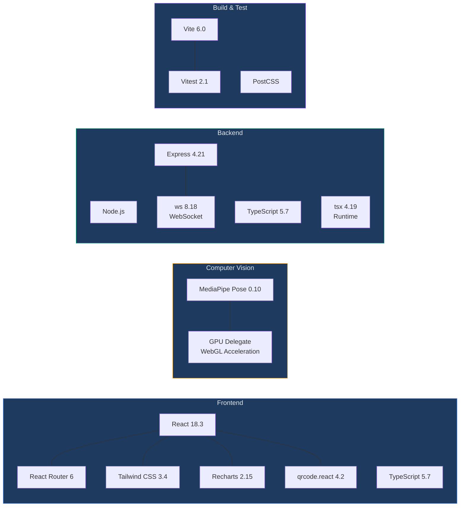

| Layer | Technology | Version | Purpose |
|-------|-----------|---------|---------|
| **UI Framework** | React | 18.3.1 | Component rendering |
| **Routing** | React Router | 6.28.0 | SPA client-side routing |
| **Styling** | Tailwind CSS | 3.4.16 | Utility-first dark-theme styling |
| **Charts** | Recharts | 2.15.0 | Line & pie chart visualizations |
| **QR Generation** | qrcode.react | 4.2.0 | SVG QR codes for session join |
| **Pose Detection** | MediaPipe Pose | 0.10.18 | On-device skeleton tracking |
| **Server** | Express | 4.21.2 | HTTP + static file serving |
| **WebSocket** | ws | 8.18.0 | Real-time bidirectional comms |
| **Language** | TypeScript | 5.7.2 | Type safety across stack |
| **Build Tool** | Vite | 6.0.3 | Dev server + production bundler |
| **Test Framework** | Vitest | 2.1.8 | Unit + component testing |

---

## 4. Frontend Architecture

### 4.1 Component Tree

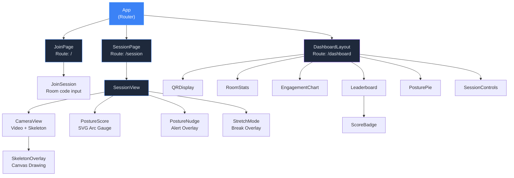

### 4.2 Hooks Architecture

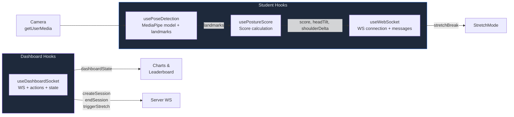

| Hook | Concern | Key State | Frequency |
|------|---------|-----------|-----------|
| `useWebSocket` | Student WS connection | `isConnected`, `stretchBreak`, `error` | On score change |
| `usePoseDetection` | MediaPipe model + detection | `landmarks`, `isLoading`, `error` | Every 3s |
| `usePostureScore` | Score from landmarks | `score`, `classification`, `isTracking` | On landmark change |
| `useDashboardSocket` | Presenter WS + actions | `dashboardState`, `roomCode`, `sessionActive` | Every 2s (receives) |

---

## 5. Backend Architecture

### 5.1 Server Components

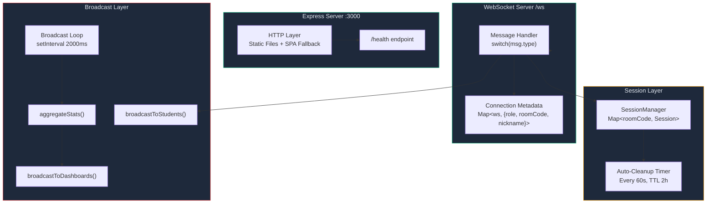

### 5.2 Session Data Model

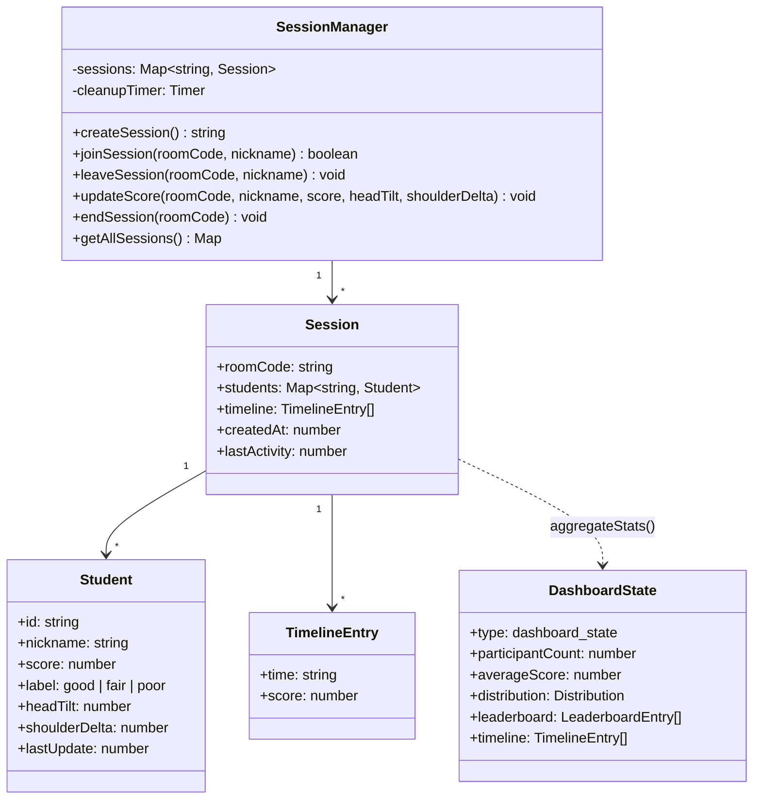

---

## 6. WebSocket Protocol

### 6.1 Message Flow Sequence

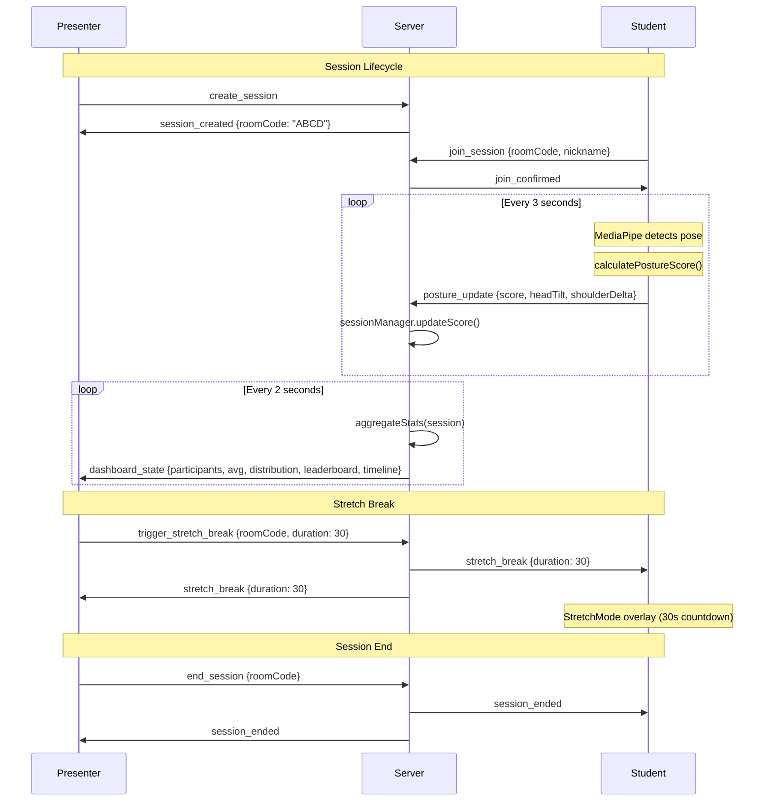

### 6.2 Message Types Reference

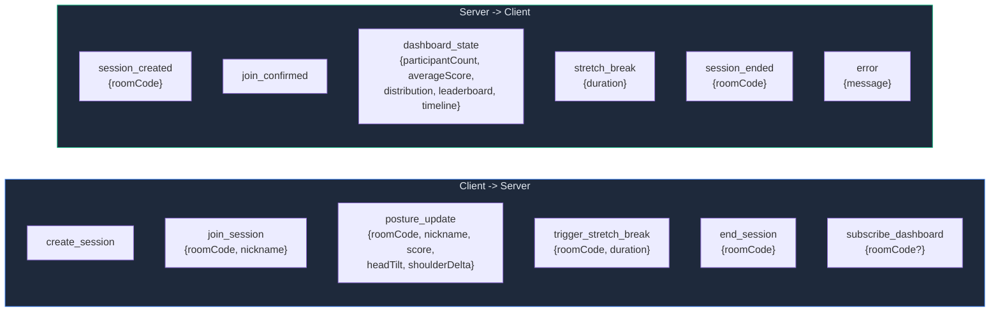

---

## 7. Posture Detection Pipeline

### 7.1 End-to-End Flow

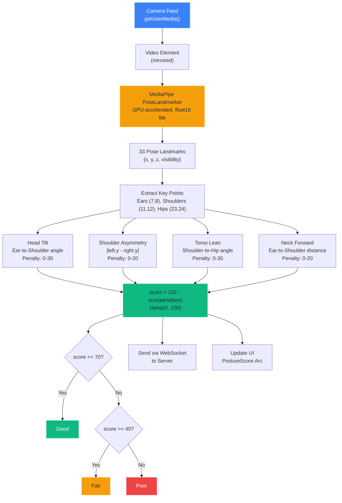

### 7.2 Landmark Indices Used

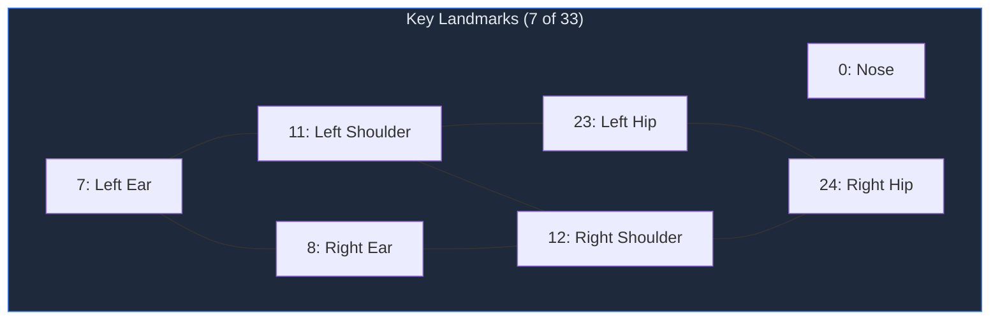

### 7.3 Scoring Thresholds

| Metric | Max Penalty | Full Penalty At |
|--------|-------------|-----------------|
| Head Tilt | 30 pts | 45 degrees |
| Shoulder Asymmetry | 20 pts | 0.1 normalized units |
| Torso Lean | 30 pts | 45 degrees |
| Neck Forward | 20 pts | 0.15 normalized units |

---

## 8. Dashboard Visualization Pipeline

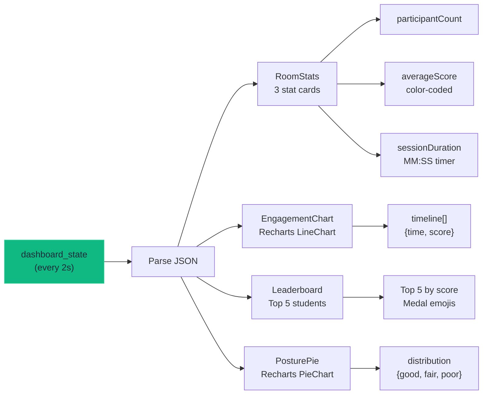

---

## 9. Directory Structure

```mermaid
graph TD
    ROOT["lecture-pulse/"]

    ROOT --> SERVER["server/"]
    SERVER --> SI["index.ts<br/>Express + WS + Broadcasting"]
    SERVER --> SS["session.ts<br/>SessionManager class"]
    SERVER --> SAG["aggregator.ts<br/>Stats computation"]

    ROOT --> SRC["src/"]
    SRC --> COMP["components/"]
    COMP --> STU["student/"]
    STU --> JS2["JoinSession.tsx"]
    STU --> CV2["CameraView.tsx"]
    STU --> PS2["PostureScore.tsx"]
    STU --> PN2["PostureNudge.tsx"]
    STU --> SM3["StretchMode.tsx"]

    COMP --> DASH["dashboard/"]
    DASH --> DL2["DashboardLayout.tsx"]
    DASH --> QR2["QRDisplay.tsx"]
    DASH --> RS2["RoomStats.tsx"]
    DASH --> EC2["EngagementChart.tsx"]
    DASH --> LB2["Leaderboard.tsx"]
    DASH --> PP2["PosturePie.tsx"]
    DASH --> SC2["SessionControls.tsx"]

    COMP --> SH["shared/"]
    SH --> SB2["ScoreBadge.tsx"]
    SH --> SO2["SkeletonOverlay.tsx"]

    SRC --> HK["hooks/"]
    HK --> H1["useWebSocket.ts"]
    HK --> H2["usePoseDetection.ts"]
    HK --> H3["usePostureScore.ts"]
    HK --> H4["useDashboardSocket.ts"]

    SRC --> LIB["lib/"]
    LIB --> L1["posture.ts"]
    LIB --> L2["nicknames.ts"]
    LIB --> L3["constants.ts"]

    SRC --> TYP["types/index.ts"]
    SRC --> APPTSX["App.tsx"]
    SRC --> MAIN["main.tsx"]

    ROOT --> TESTS["tests/"]
    ROOT --> CFG["Config Files<br/>vite, tailwind, tsconfig, etc."]

    style ROOT fill:#3b82f6,stroke:#60a5fa,color:#fff
    style SERVER fill:#10b981,stroke:#34d399,color:#1e293b
    style SRC fill:#8b5cf6,stroke:#a78bfa,color:#fff
    style COMP fill:#1e293b,stroke:#8b5cf6,color:#e2e8f0
```

---

## 10. Data Flow Summary

### 10.1 Student -> Server -> Dashboard

```mermaid
flowchart LR
    A["Student Camera<br/>3s interval"] -->|33 landmarks| B["calculatePostureScore()"]
    B -->|"score, headTilt,<br/>shoulderDelta"| C["WebSocket<br/>posture_update"]
    C -->|JSON msg| D["Server<br/>updateScore()"]
    D -->|in-memory| E["Session.students<br/>Map"]
    E -->|2s interval| F["aggregateStats()"]
    F -->|broadcast| G["Dashboard<br/>dashboard_state"]
    G --> H["Charts + Stats<br/>re-render"]

    style A fill:#3b82f6,stroke:#60a5fa,color:#fff
    style D fill:#10b981,stroke:#34d399,color:#1e293b
    style G fill:#8b5cf6,stroke:#a78bfa,color:#fff
```

### 10.2 Presenter -> Server -> Students

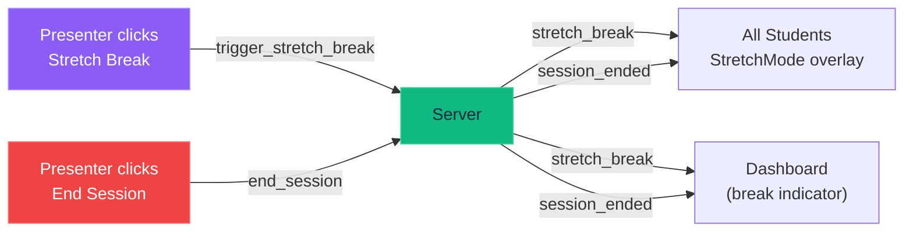

---

## 11. Key Design Decisions

| Decision | Choice | Rationale |
|----------|--------|-----------|
| **Pose processing** | Client-side (MediaPipe) | Privacy: camera frames never leave the device |
| **State management** | React hooks (no Redux) | Small app; hooks provide sufficient encapsulation |
| **Real-time transport** | WebSocket (ws library) | Low-latency bidirectional; simpler than Socket.IO |
| **Session storage** | In-memory Maps | No persistence needed; sessions are ephemeral |
| **Detection interval** | 3 seconds | Balances CPU usage vs. responsiveness |
| **Dashboard refresh** | 2 second broadcast | Smooth chart updates without overloading |
| **Scoring algorithm** | Penalty-based (100 - sum) | Intuitive: start at 100, deduct for issues |
| **Room codes** | 4-char alphanumeric (no I/O) | Easy to type on mobile, avoids ambiguous characters |
| **Nicknames** | Random adjective + animal | Anonymous by default, no student accounts needed |
| **Timeline cap** | 1800 entries (~1 hour) | Prevents unbounded memory growth |
| **Auto-cleanup** | 2-hour TTL | Prevents abandoned sessions from leaking memory |

---

## 12. Security & Privacy

- Camera frames are processed **entirely on the client** via MediaPipe WASM/WebGL
- Only **numeric scores** (0-100) and **angle metrics** transit the network
- No authentication required (by design -- low-friction classroom use)
- No persistent storage of student data
- Sessions auto-expire after 2 hours of inactivity
- HTTPS support via WebSocket protocol detection (`wss://` on secure origins)

---

## 13. Component Detail Reference

### Student Components

| Component | File | Props | Purpose |
|-----------|------|-------|---------|
| `JoinSession` | `student/JoinSession.tsx` | `onJoin(roomCode, nickname)` | 4-char room code entry, auto-nickname |
| `CameraView` | `student/CameraView.tsx` | `videoRef`, `landmarks`, `isTracking` | Video feed + skeleton overlay |
| `PostureScore` | `student/PostureScore.tsx` | `score`, `classification` | SVG arc gauge (270 degrees, color-coded) |
| `PostureNudge` | `student/PostureNudge.tsx` | `score` | Alert after 2min poor posture |
| `StretchMode` | `student/StretchMode.tsx` | `duration`, `onComplete` | Full-screen guided stretch countdown |

### Dashboard Components

| Component | File | Props | Purpose |
|-----------|------|-------|---------|
| `DashboardLayout` | `dashboard/DashboardLayout.tsx` | (none, uses hook) | 12-col grid, timer, connection status |
| `QRDisplay` | `dashboard/QRDisplay.tsx` | `url`, `roomCode` | SVG QR code + room code display |
| `RoomStats` | `dashboard/RoomStats.tsx` | `participantCount`, `averageScore`, `sessionDuration` | 3 stat cards |
| `EngagementChart` | `dashboard/EngagementChart.tsx` | `timeline` | Recharts line chart with thresholds |
| `Leaderboard` | `dashboard/Leaderboard.tsx` | `leaderboard` | Top 5 students, medal emojis |
| `PosturePie` | `dashboard/PosturePie.tsx` | `distribution` | Recharts donut chart |
| `SessionControls` | `dashboard/SessionControls.tsx` | `onCreateSession`, `onEndSession`, `onTriggerStretch`, `sessionActive` | Create / stretch / end buttons |

### Shared Components

| Component | File | Props | Purpose |
|-----------|------|-------|---------|
| `ScoreBadge` | `shared/ScoreBadge.tsx` | `score`, `size?` | Inline color-coded pill badge |
| `SkeletonOverlay` | `shared/SkeletonOverlay.tsx` | `landmarks`, `videoWidth`, `videoHeight` | Canvas pose skeleton on video |
