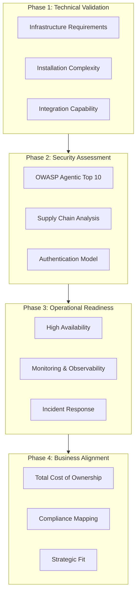
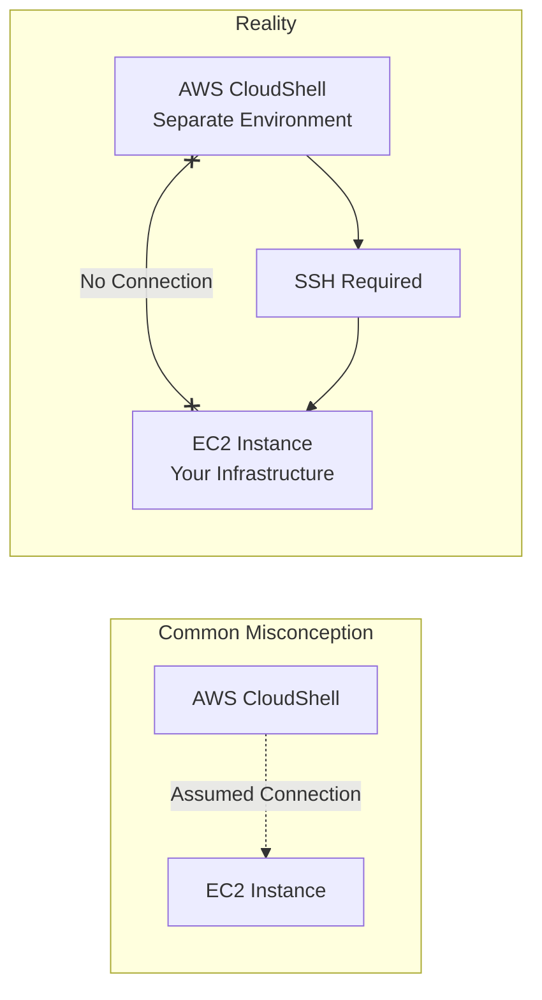
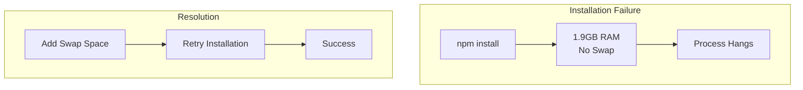
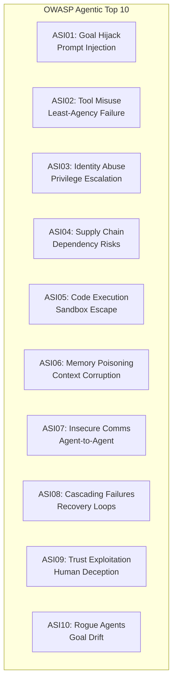
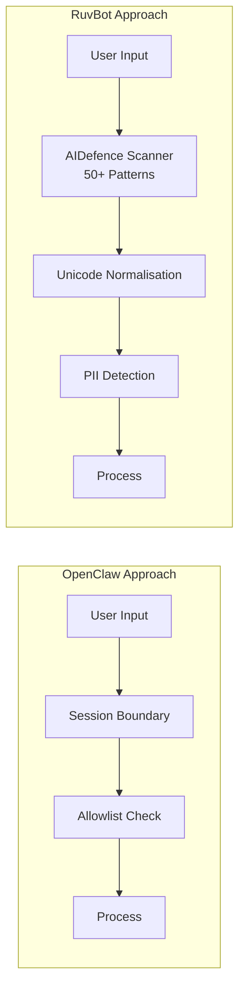
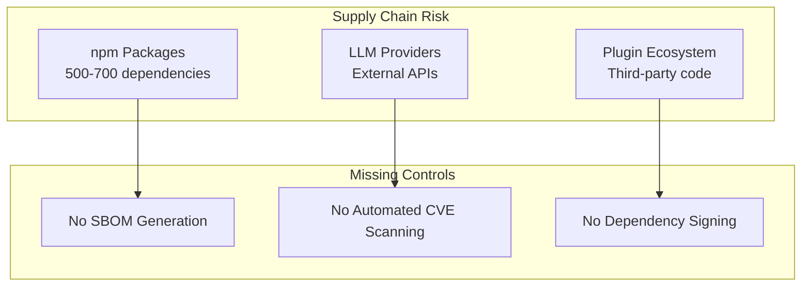
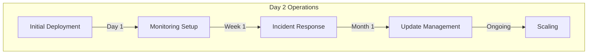
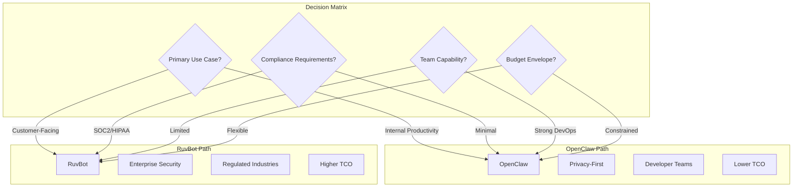
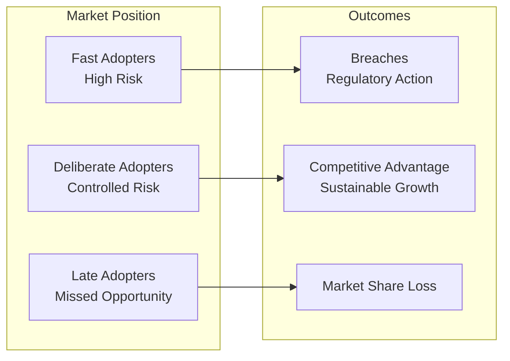

# I Spent 48 Hours Evaluating AI Agents for Enterprise Use. Here's What Every CIO Needs to Know Before 2026.

## LinkedIn Cover Post

---

**AI agents are coming to your enterprise. The question isn't IF—it's HOW SAFELY.**

I spent 48 hours hands-on with two leading AI agent platforms, deploying them on production infrastructure and assessing them against the OWASP Top 10 for Agentic Applications 2026.

What I found will change how you think about AI adoption:

✅ One platform scored 8.5/10 on enterprise security
⚠️ Both had supply chain vulnerabilities most teams would miss
🔐 The security differences could make or break your compliance posture

The full technical breakdown is in my latest article—including the evaluation framework I used, architecture diagrams, and specific recommendations for CIOs planning AI initiatives >£15M.

If you're evaluating AI agents for your organisation, I'd welcome a confidential conversation about doing it safely.

#AIAgents #CIO #DigitalTransformation #EnterpriseSecurity #OWASP #AIStrategy

---

## Full Article

### The AI Agent Imperative

Every CIO I speak with is asking the same question: *"How do we harness AI agents without creating the next headline-grabbing security breach?"*

It's a valid concern. AI agents aren't just chatbots—they're autonomous systems that can read your data, execute code, access external services, and make decisions without human intervention. The attack surface is fundamentally different from anything we've deployed before.

Last week, I decided to stop theorising and start evaluating. I took two leading AI agent platforms—**OpenClaw** and **RuvBot**—and deployed them on production AWS infrastructure. Not in a sandbox. Not with sample data. Real deployment, real security assessment, real findings.

Here's what I discovered.

---

## The Evaluation Framework

Before diving into platforms, I needed a structured approach. Too many AI evaluations focus on features and miss the risks that will matter most to your board.



This four-phase approach ensures you're not just buying technology—you're adopting capability that aligns with enterprise risk appetite.

---

## What I Evaluated

### Platform 1: OpenClaw

**Positioning**: Personal AI assistant with local-first architecture
**Target**: Privacy-conscious users and developers
**Architecture**: Gateway-based hub-and-spoke model

### Platform 2: RuvBot

**Positioning**: Enterprise-grade AI assistant with military-strength security
**Target**: Organisations requiring compliance and scale
**Architecture**: 6-layer security model with WASM sandboxing

---

## The Journey: From Theory to Production

### Day 1: The Reality of "Simple" Installation

The documentation promised 10-minute installs. Reality was different.

**Challenge 1: Environment Mismatch**

I started in AWS CloudShell, assuming it was connected to my EC2 instance. It wasn't. CloudShell is a separate, ephemeral environment—a distinction that would cost an unprepared team hours.



**Lesson for CIOs**: Your teams will make assumptions about cloud environments. Document the exact infrastructure topology before any AI deployment.

**Challenge 2: Dependency Hell**

Both platforms required Node.js 22+. My EC2 instance had Node.js 20. The upgrade process created package conflicts that broke the installation.

The fix required understanding package management at a level most enterprise teams won't have readily available:

```
sudo yum remove -y nodejs20 nodejs20-npm
curl -fsSL https://rpm.nodesource.com/setup_22.x | sudo bash -
sudo yum install -y nodejs
```

**Lesson for CIOs**: AI platforms move fast. Your infrastructure standards may be 6-12 months behind their requirements. Budget for environment modernisation.

**Challenge 3: Memory Constraints**

One platform's installation hung indefinitely. The cause? A 1.9GB RAM instance with no swap space couldn't handle npm's memory requirements.



**Lesson for CIOs**: AI workloads have different resource profiles than traditional applications. Right-size infrastructure before deployment, not after failure.

---

## The Security Assessment: OWASP Agentic Top 10

This is where the evaluation got serious. The OWASP Top 10 for Agentic Applications 2026 defines ten vulnerability categories specific to AI agents:



### Comparative Security Scores

| Vulnerability | OpenClaw | RuvBot |
|---------------|----------|--------|
| ASI01: Goal Hijack | 🟡 MEDIUM | 🟢 LOW |
| ASI02: Tool Misuse | 🟡 MEDIUM | 🟡 MEDIUM |
| ASI03: Identity Abuse | 🟢 LOW | 🟢 LOW |
| ASI04: Supply Chain | 🟡 MEDIUM | 🟡 MEDIUM |
| ASI05: Code Execution | 🟢 LOW | 🟢 LOW |
| ASI06: Memory Poisoning | 🟡 MEDIUM | 🟢 LOW |
| ASI07: Insecure Comms | 🟢 LOW | 🟢 LOW |
| ASI08: Cascading Failures | 🟡 MEDIUM | 🟡 MEDIUM |
| ASI09: Trust Exploitation | 🟢 LOW | 🟢 LOW |
| ASI10: Rogue Agents | 🟢 LOW | 🟢 LOW |
| **Overall Score** | **7.5/10** | **8.5/10** |

### The Critical Differentiator: Prompt Injection Defence

RuvBot's AIDefence module provides 50+ signature patterns for prompt injection detection with <10ms latency. OpenClaw relies on session boundaries and user allowlisting—effective but reactive.



**Lesson for CIOs**: Defence-in-depth matters more for AI than traditional applications. A single layer of protection is insufficient.

---

## The Shared Vulnerability: Supply Chain

Both platforms flagged MEDIUM risk for supply chain vulnerabilities. Here's why this matters:



Neither platform generates a Software Bill of Materials (SBOM). Neither has documented CVE scanning in their CI/CD pipeline. This is a compliance gap that will matter for regulated industries.

**Lesson for CIOs**: Assume supply chain security is YOUR responsibility until platforms mature. Budget for wrapper controls.

---

## The Hidden Cost: Operational Complexity

Getting these platforms running is one thing. Keeping them running is another.

### Operational Requirements

| Requirement | OpenClaw | RuvBot |
|-------------|----------|--------|
| Process Management | systemd required | systemd or PM2 |
| High Availability | Manual configuration | Built-in failover |
| Log Aggregation | File-based | Structured logging |
| Health Monitoring | Basic endpoints | Comprehensive /health |
| Secret Management | File-based | Environment variables |



**Lesson for CIOs**: The vendor relationship doesn't end at procurement. Factor in operational maturity and support models.

---

## The Strategic Decision Framework

After 48 hours of hands-on evaluation, here's how I'd frame the decision for a CIO:



---

## Recommendations for CIOs

### Immediate Actions (Next 30 Days)

1. **Establish an AI Agent Policy**: Define what autonomous AI can and cannot do in your environment
2. **Map Compliance Requirements**: Identify which OWASP Agentic vulnerabilities matter for your regulatory context
3. **Assess Team Readiness**: Do you have the DevSecOps capability to operate AI agents safely?

### Strategic Initiatives (Next 90 Days)

1. **Pilot with Boundaries**: Start with internal use cases where blast radius is contained
2. **Build Observability First**: You can't secure what you can't see
3. **Create Incident Playbooks**: AI failures are different—prepare for them

### Transformation Planning (6-12 Months)

1. **Integrate with Identity**: AI agents need the same IAM rigour as human users
2. **Establish Governance**: Who approves new AI capabilities? Who reviews them?
3. **Measure Value**: Connect AI initiatives to business outcomes, not just technical metrics

---

## The Bigger Picture

AI agents represent a step-change in enterprise capability. The organisations that adopt them safely will outcompete those that either:
- Rush in without security (and face breaches)
- Hold back entirely (and lose competitive ground)

The winning strategy is **deliberate adoption with appropriate controls**.



---

## Let's Talk

I help CIOs pursue growth opportunities exceeding £15M through targeted digital transformation—including safe AI adoption.

If you're evaluating AI agents for your organisation, I'd welcome a confidential discussion about:
- Applying this evaluation framework to your specific context
- Mapping AI capabilities to your strategic objectives
- Building the governance and operational foundation for sustainable AI adoption

**The conversation is confidential. The insights could be transformational.**

Connect with me or reach out directly to start the discussion.

---

*Assessment methodology based on OWASP Top 10 for Agentic Applications 2026. Full technical documentation available upon request.*

---

## About the Author

Digital transformation advisor specialising in AI strategy, enterprise architecture, and technology-enabled growth. Working with CIOs to identify and execute transformation initiatives that deliver measurable business value.

**Areas of Focus:**
- AI Agent Adoption & Governance
- Enterprise Architecture Modernisation
- Digital Transformation Strategy
- Technology Due Diligence

*All opinions are my own. Vendor assessments reflect point-in-time evaluation and should be validated against your specific requirements.*
