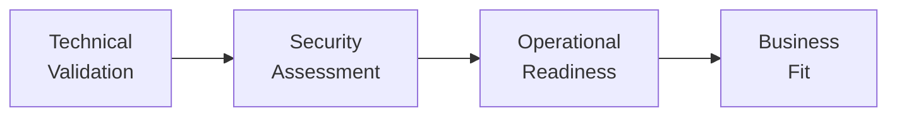
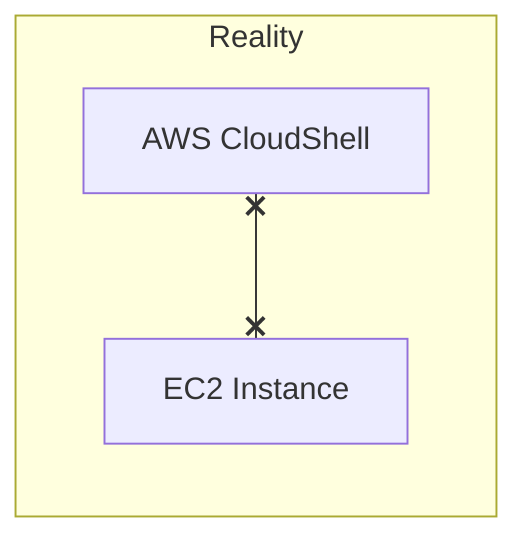
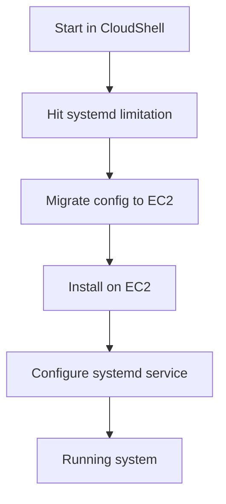
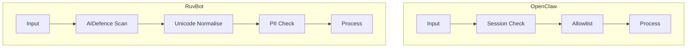

# Evaluating AI Agents for Enterprise: A Practical Evening with OpenClaw and RuvBot

## LinkedIn Cover Post

---

I spent last night deploying two AI agent platforms on production AWS infrastructure and assessing them against the OWASP Top 10 for Agentic Applications 2026.

Here's what I found:

- One platform scored 8.5/10 on enterprise security, the other 7.5/10
- Both have supply chain gaps that most teams won't catch
- The installation documentation undersells the actual complexity
- systemd knowledge is now a prerequisite for AI operations
- Day-one releases have rough edges—one API server wouldn't start despite reporting success

The full write-up covers the evaluation framework, the problems I hit, and what the security differences actually mean.

Link in comments.

#AIAgents #EnterpriseSecurity #OWASP

---

## Full Article

### Background

I've been reading about OpenClaw for about a week. RuvBot was announced as coming soon and released yesterday evening. Last night I decided to stop reading and actually deploy both on a production AWS EC2 instance.

This isn't a sponsored review. I paid for my own AWS resources. The goal was to understand what it actually takes to get these platforms running and how they compare on security.

### The Platforms

**OpenClaw** is a personal AI assistant with a local-first architecture. It connects to WhatsApp, Telegram, Slack, Discord, and other messaging platforms. The pitch is privacy—your data stays on your hardware.

**RuvBot** positions itself as enterprise-grade with a 6-layer security model. It includes something called AIDefence for prompt injection detection and supports multiple LLM providers including Claude, GPT, and Gemini.

Both are open source. Both required more effort to deploy than their documentation suggested.

### The Evaluation Approach

I used a four-phase framework:



**Phase 1** covers whether the thing actually installs and runs.
**Phase 2** applies the OWASP Top 10 for Agentic Applications.
**Phase 3** asks what it takes to keep it running.
**Phase 4** maps findings to business requirements.

Most evaluations skip Phase 3. That's a mistake.

### What Actually Happened

#### Problem 1: Environment Confusion

I started in AWS CloudShell, assuming it was connected to my EC2 instance. It isn't. CloudShell is a separate browser-based shell environment with no connection to your EC2 infrastructure.



This cost me 20 minutes of confusion. The fix was straightforward once I understood the problem—SSH into EC2 separately.

#### Problem 2: Node.js Version

Both platforms require Node.js 22+. The EC2 instance had Node.js 20. Upgrading created package conflicts:

```
file /usr/lib/node_modules/npm/... conflicts with file from package nodejs20-npm
```

The fix:
```bash
sudo yum remove -y nodejs20 nodejs20-npm
curl -fsSL https://rpm.nodesource.com/setup_22.x | sudo bash -
sudo yum install -y nodejs
```

Not complex, but not documented either.

#### Problem 3: Memory Constraints

The OpenClaw installation hung indefinitely on a 1.9GB RAM instance. The npm process was running out of memory with no error message—just a frozen terminal.

The fix was adding swap space:
```bash
sudo dd if=/dev/zero of=/swapfile bs=128M count=8
sudo chmod 600 /swapfile
sudo mkswap /swapfile
sudo swapon /swapfile
```

#### Problem 4: systemd Dependency

Both platforms assume systemd for process management. AWS CloudShell doesn't have systemd. This meant I had to complete the migration to EC2 before I could get persistent operation.

The actual deployment path looked like this:



### Security Assessment

I assessed both platforms against the OWASP Top 10 for Agentic Applications 2026. This framework covers vulnerabilities specific to AI agents—things like prompt injection, tool misuse, and rogue agent behaviour.

#### Summary Scores

| Vulnerability | OpenClaw | RuvBot |
|---------------|----------|--------|
| ASI01: Prompt Injection | MEDIUM | LOW |
| ASI02: Tool Misuse | MEDIUM | MEDIUM |
| ASI03: Identity Abuse | LOW | LOW |
| ASI04: Supply Chain | MEDIUM | MEDIUM |
| ASI05: Code Execution | LOW | LOW |
| ASI06: Memory Poisoning | MEDIUM | LOW |
| ASI07: Inter-Agent Comms | LOW | LOW |
| ASI08: Cascading Failures | MEDIUM | MEDIUM |
| ASI09: Trust Exploitation | LOW | LOW |
| ASI10: Rogue Agents | LOW | LOW |

**OpenClaw: 7.5/10**
**RuvBot: 8.5/10**

#### The Key Difference: Prompt Injection Defence

RuvBot includes AIDefence, which scans inputs against 50+ prompt injection patterns with sub-10ms latency. It also normalises Unicode to prevent homoglyph attacks and detects PII.

**What's a homoglyph attack?** Attackers use visually identical characters from different Unicode scripts to bypass security filters. The Cyrillic 'а' looks identical to the Latin 'a' but has a different code point. An attacker could craft a prompt injection using these lookalikes to evade pattern matching. Unicode normalisation converts these to canonical forms before scanning, closing that gap.

OpenClaw relies on session boundaries and user allowlisting. This works, but it's reactive rather than proactive.



For internal tools with trusted users, OpenClaw's approach is probably sufficient. For customer-facing applications or environments with compliance requirements, RuvBot's defence-in-depth matters more.

#### Shared Weakness: Supply Chain

Both platforms pulled 500-700 npm packages during installation. Neither generates a Software Bill of Materials. Neither has documented CVE scanning in their build process.

This is a gap. If you're in a regulated industry, you'll need to add your own supply chain controls around either platform.

### Operational Reality

Getting these platforms installed is Phase 1. Keeping them running is the ongoing work.

| Requirement | OpenClaw | RuvBot |
|-------------|----------|--------|
| Process Management | systemd | systemd or PM2 |
| Health Endpoints | Basic | Comprehensive |
| Structured Logging | No | Yes |
| Multi-tenancy | No | PostgreSQL RLS |

**PM2** is a Node.js process manager that provides an alternative to systemd. It handles auto-restart on crash, cluster mode for multi-core utilisation, zero-downtime reloads, and built-in monitoring. If you're already in the Node.js ecosystem, PM2 is often simpler than writing systemd unit files.

OpenClaw is simpler. RuvBot is more enterprise-ready. The right choice depends on your use case.

#### Problem 5: RuvBot API Server

This one caught me off guard. After configuring RuvBot with a Google AI API key and running `ruvbot start`, the CLI reported success:

```
✔ RuvBot started successfully
```

But the process exited immediately. Port 3000 never bound. Running `ruvbot doctor` showed:

```
⚠ LLM API Key - No LLM API key found
⚠ Config File - No config file found
✗ Database - Database file not found
✗ Memory Index - Vector memory not initialized
```

The GOOGLE_AI_API_KEY was set correctly in both the environment and .env file. The config file existed at the expected path. But the doctor didn't recognise either.

This is a day-one release issue. The platform is hours old. But it illustrates the gap between documentation and reality—the startup flow looks straightforward until you actually run it and find the API server component doesn't bind.

For now, RuvBot works in CLI mode but the REST API server needs more work.

### What I Learned

**1. Documentation understates complexity.** Both platforms claim 10-minute installs. Neither achieved that on a standard EC2 instance.

**2. Infrastructure requirements are moving targets.** Node.js 22 is new. Your standard AMIs probably don't have it yet. Budget for environment updates.

**3. Memory matters more than expected.** AI tooling is heavier than traditional web applications. Right-size your instances.

**4. Security varies significantly.** The difference between 7.5/10 and 8.5/10 might not matter for a personal project. It matters a lot for enterprise deployment.

**5. Operational maturity differs.** Installation is the easy part. Think through monitoring, logging, and incident response before you commit.

**6. Day-one releases need caution.** RuvBot was released yesterday. The CLI works, but the API server component has issues. This is normal for new software—just factor it into your evaluation timeline.

### When to Use Which

**OpenClaw** makes sense when:
- Data residency is the primary concern (note: session logs stay local, but LLM requests still go to external providers—this isn't complete privacy, it's about controlling where your logs and context live)
- Users are trusted (internal teams)
- You have strong DevOps capability
- Budget is constrained

**RuvBot** makes sense when:
- Security is the primary concern
- You're in a regulated industry
- You need multi-tenancy
- You want more operational tooling out of the box

### Closing Thoughts

AI agents are a meaningful capability. They're also a meaningful risk surface. The platforms I evaluated are both functional, but they require more operational maturity than their marketing suggests.

If you're evaluating AI agents for your organisation, I'd suggest:

1. **Deploy on real infrastructure.** Sandboxes hide problems.
2. **Apply a security framework.** The OWASP Agentic Top 10 is a reasonable starting point.
3. **Think about Day 2.** Installation is temporary. Operations are permanent.

I work with CIOs on digital transformation initiatives, including technology evaluation and adoption. If you're working through similar questions about AI agents in your organisation, I'm happy to discuss.

---

*Technical documentation and full OWASP assessments available at: github.com/mondweep/vibe-cast*

---

## About

I advise CIOs on digital transformation, with a focus on technology strategy, enterprise architecture, and safe adoption of emerging capabilities. My work typically involves initiatives exceeding £15M where technology decisions have material business impact.

Available for confidential discussions on AI strategy and adoption.
