# OWASP Top 10 for Agentic Applications 2026
## Security Assessment of OpenClaw

> This document provides a comprehensive security assessment of the OpenClaw personal AI assistant against the OWASP Top 10 for Agentic Applications 2026 framework.

---

## Executive Summary

| Risk ID | Vulnerability | OpenClaw Risk Level | Mitigation Status |
|---------|--------------|---------------------|-------------------|
| ASI01 | Agent Goal Hijack | 🟡 MEDIUM | Partial |
| ASI02 | Tool Misuse & Exploitation | 🟡 MEDIUM | Partial |
| ASI03 | Identity & Privilege Abuse | 🟢 LOW | Good |
| ASI04 | Agentic Supply Chain | 🟡 MEDIUM | Partial |
| ASI05 | Unexpected Code Execution | 🟢 LOW | Good |
| ASI06 | Memory & Context Poisoning | 🟡 MEDIUM | Partial |
| ASI07 | Insecure Inter-Agent Comms | 🟢 LOW | Good |
| ASI08 | Cascading Failures | 🟡 MEDIUM | Partial |
| ASI09 | Human-Agent Trust Exploitation | 🟡 MEDIUM | Partial |
| ASI10 | Rogue Agents | 🟢 LOW | Good |

**Overall Assessment**: OpenClaw demonstrates security-conscious design with room for improvement in input validation and supply chain security.

---

## OWASP Top 10 for Agentic Applications 2026

### Reference Framework

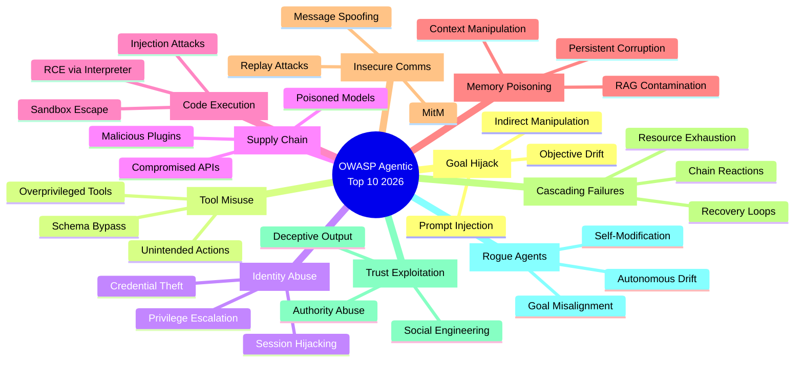

---

## Detailed Assessment

### ASI01: Agent Goal Hijack

**OWASP Definition**: Attackers manipulate an agent's objectives through injected instructions, where the agent can't distinguish between legitimate commands and malicious ones embedded in content it processes.

**Risk Level**: 🟡 MEDIUM

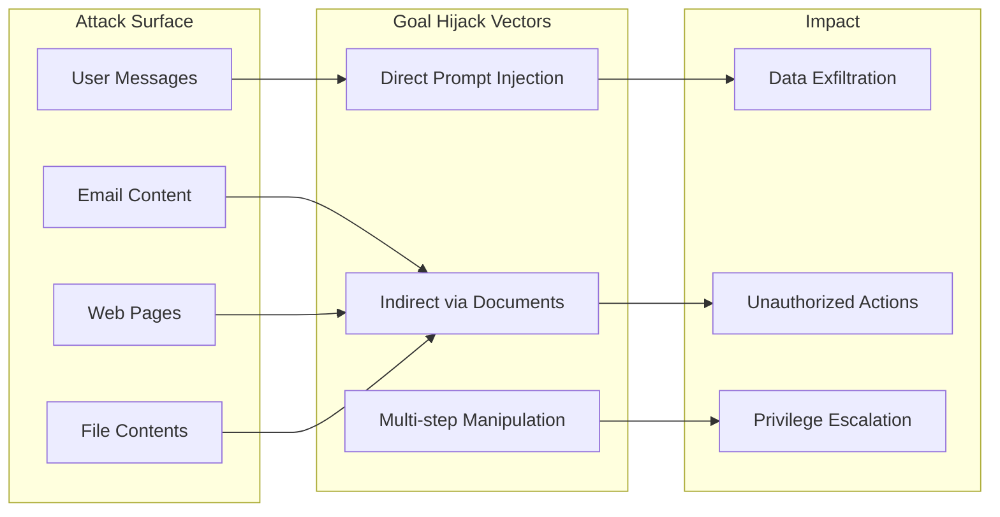

**OpenClaw Analysis**:

| Aspect | Finding |
|--------|---------|
| **Input Sources** | Multiple channels (WhatsApp, Telegram, Gmail) accept natural language |
| **Prompt Injection** | SECURITY.md explicitly lists prompt injection as "out of scope" |
| **Indirect Attacks** | Browser tool, email processing create injection surfaces |
| **Model Choice** | Recommends Claude for "better prompt-injection resistance" |

**Evidence from Codebase**:
- The `SECURITY.md` states: "Prompt injection attacks" are explicitly out of scope
- Recommended model is "anthropic/claude-opus-4-5" for injection resistance
- No documented input sanitization for multi-channel messages

**Mitigations in Place**:
- ✅ Claude model recommendation for injection resistance
- ✅ Session isolation between channels
- ⚠️ No explicit input sanitization layer documented
- ❌ No "Intent Capsule" pattern implementation

**Recommendations**:
1. Implement input sanitization layer before agent processing
2. Add human-in-the-loop for high-impact actions (file deletion, credential access)
3. Consider "Intent Capsule" pattern for action verification
4. Document prompt injection defenses explicitly

---

### ASI02: Tool Misuse and Exploitation

**OWASP Definition**: Agents use authorized tools unsafely due to ambiguous instructions or prompt manipulation, representing a Least-Agency failure.

**Risk Level**: 🟡 MEDIUM

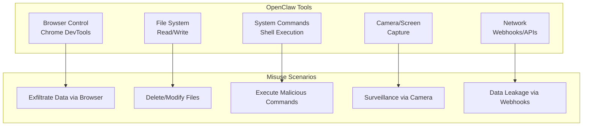

**OpenClaw Analysis**:

| Tool | Risk | Mitigation |
|------|------|------------|
| Browser Control | HIGH | Dedicated Chrome instance |
| File System | HIGH | Main session only by default |
| Shell Commands | CRITICAL | Docker sandbox for groups |
| Camera/Screen | MEDIUM | Node-based, local only |
| Webhooks | MEDIUM | Configuration required |

**Evidence from Codebase**:
- Tools execute with host permissions for "main" sessions
- Docker sandboxing available for non-main sessions
- `AGENTS.md` documents tool schema requirements
- No explicit tool allowlist per session type

**Mitigations in Place**:
- ✅ Docker sandbox for group/channel sessions
- ✅ Tool schema validation requirements
- ✅ Dedicated browser instance isolation
- ⚠️ Main session has full tool access
- ❌ No just-in-time permission prompts

**Recommendations**:
1. Implement tool allowlists per session type
2. Add confirmation prompts for destructive actions
3. Rate-limit tool executions
4. Log all tool invocations with parameters

---

### ASI03: Identity & Privilege Abuse

**OWASP Definition**: Agents escalate privileges by abusing their own identity or inheriting credentials from connected services.

**Risk Level**: 🟢 LOW

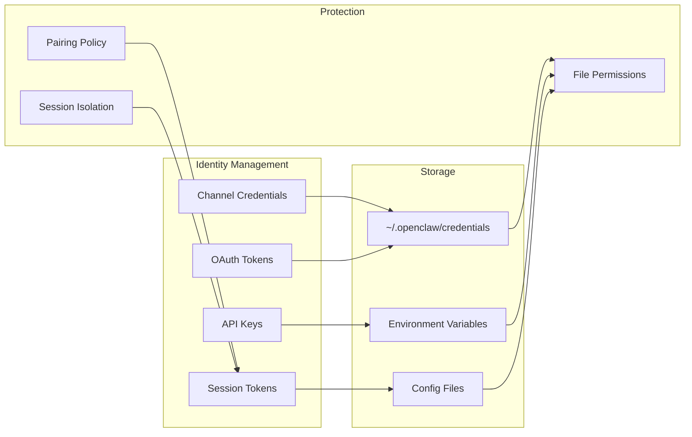

**OpenClaw Analysis**:

| Aspect | Status |
|--------|--------|
| Credential Storage | File-based at `~/.openclaw/credentials/` |
| Access Control | OS-level file permissions |
| Token Management | OAuth refresh supported |
| Session Identity | Unique per channel/conversation |

**Mitigations in Place**:
- ✅ Separate credential storage directory
- ✅ Pairing policy for unknown DMs
- ✅ Session isolation between conversations
- ✅ OAuth token rotation support
- ⚠️ Long-lived credentials possible

**Recommendations**:
1. Implement credential encryption at rest
2. Add automatic token expiration/rotation
3. Audit credential access logging
4. Consider hardware security module integration

---

### ASI04: Agentic Supply Chain Vulnerabilities

**OWASP Definition**: External dependencies—third-party APIs, models, RAG data sources—inherit vulnerabilities into the agent.

**Risk Level**: 🟡 MEDIUM

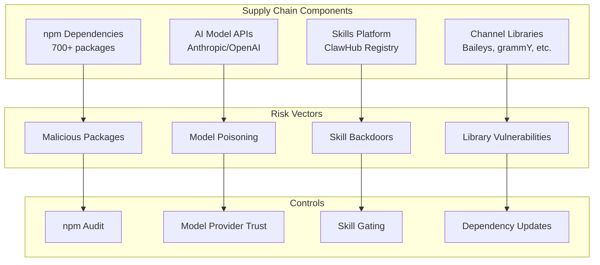

**OpenClaw Analysis**:

| Component | Risk | Controls |
|-----------|------|----------|
| npm packages | HIGH | `detect-secrets` in CI |
| AI Models | MEDIUM | Provider trust |
| Skills | MEDIUM | Install gating |
| Channels | MEDIUM | Version pinning |

**Evidence from Codebase**:
- Uses `detect-secrets` for credential scanning
- Skills have "install gating" controls
- Multiple third-party channel libraries
- Node.js 22+ required for security patches

**Mitigations in Place**:
- ✅ Secret detection in CI/CD
- ✅ Skill install gating
- ✅ Node.js version requirements
- ⚠️ No SBOM generation documented
- ❌ No dependency signature verification

**Recommendations**:
1. Generate and maintain Software Bill of Materials (SBOM)
2. Implement dependency signature verification
3. Create trusted skill registry with code signing
4. Regular dependency audits with automated CVE scanning

---

### ASI05: Unexpected Code Execution

**OWASP Definition**: Agents generate and execute malicious code via code-interpreter tools.

**Risk Level**: 🟢 LOW

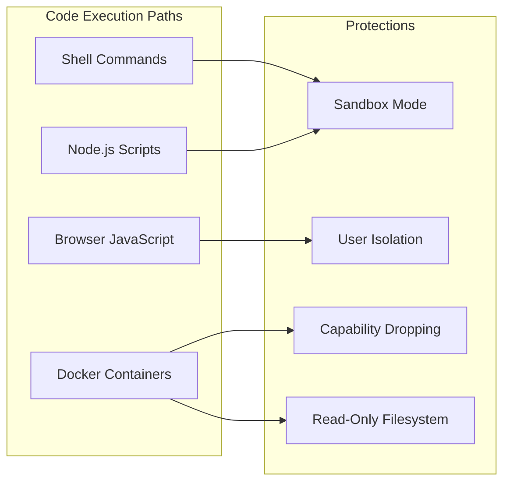

**OpenClaw Analysis**:

| Execution Context | Isolation Level |
|-------------------|-----------------|
| Main Session | Host (FULL ACCESS) |
| Group Session | Docker (SANDBOXED) |
| Non-main Session | Configurable |

**Evidence from Codebase**:
- Docker sandbox with `--read-only` flags
- Capability dropping with `--cap-drop=ALL`
- Non-root container execution
- Configurable sandbox modes

**Mitigations in Place**:
- ✅ Docker sandboxing for group sessions
- ✅ Read-only filesystem option
- ✅ Capability dropping
- ✅ Non-root execution
- ⚠️ Main session runs with full host access

**Recommendations**:
1. Default to sandboxed execution even for main session
2. Implement code analysis before execution
3. Add execution timeouts and resource limits
4. Log all code execution with inputs/outputs

---

### ASI06: Memory & Context Poisoning

**OWASP Definition**: Malicious data corrupts the agent's persistent memory stores, causing misaligned behavior over time.

**Risk Level**: 🟡 MEDIUM

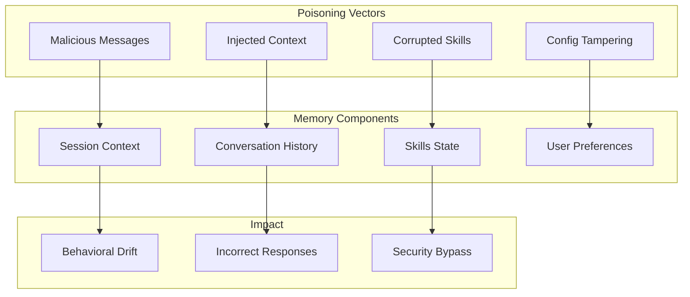

**OpenClaw Analysis**:

| Memory Type | Protection |
|-------------|------------|
| Session Logs | JSONL files, no integrity check |
| Config | JSON, user-writable |
| Skills | Directory-based, install gating |
| Context | In-memory, session-scoped |

**Mitigations in Place**:
- ✅ Session isolation
- ✅ Session pruning and context compaction
- ✅ `/reset` command to clear context
- ⚠️ No cryptographic integrity verification
- ❌ No memory rollback capability

**Recommendations**:
1. Implement integrity checksums for session logs
2. Add memory versioning for rollback
3. Sanitize context before persistence
4. Regular memory audits for anomalies

---

### ASI07: Insecure Inter-Agent Communication

**OWASP Definition**: Multi-agent systems face interception, message forging, and replay attacks.

**Risk Level**: 🟢 LOW

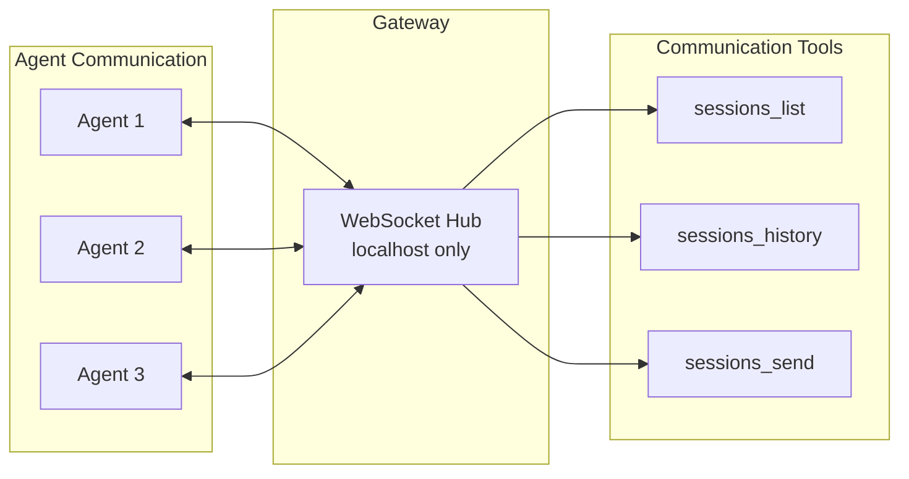

**OpenClaw Analysis**:

| Aspect | Status |
|--------|--------|
| Transport | WebSocket over localhost |
| Authentication | Gateway-controlled |
| Message Signing | Not documented |
| Replay Protection | Not documented |

**Mitigations in Place**:
- ✅ Gateway bound to localhost (127.0.0.1)
- ✅ Single control point for routing
- ✅ Session-based isolation
- ⚠️ No message signing for inter-agent comms
- ⚠️ No replay protection documented

**Recommendations**:
1. Implement message signing for agent-to-agent communication
2. Add nonce/timestamp for replay protection
3. Log inter-agent message flows
4. Consider mTLS for remote Gateway scenarios

---

### ASI08: Cascading Failures

**OWASP Definition**: Minor component failures trigger destructive chain reactions as agents attempt recovery.

**Risk Level**: 🟡 MEDIUM

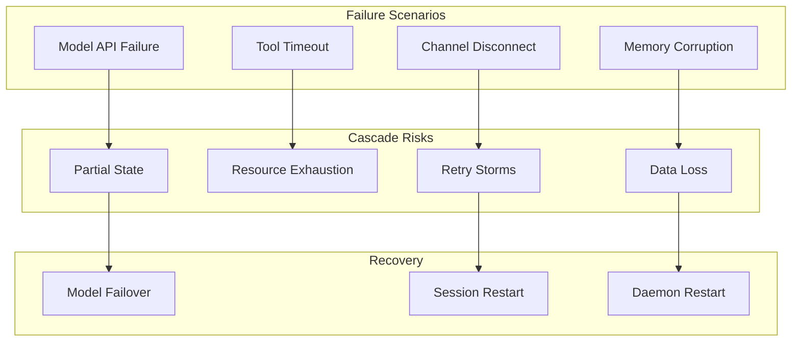

**OpenClaw Analysis**:

| Failure Mode | Handling |
|--------------|----------|
| Channel Disconnect | Reconnection logic |
| Model API Failure | Failover configuration |
| Tool Failure | Error returned to agent |
| Gateway Crash | Daemon restart (launchd/systemd) |

**Mitigations in Place**:
- ✅ Model failover configuration
- ✅ Daemon supervision (launchd/systemd)
- ✅ Channel reconnection
- ⚠️ No circuit breaker pattern documented
- ❌ No transactional rollback

**Recommendations**:
1. Implement circuit breakers for external services
2. Add graceful degradation modes
3. Define safe failure states
4. Implement operation rollback for multi-step actions

---

### ASI09: Human-Agent Trust Exploitation

**OWASP Definition**: Attackers manipulate agent output to deceive humans into bypassing security controls.

**Risk Level**: 🟡 MEDIUM

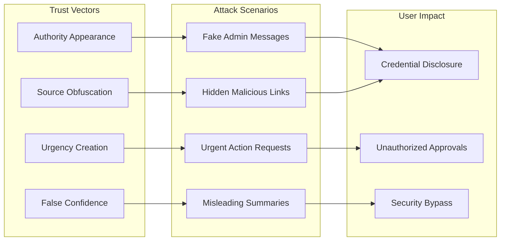

**OpenClaw Analysis**:

| Aspect | Status |
|--------|--------|
| Output Attribution | Agent responses marked |
| Source Transparency | Not enforced |
| Decision Audit | Session logs available |
| User Education | Documentation provided |

**Mitigations in Place**:
- ✅ Session logging for audit
- ✅ Pairing codes for unknown senders
- ⚠️ No output integrity markers
- ❌ No source transparency enforcement

**Recommendations**:
1. Add visible markers for AI-generated content
2. Implement source attribution for information
3. Require confirmation for sensitive actions
4. Educate users on social engineering risks

---

### ASI10: Rogue Agents

**OWASP Definition**: Agents drift from intended purpose through internal misalignment—a self-initiated autonomous threat.

**Risk Level**: 🟢 LOW

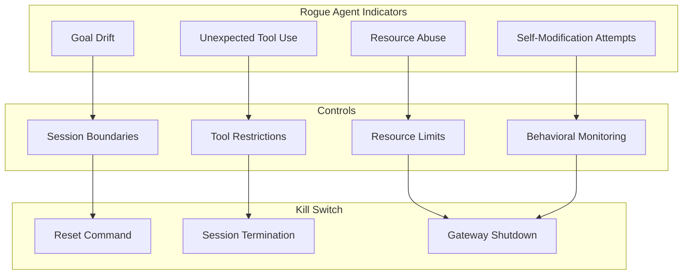

**OpenClaw Analysis**:

| Control | Implementation |
|---------|----------------|
| Goal Boundaries | Session-scoped context |
| Kill Switch | `/reset`, session termination |
| Monitoring | Session logs |
| Autonomy Limits | Human-initiated only |

**Mitigations in Place**:
- ✅ Session-scoped operations
- ✅ Multiple kill switch options
- ✅ Human-initiated conversations only
- ✅ No autonomous goal-seeking behavior
- ⚠️ Limited behavioral drift detection

**Recommendations**:
1. Implement behavioral baseline monitoring
2. Add anomaly detection for tool usage patterns
3. Create automated circuit breakers for unusual activity
4. Regular audit of session patterns

---

## Security Architecture Recommendations

### Proposed Security Enhancements

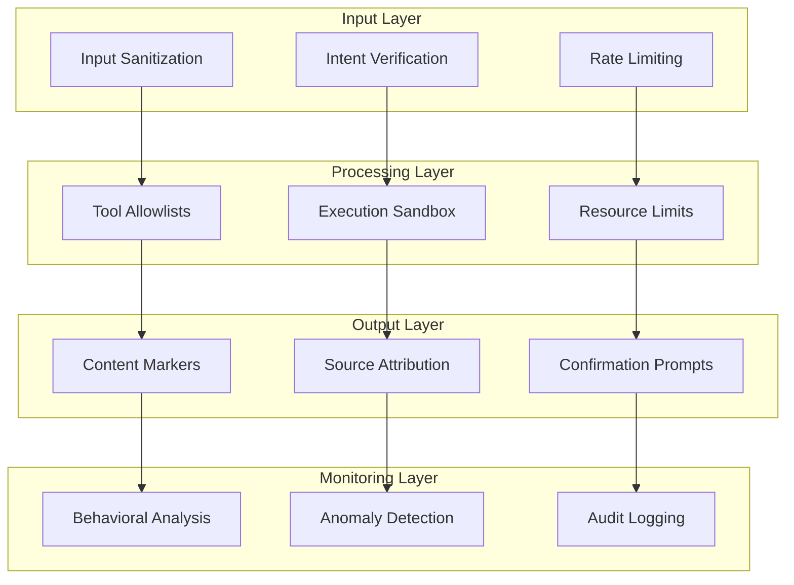

### Priority Improvements

| Priority | Improvement | Addresses |
|----------|-------------|-----------|
| 1 | Input sanitization layer | ASI01, ASI06 |
| 2 | Tool allowlists per session | ASI02 |
| 3 | SBOM generation | ASI04 |
| 4 | Memory integrity verification | ASI06 |
| 5 | Behavioral monitoring | ASI10 |

---

## Conclusion

OpenClaw demonstrates a **security-conscious architecture** with several built-in protections:

**Strengths**:
- Docker sandboxing for untrusted sessions
- Pairing policy for unknown senders
- Session isolation and boundaries
- Model selection for injection resistance
- Localhost-bound Gateway

**Areas for Improvement**:
- Input sanitization and validation
- Supply chain security (SBOM, signing)
- Memory integrity verification
- Behavioral drift detection
- Human-in-the-loop for sensitive actions

**Overall Risk Rating**: 🟡 **MEDIUM** - Suitable for personal use with documented security practices; enterprise deployment requires additional hardening.

---

## References

- [OWASP Top 10 for Agentic Applications 2026](https://genai.owasp.org/resource/owasp-top-10-for-agentic-applications-for-2026/)
- [OpenClaw Security Documentation](https://github.com/openclaw/openclaw/blob/main/SECURITY.md)
- [OpenClaw Agent Guidelines](https://github.com/openclaw/openclaw/blob/main/AGENTS.md)
- [NeuralTrust OWASP Analysis](https://neuraltrust.ai/blog/owasp-top-10-for-agentic-applications-2026)

---

*Assessment conducted: 2026-02-01*
*Framework: OWASP Top 10 for Agentic Applications 2026*
*Target: OpenClaw Personal AI Assistant*
