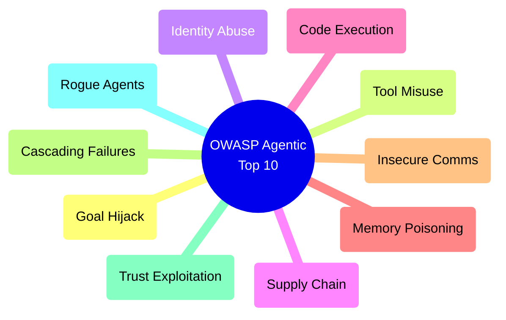
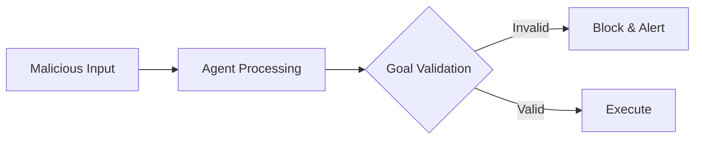
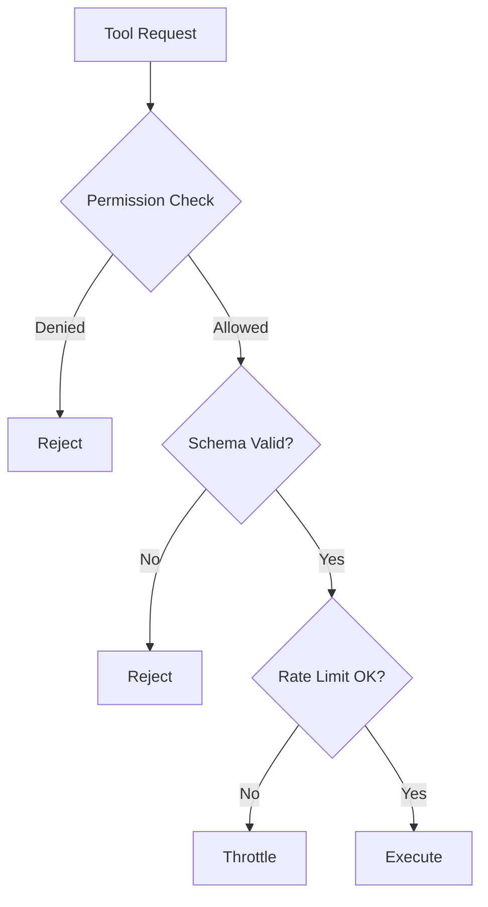
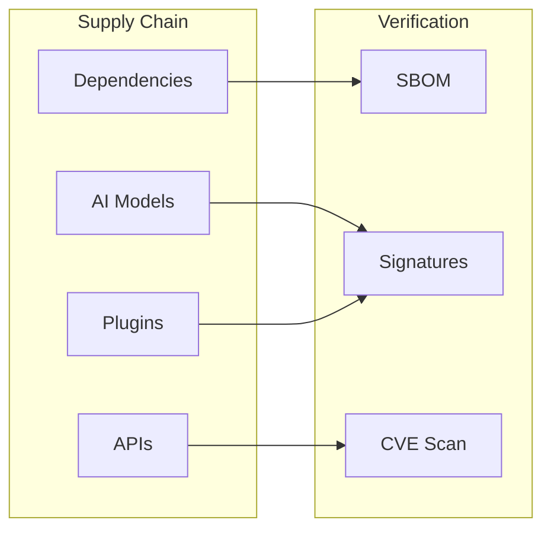
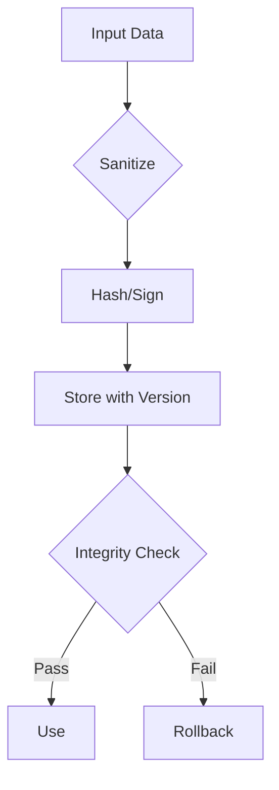
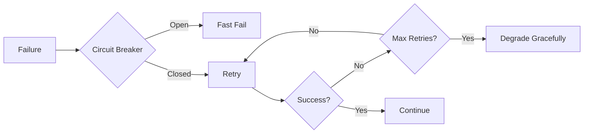
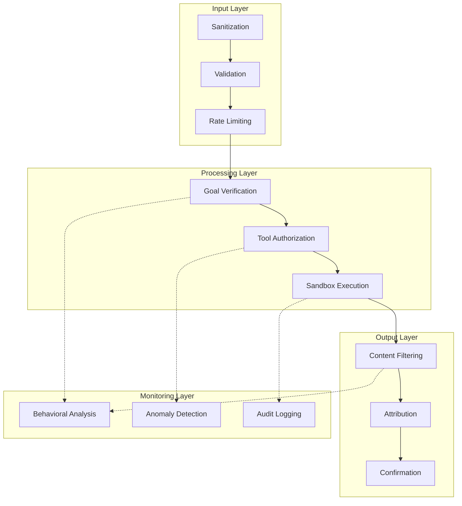

# OWASP Top 10 for Agentic Applications 2026
## Quick Reference Guide

> The definitive framework for securing autonomous AI agents, released December 2025 by the OWASP GenAI Security Project.

---

## Overview

---

## The 10 Vulnerabilities

### ASI01: Agent Goal Hijack

**Definition**: Attackers manipulate an agent's objectives through injected instructions, where the agent cannot distinguish between legitimate commands and malicious ones embedded in content it processes.

**Attack Vectors**:
- Direct prompt injection
- Indirect injection via documents, emails, web pages
- Hidden instructions in data sources
- Multi-step manipulation campaigns

**Real-World Example**: EchoLeak attack where hidden prompts turned copilots into silent data exfiltration engines.

**Mitigations**:
- Treat ALL natural-language inputs as untrusted
- Implement "Intent Capsule" pattern
- Human-in-the-loop for high-impact actions
- Input sanitization and validation

---

### ASI02: Tool Misuse and Exploitation

**Definition**: Agents use authorized tools unsafely due to ambiguous instructions or prompt manipulation, representing a Least-Agency failure.

**Attack Vectors**:
- Overprivileged tool access
- Ambiguous tool schemas
- Parameter manipulation
- Chained tool abuse

**Real-World Example**: Amazon Q bent legitimate tools into destructive outputs.

**Mitigations**:
- Zero-trust tooling with granular permissions
- Just-in-time permission grants
- Rigorous schema validation
- Tool allowlists per session type

---

### ASI03: Identity & Privilege Abuse

**Definition**: Agents escalate privileges by abusing their own identity or inheriting credentials from connected services.

**Attack Vectors**:
- Credential theft/leakage
- Session token abuse
- Cross-service privilege inheritance
- Identity spoofing

**Mitigations**:
- Unique, short-lived session credentials
- Zero-trust identity management
- Automatic token expiration
- Audit logging of credential access

---

### ASI04: Agentic Supply Chain Vulnerabilities

**Definition**: External dependencies—third-party APIs, models, RAG data sources—inherit vulnerabilities into the agent.

**Attack Vectors**:
- Malicious npm/PyPI packages
- Poisoned AI models
- Compromised MCP servers
- Backdoored plugins/skills

**Real-World Example**: GitHub MCP exploit where malicious package impersonated email service, BCC'ing all messages to attackers.

**Mitigations**:
- Software Bill of Materials (SBOM)
- Dependency signature verification
- Trusted registries with code signing
- Regular CVE scanning

---

### ASI05: Unexpected Code Execution

**Definition**: Agents generate and execute malicious code via code-interpreter tools.

**Attack Vectors**:
- Code injection via prompts
- Sandbox escape attempts
- Malicious code generation
- Interpreter abuse

**Real-World Example**: AutoGPT RCE where natural-language execution paths enabled remote code execution.

**Mitigations**:
- Hardware-enforced sandboxes
- Static and dynamic code analysis
- Execution timeouts and resource limits
- Audit logging of all executions

---

### ASI06: Memory & Context Poisoning

**Definition**: Malicious data corrupts the agent's persistent memory stores, causing misaligned behavior over time.

**Attack Vectors**:
- Malicious conversation history
- RAG contamination
- Context window poisoning
- Persistent memory corruption

**Real-World Example**: Gemini Memory Attack where memory poisoning reshaped behavior long after initial interaction.

**Mitigations**:
- Cryptographic integrity checks
- Data sanitization before storage
- Version control with rollback
- Memory anomaly detection

---

### ASI07: Insecure Inter-Agent Communication

**Definition**: Multi-agent systems face interception, message forging, and replay attacks.

**Attack Vectors**:
- Message interception
- Spoofed agent messages
- Replay attacks
- Man-in-the-middle

**Mitigations**:
- Cryptographic message signing
- Mutual TLS (mTLS)
- Nonce/timestamp for replay protection
- Message flow logging

---

### ASI08: Cascading Failures

**Definition**: Minor component failures trigger destructive chain reactions as agents attempt recovery.

**Attack Vectors**:
- Retry storms
- Resource exhaustion
- Partial state corruption
- Recovery loop attacks

**Mitigations**:
- Circuit breaker patterns
- Transactional rollback
- Graceful degradation modes
- Defined safe failure states

---

### ASI09: Human-Agent Trust Exploitation

**Definition**: Attackers manipulate agent output to deceive humans into bypassing security controls.

**Attack Vectors**:
- Authority appearance spoofing
- Urgency creation
- Misleading summaries
- Hidden malicious content

**Mitigations**:
- Transparent decision rationale
- Source attribution
- AI content markers
- Confirmation for sensitive actions

---

### ASI10: Rogue Agents

**Definition**: Agents drift from intended purpose through internal misalignment—a self-initiated autonomous threat.

**Attack Vectors**:
- Goal drift over time
- Behavioral misalignment
- Self-modification attempts
- Autonomy escalation

**Mitigations**:
- Auditable kill switches
- Continuous behavioral monitoring
- Session boundaries
- Anomaly detection for drift

---

## Core Security Principles

### Principle 1: Least-Agency

> Grant agents only the minimum level of autonomy required to complete their defined task.

- Just-in-time agency grants
- Revoke after task completion
- Scope-limited tool access
- Human approval for escalation

### Principle 2: Strong Observability

> Comprehensive visibility into what agents are doing, why, and which tools they invoke.

- Detailed logging of:
  - Goal state changes
  - Tool-use patterns
  - Decision pathways
  - Memory modifications
- Real-time monitoring dashboards
- Anomaly alerting

---

## Security Architecture Pattern

---

## Quick Reference Table

| ID | Vulnerability | Key Mitigation |
|----|--------------|----------------|
| ASI01 | Goal Hijack | Intent Capsule, HITL |
| ASI02 | Tool Misuse | Zero-trust tooling |
| ASI03 | Identity Abuse | Short-lived credentials |
| ASI04 | Supply Chain | SBOM, signatures |
| ASI05 | Code Execution | Sandboxed execution |
| ASI06 | Memory Poisoning | Integrity verification |
| ASI07 | Insecure Comms | mTLS, signing |
| ASI08 | Cascading Failures | Circuit breakers |
| ASI09 | Trust Exploitation | Transparency |
| ASI10 | Rogue Agents | Kill switches |

---

## References

- [OWASP GenAI Security Project](https://genai.owasp.org)
- [OWASP Top 10 for Agentic Applications](https://genai.owasp.org/resource/owasp-top-10-for-agentic-applications-for-2026/)
- [NeuralTrust Deep Dive](https://neuraltrust.ai/blog/owasp-top-10-for-agentic-applications-2026)
- [Palo Alto Networks Analysis](https://www.paloaltonetworks.com/blog/cloud-security/owasp-agentic-ai-security/)

---

*Document Version: 1.0.0 | Framework Release: December 2025*
