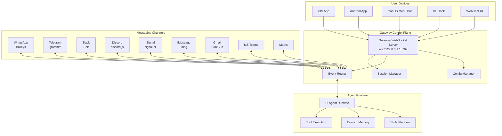
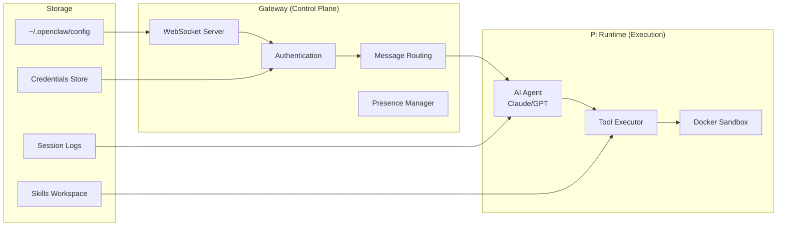
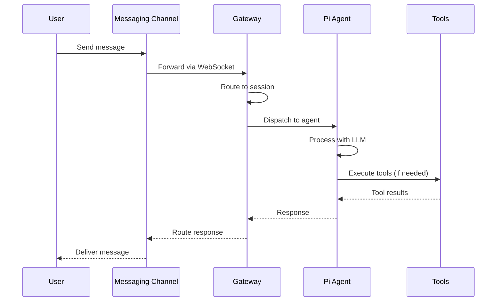
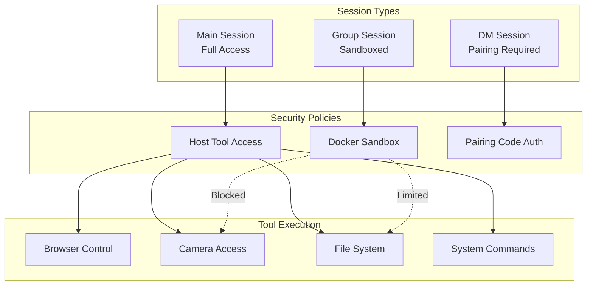
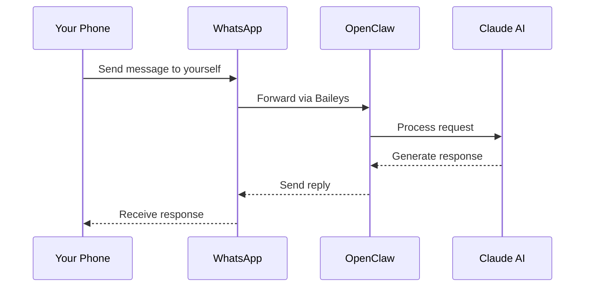
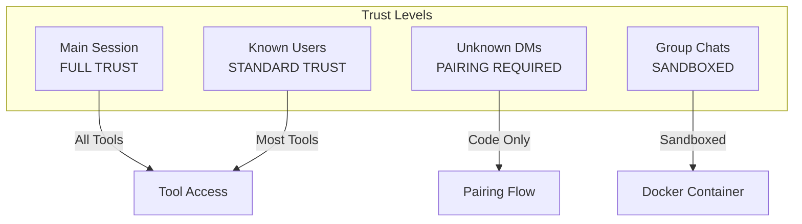

# OpenClaw Analysis & Getting Started Guide

> A comprehensive analysis of the OpenClaw personal AI assistant platform, including architecture overview, getting started guides, and security assessment.

## Table of Contents

1. [What is OpenClaw?](#what-is-openclaw)
2. [Architecture Overview](#architecture-overview)
3. [Getting Started](#getting-started)
4. [Walkthrough Examples](#walkthrough-examples)
5. [Channel Integrations](#channel-integrations)
6. [Security Model](#security-model)
7. [OWASP Agentic Security Assessment](#owasp-agentic-security-assessment)

---

## What is OpenClaw?

OpenClaw is a **personal AI assistant** that you run on your own devices. Unlike cloud-hosted AI assistants, OpenClaw operates locally with a "local-first" philosophy while seamlessly connecting to multiple messaging platforms.

### Key Characteristics

| Feature | Description |
|---------|-------------|
| **Local-First** | Runs on your devices (macOS, Linux, iOS, Android) |
| **Multi-Channel** | Connects to WhatsApp, Telegram, Slack, Discord, Gmail, and 10+ platforms |
| **Privacy-Focused** | Your conversations stay on your hardware |
| **Always-On** | Runs as a daemon/service for continuous availability |
| **Extensible** | Skills platform for adding custom capabilities |

### Who Is It For?

- **Developers** wanting a programmable AI assistant
- **Privacy-conscious users** who prefer local processing
- **Power users** managing multiple messaging platforms
- **Teams** needing a customizable AI bot framework

---

## Architecture Overview

OpenClaw follows a **hub-and-spoke architecture** with the Gateway as the central control plane.

### High-Level Architecture



### Core Components



### Data Flow Diagram



### Session & Security Model



---

## Getting Started

### Prerequisites

- **Node.js 22+** (LTS recommended)
- **Operating System**: macOS, Linux, or Windows (WSL)
- **Package Manager**: npm, pnpm, or bun

### Installation

#### Option 1: Global Install (Recommended)

```bash
# Install OpenClaw globally
npm install -g openclaw@latest

# Run the onboarding wizard
openclaw onboard --install-daemon
```

The wizard will guide you through:
1. Gateway configuration
2. Workspace setup
3. Channel authentication
4. Skill installation

#### Option 2: Development Install

```bash
# Clone the repository
git clone https://github.com/openclaw/openclaw.git
cd openclaw

# Install dependencies (pnpm recommended)
pnpm install

# Build the project
pnpm build

# Start the gateway
pnpm start
```

### Basic Configuration

Create or edit `~/.openclaw/openclaw.json`:

```json
{
  "agent": {
    "model": "anthropic/claude-opus-4-5"
  },
  "gateway": {
    "host": "127.0.0.1",
    "port": 18789
  }
}
```

### Verify Installation

```bash
# Check system health
openclaw doctor

# View status
openclaw status

# Test the agent
openclaw chat "Hello, are you working?"
```

---

## Walkthrough Examples

### Example 1: Setting Up WhatsApp Integration

WhatsApp is one of the most popular channels. Here's how to set it up:

```bash
# Step 1: Start the gateway if not running
openclaw start

# Step 2: Link WhatsApp
openclaw channel add whatsapp

# Step 3: Scan the QR code displayed in terminal
# Use WhatsApp app: Settings > Linked Devices > Link a Device

# Step 4: Verify connection
openclaw channel status whatsapp
```

**Usage Flow:**


### Example 2: Gmail Integration with Automation

Set up Gmail to trigger actions on incoming emails:

```bash
# Step 1: Enable Gmail Pub/Sub
openclaw channel add gmail

# Step 2: Authenticate with Google
# Follow OAuth flow in browser

# Step 3: Configure email rules in workspace
cat > ~/.openclaw/workspace/skills/email-handler/skill.json << 'EOF'
{
  "name": "email-handler",
  "triggers": ["gmail:inbox"],
  "actions": ["summarize", "categorize", "respond"]
}
EOF

# Step 4: Test the integration
openclaw skill run email-handler --test
```

### Example 3: Voice Commands with Google Nest

For voice interaction via Google Nest:

```bash
# Step 1: Enable Google Chat/Assistant integration
openclaw channel add google-chat

# Step 2: Link to Google Home
# In Google Home app: Settings > Works with Google > Link OpenClaw

# Step 3: Configure voice wake word
openclaw config set voice.wakeWord "Hey OpenClaw"

# Step 4: Test voice activation
# Say: "Hey OpenClaw, what's on my calendar today?"
```

### Example 4: Multi-Agent Coordination

Run multiple agents that can communicate:

```bash
# Start a research agent
openclaw session new --name research --agent researcher

# Start a coding agent
openclaw session new --name coder --agent developer

# Agents can communicate via sessions_send tool
# Research agent finds info, sends to coder
# Coder implements based on research
```

---

## Channel Integrations

### Supported Channels

| Channel | Library | Auth Method | Features |
|---------|---------|-------------|----------|
| WhatsApp | Baileys | QR/Phone Link | Messages, Media, Groups |
| Telegram | grammY | Bot Token | Messages, Commands, Inline |
| Slack | Bolt | Bot + App Token | Threads, Files, Reactions |
| Discord | discord.js | Bot Token | Servers, Threads, Voice |
| Signal | signal-cli | Phone Number | E2E Encrypted Messages |
| iMessage | imsg | macOS Only | Native Integration |
| Gmail | Pub/Sub | OAuth 2.0 | Email Triggers |
| MS Teams | Graph API | Azure AD | Teams, Channels |
| Matrix | matrix-js | Access Token | Federated Chat |
| Google Chat | Cloud API | Service Account | Spaces, DMs |

### Channel Commands

All channels support these commands:

| Command | Description |
|---------|-------------|
| `/status` | Show session info |
| `/new` or `/reset` | Clear conversation |
| `/think <level>` | Set thinking depth (off/low/medium/high) |
| `/usage` | Toggle usage reporting |
| `/activation` | Set group activation mode |

---

## Security Model

### Default Security Posture



### Security Best Practices

1. **Never expose Gateway to public internet** - Use Tailscale for remote access
2. **Use pairing policy for DMs** - Prevent unauthorized access
3. **Run group sessions in Docker** - Isolate potentially malicious inputs
4. **Keep Node.js updated** - v22.12.0+ required for security patches
5. **Regular credential rotation** - Use short-lived tokens

### Running Security Audit

```bash
# Run built-in security check
openclaw doctor --security

# Check for misconfigurations
openclaw security audit

# View current policies
openclaw config list --section security
```

---

## OWASP Agentic Security Assessment

See [OWASP-SECURITY-ASSESSMENT.md](./OWASP-SECURITY-ASSESSMENT.md) for the complete assessment against OWASP Top 10 for Agentic Applications 2026.

---

## Additional Resources

- **Official Documentation**: [OpenClaw Docs](https://github.com/openclaw/openclaw)
- **Skills Registry**: ClawHub
- **Community**: Discord/Matrix channels
- **Security**: security@openclaw.dev

---

*Generated for the vibe-cast project - OpenClaw Analysis*
