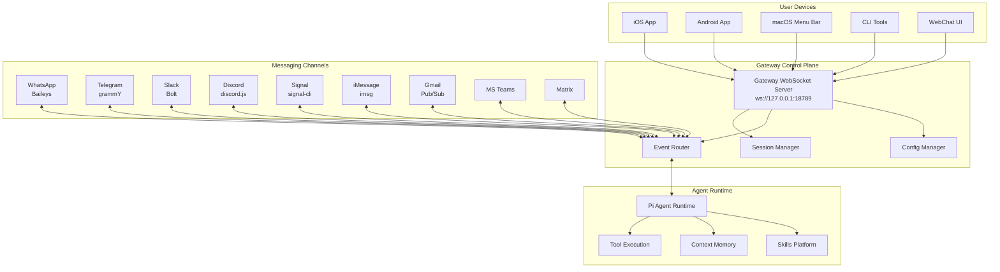
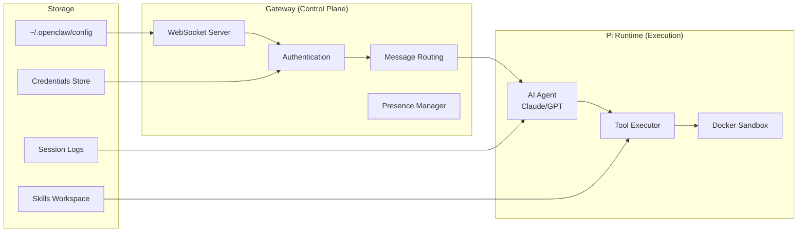
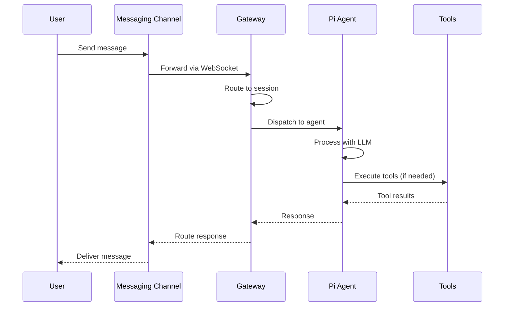
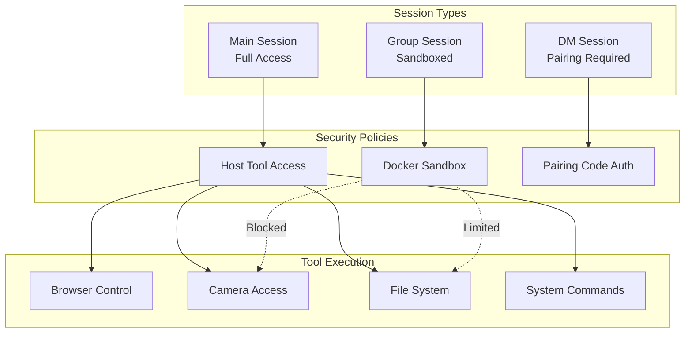
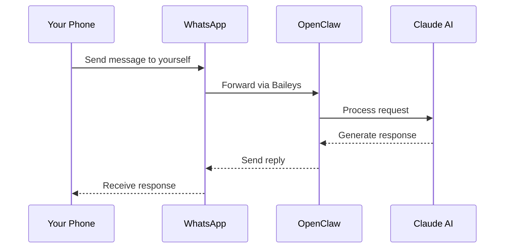
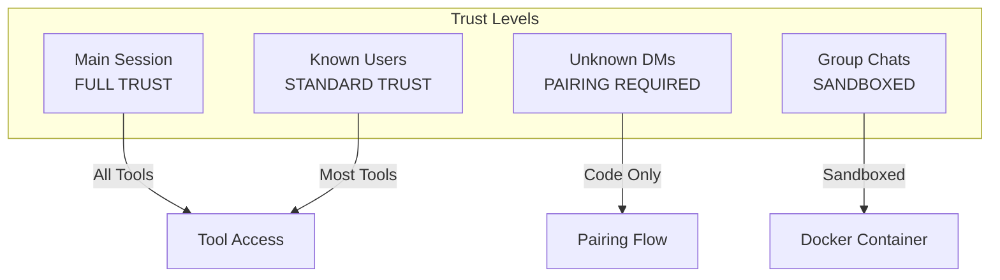

# OpenClaw Analysis & Getting Started Guide

> A comprehensive analysis of the OpenClaw personal AI assistant platform, including architecture overview, getting started guides, and security assessment.

## Table of Contents

1. [What is OpenClaw?](#what-is-openclaw)
2. [Architecture Overview](#architecture-overview)
3. [Getting Started](#getting-started)
4. [Walkthrough Examples](#walkthrough-examples)
5. [Channel Integrations](#channel-integrations)
6. [Security Model](#security-model)
7. [OWASP Agentic Security Assessment](#owasp-agentic-security-assessment)

---

## What is OpenClaw?

OpenClaw is a **personal AI assistant** that you run on your own devices. Unlike cloud-hosted AI assistants, OpenClaw operates locally with a "local-first" philosophy while seamlessly connecting to multiple messaging platforms.

### Key Characteristics

| Feature | Description |
|---------|-------------|
| **Local-First** | Runs on your devices (macOS, Linux, iOS, Android) |
| **Multi-Channel** | Connects to WhatsApp, Telegram, Slack, Discord, Gmail, and 10+ platforms |
| **Privacy-Focused** | Your conversations stay on your hardware |
| **Always-On** | Runs as a daemon/service for continuous availability |
| **Extensible** | Skills platform for adding custom capabilities |

### Who Is It For?

- **Developers** wanting a programmable AI assistant
- **Privacy-conscious users** who prefer local processing
- **Power users** managing multiple messaging platforms
- **Teams** needing a customizable AI bot framework

---

## Architecture Overview

OpenClaw follows a **hub-and-spoke architecture** with the Gateway as the central control plane.

### High-Level Architecture



### Core Components



### Data Flow Diagram



### Session & Security Model



---

## Getting Started

### Prerequisites

- **Node.js 22+** (LTS recommended)
- **Operating System**: macOS, Linux, or Windows (WSL)
- **Package Manager**: npm, pnpm, or bun

### Installation

#### Option 1: Global Install (Recommended)

```bash
# Install OpenClaw globally
npm install -g openclaw@latest

# Run the onboarding wizard
openclaw onboard --install-daemon
```

The wizard will guide you through:
1. Gateway configuration
2. Workspace setup
3. Channel authentication
4. Skill installation

#### Option 2: Development Install

```bash
# Clone the repository
git clone https://github.com/openclaw/openclaw.git
cd openclaw

# Install dependencies (pnpm recommended)
pnpm install

# Build the project
pnpm build

# Start the gateway
pnpm start
```

### Basic Configuration

Create or edit `~/.openclaw/openclaw.json`:

```json
{
  "agent": {
    "model": "anthropic/claude-opus-4-5"
  },
  "gateway": {
    "host": "127.0.0.1",
    "port": 18789
  }
}
```

### Verify Installation

```bash
# Check system health
openclaw doctor

# View status
openclaw status

# Test the agent
openclaw chat "Hello, are you working?"
```

---

## Walkthrough Examples

### Example 1: Setting Up WhatsApp Integration

WhatsApp is one of the most popular channels. Here's how to set it up:

```bash
# Step 1: Start the gateway if not running
openclaw start

# Step 2: Link WhatsApp
openclaw channel add whatsapp

# Step 3: Scan the QR code displayed in terminal
# Use WhatsApp app: Settings > Linked Devices > Link a Device

# Step 4: Verify connection
openclaw channel status whatsapp
```

**Usage Flow:**


### Example 2: Gmail Integration with Automation

Set up Gmail to trigger actions on incoming emails:

```bash
# Step 1: Enable Gmail Pub/Sub
openclaw channel add gmail

# Step 2: Authenticate with Google
# Follow OAuth flow in browser

# Step 3: Configure email rules in workspace
cat > ~/.openclaw/workspace/skills/email-handler/skill.json << 'EOF'
{
  "name": "email-handler",
  "triggers": ["gmail:inbox"],
  "actions": ["summarize", "categorize", "respond"]
}
EOF

# Step 4: Test the integration
openclaw skill run email-handler --test
```

### Example 3: Voice Commands with Google Nest

For voice interaction via Google Nest:

```bash
# Step 1: Enable Google Chat/Assistant integration
openclaw channel add google-chat

# Step 2: Link to Google Home
# In Google Home app: Settings > Works with Google > Link OpenClaw

# Step 3: Configure voice wake word
openclaw config set voice.wakeWord "Hey OpenClaw"

# Step 4: Test voice activation
# Say: "Hey OpenClaw, what's on my calendar today?"
```

### Example 4: Multi-Agent Coordination

Run multiple agents that can communicate:

```bash
# Start a research agent
openclaw session new --name research --agent researcher

# Start a coding agent
openclaw session new --name coder --agent developer

# Agents can communicate via sessions_send tool
# Research agent finds info, sends to coder
# Coder implements based on research
```

---

## Channel Integrations

### Supported Channels

| Channel | Library | Auth Method | Features |
|---------|---------|-------------|----------|
| WhatsApp | Baileys | QR/Phone Link | Messages, Media, Groups |
| Telegram | grammY | Bot Token | Messages, Commands, Inline |
| Slack | Bolt | Bot + App Token | Threads, Files, Reactions |
| Discord | discord.js | Bot Token | Servers, Threads, Voice |
| Signal | signal-cli | Phone Number | E2E Encrypted Messages |
| iMessage | imsg | macOS Only | Native Integration |
| Gmail | Pub/Sub | OAuth 2.0 | Email Triggers |
| MS Teams | Graph API | Azure AD | Teams, Channels |
| Matrix | matrix-js | Access Token | Federated Chat |
| Google Chat | Cloud API | Service Account | Spaces, DMs |

### Channel Commands

All channels support these commands:

| Command | Description |
|---------|-------------|
| `/status` | Show session info |
| `/new` or `/reset` | Clear conversation |
| `/think <level>` | Set thinking depth (off/low/medium/high) |
| `/usage` | Toggle usage reporting |
| `/activation` | Set group activation mode |

---

## Security Model

### Default Security Posture



### Security Best Practices

1. **Never expose Gateway to public internet** - Use Tailscale for remote access
2. **Use pairing policy for DMs** - Prevent unauthorized access
3. **Run group sessions in Docker** - Isolate potentially malicious inputs
4. **Keep Node.js updated** - v22.12.0+ required for security patches
5. **Regular credential rotation** - Use short-lived tokens

### Running Security Audit

```bash
# Run built-in security check
openclaw doctor --security

# Check for misconfigurations
openclaw security audit

# View current policies
openclaw config list --section security
```

---

## OWASP Agentic Security Assessment

See [OWASP-SECURITY-ASSESSMENT.md](./OWASP-SECURITY-ASSESSMENT.md) for the complete assessment against OWASP Top 10 for Agentic Applications 2026.

---

## Additional Resources

- **Official Documentation**: [OpenClaw Docs](https://github.com/openclaw/openclaw)
- **Skills Registry**: ClawHub
- **Community**: Discord/Matrix channels
- **Security**: security@openclaw.dev

---

## Frequently Asked Questions (FAQ)

### Installation & Setup

**Q: What Node.js version do I need?**
A: Node.js 22 or higher. OpenClaw will not work with Node.js 20 or earlier. Check with `node --version`.

**Q: How do I install OpenClaw on Amazon Linux / EC2?**
```bash
# Remove old Node.js if present
sudo yum remove -y nodejs20 nodejs20-npm

# Install Node.js 22
curl -fsSL https://rpm.nodesource.com/setup_22.x | sudo bash -
sudo yum install -y nodejs

# Install OpenClaw globally (requires sudo for global install)
sudo npm install -g openclaw@latest

# Run onboarding
openclaw onboard --install-daemon
```

**Q: Why do I get "EACCES permission denied" when installing?**
A: Use `sudo npm install -g openclaw@latest` for global installations on Linux.

**Q: What's the difference between CloudShell and EC2?**
A: AWS CloudShell is a browser-based shell environment separate from your EC2 instances. To work on EC2, you must SSH into it:
```bash
ssh -i /path/to/key.pem ec2-user@YOUR_EC2_IP
```

### Gateway & Services

**Q: How do I start the gateway without systemd?**
A: Use foreground mode with a process manager:
```bash
# Option 1: nohup
nohup openclaw gateway start --foreground > ~/.openclaw/gateway.log 2>&1 &

# Option 2: screen
screen -S openclaw
openclaw gateway start --foreground
# Detach: Ctrl+A, D

# Option 3: PM2
pm2 start "openclaw gateway start --foreground" --name openclaw-gateway
```

**Q: Why is my gateway "unreachable"?**
A: The gateway service isn't running. Start it with `openclaw gateway start --foreground` or install the daemon with `openclaw onboard --install-daemon`.

**Q: How do I keep OpenClaw running permanently on EC2?**
A: Use systemd (available on full EC2, not CloudShell):
```bash
openclaw onboard --install-daemon
# This installs systemd services that auto-start on boot
```

### Channels

**Q: How do I link WhatsApp?**
```bash
openclaw channel add whatsapp
# Scan the QR code with WhatsApp > Settings > Linked Devices > Link a Device
```

**Q: Can I link the same WhatsApp account to multiple OpenClaw instances?**
A: No. WhatsApp allows only one linked session per "Linked Devices" slot. Unlink from the old instance first before linking to a new one.

**Q: How do I unlink WhatsApp?**
```bash
openclaw channel remove whatsapp
# Or from phone: WhatsApp > Settings > Linked Devices > Select device > Log out
```

### Skills & Dependencies

**Q: Why are skills failing to install with "brew not installed"?**
A: Some skills require Homebrew. Install it on Linux:
```bash
/bin/bash -c "$(curl -fsSL https://raw.githubusercontent.com/Homebrew/install/HEAD/install.sh)"
eval "$(/home/linuxbrew/.linuxbrew/bin/brew shellenv)"
echo 'eval "$(/home/linuxbrew/.linuxbrew/bin/brew shellenv)"' >> ~/.bashrc
```

**Q: What are the common Homebrew packages needed for skills?**
```bash
brew install go    # For blogwatcher skill
brew install uv    # For nano-pdf skill (Python package manager)
```

**Q: Can I skip skill installation?**
A: Yes, OpenClaw works without optional skills. Select "Skip for now" during onboarding and install them later with `openclaw skill install <name>`.

### Security

**Q: How do I fix "Credentials dir is readable by others"?**
```bash
chmod 700 ~/.openclaw/credentials
```

**Q: What does "Gateway auth missing on loopback" mean?**
A: If your gateway is only accessed locally (127.0.0.1), this is acceptable. If exposing via reverse proxy, set `gateway.auth` in your config.

**Q: Which AI model should I use?**
A: Use Claude 4.5+ (Opus or Sonnet) for production. Haiku is cheaper but more susceptible to prompt injection. Configure in `~/.openclaw/openclaw.json`:
```json
{
  "agent": {
    "model": "anthropic/claude-opus-4-5"
  }
}
```

### Troubleshooting

**Q: Where are the logs?**
```bash
openclaw logs --follow
# Or check: ~/.openclaw/logs/
```

**Q: How do I reset everything?**
```bash
rm -rf ~/.openclaw
openclaw onboard --install-daemon
```

**Q: How do I check system health?**
```bash
openclaw doctor --fix
openclaw status --deep
openclaw security audit --deep
```

---

## Appendix A: Installation Log - February 1, 2026

### Session Summary

This appendix documents the complete OpenClaw installation and exploration session conducted on February 1, 2026.

### What We Did

#### 1. Environment Preparation
- Created feature branch `claude/openclaw-tinkering-aI4U7` for OpenClaw exploration
- Installed **Agentic QE** (Quality Engineering platform) - 63 skills, 51 agents
- Installed **Claude-Flow V3** (AI orchestration platform) - 92 agents, 30 skills, HNSW vector indexing

#### 2. OpenClaw Analysis
- Analyzed the OpenClaw codebase from https://github.com/openclaw/openclaw
- Created comprehensive documentation with Mermaid architecture diagrams
- Documented all 10+ messaging channel integrations
- Created Claude agent skill for channel integration (`.claude/skills/openclaw-channel-integration/`)

#### 3. Security Assessment
- Completed full **OWASP Top 10 for Agentic Applications 2026** assessment
- Documented in `OWASP-SECURITY-ASSESSMENT.md`
- Created reference guide `OWASP-TOP-10-AGENTIC-2026.md`
- Risk ratings: 4 LOW, 6 MEDIUM, 0 HIGH/CRITICAL

#### 4. AWS Installation Journey

**Initial Attempt (AWS CloudShell):**
```
Location: AWS CloudShell (browser-based shell)
Issue: CloudShell ≠ EC2 instance
```

**Node.js Upgrade:**
```bash
# Problem: Node.js 20 installed, OpenClaw requires 22+
# Solution:
sudo yum remove -y nodejs20 nodejs20-npm
curl -fsSL https://rpm.nodesource.com/setup_22.x | sudo bash -
sudo yum install -y nodejs
```

**OpenClaw Installation:**
```bash
# Problem: EACCES permission denied
# Solution: Use sudo for global install
sudo npm install -g openclaw@latest
# Result: 696 packages installed
```

**Homebrew Installation (for optional skills):**
```bash
/bin/bash -c "$(curl -fsSL https://raw.githubusercontent.com/Homebrew/install/HEAD/install.sh)"
eval "$(/home/linuxbrew/.linuxbrew/bin/brew shellenv)"
brew install go uv
```

**Gateway Issue:**
```
Problem: "systemd user services are unavailable"
Cause: CloudShell doesn't have systemd
Solution: Use foreground mode or migrate to proper EC2 instance
```

### Lessons Learned

| Lesson | Detail |
|--------|--------|
| **CloudShell ≠ EC2** | AWS CloudShell is a separate environment, not connected to EC2 instances |
| **Node.js 22 Required** | OpenClaw strictly requires Node.js 22+, won't work with v20 |
| **Package Conflicts** | Must remove old nodejs packages before installing new version |
| **sudo for Global Install** | Linux requires `sudo npm install -g` for global packages |
| **systemd Availability** | CloudShell lacks systemd; use foreground mode or PM2/screen |
| **Homebrew on Linux** | Works via Linuxbrew at `/home/linuxbrew/.linuxbrew/` |
| **WhatsApp Single Link** | Can only link WhatsApp to one OpenClaw instance at a time |

### Current Status (FINAL - February 1, 2026)

| Component | Status | Notes |
|-----------|--------|-------|
| OpenClaw CLI | ✅ Installed | v2026.1.30 on EC2 |
| Node.js | ✅ v24.13.0 | Via nvm on EC2 |
| Gateway | ✅ **Running** | systemd active (pid 7224) |
| systemd | ✅ Enabled | Auto-starts on boot |
| WhatsApp | ✅ **Linked & Working** | +447786265893 on EC2 |
| Skills | ⚠️ Partial | 4 eligible, 45 missing requirements |
| Plugins | ✅ 2 Loaded | 28 disabled, 0 errors |

**OpenClaw is fully operational and responding to WhatsApp messages!**

---

## Appendix B: EC2 Migration Journey - February 1, 2026 (Continued)

After the initial CloudShell setup documented in Appendix A, we completed the migration to EC2 for production use.

### Phase 1: Understanding CloudShell vs EC2

**Key Learning:** AWS CloudShell is NOT your EC2 instance - it's a separate browser-based shell environment.

```bash
# To find your EC2 instance from CloudShell:
aws ec2 describe-instances --query 'Reservations[*].Instances[*].[InstanceId,PublicIpAddress,State.Name]' --output table

# Result:
# i-00f2c778c02ec7a53 | 52.207.252.100 | running
```

### Phase 2: SSH Key Permissions

**Problem:** SSH key file had wrong permissions
```
@@@@@@@@@@@@@@@@@@@@@@@@@@@@@@@@@@@@@@@@@@@@@@@@@@@@@@@@@@@
@         WARNING: UNPROTECTED PRIVATE KEY FILE!          @
@@@@@@@@@@@@@@@@@@@@@@@@@@@@@@@@@@@@@@@@@@@@@@@@@@@@@@@@@@@
Permissions 0644 for 'moltbot.pem' are too open.
```

**Solution:**
```bash
chmod 400 moltbot.pem
ssh -i moltbot.pem ec2-user@52.207.252.100
```

### Phase 3: Config Migration via Tarball

Migrated OpenClaw config from CloudShell to EC2:

```bash
# On CloudShell - create backup
tar -czvf openclaw-backup.tar.gz -C ~ .openclaw

# Copy to EC2
scp -i moltbot.pem openclaw-backup.tar.gz ec2-user@52.207.252.100:~/

# On EC2 - extract (note: paths need adjustment)
tar -xzvf openclaw-backup.tar.gz -C ~/
mv ~/home/cloudshell-user/.openclaw ~/.openclaw
rm -rf ~/home
```

### Phase 4: EC2 Node.js & OpenClaw Installation

**Existing state:** EC2 had Node.js v24.13.0 via nvm

**Problem:** npm install hung due to low memory (1.9GB RAM, no swap)

**Solution - Add swap space:**
```bash
# Create 1GB swap file
sudo dd if=/dev/zero of=/swapfile bs=128M count=8
sudo chmod 600 /swapfile
sudo mkswap /swapfile
sudo swapon /swapfile

# Then install OpenClaw
sudo npm install -g openclaw@latest
```

**What is swap?** Virtual memory that uses disk storage when RAM runs out. Essential for npm on small EC2 instances.

### Phase 5: systemd Configuration

**What is systemd?** Linux's service manager that:
- Starts services when Linux boots
- Auto-restarts crashed services
- Manages dependencies between services
- Captures logs via `journalctl`

**Setup:**
```bash
openclaw onboard --install-daemon
```

**Useful systemd commands:**
```bash
systemctl --user status openclaw-gateway    # Check status
systemctl --user restart openclaw-gateway   # Restart
systemctl --user enable openclaw-gateway    # Enable auto-start
journalctl --user -u openclaw-gateway -f    # View logs
```

### Phase 6: WhatsApp Re-linking

WhatsApp sessions are tied to a single device. After migrating to EC2, we needed to re-link:

```bash
# WhatsApp session from CloudShell was logged out
openclaw channels login
# Scanned QR code with phone
# Result: "✅ Linked after restart; web session ready."
```

### Phase 7: Security Hardening

Fixed permission warnings:
```bash
chmod 700 /home/ec2-user/.openclaw
chmod 700 /home/ec2-user/.openclaw/credentials
```

### Phase 8: Gateway Startup Issues

**Problem:** Gateway service stuck in "activating" state

**Root cause:** systemd service was pointing to wrong Node.js path (nvm vs system)

**Solution:**
```bash
systemctl --user restart openclaw-gateway
systemctl --user status openclaw-gateway
# Result: Active: active (running)
```

### Final Verification

```bash
openclaw status
```

**Output confirmed:**
- Gateway: ✅ reachable (88ms)
- Gateway service: ✅ systemd installed, enabled, running (pid 7224)
- WhatsApp: ✅ ON, linked, auth just now

### Key Commands Reference

| Task | Command |
|------|---------|
| Check status | `openclaw status` |
| View logs | `openclaw logs --follow` |
| Health check | `openclaw doctor --fix` |
| Restart gateway | `systemctl --user restart openclaw-gateway` |
| Security audit | `openclaw security audit --deep` |
| Link WhatsApp | `openclaw channels login` |

### npm vs npx Explained

| Aspect | npm | npx |
|--------|-----|-----|
| Purpose | Install packages | Run packages |
| Persistence | Permanent | Temporary |
| Example | `npm install -g openclaw` | `npx openclaw@latest status` |
| When to use | Production installs | Testing/one-off runs |

### Files Created This Session

| File | Purpose |
|------|---------|
| `projects/openclaw-analysis/README.md` | Main documentation (this file) |
| `projects/openclaw-analysis/OWASP-SECURITY-ASSESSMENT.md` | Security assessment |
| `projects/openclaw-analysis/OWASP-TOP-10-AGENTIC-2026.md` | OWASP reference guide |
| `.claude/skills/openclaw-channel-integration/SKILL.md` | Channel integration skill |

### EC2 Instance Details

```
Instance ID: i-00f2c778c02ec7a53
Public IP: 52.207.252.100
State: running
Node.js: v24.13.0 (nvm)
OpenClaw: v2026.1.30
Gateway: ws://127.0.0.1:18789 (systemd managed)
WhatsApp: +447786265893 (linked)
```

### Success Criteria Met

1. ✅ OpenClaw installed on production EC2 instance
2. ✅ systemd service enabled (auto-starts on reboot)
3. ✅ Gateway running and reachable
4. ✅ WhatsApp linked and responding to messages
5. ✅ Security permissions hardened
6. ✅ Comprehensive documentation created

---

*Generated for the vibe-cast project - OpenClaw Analysis*
*Last updated: February 1, 2026 - EC2 Migration Complete*
