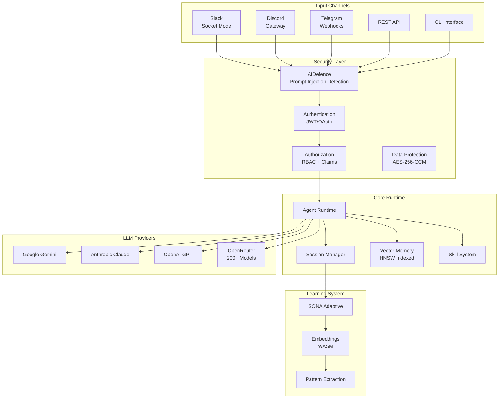
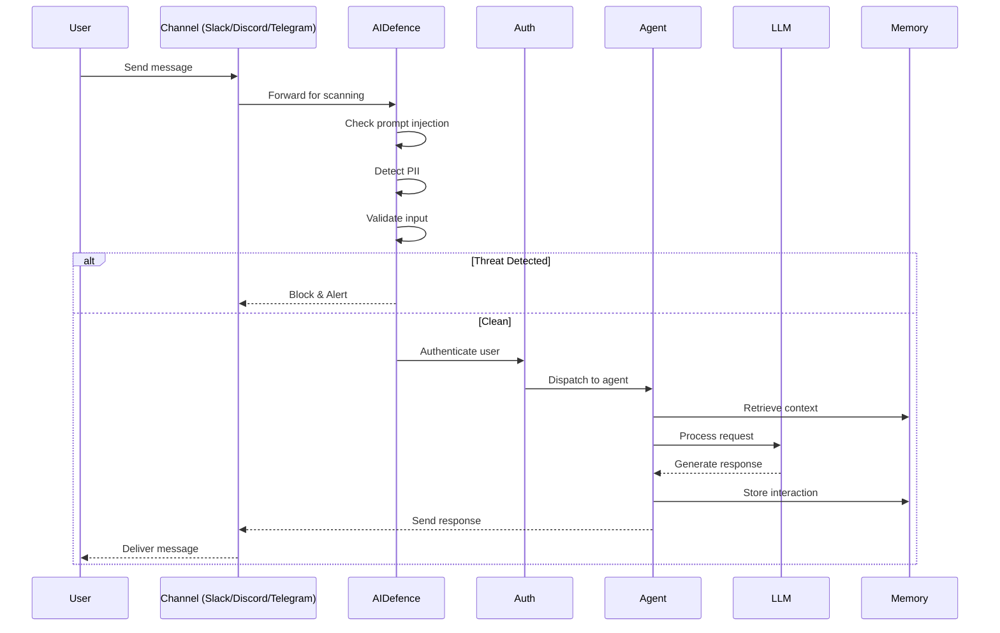
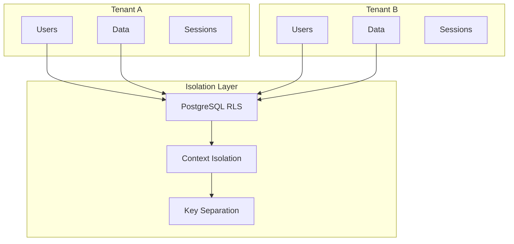

# RuvBot Analysis & Security Assessment

> A comprehensive analysis of the RuvBot enterprise AI assistant platform, including architecture overview, security features, and OWASP Agentic Applications 2026 assessment.

## Table of Contents

1. [What is RuvBot?](#what-is-ruvbot)
2. [Architecture Overview](#architecture-overview)
3. [Security Architecture](#security-architecture)
4. [Platform Integrations](#platform-integrations)
5. [OWASP Agentic Security Assessment](#owasp-agentic-security-assessment)

---

## What is RuvBot?

RuvBot is an **enterprise-grade self-learning AI assistant** with military-strength security, high-performance vector search, and multi-platform support. It emphasizes security-first design with a 6-layer defense architecture.

### Key Characteristics

| Feature | Description |
|---------|-------------|
| **Enterprise Security** | 6-layer defense with AIDefence integration |
| **High Performance** | 150x-12,500x faster vector search via HNSW indexing |
| **Multi-LLM Support** | 12+ models including Claude, GPT, Gemini, Qwen |
| **Self-Learning** | SONA adaptive system with trajectory tracking |
| **Multi-Channel** | Slack, Discord, Telegram, REST API, CLI |

### Version Information

- **Package**: ruvbot
- **Version**: 0.2.0
- **Node.js**: 18+ required
- **License**: MIT

---

## Architecture Overview

RuvBot follows **Domain-Driven Design (DDD)** with seven bounded contexts.

### High-Level Architecture



### Bounded Contexts (DDD)

```mermaid
flowchart LR
    subgraph "Core Context"
        Agent[Agent]
        Session[Session]
        Memory[Memory]
        Skill[Skill]
    end

    subgraph "Infrastructure"
        EventBus[Event Bus]
        Queue[Queue Manager]
        WorkerPool[Worker Pool]
        Persistence[Persistence]
    end

    subgraph "Integration"
        SlackInt[Slack]
        Webhooks[Webhooks]
        Providers[LLM Providers]
    end

    subgraph "Security"
        AuthContext[Auth]
        RBAC[RBAC]
        AIDefenceCtx[AIDefence]
    end

    subgraph "Learning"
        EmbeddingsCtx[Embeddings]
        Training[Training]
        PatternRecog[Pattern Recognition]
    end

    Core Context --> Infrastructure
    Core Context --> Integration
    Security --> Core Context
    Learning --> Core Context
```

### Data Flow



---

## Security Architecture

RuvBot implements a **6-layer security model** designed to address vulnerabilities in competing AI assistants.

### Security Layers

```mermaid
flowchart TB
    subgraph "Layer 1: Transport"
        TLS[TLS 1.3]
        HSTS[HSTS Headers]
        CertPin[Certificate Pinning]
    end

    subgraph "Layer 2: Authentication"
        JWT[JWT RS256]
        OAuth[OAuth 2.0]
        RateLimit[Rate Limiting]
    end

    subgraph "Layer 3: Authorization"
        RBACLayer[Role-Based Access]
        Claims[Claims-Based Access]
        TenantIso[Tenant Isolation]
    end

    subgraph "Layer 4: Data Protection"
        AES[AES-256-GCM]
        KeyRotation[Key Rotation]
        AtRest[Encryption at Rest]
    end

    subgraph "Layer 5: AI Defense"
        PromptInj[Prompt Injection Detection]
        Jailbreak[Jailbreak Prevention]
        PII[PII Detection & Masking]
        Anomaly[Behavioral Anomaly Detection]
    end

    subgraph "Layer 6: Sandbox"
        WASM[WASM Isolation]
        MemLimits[Memory Limits]
        ResourceCap[Resource Caps]
    end

    Layer 1 --> Layer 2
    Layer 2 --> Layer 3
    Layer 3 --> Layer 4
    Layer 4 --> Layer 5
    Layer 5 --> Layer 6
```

### AIDefence Integration

| Protection | Description | Latency |
|------------|-------------|---------|
| Prompt Injection | 50+ signature patterns | <10ms |
| Jailbreak Prevention | DAN, bypass, roleplay detection | <10ms |
| PII Detection | Emails, phones, SSNs, API keys | <10ms |
| Unicode Normalization | Homoglyph attack prevention | <1ms |
| Behavioral Anomaly | Pattern deviation detection | <5ms |

### Multi-Tenancy Security



---

## Platform Integrations

### Supported Channels

| Channel | Protocol | Auth Method | Features |
|---------|----------|-------------|----------|
| Slack | Socket Mode | Bot Token + App Token | Real-time, threads, reactions |
| Discord | Gateway | Bot Token | Slash commands, intents |
| Telegram | Webhook/Polling | Bot Token | Groups, inline mode |
| REST API | HTTP/HTTPS | JWT/API Key | Programmatic access |
| CLI | Local | Environment | Development, admin |

### LLM Provider Support

| Provider | Models | Default |
|----------|--------|---------|
| Google | Gemini 2.5 Pro | ✅ |
| Anthropic | Claude 3.5/4 | - |
| OpenAI | GPT-4/4o | - |
| OpenRouter | 200+ models | - |
| Qwen | Qwen 2.5 | - |
| DeepSeek | DeepSeek v3 | - |

---

## OWASP Agentic Security Assessment

See [OWASP-SECURITY-ASSESSMENT.md](./OWASP-SECURITY-ASSESSMENT.md) for the complete assessment against OWASP Top 10 for Agentic Applications 2026.

### Executive Summary

| Vulnerability | Risk Level | Mitigation Status |
|--------------|------------|-------------------|
| ASI01: Goal Hijack | 🟢 LOW | ✅ Strong |
| ASI02: Tool Misuse | 🟡 MEDIUM | ⚠️ Partial |
| ASI03: Identity Abuse | 🟢 LOW | ✅ Strong |
| ASI04: Supply Chain | 🟡 MEDIUM | ⚠️ Partial |
| ASI05: Code Execution | 🟢 LOW | ✅ Strong |
| ASI06: Memory Poisoning | 🟢 LOW | ✅ Strong |
| ASI07: Insecure Comms | 🟢 LOW | ✅ Strong |
| ASI08: Cascading Failures | 🟡 MEDIUM | ⚠️ Partial |
| ASI09: Trust Exploitation | 🟢 LOW | ✅ Strong |
| ASI10: Rogue Agents | 🟢 LOW | ✅ Strong |

**Overall Security Posture: STRONG** - RuvBot demonstrates enterprise-grade security with explicit defenses against common agentic vulnerabilities.

---

## Additional Resources

- **GitHub**: [ruvnet/ruvector](https://github.com/ruvnet/ruvector/tree/main/npm/packages/ruvbot)
- **npm**: [ruvbot](https://www.npmjs.com/package/ruvbot)
- **Documentation**: Included in package

---

*Generated for the vibe-cast project - RuvBot Analysis*
*Date: February 2, 2026*
