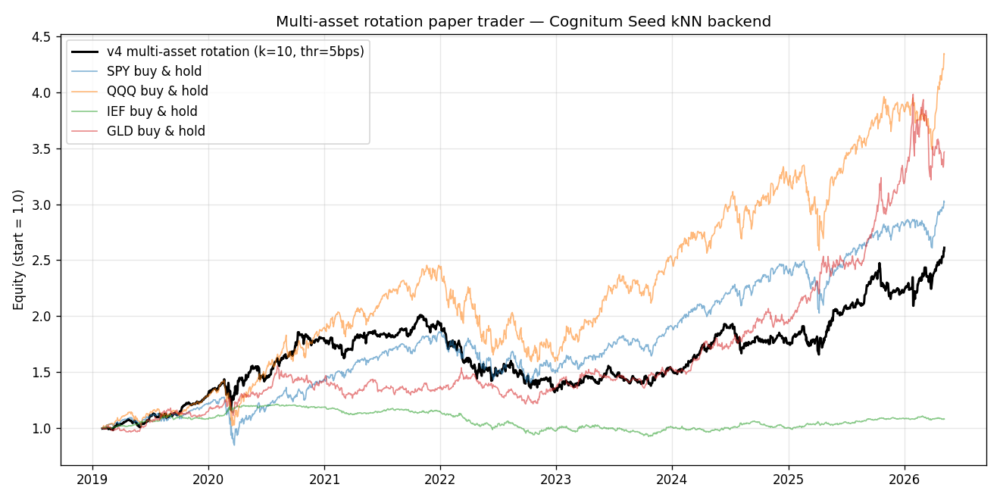

# Neural Trader — v4: multi-asset rotation

**Backend:** Cognitum Seed `0.21.12`, RVF vector store via SSH tunnel
**Universe:** SPY, QQQ, IEF, GLD + cash
**Data:** daily bars, 2019-02-01 → 2026-05-07 (1826 walk-forward bars)
**Embedding:** 8-dim per asset (same 7 base features + bias as v1.5), z-scored on each asset's own warmup window.
**Method:** at each bar, query each asset's own kNN history (filter to per-asset id range), take winner = argmax(mean_pred);
hold winner if mean_pred > 5 bps else cash. 1-day hold; 1 bps/side slippage.

## Headline

| Metric | Strategy | SPY buy & hold |
|---|---|---|
| Final equity | **2.6113** | 3.0204 |
| CAGR | **14.16%** | 16.48% |
| Sharpe (daily, ann.) | **0.79** | — |
| Max drawdown | **-34.33%** | -33.72% |
| Hit rate (bar-days) | **54.40%** | — |
| Position flips | 1306 | — |
| Bars in market | 1636 / 1826 | — |
| Insufficient-neighbors events | 32 | — |

## Position distribution

| held | bars |
|---|---|
| SPY | 384 |
| QQQ | 590 |
| IEF | 169 |
| GLD | 493 |
| cash | 190 |

## Notes

- Vectors written to seed under id ranges: SPY=[13_000_000_000, 13_000_002_079), QQQ=[14_000_000_000, 14_000_002_079), IEF=[15_000_000_000, 15_000_002_079), GLD=[16_000_000_000, 16_000_002_079).
- Cog `neural-trader` was stopped during this run.
- Each asset's kNN searches only its own history (id-range filtering on cosine query results).
- Cash position earns 0% per bar (no money-market proxy); a real implementation would substitute SHV/BIL.
