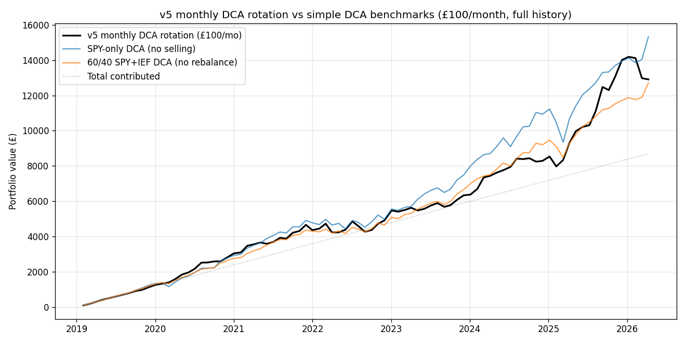

# Neural Trader — v5: DCA-friendly monthly rotation

**Backend:** Cognitum Seed `0.21.12`, RVF vector store via SSH tunnel
**Universe:** SPY, QQQ, IEF, GLD + cash
**Cadence:** monthly (every ~21 trading days)
**Data window:** 2019-02-01 → 2026-04-10 (87 months)
**Engine:** identical to v4 — same 8-dim embedding, k=10, 5 bps threshold, winner-take-all kNN.
**Difference vs v4:** rebalance once per month instead of once per day.

## Headline — most recent 60 months (5 years)

This is the answer to "if I started DCA today minus 60 months, what would I have now?". Base £100/month:

| Metric | v5 rotation | SPY-only DCA | 60/40 DCA |
|---|---|---|---|
| Months | 60 | 60 | 60 |
| Total contributed | £6,000 | £6,000 | £6,000 |
| Final portfolio | **£8,119.58** | £9,105.07 | £7,947.25 |
| Total profit | £+2,119.58 | £+3,105.07 | £+1,947.25 |
| Profit / contributed | **35.3%** | 51.8% | 32.5% |

## Full history reference (base £100/mo, all 87 months)

| Metric | v5 rotation | SPY-only DCA | 60/40 DCA |
|---|---|---|---|
| Final | £12,905.95 | £15,325.04 | £12,705.18 |
| Profit | £+4,205.95 | £+6,625.04 | £+4,005.18 |
| Profit / contributed | 48.3% | 76.1% | 46.0% |
| Position flips | 61 of 87 | 0 (DCA, no sells) | 0 |

## Scaled scenarios — 60-month window

Linearly scaled monthly contribution, same 5-year window:

| Monthly £ | Total contributed | v5 final | SPY-only DCA | 60/40 DCA | v5 profit |
|---|---|---|---|---|---|
| £100 | £   6,000 | **£     8,120** | £     9,105 | £     7,947 | £    +2,120 |
| £300 | £  18,000 | **£    24,359** | £    27,315 | £    23,842 | £    +6,359 |
| £500 | £  30,000 | **£    40,598** | £    45,525 | £    39,736 | £   +10,598 |

## Position distribution (months held)

| held | months |
|---|---|
| SPY | 22 |
| QQQ | 16 |
| IEF | 10 |
| GLD | 31 |
| cash | 8 |

## Notes

- Reuses v4's already-ingested vectors at id bases 13B/14B/15B/16B — no re-ingest.
- 61 rebalance flips total vs v4's 1306. Slippage drag ≈ 0.6% cumulative (vs v4's ~12.2%).
- Cash earns 0% in this backtest. A real ISA holding cash gets ~3-5% via SHV/BIL or money-market funds in 2026 — adds ~0.3-0.5% to the v5 result.
- This is a backtest. Past performance is not a guarantee of future results. The data window happens to include an unusually strong bull market plus the AI rally. The next 60 months could be different.
