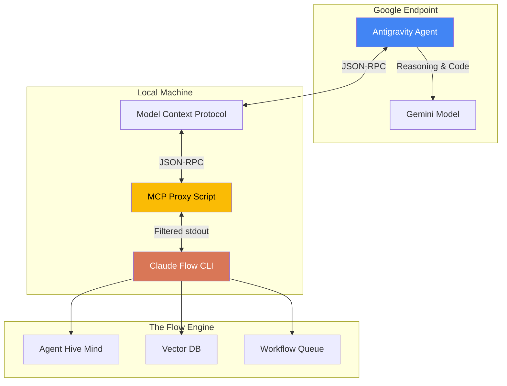
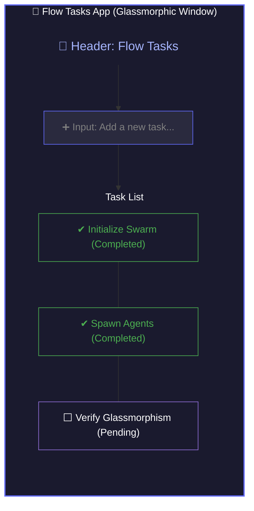
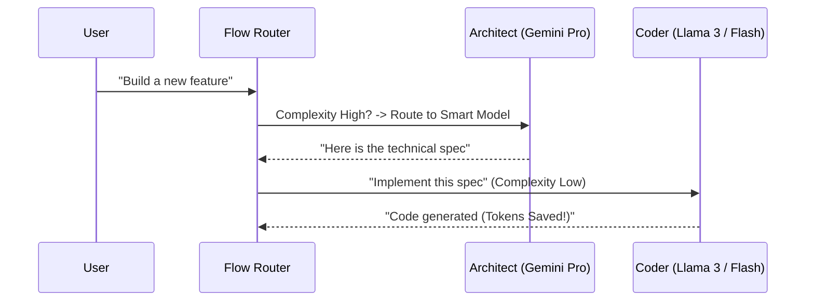

# Mastering Claude Flow on Google Antigravity

**Orchestrating Hierarchical Agent Swarms within the Antigravity Ecosystem**

## 1. Introduction: Why Unified Agent Orchestration?

In the rapidly evolving landscape of AI coding assistants, we often find ourselves choosing between "Smart Models" and "Smart Frameworks". **Claude Flow** bridges this gap. It is an advanced CLI tool designed to bring **Persistent Memory**, **Swarm Intelligence**, and **Agentic Workflows** to any environment that speaks the Model Context Protocol (MCP).

### Key Benefits

*   **🧠 Hive Mind & Swarm Capabilities**: Instead of one-shot prompts, deploy a hierarchical mesh of 15+ specialized agents (Architects, Coders, QA) that collaborate to solve complex problems.
*   **💾 Persistent Memory**: The system remembers context, learning from past interactions via a hybrid vector database (HNSW), meaning you don't have to keep re-explaining project details.
*   **🔌 MCP Universal Connectivity**: Because it exposes its capabilities via MCP, it plugs directly into modern editors like **Antigravity** (Claude Desktop).
*   **💰 Token Efficiency**: By using specialized agents, you can route simple tasks to smaller, faster models and reserve the "heavy lifters" for complex reasoning (more on this in Section 5).

---

## 2. The "Agnostic" Architecture

A common misconception is that "Claude Flow" only works with Anthropic's Claude. **This is false.**

Claude Flow is an **orchestration layer**. It defines *how* the work is organized (the tasks, the swarm, the vectors), but it is happy to let *any* sufficiently smart brain do the driving.

In our setup, we are using **Google's Antigravity** (powered by Gemini) as the **Brain**, while using **Claude Flow** as the **Toolbelt**.

### How it Works



**The Breakdown:**
1.  **Antigravity** decides it needs to "Spawn a Swarm".
2.  It sends an MCP instruction.
3.  Our **Proxy Script** (the secret sauce) sanitizes the communication.
4.  **Claude Flow CLI** executes the logic, spinning up the requested agent structures.

---

## 3. Implementation Guide: Getting it Running

This setup solves the "Noisy Logs" problem where the CLI's human-readable output breaks the MCP protocol.

### Prerequisites
*   Node.js (v20 or higher)
*   Claude Desktop (Antigravity) setup locally

### Step 1: The Magic Proxy Script
Create a file named `mcp-proxy.js`. This script acts as a filter, ensuring only valid JSON reaches Antigravity.

```javascript
#!/usr/bin/env node
const { spawn } = require('child_process');

// Usage: node mcp-proxy.js <command> [args...]
const [,, command, ...args] = process.argv;

if (!command) process.exit(1);

const child = spawn(command, args, {
  stdio: ['inherit', 'pipe', 'inherit'], 
  shell: false
});

let buffer = '';

child.stdout.on('data', (data) => {
  buffer += data.toString();
  const lines = buffer.split('\n');
  buffer = lines.pop(); 

  for (const line of lines) {
    const trimmed = line.trim();
    // Only pass through valid JSON (MCP Protocol)
    if (trimmed.startsWith('{')) {
      console.log(line);
    }
  }
});
```

### Step 2: Configure Antigravity
Edit your `claude_desktop_config.json`. We use **absolute paths** to ensure stability.

```json
{
  "mcpServers": {
    "claude-flow": {
      "command": "/absolute/path/to/node",
      "args": [
        "/absolute/path/to/mcp-proxy.js",
        "/absolute/path/to/npx",
        "-y",
        "@claude-flow/cli@latest",
        "mcp",
        "start"
      ]
    }
  }
}
```

---

## 4. Sample Project: "The Glassmorphic Task App"

Let's verify the integration by letting the swarm build an app.

### The Objective
Create a modern React task list app with glassmorphism design, purely through agent orchestration.

### The "One-Shot" Prompt
Once connected, paste this into Antigravity:

> "Use Claude Flow to initialize a V3 swarm. Spawn an 'Architect' agent to design a glassmorphic React Task App, and a 'Coder' agent to implement it using Vite. Execute the plan."

### The Results

The swarm will:
1.  **Init**: `claude-flow swarm init --v3-mode`
2.  **Spawn**: Create specialized roles (`architect-1`, `coder-1`).
3.  **Produce**:

**`src/index.css` (Generated Design System)**
```css
:root {
  --glass-bg: rgba(255, 255, 255, 0.05);
  --glass-border: rgba(255, 255, 255, 0.1);
  --glass-shadow: 0 8px 32px 0 rgba(0, 0, 0, 0.37);
}
.glass-panel {
  background: var(--glass-bg);
  backdrop-filter: blur(12px);
}
```

**The Final App**:
A fully functional, persistent task dashboard that looks like this:



---

## 5. Advanced Feature: Dynamic Model Selection

Starting with **Claude Flow V3**, you are not locked into one model. You can configure the swarm to route tasks dynamically to different providers (including local ones like Ollama!).

### Why is this huge?
*   **Cost**: Use **Gemini Flash** or **Llama 3** (via Ollama) for bulk code generation or test writing.
*   **Intelligence**: Reserve **Claude 3.5 Sonnet** or **Gemini Pro** for Architecture and Complex Reasoning.

### Configuration
You can manage this directly via the CLI (which Antigravity can now control!).

**Command to list providers:**
```bash
npx @claude-flow/cli@latest config providers
```

**Command to enable a local model (Free!):**
```bash
npx @claude-flow/cli@latest config providers --enable ollama --model llama3
```

**Command to set priority:**
```bash
npx @claude-flow/cli@latest config set providers.ollama.priority 1
```

### The Hybrid Swarm Workflow



By leveraging this, **Antigravity** becomes the Commander, while **Claude Flow** manages a cost-effective, high-performance army of specialized agents.
