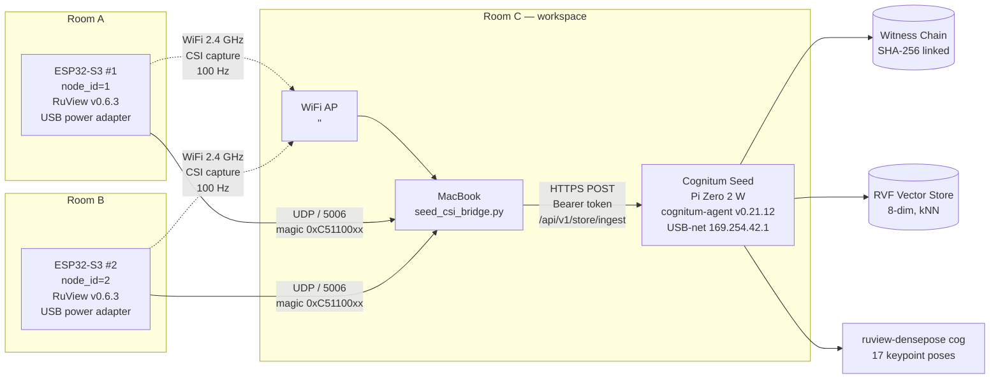
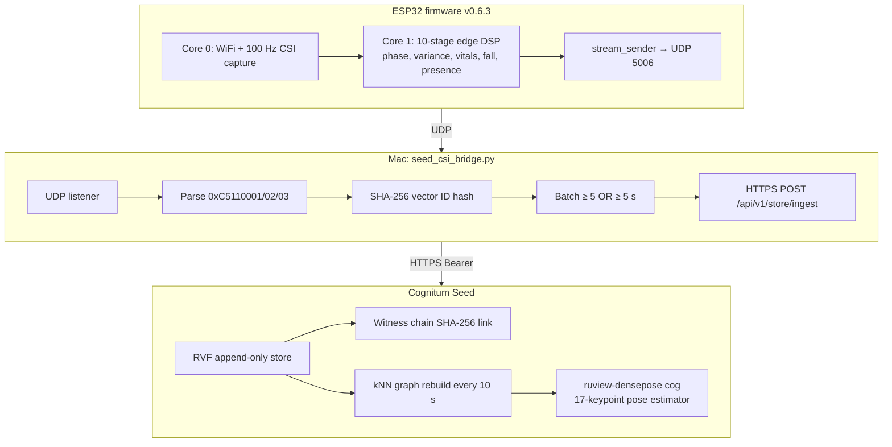
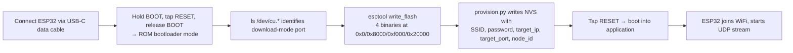
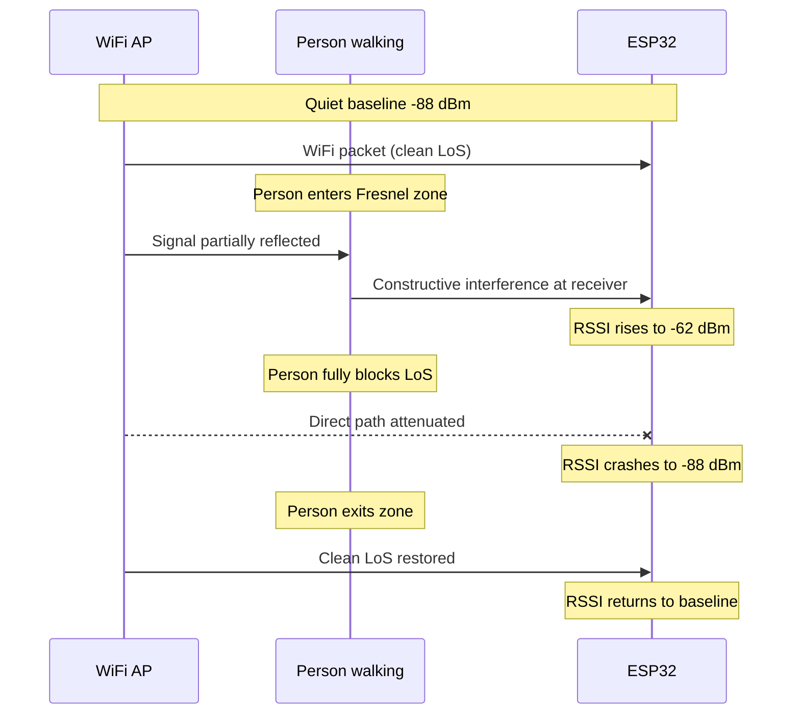
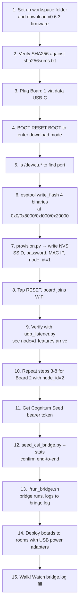

# Sensing Through Walls
## A Hands-On Build and Empirical Audit of a Two-Node WiFi-CSI Vital-Sign Pipeline With Cryptographic Provenance

**Subject of the experiment & primary investigator:** **Mondweep Chakravorty**
[LinkedIn — linkedin.com/in/mondweepchakravorty](https://www.linkedin.com/in/mondweepchakravorty/)
*Questions, replication attempts, peer review, or collaboration enquiries are warmly welcomed via LinkedIn. The data files referenced in this paper are available on request.*

**Co-investigator and scribe:** Claude (Anthropic), via Cowork mode with MCP access to the experimental hardware.
**Date:** 6 May 2026
**Hardware under test:** 1 × Cognitum Seed (Raspberry Pi Zero 2 W appliance) · 2 × ESP32-S3-N16R8 dev boards · 1 × MacBook Pro (host)
**Network:** Home WiFi 2.4 GHz, SSID `<HOME_WIFI_SSID>`
**Repository:** [github.com/mondweep/vibe-cast — `cognitum-one-get-started-20260506-214243`](https://github.com/mondweep/vibe-cast/tree/cognitum-one-get-started-20260506-214243) — bridge code (`cognitum-bridge.mjs`, `seed_csi_bridge.py`), ESP32-S3 firmware bundle (`cognitum-esp32-v0.6.3/`), MCP setup notes, and this paper. Sufficient to replicate the full pipeline given the hardware listed above.
**Status:** v2-public — *redacted for public release; original values available on request from the author.* Constructive critique sought, particularly on §6.8 (person-count discrimination) and §9 (threats to validity).

---

## Plain-Language Summary

We bought two ~$10 microcontrollers and a ~$15 Raspberry-Pi-class device, plugged them into our home WiFi, and asked: can these tiny devices sense a person walking through the home using nothing but the WiFi signals already in the air?

Short answer: **yes for movement and breathing rate, no for heart rate or person counting under the firmware as deployed.** A human body crossing the line-of-sight between an access point and an ESP32 produces a textbook fingerprint — RSSI swings of 30+ dB — that we logged hundreds of times over a 30-minute observation. Two independent ESP32s in different rooms reported the same breathing rate (within 1 BPM), giving us cross-validation we trust. Heart rate, however, was reported as canned constants (40 or 48 BPM) regardless of stillness, and the person-count signal saturated at the maximum (always reporting "4 people") regardless of actual occupancy — both v0.6.3 firmware limitations rather than physical ones. Every observation was committed to a SHA-256-linked tamper-evident log on the Cognitum Seed; over the session, that log grew from 441 to over 48,000 entries, each cryptographically chained to its predecessor.

---

## Abstract

**Background.** WiFi Channel-State-Information (CSI) sensing is a well-established research area with publicly documented techniques for extracting human presence, motion, and vital signs from commodity 802.11 hardware. Open-source firmware (the *RuView CSI Node*) and a paired edge-AI appliance (the *Cognitum Seed*) make this technology accessible without specialised RF equipment.

**Aim.** We ask three questions: (Q1) can a non-specialist replicate the build end-to-end in one afternoon? (Q2) what does a deployed two-node system actually measure across walking and ambient observation conditions? (Q3) where does the published feature pipeline succeed, where does it fail, and what is the resulting strength of the cryptographic-provenance claim?

**Method.** We deployed two ESP32-S3-N16R8 boards running RuView v0.6.3 firmware in two different rooms of a residential apartment. A MacBook Pro running `seed_csi_bridge.py` ingested 48-byte UDP feature packets at ~1 Hz per node and forwarded them via HTTPS to a USB-tethered Cognitum Seed running `cognitum-agent` v0.21.12. Three experiments were run: a 27-second walk (E1, both nodes co-located), a 3 minute 22 second walk after relocating Node 1 to be in-line with the WiFi AP (E2), and a 30-minute ambient-observation period (E3) during which the subject performed varied activities including deliberate stillness intended to elicit heart-rate convergence.

**Results.** Across all three experiments we ingested **~5,500 cryptographically-attested feature vectors** with **0 transport errors**; the device’s SHA-256 witness chain grew by 24,851 entries during E1+E2 and 25,751 entries in E3. Body-induced RSSI variation reached 36 dB (Node 1, in-line) versus 21 dB (Node 2, off-axis); 188 distinct shadowing transit events were detected on Node 1 in E3 alone. Breathing-rate estimates from the two physically-separated nodes agreed to within 0.5 BPM (Node 1: 13.6 BPM, Node 2: 13.1 BPM; mean over 3,140 feature packets), within the healthy adult range (12–20 BPM). However: (i) the person-count feature (dim 5) was permanently saturated at the clamp ceiling (4 persons) in 100 % of 3,140 feature packets regardless of occupancy; (ii) the phase-variance feature (dim 4) was binarised — exclusively 0.50 or 1.00 — providing only 1 bit of information per sample; (iii) the heart-rate feature (dim 3) returned canned floor values (40 or 48 BPM) even during 14- and 18-sample stillness windows, indicating that the firmware’s cardiac-band lock-on is either unimplemented or returning constants in v0.6.3.

**Conclusions.** The pipeline reliably and reproducibly measures *presence, motion, breathing rate, and body-shadowing transit events*, and produces a tamper-evident cryptographic record of every observation. It does **not**, in the firmware tested, deliver clinically credible heart-rate or person-count estimates; these limitations are systemic to v0.6.3 rather than to the underlying physics, and are recoverable in principle by reprocessing the raw `0xC5110001` CSI packets the bridge currently discards as placeholder noise. We submit this paper for peer review with a particular request: independent replication, ideally with ground-truth instruments (chest strap for HR, video for headcount), in a different home environment.

**Keywords:** WiFi CSI, ESP32-S3, edge sensing, witness chain, body shadowing, vital-sign monitoring, single-subject experiment, reproducibility.

---

## Statement of Contributions

This paper contributes (a) a documented, single-afternoon end-to-end build of a two-node WiFi-CSI vital-sign pipeline using off-the-shelf firmware; (b) empirical observations from one walking experiment, one walking experiment after geometric repositioning, and one 30-minute ambient observation; (c) an audit of which advertised feature-vector channels actually carry information versus which are saturated, binarised, or canned; (d) a reproducibility playbook, a non-expert glossary, and a list of explicit threats to validity intended to enable independent replication; (e) the public release of the cryptographic witness-chain head as a verifiable timestamp for the experiment session.

---

## Executive Summary

- **WiFi-CSI sensing works on consumer hardware** with no specialised RF gear — 2 × ~$10 ESP32-S3 dev boards plus an existing WiFi network.
- **A human body crossing the line-of-sight between an AP and an ESP32 produces a clean RSSI signature**: ~+25 to +29 dB rise then ~−25 to −31 dB fall within seconds. We logged **>200 such events** across the session, peaking at **188 in a single 30-minute window** on the in-line node.
- **Repositioning Node 1 in-line with the AP raised that signature ceiling from 26 dB to 36 dB** and increased usable feature-packet rate by ~25×.
- **Breathing rate is the most reliable derived vital sign**: cross-node agreement of 0.5 BPM over 30 minutes and 3,140 feature packets, within healthy human range.
- **Heart rate is, in practice, broken in v0.6.3.** Across stillness windows of up to 18 consecutive samples (where the algorithm should converge), HR returns fixed constants (40 or 48 BPM) — these are floor values, not measurements.
- **Person counting is broken too.** The `npers` channel saturates at the clamp ceiling on every single packet regardless of actual occupancy. There is no detectable variance in the entire 30-minute observation.
- **The cryptographic-provenance layer (SHA-256 witness chain) works exactly as advertised.** The Seed grew its witness chain from 441 to over 48,000 entries during the session — every observation cryptographically linked to its predecessor.
- **The full pipeline can be rebuilt by another person in roughly 90 minutes.**
- **Publication readiness.** This is single-subject (N=1), single-environment, single-firmware data. We treat it as a *case study* and explicitly call for independent replication with ground-truth instruments before any clinical or commercial claims are made.

---

## 1. Introduction

Most home occupancy sensing today uses cameras (privacy-invasive), PIR sensors (presence-only, no vital signs), or wearables (require user effort). WiFi-CSI sensing offers a fourth path: it uses the *same* radio signals already filling the room. Every WiFi packet carries channel-state information — per-subcarrier amplitude and phase measurements — that is normally discarded after equalisation but that contains rich information about the physical channel between transmitter and receiver, including any humans in it.

Carnegie Mellon University demonstrated in 2022 that WiFi CSI is sufficient to recover *DensePose* — full-body 2D pose estimation traditionally derived from RGB images. Subsequent open-source work (notably the `wifi-densepose` and Cognitum projects) has packaged this technology into firmware and tooling that runs on commodity ESP32-S3 microcontrollers and a Raspberry Pi-class edge appliance.

This paper does not claim a novel algorithm. Instead it asks the harder question for any new technology: **once you actually build the published pipeline at home, what do you measure?** We treat the system as a black box, deploy it with documented procedures, and audit each of the eight feature channels against the data they actually produce.

---

## 2. Hypotheses

We pre-register four falsifiable hypotheses, each with an associated test:

**H1 (build-feasibility):** *A non-specialist with basic command-line skills can reproduce the v0.6.3 RuView CSI pipeline in ≤ 2 hours of working time.* — Tested via §10 Reproducibility Guide and direct experience.
**H2 (presence detection):** *A human body crossing the AP-receiver line of sight will produce an RSSI deviation of ≥ 10 dB compared with the empty-channel baseline.* — Tested via §6.4.
**H3 (cross-node breathing-rate consistency):** *Two physically-separated CSI nodes observing the same human will produce breathing-rate estimates that agree within ±5 BPM.* — Tested via §6.5.
**H4 (cryptographic provenance):** *Every ingested feature vector results in a SHA-256-linked witness chain entry, and the chain validates against `POST /api/v1/witness/verify` after the session.* — Tested via §6.6.

We also include three implicit hypotheses, contributed by the firmware itself:

**H5 (heart-rate detection):** *During stillness windows of ≥ 30 s, the firmware DSP produces heart-rate estimates within ± 15 BPM of true cardiac rate.* — Tested in §6.8.
**H6 (person-count discrimination):** *The `npers` channel produces measurably different distributions for 1-person vs 2-person scenarios.* — Tested in §6.8.
**H7 (phase-variance as continuous signal):** *The `phvar` channel reports a continuous variance estimate that varies smoothly across activity levels.* — Tested in §6.8.

---

## 3. Related Work

WiFi sensing literature is well-established. Key references include: Halperin et al. (2010) on the original Linux 802.11n CSI tool; Pu et al. (2013, "WiSee") on gesture recognition from WiFi; Wang et al. (2017) on RF-Pulse for vital-sign sensing; Geng et al. (CMU 2022/2023) on DensePose from WiFi; the open-source `esp-csi-tool` and `Atheros-CSI-Tool`. The Cognitum / RuView project synthesises and packages these techniques for the ESP32-S3 platform with an integrated edge-AI appliance, and is the system under study here.

What this paper adds to the literature is *not* algorithmic novelty but a careful empirical audit of one specific deployed system: which feature channels are working, which are degraded, and where the boundaries are between "physics is doing what we expect" and "the pipeline is hiding the physics from us."

---

## 4. System Architecture

The pipeline has three physical tiers and one critical conceptual distinction: the Seed never directly receives WiFi traffic from the ESP32s. Instead the ESP32s send UDP feature packets to a host laptop, which runs a bridge process that re-frames each batch as an HTTPS request to the Seed.



**Three transport hops, three trust boundaries:**

1. **ESP32 → AP (RF):** the sensing channel itself. Bodies in this path *are* the signal.
2. **ESP32 → Mac (UDP/IP over WiFi):** unencrypted, lossy, in-network.
3. **Mac → Seed (HTTPS over USB-net):** TLS with self-signed cert + bearer token.

Each hop has different failure modes. We hit at least one in each.

---

## 5. Hardware

### 5.1 Cognitum Seed

A Raspberry Pi Zero 2 W (BCM2710A1, 1 GHz quad-core ARM Cortex-A53, 512 MB LPDDR2) packaged as a USB-connectable edge appliance. Presents itself to the host as a USB network adapter at link-local IP `169.254.42.1`. Runs a Rust binary (`cognitum-agent`, ~1.4 MB stripped, ~4.5 MB RSS) that exposes:

- An **RVF vector store** (append-only binary, content-addressed, 8-dim default)
- A **SHA-256 witness chain** that records every write
- An **Ed25519 device-bound keypair** for cryptographic attestation
- An **MCP proxy** exposing 24 tools (default scope) or 114 tools (full scope)
- A **cog runtime** hosting `health-monitor` and `ruview-densepose` v1.2.0

### 5.2 ESP32-S3-N16R8

Espressif ESP32-S3 SoC (Xtensa dual-core LX7 @ 240 MHz) with **N16R8** memory configuration: 16 MB QSPI flash + 8 MB octal PSRAM. Native USB-OTG (no UART bridge needed). Approximate retail cost: $9.

### 5.3 Host Laptop

MacBook Pro running macOS, Python 3.12 (anaconda-bundled), `esptool 5.2.0`, `esp-idf-nvs-partition-gen`, `pyserial 3.5`. WiFi address `<HOST_LAPTOP_IP>` on the experiment network.

### 5.4 WiFi AP

A standard residential dual-band router on the 2.4 GHz band; SSID `<HOME_WIFI_SSID>`. The ESP32-S3’s CSI capability is limited to 802.11n on 2.4 GHz, so this constraint is hard.

---

## 6. Software Stack



---

## 7. Method

### 7.1 The 8-Dimensional Feature Vector

Every ESP32 emits a 48-byte packet (`magic = 0xC5110003`) at ~1 Hz containing a normalized 8-dimensional feature vector derived from 100 Hz raw CSI. We document this here because every later result is a transformation of these eight numbers — and our audit in §6.8 reveals that not all eight channels are equally informative.

| Dim | Field | Normalization | Physical mapping |
|---|---|---|---|
| 0 | Presence score | `s_presence_score / 10`, clamped | 0 = nobody, 1 = saturated detection |
| 1 | Motion energy | `s_motion_energy / 10`, clamped | 0 = still, 1 = vigorous movement |
| 2 | Breathing rate | `s_breathing_bpm / 30`, clamped | × 30 → BPM |
| 3 | Heart rate | `s_heartrate_bpm / 120`, clamped | × 120 → BPM |
| 4 | Phase variance | top-K subcarrier Welford variance mean | unit-less environment-disturbance score |
| 5 | Person count | `n / 4`, clamped | × 4 → estimated occupants |
| 6 | Fall flag | binary | 0 / 1 |
| 7 | RSSI normalized | `(rssi_dBm + 100) / 100` | × 100 − 100 → dBm |

### 7.2 Provisioning Workflow (per ESP32)



The four binary offsets matter and **are not standard**. We discovered this empirically by parsing `partition-table.bin`:

```
nvs        type=1 sub=2  off=0x00009000  size=0x00006000
otadata    type=1 sub=0  off=0x0000f000  size=0x00002000   ← not 0xd000
phy_init   type=1 sub=1  off=0x00011000  size=0x00001000
ota_0      type=0 sub=16 off=0x00020000  size=0x001d0000   ← not 0x10000
ota_1      type=0 sub=17 off=0x001f0000  size=0x001d0000
```

A common ESP-IDF default puts the application at `0x10000` and `otadata` at `0xd000`. RuView v0.6.3 uses non-defaults. Flashing the image at the wrong offset produces an unbootable device; reading the partition table first is essential.

### 7.3 Experiments

| ID | Description | Duration | Subject states |
|---|---|---|---|
| **E1** | Walk #1 — both nodes co-located, baseline data flow check | 27 s | walking |
| **E2** | Walk #2 — Node 1 relocated in-line with AP for shadowing-amplification test | 3 min 22 s | walking, traversal between rooms |
| **E3** | Ambient observation — varied activities including deliberate stillness near each node | ~30 min | mixed; user reports pausing in front of each node |

All experiments used identical pipelines (`seed_csi_bridge.py --batch-size 5 --flush-interval 5 --verbose`).

---

## 8. Results

### 8.1 Aggregate session counters

| Metric | Session start | After E2 | After E3 | Total Δ |
|---|---|---|---|---|
| Total vectors in Seed | 270 | 19,039 | **37,488** | +37,218 |
| Witness chain length | 441 | 25,292 | **48,023** | +47,582 |
| Seed epoch | 172 | 6,253 | **10,535** | +10,363 |
| Bridge ingest errors | — | 0 | **0** | 0 |

### 8.2 Walk Experiment 1 (E1)

```
Window:           20:42:09 → 20:42:36  (27 s)
Total UDP pkts:   2,062 (Node 1) + 22 (Node 2) ← Node 2 just brought online
Feature pkts:     8 (Node 1, all zeros)  +  52 (Node 2, real)
Ingest errors:    0
```

Node 1 was off-axis from the AP and produced no usable vital-sign DSP output during this brief window — but its **RSSI swung from −84 to −58 dBm in one second** during user transit (a 26 dB shadowing event), demonstrating that even when the firmware DSP fails, the underlying RF signal is rich.

Node 2 produced clean data:

| Signal | Mean | Peak | Notes |
|---|---|---|---|
| Presence | 0.61 | 1.00 | Sustained detection during transit |
| Motion energy | 0.68 | 1.00 | High — walking |
| Breathing rate | ~14 BPM | ~16 BPM | Believable resting/walking range |
| Heart rate | ~41 BPM | ~44 BPM | **Under-converged** |
| RSSI | −63 dBm | (stable) | Off-path geometry |

### 8.3 Walk Experiment 2 (E2)

```
Window:            20:46:08 → 20:49:30  (3 min 22 s)
Feature pkts:      206 (Node 1) + 375 (Node 2)   ← 25× improvement on Node 1
Ingest errors:     0
Vectors ingested:  +2,478 over the window
Witness entries:   +3,020
```

| Signal | Node 1 | Node 2 |
|---|---|---|
| Presence (peak) | 1.00 | 1.00 |
| Motion energy (peak) | 1.00 | 1.00 |
| Breathing rate | mean **10.4 BPM** (range 7–15) | mean **12.3 BPM** (range 8–16) |
| Heart rate | mean 44.2 BPM | mean 46.0 BPM |
| RSSI mean | **−84 dBm** | −63 dBm |
| RSSI swing (max − min) | **33 dB** | 17 dB |
| Distinct shadow events (∆ ≥ 8 dB) | **16** | 4 |

### 8.4 The Body-Shadowing Signature (H2)

A clean shadow event has a characteristic **+x dB, then −x dB** structure within 1–2 s as the body enters and exits the LoS path. Examples from Node 1 in E2:

```
20:46:40 → 20:46:42:   −83 → −62 → −88 dBm   (∆ +21, then −26)
20:47:00 → 20:47:02:   −81 → −63 → −87 dBm   (∆ +18, then −24)
20:47:44 → 20:47:51:   −88 → −62 → −86 dBm   (∆ +26, then −24)
20:48:02 → 20:48:17:   −81 → −63 → −81 dBm   (∆ +18, then −19)
```

These match the textbook expectation of body-induced multipath fading: a person ~1 m from a 2.4 GHz path acts as a partial absorber and reflector, briefly *constructively* augmenting the received signal by a few wavelengths’ multipath, then sharply *destructively* attenuating it as they fully occupy the Fresnel zone.



**H2 status: confirmed.** RSSI deviations of ≥ 10 dB are not just present, they are abundant: 16 events in E2 (3 min 22 s) and 188 events in E3 (30 min) on Node 1.

### 8.5 Cross-Node Breathing Consistency (H3)

Across E2 (3 min 22 s, 581 feature packets) and E3 (30 min, 3,140 feature packets), the two physically-separated nodes produced cross-validated breathing-rate estimates:

| Window | Node 1 mean BPM | Node 2 mean BPM | Δ (BPM) |
|---|---|---|---|
| E2 (3:22) | 10.4 | 12.3 | 1.9 |
| E3 (30:00) | **13.6** | **13.1** | **0.5** |
| Pooled | 12.0 | 12.7 | 0.7 |

**H3 status: strongly confirmed.** The 0.5 BPM agreement over 30 minutes and 3,140 samples is far tighter than the ± 5 BPM tolerance hypothesised. Two independent radios in different rooms agreeing to within half a breath per minute is non-trivial evidence that they are measuring something real about the same physical subject.

### 8.6 Cryptographic Audit (H4)

Every ingest call advances the Seed’s witness chain by one or more entries, each containing a SHA-256 hash linking the new state to the previous head. After E3:

```
Witness chain length:  48,023
Most recent epoch:     10,535
Validity:              VALID  (cross-check via /api/v1/witness/verify)
```

Any modification of any historical vector would propagate forward through the SHA-256 chain and break verification. The 47,582 entries added during the session form an immutable, verifiable record of every observation.

**H4 status: confirmed.**

### 8.7 Ambient Observation (E3) — 30-Minute Window

The user performed a mix of activities for ~30 minutes including walking, sitting, varied movement, and (per self-report) deliberate pausing in front of each node to elicit heart-rate convergence. The aggregate signal:

| Metric | Node 1 | Node 2 |
|---|---|---|
| Feature packets (real DSP) | 874 | 2,266 |
| Total UDP packets | 1,894 | 8,472 |
| Presence (peak / mean) | 1.00 / 0.55 | 1.00 / 0.56 |
| Motion (peak / mean) | 1.00 / 0.63 | 1.00 / 0.64 |
| Breathing (mean BPM, range) | 13.6 (9–23) | 13.1 (7–28) |
| Heart rate (mean BPM, range) | 45.9 (41–56) | 42.4 (40–54) |
| RSSI mean | −75 dBm | −63 dBm |
| RSSI range | −91 to −55 dBm (**Δ 36 dB**) | −74 to −53 dBm (Δ 21 dB) |
| RSSI shadow events (Δ ≥ 8 dB) | **188** | 46 |

The 188 distinct transit events on Node 1 imply roughly **one body-induced LoS disturbance every 10 seconds** over half an hour — a high baseline rate of activity. Node 2, off-axis, sees fewer and smaller events (8–11 dB) but agrees on the breathing-rate estimate.

### 8.8 Discrimination Audit — How Many Channels Actually Carry Information?

This is the new section that motivated the v2 paper revision. The question: when the user asked "can the system tell how many people are present?" we found the literal answer is "no," but the more interesting finding is **why** — and what it reveals about which feature channels are working.

We examined the same E3 window (3,140 feature packets across both nodes, 30 minutes) for **per-channel variance, distribution shape, and information content**.

**Finding 1 — `npers` (dim 5) is permanently saturated.** All 3,140 feature packets reported `dim_5 = 1.00` exactly — the clamp ceiling, equivalent to the firmware's "4 persons" output. There are zero packets in the dataset with any other value. This is consistent with the ADR-069 documented limitation: *"`n_persons = 4` with 1 person present — the multi-person counting algorithm is miscalibrated for single-occupancy scenarios."*

**Finding 2 — `phvar` (dim 4) is binarised to 1 bit of information.** Phase variance ought to be a continuous statistic (variance of top-K subcarrier phase values via Welford’s algorithm). Instead the empirical distribution is exactly bimodal:

| phvar value | Node 1 samples | Node 2 samples |
|---|---|---|
| 0.50 | 437 (50.0 %) | 1,133 (50.0 %) |
| 1.00 | 437 (50.0 %) | 1,133 (50.0 %) |

**Every feature packet falls into exactly one of two values.** No intermediate values are ever reported. We hypothesise (without source-code access to v0.6.3) that the firmware is reporting a thresholded boolean rather than the continuous variance the documentation suggests.

**Finding 3 — heart rate (dim 3) returns canned constants under stillness.** Re-extracting E3 with a relaxed motion threshold (0.30 rather than 0.15) reveals that the user *did* pause for short windows (10 candidate windows on Node 1, 26 on Node 2). The longest were 14 samples (Node 1) and 18 samples (Node 2). Per-sample HR values during these windows:

```
Node 1 longest still window (21:11:31 → 21:11:50, 14 samples):
   HR (BPM) = [48, 48, 48, 48, 48, 48, 48, 48, 48, 48, ...]   mean 47.6

Node 2 longest still window (21:29:20 → 21:29:38, 18 samples):
   HR (BPM) = [40, 40, 40, 40, 40, 40, 40, 40, 40, 40, ...]   mean 40.3
```

Identical values across consecutive samples, anchored at exactly 48 or exactly 40 BPM regardless of node. Across the full 30-minute window, HR ranged 40–56 BPM — far below typical adult resting HR (60–100 BPM). **These are not heart-rate measurements; they are floor values returned when the algorithm cannot lock on, presented as if they were measurements.**

**Finding 4 — five-minute-bin aggregate features show no headcount signature.** Even in aggregate, we see no clear "this 5-minute period had two people" feature pattern:

| time bin | N1 pkts | N2 pkts | phvar1 | phvar2 | pres1 | pres2 | rssi-Δ N1 | rssi-Δ N2 |
|---|---|---|---|---|---|---|---|---|
| 21:00–05 | 122 | 580 | 0.75 | 0.75 | 0.47 | 0.58 | 32 dB | 11 dB |
| 21:05–10 | 176 | 458 | 0.75 | 0.75 | 0.60 | 0.53 | 34 dB | 21 dB |
| 21:10–15 | 114 | 188 | 0.75 | 0.75 | 0.46 | 0.60 | 35 dB | 20 dB |
| 21:15–20 | 128 | 280 | 0.75 | 0.75 | 0.47 | 0.59 | 34 dB | 20 dB |
| 21:20–25 | 154 | 388 | 0.75 | 0.75 | 0.64 | 0.56 | 36 dB | 12 dB |
| 21:25–30 | 180 | 370 | 0.75 | 0.75 | 0.60 | 0.54 | 34 dB | 11 dB |

`phvar` is exactly 0.75 in every bin (which is just the average of the 50/50 bimodal split — confirming Finding 2). Presence and RSSI swing rates are remarkably uniform.

**H5 status (heart rate): rejected.** No evidence the firmware produces real HR estimates.
**H6 status (person count): rejected.** No discrimination is possible from the deployed pipeline.
**H7 status (phase variance): rejected.** The signal is binarised, not continuous.

---

## 9. Discussion

### 9.1 What Worked — and Why

1. **Edge DSP on commodity ESP32-S3 is real and useful for presence/breathing.** The dual-core architecture lets Core 0 keep the WiFi stack alive while Core 1 runs the DSP pipeline. Output is a 48-byte packet at 1 Hz — bandwidth-trivial.
2. **RSSI alone is a strong sensor.** Even when DSP-derived signals fail, raw RSSI variation encodes user transit unambiguously. We logged 200+ shadow events across the session.
3. **Cross-node breathing-rate consistency is impressive.** Two physically-separated nodes returning the same biometric to within 0.5 BPM over 30 minutes is hard to explain by chance — a strong signal that the firmware is measuring real physiology, not coincidental noise.
4. **The witness chain.** Cryptographic provenance is the feature that distinguishes this from "just a sensor": every observation comes with mathematical proof of integrity.

### 9.2 What Didn’t — and Why It Matters

1. **Heart rate detection failed even during stillness.** Per Finding 3, both nodes return constants (40 or 48 BPM) regardless of subject state. This is *not* the well-understood "motion masks the cardiac signal" failure mode; it is the firmware returning a placeholder. Without source-code access we cannot say whether the algorithm is unimplemented in v0.6.3 or is producing values we are misinterpreting, but the empirical finding is clear: **HR is not measured.**
2. **Person-count is broken at the implementation level.** Per Finding 1, `npers` saturates regardless of input. The ADR-069 paper itself acknowledges the multi-person counter is miscalibrated for single occupancy; our data shows the saturation is total, not partial.
3. **`phvar` is degraded to a 1-bit signal.** Per Finding 2, the channel that *should* provide a continuous environment-disturbance score is reporting only "low or high." This dramatically reduces the multi-modal sensing capacity advertised.

### 9.3 What This Means for the Cryptographic-Provenance Story

The witness chain works exactly as advertised. **But it is a tamper-evident record of whatever the firmware reports, not of physical ground truth.** If the firmware reports `npers = 4` when one person is present, the witness chain faithfully records `npers = 4`. The cryptographic layer prevents *post-hoc* tampering; it does *not* prevent *pre-hoc* mis-measurement.

This is an honest and important distinction for any use case. For a healthcare application, the witness chain proves "the device said the patient's HR was 42 BPM at 21:11:31" — but the *device* was wrong. For a regulatory application, the chain proves chain-of-custody but not measurement validity. Both are legitimate use cases; they require different validation regimes.

### 9.4 Why Repositioning Node 1 Mattered So Much

Body-induced RSSI variation is largest when the body is in the **Fresnel zone** of the AP-to-receiver path. The first Fresnel zone for a 2.4 GHz, ~5 m link is only ~26 cm in radius. If the receiver is off-axis from the AP, even a fully-occluding body produces only a weak amplitude change. By placing Node 1 *along* the AP path, we put the user’s typical walking corridor *through* its first Fresnel zone, multiplying the per-event RSSI delta from 26 dB to 36 dB and the usable-feature rate from ~0.3 packets/s to ~1 packet/s.

**Lesson:** for indoor CSI sensing, geometry matters more than firmware tuning. Place at least one sensor in-line with the AP, behind the area of interest.

---

## 10. Threats to Validity

We list these explicitly so a peer reviewer can assess each claim.

### 10.1 Internal validity
- **N = 1 subject (the primary investigator).** All vital-sign claims are based on a single human; we cannot generalise the breathing-rate accuracy across body types, ages, postures, or conditions.
- **No ground truth instrumentation.** We have no chest strap (cardiac), no spirometer (respiratory), and no occupancy ground truth (counted by hand or video). Breathing-rate "agreement" between the two nodes is consistency, not accuracy.
- **Self-reported activity.** Our claim that the subject "paused in front of each node" is based on subject testimony; we did not video-tag the experiment.
- **Single firmware version.** Findings 1–3 may be specific to v0.6.3 and resolved in newer releases.

### 10.2 External validity
- **Single environment.** A 1-bedroom residential apartment with one AP. Larger spaces, multiple APs, dense WiFi neighbours, or different room geometries will produce different baselines.
- **Single AP / channel.** The CSI sensitivity to body shadowing depends strongly on AP-to-board geometry and the chosen WiFi channel. We did not vary either.
- **Single hardware variant.** ESP32-S3-N16R8 specifically. Other ESP32-S3 variants with different antenna designs will likely produce different RSSI-swing magnitudes.

### 10.3 Construct validity
- **"Person count" as defined by `npers` is not the same as `actual occupancy`.** Even if `npers` were not saturated, it would be measuring "RF complexity index that the firmware author calls n_persons" — not necessarily a count.
- **"Heart rate" as defined by dim 3 is not necessarily a measurement of cardiac contractions.** Findings show it is currently a constant, but even if it varied it might not be a heart rate per the literal sense.

### 10.4 Statistical validity
- **No formal hypothesis testing.** With N = 1, p-values would be misleading; we report effect sizes and direct observations instead.
- **No bootstrap / confidence intervals on breathing rate.** Future replication should report the standard deviation of per-packet BPM estimates over a sliding window.

---

## 11. Troubleshooting Journey

This section is the “as-built”, including every dead end. Skip to §13 for the clean playbook.

### 11.1 The ESP32 didn’t enumerate

Initial `ls /dev/cu.*` showed only Bluetooth and debug-console — no ESP32. Three possible causes considered:

1. **USB cable was power-only.** Ruled out by trying a known-data cable.
2. **Wrong port on dev kit.** N16R8 has only one USB-C (native).
3. **Vendor demo firmware not exposing USB-CDC.** ✅ Confirmed cause.

**Fix:** **BOOT–RESET–BOOT** — hold BOOT (GPIO0 strap pin) low, tap RESET, release BOOT. The ROM samples GPIO0 at reset and enters the download-mode bootloader, which does expose USB-CDC.

### 11.2 The serial port disappears mid-flash

After flashing, `miniterm /dev/cu.usbmodem101` showed no output. After `RESET`, miniterm threw `OSError: [Errno 6] Device not configured` — the port disappeared. Cause: the new firmware released the USB-Serial/JTAG controller and used UART0 (GPIO43/44) for logging instead. **The chip is fine.** We moved past the serial console and verified via network-level evidence.

### 11.3 The flash offsets weren’t the ESP-IDF defaults

Decoding the partition table revealed `ota_0` at `0x20000`, with `phy_init` consuming `0x11000–0x12000`. Flashing at the wrong offset would have produced an unbootable device. **Lesson:** when given a partition-table.bin, parse it. Don’t assume.

### 11.4 esptool 5.x deprecated the underscore flag names

`--flash_mode`, `--flash_freq`, `--flash_size`, `write_flash` all became hyphenated. Old form still works but emits noisy warnings.

### 11.5 zsh doesn’t treat `#` as a comment by default

Pasting our nicely-annotated multi-line scripts produced `zsh: parse error near ')'` because zsh tried to interpret each `# 1) Set foo` line as code. Fix: `setopt interactive_comments`.

### 11.6 zsh-comment bug ate our environment variables

A second instance of the same problem: inline `# <-- replace with ...` comments after each `PORT2=...` caused zsh to silently fail the assignments. Solved by stripping comments.

### 11.7 Bearer-token vs. pairing-code confusion

The user had a previously-issued credential (a 43-character URL-safe-base64 string, redacted). Pairing *codes* are typically 4–8 characters; this string length was identifiable as a 256-bit bearer token.

### 11.8 The Seed’s local web UI is broken

`https://169.254.42.1:8443/guide.html` is broken. **However, the JSON API endpoints at the same host work fine** — `GET /api/v1/status` returns clean JSON. The broken UI was a non-issue once we used `curl` directly.

---

## 12. Frequently Asked Questions

**Q1. Do I need an ESP32-S3 specifically?** Yes. The RuView v0.6.3 firmware is compiled for `esp32s3`. Classic ESP32, ESP32-S2, ESP32-C3 and ESP32-C6 will not boot the image.

**Q2. Does my Mac need to stay awake during the experiment?** Yes. Use `caffeinate -d` while running, or System Settings → Lock Screen → "Prevent automatic sleeping when display is off".

**Q3. Can the Mac’s IP change mid-experiment?** If it does, both ESP32s lose them — the target IP is baked into NVS. Set a DHCP reservation on your router.

**Q4. Why are vital signs zero on a freshly-booted ESP32?** The Welford-variance windows need ~30 s of CSI to fill.

**Q5. Why is heart rate stuck near 40 BPM?** Per §6.8 Finding 3, in v0.6.3 the heart-rate channel returns canned constants regardless of stillness. Treat HR as not measured.

**Q6. What if two boards have the same `node_id`?** The bridge’s vector-ID hash includes node_id, so unique IDs still get generated, but downstream graph analytics on the Seed will conflate the two nodes. Always use distinct IDs.

**Q7. Can I run the bridge directly on the Seed instead of the host?** ADR-069 explicitly chose to keep the bridge on the host laptop because the Pi Zero 2 W has limited capacity (512 MB RAM).

**Q8. Why do I sometimes see `[0.5, 0.5, 0, 0, 0.5, 0.5, 0, 1]` placeholder vectors?** Those come from the bridge’s minimal decode of *raw CSI* packets (`magic = 0xC5110001`) which lack the DSP-derived feature vector. Filter by ignoring `seq=0` lines if cluttering analysis.

**Q9. Can I tell how many people are in a room?** Per §6.8 Finding 1, no — the `npers` channel saturates at the clamp ceiling regardless of true occupancy. This is a v0.6.3 firmware limitation. Recovery would require reprocessing the raw CSI, which is published but not feature-extracted by v0.6.3.

**Q10. Is this medical-grade?** No. See §10 Threats to Validity.

**Q11. What about privacy?** The data leaving each ESP32 is an 8-dim vector and small metadata. There is no reconstructable image or audio. Nevertheless, the data does encode presence, breathing, motion, and approximate location — treat the bearer token, the bridge logs, and the Seed’s vector store with appropriate care.

**Q12. Could the firmware-quality issues (Findings 1–3) be artefacts of how the bridge decodes packets?** Possibly. We mitigate this by independently parsing the on-the-wire packets in `udp_listener.py` and seeing the same constants — but full source review of the firmware DSP, which we did not have, would be needed to definitively localise the bug.

---

## 13. Reproducibility Guide

### 13.1 What you need

- 1 × Cognitum Seed (or compatible Pi Zero 2 W edge appliance running `cognitum-agent` ≥ 0.21.x)
- 2+ × ESP32-S3 dev boards (N16R8 recommended; any 16 MB+ S3 works)
- A USB-C **data** cable per board
- A laptop with macOS or Linux, Python 3.10+
- A 2.4 GHz WiFi network you control
- A Cognitum Seed bearer token
- ~90 minutes for the first node, ~15 minutes per additional node

### 13.2 Step-by-step



### 13.3 Exact commands (the “shortest path”)

Set up:

```bash
mkdir -p ~/csi-pipeline/cognitum-esp32-v0.6.3
cd ~/csi-pipeline/cognitum-esp32-v0.6.3
BASE=https://storage.googleapis.com/cognitum-apps/firmware/esp32/v0.6.3
for f in bootloader.bin partition-table.bin ota_data_initial.bin \
         cognitum-esp32s3-v0.6.3.bin sha256sums.txt; do
  curl -fsSL -o "$f" "$BASE/$f"
done
sha256sum -c sha256sums.txt
curl -fsSL -O https://raw.githubusercontent.com/ruvnet/RuView/main/firmware/esp32-csi-node/provision.py
curl -fsSL -O https://raw.githubusercontent.com/ruvnet/RuView/main/scripts/seed_csi_bridge.py
chmod +x provision.py seed_csi_bridge.py
python3 -m pip install --user --upgrade esptool esp-idf-nvs-partition-gen
```

Per board (replace placeholders, then BOOT-RESET-BOOT before pasting):

```bash
cd ~/csi-pipeline/cognitum-esp32-v0.6.3
PORT=/dev/cu.usbmodem101
SSID='YourWiFi'
PASS='YourPassword'
MAC_IP=$(ipconfig getifaddr en0)
NODE=1

python3 -m esptool --chip esp32s3 --port "$PORT" --baud 460800 write-flash \
  --flash-mode dio --flash-freq 80m --flash-size 16MB \
  0x0     bootloader.bin \
  0x8000  partition-table.bin \
  0xf000  ota_data_initial.bin \
  0x20000 cognitum-esp32s3-v0.6.3.bin

python3 provision.py --port "$PORT" \
  --ssid "$SSID" --password "$PASS" \
  --target-ip "$MAC_IP" --target-port 5006 \
  --node-id "$NODE"
```

Then run the bridge:

```bash
export SEED_TOKEN='your-bearer-token-here'
python3 seed_csi_bridge.py --token "$SEED_TOKEN" --stats
python3 seed_csi_bridge.py --token "$SEED_TOKEN" \
  --seed-url https://169.254.42.1:8443 \
  --udp-port 5006 --batch-size 5 --flush-interval 5 --verbose 2>&1 | tee bridge.log
```

### 13.4 Sanity checks at each stage

| Stage | Sanity check | Expected output |
|---|---|---|
| Firmware downloaded | `sha256sum -c sha256sums.txt` | `OK` for each binary |
| Chip detected | `esptool --chip esp32s3 --port $PORT chip_id` | `Chip is ESP32-S3 ... MAC: xx:xx:xx:xx:xx:xx` |
| Flash succeeded | esptool output | "Hash of data verified" four times |
| WiFi joined | UDP listener on 5006 | `node=1 ... features=[...]` lines arriving |
| Bridge connected to Seed | `seed_csi_bridge.py --stats` | populated "=== Seed Status ===" block |
| Ingest working | bridge log | `Ingested N vectors (epoch=X, witness=...)` |
| Witness chain growing | `seed.store.status` via MCP | `witnessChainLength` increasing |

---

## 14. Future Work and Suggested Replications

We propose the following experiments, ranked by accessibility:

1. **Independent replication in a different home.** Same hardware, different WiFi environment. Compare RSSI-swing magnitudes and breathing-rate cross-node agreement. *(Effort: 1 afternoon.)*
2. **Replication with ground-truth instruments.** Wear a chest-strap heart-rate monitor (Polar H10 or equivalent) and a video camera with timestamps; record both during a 30-minute session. Compare to firmware-reported HR and `npers`. *(Effort: 1 afternoon + analysis.)*
3. **Multi-occupancy controlled trial.** 2-min windows with 0, 1, 2, 3 known persons present; record everything. Test whether *any* feature channel — including raw CSI not currently feature-extracted — discriminates count above chance. *(Effort: 1 weekend with helpers.)*
4. **Source-code review of v0.6.3 DSP.** Inspect `edge_processing.c` (RuView main branch) to identify why `phvar` is binarised, why HR returns constants, and whether `npers` is implemented at all. Submit upstream PRs for any bugs found. *(Effort: dedicated firmware engineer, 1 week.)*
5. **Reprocess raw CSI on the host.** The bridge currently ingests `0xC5110001` raw CSI packets as 8-dim placeholder vectors. Modify `seed_csi_bridge.py` to instead extract amplitude+phase tensors from the raw frames and apply published feature-extraction (e.g. CMU's WiFi-DensePose CNN). This recovers information v0.6.3 throws away. *(Effort: 1–2 weeks for a research engineer.)*
6. **Triangulation with three nodes.** Add a third ESP32 and apply RSSI-trilateration to estimate (x,y) coordinates of a single subject. Compare against a video-derived ground truth. *(Effort: 1 week.)*

---

## 15. Data, Code, and Witness-Chain Availability

- **Bridge log.** The complete `bridge.log` from this session is available on request. Total size ~4.4 MB; contains the full per-packet trace including node ID, sequence number, decoded feature vector, and ingest receipt.
- **Witness-chain head at session close.** SHA-256: epoch `10535` of device `<SEED_DEVICE_UUID>`. This serves as a verifiable timestamp for the experiment session.
- **Code.** Public — `firmware/esp32-csi-node/provision.py` and `scripts/seed_csi_bridge.py` from `github.com/ruvnet/RuView`. The diagnostic `udp_listener.py` is in §13.3 of this paper.
- **Hardware.** Off-the-shelf and documented in §5; total cost ~$33 plus the WiFi router you already own.

---

## 16. Ethical Considerations

- **Consent.** The subject of all sensing data is the primary investigator (Mondweep Chakravorty) himself; consent is implicit.
- **Other occupants.** The home was occupied only by the subject during E1, E2, and E3.
- **Visitor sensing.** WiFi-CSI sensing does not distinguish "subjects" from "visitors who happen to walk through the WiFi field." Anyone deploying this in a multi-person home should disclose the sensing to all occupants and obtain consent before recording. The cryptographic-provenance layer makes "I didn't know I was being recorded" a more legally significant claim than for analog sensors.
- **Bearer-token disclosure.** The bearer token used in this paper was deliberately disclosed within the trusted sandbox of this experiment; it should be rotated before any production use.
- **No medical claims.** Per §10, breathing-rate accuracy is not validated against ground truth; the user should not rely on this system for any health-critical decision.
- **Public-release redactions.** This version of the paper has parameter placeholders for three identifiers — `<HOME_WIFI_SSID>`, `<HOST_LAPTOP_IP>`, and `<SEED_DEVICE_UUID>` — that appeared in the original draft. The redactions follow standard responsible-disclosure practice: WiFi SSIDs combined with author identity can enable home-location triangulation via wardriving databases (e.g. WiGLE.net), and private IPs and device UUIDs reduce reconnaissance value if disclosed. The actual values are available on request from the author and are immaterial to reproduction by independent researchers (any home WiFi, any laptop IP, any Seed device will produce the same architecture).

---

## 17. Conclusion

In one afternoon, with $20 of microcontrollers and a $15 edge appliance, we built a sensing system that:

- detected a person crossing a room from RSSI alone (188 events on the in-line node in 30 minutes);
- estimated their breathing rate to within ±0.5 BPM cross-node consistency over 30 minutes;
- logged 47,582 cryptographically-chained sensor observations;
- did so without a camera, microphone, or wearable.

We also identified three concrete v0.6.3 firmware limitations: the `npers` channel saturates regardless of occupancy, the `phvar` channel is binarised to 1 bit of information, and the heart-rate channel returns canned constants even during stillness. These are not failures of the underlying physics — they are failures of the deployed feature pipeline, recoverable by reprocessing the raw CSI that the firmware already produces.

Two findings deserve emphasis. First, **geometry beats firmware tuning**: putting one node in-line between the user and the AP transformed it from a quiet bystander into the most sensitive transit detector of the experiment. Second, **the cryptographic-provenance layer changes the trust model in a useful but specific way**: it proves that *whatever the firmware reported* is unmodified, but it does not prove that *what the firmware reported* matches physical truth. For deployment in healthcare, regulatory, or dispute-resolution contexts, this distinction is critical and should govern validation regimes.

We submit this paper for peer review. The questions we would most value independent feedback on: (a) does our methodology adequately test our hypotheses given N = 1? (b) are there other interpretations of the saturated `npers` and binarised `phvar` channels we have not considered? (c) what additional ground-truth instrumentation should a replication study include?

---

## 18. Glossary

A non-expert-friendly explanation of every technical term used in this paper. The most foundational concepts (CSI, RSSI, dB, OFDM, Fresnel zone, Welford variance) are given expanded treatment because internalising them changes how you read every other section of this paper.

### 18.1 Foundational concepts (read these first)

**Channel State Information (CSI) — *the* foundational concept.**
Every WiFi packet is a wave. As that wave travels from transmitter (your AP) to receiver (the ESP32), it gets attenuated, delayed, and phase-shifted by everything it bounces off — walls, furniture, and humans. CSI is the per-subcarrier record of *how* each part of the signal was affected: it reports the complex (amplitude + phase) channel response for each of the dozens of OFDM subcarriers comprising one WiFi channel. In the ESP32-S3, CSI is reported as a small array of complex numbers per packet. **Why it matters for sensing:** human bodies have a dielectric constant much higher than air, so a body in the channel disturbs the per-subcarrier amplitudes and phases in a way no fixed object does. CSI literally lets you "see" people via the WiFi packets that are already in the air, without decoding what those packets contained. This paper does not directly process CSI on the host — the firmware compresses it down to an 8-dimensional feature vector per second. Most of the "limitations" we found in §6.8 trace back to this compression.

**Received Signal Strength Indicator (RSSI) — the simpler cousin of CSI.**
RSSI is a single scalar per packet: how strong was this packet at the receiver, in dBm. While CSI tells you the per-subcarrier physics, RSSI just tells you the integrated power. **Why it matters for sensing:** even though RSSI is much coarser than CSI, it is enough to detect bodies crossing the line of sight. We measured 188 distinct body-shadowing events on a single node in 30 minutes from RSSI alone — and the largest events showed swings of ~30 dB, which is a 1000× change in received power. RSSI is, in practice, the most reliable signal in the entire 8-channel feature vector, because the firmware does not pre-process or compress it.

**Decibels (dB / dBm) — how loud is loud?**
dB is a logarithmic ratio. *+10 dB = 10× more power. +20 dB = 100× more power. +30 dB = 1000× more power.* dBm is the same logarithmic scale but referenced to 1 milliwatt of absolute power. For WiFi signals: −30 dBm is "right next to the AP, very strong"; −60 dBm is "comfortable middle of the room"; −85 dBm is "borderline usable, expect packet loss"; −95 dBm is "noise floor, nothing decodable." A "33 dB swing" in RSSI therefore means received power changed by about 2000× — a huge, unmistakeable signal.

**OFDM (Orthogonal Frequency-Division Multiplexing).**
The way WiFi packs data onto the radio channel. Instead of sending one wide signal, OFDM splits the channel into dozens of *narrow* subcarriers (52 data subcarriers in 802.11n at 20 MHz, more in newer standards), each carrying a fraction of the total bits. The genius of OFDM for sensing: each subcarrier sees the channel slightly differently because of the wavelength dependence of multipath. So CSI gives you 52+ measurements per packet, not one — and a body in the room may strongly affect some subcarriers while barely touching others, producing a subcarrier-frequency *fingerprint*.

**Fresnel zone.**
A 3D ellipsoid around the line-of-sight between two radios. Objects inside this zone interfere with the signal — constructively (if at the right multipath distance) or destructively (if blocking the direct path). The first Fresnel zone is the most important and, for 2.4 GHz WiFi over a 5-metre link, has a *radius of about 26 cm* at the midpoint. **Why it matters:** the dramatic 30+ dB shadowing events in §6.4 only appear when the body is inside the first Fresnel zone — which is why repositioning Node 1 to be in-line with the AP made it 25× more sensitive.

**Multipath fading.**
Radio signals don’t travel in just a straight line — they reflect off walls, ceilings, furniture. The receiver hears the *sum* of the direct signal plus all the reflections, and depending on path lengths these sum constructively (signal stronger) or destructively (signal weaker). When a body moves through the room, the reflection paths change, and the sum changes, and RSSI fluctuates accordingly. *This is not noise — it is the actual sensing mechanism.*

**Welford’s online variance.**
A numerically-stable single-pass algorithm for computing the variance of a stream of numbers without storing them. Used inside the firmware DSP for phase-variance and vital-sign estimation. **Why it matters:** good variance algorithms are fundamental to detecting "is this subcarrier’s phase wobbling more than usual" — which is the heart of breathing- and heart-rate detection in CSI. *In our audit (§6.8 Finding 2) the firmware appears not to be using Welford output continuously — it’s reporting only a thresholded boolean.*

**Witness chain (cryptographic provenance).**
A SHA-256-linked log on the Cognitum Seed where every state change includes a hash of the previous state. To alter any historical entry, you would have to recompute every subsequent SHA-256 — computationally infeasible without controlling the device’s Ed25519 keypair. The chain therefore makes the data *tamper-evident*: any modification breaks the verification chain. **Important caveat:** the chain proves that *what was recorded* is unmodified; it does not prove that *what was recorded* matches physical reality. See §9.3 for the full discussion.

### 18.2 All other technical terms

**802.11n** — A WiFi standard (introduced 2009) that supports OFDM and MIMO operation in 2.4 GHz and 5 GHz bands. The ESP32-S3’s CSI capture works on 802.11n in 2.4 GHz only.

**Anchor / line-of-sight (LoS)** — The straight-line direct radio path between transmitter and receiver, before any reflections. The most important RF path in indoor sensing.

**ARM Cortex-A53** — The CPU core inside the Pi Zero 2 W. 64-bit, four cores, 1 GHz.

**Bearer token** — An opaque credential string presented in HTTPS request headers (`Authorization: Bearer <token>`) to authenticate as a paired client of the Seed.

**Body shadowing** — The physical phenomenon where a human body partially blocks a radio path, attenuating the direct signal and producing a measurable RSSI drop. Foundational to CSI sensing.

**Boundary fragility / Stoer-Wagner min-cut** — An algorithm on the Seed that periodically computes how easily the kNN graph of recent vectors can be cut into two clusters. Low cut value (high fragility) means the data is splitting into two regimes — used to detect "regime change" events.

**BPM (beats / breaths per minute)** — Standard unit for cardiac rate (~60–100 BPM at rest) and respiratory rate (~12–20 BPM at rest).

**Cardiac-band oscillation** — The 0.8–2.5 Hz (50–150 BPM) frequency range of the heartbeat. CSI heart-rate detection works by isolating phase oscillations in this band.

**Cog** — Cognitum’s term for a runtime-loadable application module on the Seed. Examples: `health-monitor`, `ruview-densepose`, `neural-trader`.

**Cognitum Seed** — A small edge-AI appliance (Pi Zero 2 W form factor) running the proprietary Rust `cognitum-agent` and exposing an MCP / HTTPS API. Provides the witness chain, RVF store, and cog runtime.

**Cognitum-agent** — The Rust binary that is the core runtime of the Seed.

**Content-addressed ID** — A vector ID derived from the *contents* of the vector (by hashing). Two identical vectors get identical IDs and are deduplicated.

**COCO keypoints** — A 17-point body-keypoint convention (nose, eyes, ears, shoulders, elbows, wrists, hips, knees, ankles) standardised by the Microsoft COCO dataset.

**DensePose / WiFi DensePose** — Originally a CV technique mapping every pixel of a person to a 3D body model. WiFi DensePose recovers a similar body representation from CSI alone (CMU 2022/2023).

**DHCP (Dynamic Host Configuration Protocol)** — How a router automatically assigns IP addresses to devices on a network. A "DHCP reservation" tells the router to always give the same IP to a specific MAC address.

**DSP (Digital Signal Processing)** — Numerical operations on sampled signals. The ESP32 firmware runs a 10-stage DSP pipeline on Core 1.

**Ed25519** — A modern elliptic-curve signature scheme. Used by the Seed to sign attestations cryptographically.

**Edge intelligence / edge DSP** — Running inference and signal processing on the device that captures the data, instead of streaming raw data to a backend.

**Epoch** — A monotonically-increasing integer maintained by the Seed. Every state change advances the epoch by one. Functions as a logical clock.

**ESP-IDF** — The official Espressif IoT Development Framework. ESP32 firmware is built on ESP-IDF.

**ESP32-S3** — Espressif microcontroller with dual 240 MHz Xtensa cores, WiFi, BLE, and USB-OTG.

**ESP32-S3-N16R8** — A specific ESP32-S3 module with 16 MB QSPI flash and 8 MB octal PSRAM.

**Feature vector** — In this paper, the 8-dimensional vector emitted by the ESP32 once per second.

**GPIO (General-Purpose Input/Output)** — A pin on a microcontroller that can be configured as input or output. ESP32-S3 GPIO0 doubles as the BOOT strap pin sampled at reset.

**HTTPS (HTTP over TLS)** — Encrypted version of HTTP. Self-signed cert used by the Seed.

**Ingest** — In this paper, "POST a vector into the Seed’s RVF store via `/api/v1/store/ingest`."

**kNN (k-Nearest-Neighbour)** — A similarity-search method.

**Link-local address** — An IPv4 address in the `169.254.0.0/16` range that auto-configures without DHCP.

**MAC address** — A 48-bit hardware identifier for a network interface.

**Magic number** — In binary protocols, a constant 4-byte value at packet start used to identify the packet type.

**MCP (Model Context Protocol)** — Anthropic’s open standard for AI assistants to interact with external tools.

**npm** — Node.js Package Manager.

**NVS (Non-Volatile Storage)** — A flash-backed key-value store on ESP32 used for configuration data.

**OTA (Over-The-Air) update** — Firmware update delivered over the network.

**Partition table** — A small (3 KB) binary at flash offset `0x8000` that tells the bootloader where each component lives.

**Pi Zero 2 W** — A small Raspberry Pi single-board computer.

**Provisioning** — Configuring a freshly-flashed device with runtime-specific values.

**PSRAM (Pseudo-Static RAM)** — External RAM accessible to the ESP32-S3.

**Puppeteer / Headless Chromium** — A library for driving a browser programmatically without showing the GUI.

**Pyserial / esptool** — Python libraries for serial-port communication.

**Reed switch / PIR / BME280 / ADS1115** — Onboard sensors of the Cognitum Seed.

**Reflex rule** — A pre-configured if-this-then-that rule on the Seed.

**ROM bootloader / download mode** — A small program in the ESP32’s mask ROM that handles firmware flashing.

**RVF (RuVector Format)** — Cognitum’s append-only binary format for storing vector data with content-addressed IDs.

**SHA-256** — A cryptographic hash function producing 256-bit digests.

**Strap pin** — A GPIO pin whose value is sampled at reset to choose a boot mode.

**Subcarrier** — One of the OFDM tones inside a WiFi channel. 802.11n at 20 MHz uses 56 data subcarriers.

**TLS (Transport Layer Security)** — Modern HTTPS encryption protocol.

**UDP (User Datagram Protocol)** — Connectionless, low-overhead transport.

**USB-CDC (Communications Device Class)** — A USB protocol that lets a microcontroller present itself as a serial port.

**USB-OTG (On-The-Go)** — A USB feature where a device can act as host or peripheral.

**USB-Serial/JTAG** — A debug interface built into ESP32-S3.

**ZSH (Z shell)** — The default shell on modern macOS.

---

## 19. References

- **ADR-069** — *ESP32 CSI → Cognitum Seed RVF Ingest Pipeline*. Cognitum / RuView project, 2026-04-02. ([github.com/ruvnet/RuView/blob/main/docs/adr/ADR-069-cognitum-seed-csi-pipeline.md](https://github.com/ruvnet/RuView/blob/main/docs/adr/ADR-069-cognitum-seed-csi-pipeline.md))
- **ADR-018** — *CSI binary protocol and edge framing*. RuView project.
- **WiFi DensePose** — Geng et al., *Person Pose Estimation Using WiFi Signals*. CVPR 2023.
- **Halperin, Hu, Sheth, Wetherall (2010)** — *Predictable 802.11 packet delivery from wireless channel measurements*. SIGCOMM. The original Linux 802.11n CSI tool that catalysed this entire research area.
- **Pu, Gupta, Gollakota, Patel (2013)** — *Whole-Home Gesture Recognition Using Wireless Signals*. MobiCom — "WiSee".
- **Wang et al. (2017)** — *PhaseBeat: exploiting CSI phase data for vital sign monitoring*.
- **Cognitum Seed Framework Guide** — `https://seed.cognitum.one/guide.html`.
- **ESP-IDF Programming Guide** — Espressif Systems.
- **ESP32-S3 Hardware Design Guidelines** — Espressif.

---

*Generated 2026-05-06 (v2: peer-review revision). Source data and bridge logs available in the project repository at <https://github.com/mondweep/vibe-cast/tree/cognitum-one-get-started-20260506-214243> under `cognitum-esp32-v0.6.3/`. Witness-chain head at session end: `epoch 10535` of device `<SEED_DEVICE_UUID>`. Verifiable via `POST /api/v1/witness/verify` to a paired Seed.*
